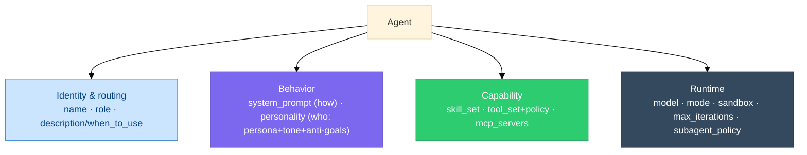

# Agents

> **Status:** Approved
>
> **Version:** 1.0   ·   **Last updated:** 2026-06-08
>
> **Purpose:** The Agent feature — the scoped, role-based **actors that do work for the user**: how an Agent is **defined** (the full field set), the **built-in roster** plus **user-definable** agents, the agent **run loop**, **sandbox/isolation**, and the **subagent/depth** policy.
>
> **Depends on:** [constitution](constitution.md), [data-model](data-model.md), [glossary](glossary.md)   ·   **Related:** [agent-orchestration](agent-orchestration.md), [skills](skills.md), [tools](tools.md), [permissions](permissions.md), [sandboxing](sandboxing.md), [mcp](mcp.md), [ai-models](ai-models.md), [memory](memory.md), [tasks](tasks.md), [situations](situations.md), [curator](curator.md), [activity-log](activity-log.md)

> Requirement tag: **AGENT**

---

## 1. Purpose & Scope

An **Agent** is a **scoped, role-based actor that does work *for the user*** — running [Tasks](tasks.md), using tools and skills, bounded by Always/Ask-first/Never. It is **not** the [Curator](curator.md) (which is a background *engine* that maintains understanding, not a user-task actor).

This spec owns the **Agent definition** — every field an agent carries — the **default roster** and how the user/System **define new agents**, the **run loop** at feature altitude, **sandbox/isolation**, and the **subagent & depth** policy. *How* agents are orchestrated (planned, routed, reviewed) is [agent-orchestration](agent-orchestration.md); skills, tools, permissions, and sandboxing each have their own specs.

The definition is **production-grade** and grounded in how shipping agent systems do it (see §12 Design lineage) — adapted to this System's primitives.

## 2. Non-Goals / Out of Scope

- **Not orchestration.** Planning, routing, dispatch, review, replanning are [agent-orchestration](agent-orchestration.md); this spec defines the actors it drives.
- **Not skill/tool internals.** What a Skill or Tool *is* lives in [skills](skills.md) / [tools](tools.md); an Agent only *references* them.
- **Not the Task/queue.** The Task entity and queue are [tasks](tasks.md) / [app-architecture](app-architecture.md).
- **Not the autonomy gate.** Always/Ask-first/Never is [constitution](constitution.md) §5 / [permissions](permissions.md).
- **Not the Curator.** The maintenance engine is [curator](curator.md).

## 3. Background & Rationale

Every production agent system converges on the same shape for "what an agent is": a **name**, a **description of when to use it** (the routing handle), a **system prompt**, a **tool set**, and a **model** — plus capability/runtime fields (skills, sandbox, permissions, iteration budget). This System adopts that shape and adds two deliberate choices:

- **Personality is its own layer**, separate from the operating instructions — the agent's *voice and boundaries*, kept consistent across tasks (as in OpenClaw's `SOUL.md` vs `AGENTS.md`, or CrewAI's `backstory` vs `role`).
- **Agents are definition files**: a small set of **built-in** roles ship by default, and the user (or the System) can **define new agents** the same way — name + description + prompt + capabilities — exactly as Claude Code subagents and opencode agents work.

## 4. Concepts & Definitions

- **Agent** — a scoped, role-based actor (`agent_`) defined by the fields in §5.2.
- **Role** — the agent's function (Executive / Research / Ops / Reviewer / a custom one).
- **Built-in vs user-defined** — default agents ship with the System; users add more from a definition file (§5.9, §5.14).
- **Primary vs subagent** — whether an agent is user-facing or only spawned by the orchestrator (§5.8).
- **Personality** — the persona/voice layer, distinct from the system prompt (§5.4).
- **Run loop** — the agent's model-tools-context loop, bounded by `max_iterations` (§5.10).

## 5. Detailed Specification

### 5.1 What an Agent is

> **REQ-AGENT-01.** An Agent (`agent_`) is a **scoped, role-based actor** that performs work **for the user** — executing [Tasks](tasks.md), reasoning, and calling tools/skills, observable and bounded by Always/Ask-first/Never ([constitution](constitution.md) §5). It is distinct from the [Curator](curator.md) engine (maintenance, not user work) and from the **orchestrator** ([agent-orchestration](agent-orchestration.md)), which is a control loop, not an agent.

### 5.2 The Agent definition

> **REQ-AGENT-02.** An Agent is defined by the following fields. The first group is the **core** (identity + behavior + capabilities); the rest are **runtime/production** fields:
>
> | Field | Group | Meaning |
> |-------|-------|---------|
> | `name` | identity | unique identifier |
> | `role` | identity | the agent's function (Executive/Research/Ops/Reviewer/custom) |
> | `description` / `when_to_use` | identity | **what the orchestrator routes on** (§5.3) |
> | `system_prompt` | behavior | operating instructions — *how it works* (§5.4) |
> | `personality` | behavior | persona + tone + anti-goals — *who it is* (§5.4) |
> | `skill_set` | capability | the [Skills](skills.md) it has (§5.5) |
> | `tool_set` + `tool_policy` | capability | the [Tools](tools.md) it has + per-tool ask/allow/deny (§5.6) |
> | `mcp_servers` | capability | connected [MCP](mcp.md) servers |
> | `model` | runtime | primary + fallbacks, or `inherit` (§5.7) |
> | `mode` | runtime | `primary` / `subagent` / `both` (§5.8) |
> | `sandbox` | runtime | sandbox profile ([sandboxing](sandboxing.md), §5.11) |
> | `max_iterations` | runtime | the agent-loop budget (§5.10) |
> | `subagent_policy` | runtime | whether it may spawn subagents (depth-1; §5.12) |
> | `color` | runtime | UI affordance |

### 5.3 Identity & routing metadata

> **REQ-AGENT-03.** Every Agent carries a `name`, a `role`, and a **`description`/`when_to_use`** — a short statement of *what this agent is for and when to pick it*. The **orchestrator routes on the description** (§[agent-orchestration](agent-orchestration.md) REQ-AORCH-03), so it must be specific about the agent's strengths **and** its non-uses (e.g. *"…use for X; do NOT use for code review or open-ended analysis"*), mirroring real subagent `whenToUse` fields.

**◆ Source pattern — Claude Code subagents & opencode** (`code.claude.com/docs/en/sub-agents`; `opencode.ai/docs/agents`). Both route on the `description`, which is *required* and must say *when* to use the agent:
> "Claude uses each subagent's description to decide when to delegate tasks. When you create a subagent, write a clear description so Claude knows when to use it." — Claude Code
>
> "Use the `description` option to provide a brief description of what the agent does and when to use it." (required) — opencode

A real `description` exemplar (Claude Code) — note the explicit *when*:
```text
description: Expert code review specialist. Proactively reviews code for quality,
security, and maintainability. Use immediately after writing or modifying code.
```
*Used here:* our `description`/`when_to_use` is the routing handle for REQ-AORCH-03; the "do NOT use for…" guidance just extends the same idea to the negative case.

### 5.4 `system_prompt` vs `personality`

> **REQ-AGENT-04.** An Agent's **`system_prompt`** (operating instructions — *how it works*: its method, constraints, output expectations) is **separate from** its **`personality`** (*who it is*: voice and boundaries). Personality is represented as a **prose persona + structured guardrails**:
> - `persona` — a short prose voice/identity ("a terse, decisive operations lead");
> - `tone` — e.g. `direct` · `warm` · `exploratory`;
> - `anti_goals` — explicit **forbidden behaviors** ("never speculate about the user's feelings", "never send outbound messages without approval").
>
> Personality is the **consistent layer** — it persists across every Task the agent runs, while the system prompt may be task-shaped. (Per persona best practice, **anti-goals matter as much as goals** for preventing drift; this mirrors OpenClaw's `SOUL.md`/`IDENTITY.md` and CrewAI's `backstory`.)

**◆ Source pattern — OpenClaw, `SOUL.md` vs `AGENTS.md`** (local: `docs/reference/templates/`). The two bootstrap files *are* our `personality` ÷ `system_prompt` — "who you are" kept apart from "how you work":
```text
# SOUL.md - Who You Are
*You're not a chatbot. You're becoming someone.*

**Have opinions.** You're allowed to disagree, prefer things, find stuff amusing or
boring. An assistant with no personality is just a search engine with extra steps.
```
```text
# AGENTS.md - Your Workspace
## Every Session
Before doing anything else:
1. Read `SOUL.md` — this is who you are
2. Read `USER.md` — this is who you're helping
Don't ask permission. Just do it.
```
*Used here:* `SOUL.md` ⇒ `personality` (the consistent "who", incl. anti-goals); `AGENTS.md` ⇒ `system_prompt` (the operating "how"). CrewAI splits identically (`role`/`goal` vs `backstory`).

### 5.5 Skill set

> **REQ-AGENT-05.** An Agent's `skill_set` lists the [Skills](skills.md) it carries (`skill_`); skills are **loaded into context on demand** (read the skill's instructions before applying it). Skills package reusable capability; the Agent references them, it does not define them.

### 5.6 Tool set & policy

> **REQ-AGENT-06.** An Agent's `tool_set` lists the [Tools](tools.md) it may call (`tool_`), and `tool_policy` sets a **per-tool tier — `allow` / `ask` / `deny`** (after opencode's permission model). `ask` routes through the Ask-first gate ([permissions](permissions.md), [tasks](tasks.md) REQ-TASK-07). **Subagents get a restricted set** by a hard denylist (no spawning further agents, no admin/session tools), as in OpenClaw's subagent policy (§5.12).

**◆ Source pattern — opencode, per-tool `permission`** (`opencode.ai/docs/agents`). `allow`/`deny` per tool, per agent — the shape our `tool_policy` extends with an `ask` tier:
```json
{
  "agent": {
    "build": {
      "mode": "primary",
      "model": "anthropic/claude-sonnet-4-20250514",
      "prompt": "{file:./prompts/build.txt}",
      "permission": { "edit": "allow", "bash": "allow" }
    },
    "plan": {
      "mode": "primary",
      "model": "anthropic/claude-haiku-4-20250514",
      "permission": { "edit": "deny", "bash": "deny" }
    }
  }
}
```
*Used here:* same allow/deny shape; our middle **`ask`** tier routes through the Ask-first gate (REQ-TASK-07). The subagent restriction itself is the OpenClaw denylist quoted at REQ-AGENT-12/13.

### 5.7 Model

> **REQ-AGENT-07.** An Agent's `model` is a primary model with optional **fallbacks**, or **`inherit`** (use the caller/default model). This enables per-agent **tiering** — a cheap model for a narrow Research subagent, a stronger one for the Executive — owned by [ai-models](ai-models.md).

### 5.8 Mode

> **REQ-AGENT-08.** An Agent's `mode` is **`primary`** (a user-facing agent the user talks to / that leads work), **`subagent`** (only ever spawned by the orchestrator, never user-facing), or **`both`** (after opencode). The orchestrator may dispatch any `subagent`/`both` agent; only `primary`/`both` agents lead.

### 5.9 The roster — built-ins + user-definable

> **REQ-AGENT-09.** The System ships a small **built-in roster**, and the **user (or the System) may define new agents** the same way (§5.14). The built-ins differ on two **invariant axes** — **mode** (a user-facing *primary* vs a spawned *subagent*) and **read-only vs acting** — *not* by tool family:
>
> | Role | Mode | When to use | What makes it distinct |
> |------|------|-------------|------------------------|
> | `Executive` | primary | lead a goal, converse with the user, delegate | the only **user-facing coordinator** — owns the plan and delegates; rarely does the grunt work itself |
> | `Research` | subagent | investigate, read, synthesize | **read-only** — gathers and reports, never acts |
> | `Ops` | subagent | perform outbound actions — exec, files, connectors, browser | the **actor** — the agent with side effects; executes one leaf, doesn't converse or delegate |
> | `Reviewer` | subagent | check another agent's result with fresh eyes | **read-only, never self-reviews** ([agent-orchestration](agent-orchestration.md) REQ-AORCH-07) |
>
> A specialized actor — e.g. a **`Browser`** agent — is just **`Ops` narrowed to a tool surface** (the [browser-automation](browser-automation.md) skill + browser tools, a tighter `sandbox`/`tool_policy`); it is the canonical **user-defined specialization** (§5.14), not a separate built-in. Splitting a built-in per tool family would mean one role per integration (Browser, Email, Calendar, …) and ambiguous routing — so the roster splits on mode and read-only-vs-acting instead. User-defined agents are first-class — same fields, same routing — and may override or extend the built-ins.

### 5.10 The agent run loop

> **REQ-AGENT-10.** An Agent runs a **model → tool-calls → observe → repeat** loop on its `system_prompt` + `personality` + recalled context, until it produces a result or hits **`max_iterations`**. Mid-loop it may reach an **Ask-first** step and pause for the user's permission ([tasks](tasks.md) REQ-TASK-07). The deeper *orchestration* (who plans/routes/reviews this agent) is [agent-orchestration](agent-orchestration.md); this spec fixes only that the agent loop is bounded and observable.

### 5.11 Sandbox & isolation

> **REQ-AGENT-11.** An Agent runs under a `sandbox` profile ([sandboxing](sandboxing.md)) scoping its filesystem/network/exec access. A **spawned subagent runs in isolated context** — it **cannot see the orchestrator's conversation** and receives only the self-contained prompt it was dispatched with ([agent-orchestration](agent-orchestration.md) REQ-AORCH-04). Per-agent sandboxing mirrors OpenClaw's per-agent Docker model.

**◆ Source pattern — Claude Code subagents** (`code.claude.com/docs/en/sub-agents`). Verbatim on per-agent isolation:
> "Each subagent runs in its own context window with a custom system prompt, specific tool access, and independent permissions."
>
> "the subagent does that work in its own context and returns only the summary"

*Used here:* grounds REQ-AGENT-11 (isolated context) and REQ-AORCH-04/06 — a worker can't see the conversation and returns only a result the orchestrator synthesizes.

### 5.12 Subagent & depth policy

> **REQ-AGENT-12.** By default, **only the orchestrator spawns agents**; an executing agent is a **leaf that does not spawn its own orchestration** (`subagent_policy.can_spawn = false`). This is **depth-1** — uniform across OpenClaw, Claude Code, Anthropic Managed Agents, and Hermes. **The recursion lives in the *plan*** (the orchestrator may decompose a goal into a deep subtask tree — [tasks](tasks.md) recursion), **not in agent-spawning.** An agent that legitimately needs sub-work returns a result that the orchestrator turns into further subtasks.

**◆ Source pattern — OpenClaw, `DEFAULT_SUBAGENT_TOOL_DENY`** (local: `src/agents/pi-tools.policy.ts`). Subagents are *hard-denied* the spawn/session tools — depth-1 enforced in code, not by convention:
```text
const DEFAULT_SUBAGENT_TOOL_DENY = [
  // Session management - main agent orchestrates
  "sessions_list",
  "sessions_history",
  "sessions_send",
  "sessions_spawn",
  // System admin - dangerous from subagent
  "gateway",
  "agents_list",
  ...
];
```
*Used here:* `sessions_spawn` in the denylist *is* `subagent_policy.can_spawn = false` (REQ-AGENT-12) — recursion lives in the orchestrator's plan, never in agent-spawning.

### 5.13 Memory & continuity

> **REQ-AGENT-13.** An Agent **does not recall from [Memory](memory.md) on its own.** Whatever durable knowledge an agent needs is **recalled by the orchestrator** (or by the System, for a user-facing turn) and **injected into the agent's prompt** ([agent-orchestration](agent-orchestration.md) REQ-AORCH-04, [memory](memory.md) REQ-MEM-16) — consistent with worker isolation (REQ-AGENT-11): a subagent receives only its self-contained prompt and never queries shared state. An agent's continuity therefore comes from its **persona** plus the **context it is handed**, not from a private memory of its own — *personality through continuity*, not per-agent state. (A `Research` agent may still *investigate the world* with its tools; that is tool use, not Memory recall.)

**◆ Source pattern — OpenClaw, same denylist, the memory entries** (local: `src/agents/pi-tools.policy.ts`). Real production code denies a subagent the memory tools, with the rationale right in the comment — independent validation of "the orchestrator puts memory in the prompt":
```text
  // Memory - pass relevant info in spawn prompt instead
  "memory_search",
  "memory_get",
```
*Used here:* REQ-AGENT-13 verbatim-in-the-wild — a spawned worker cannot query Memory; whatever it needs is recalled by the orchestrator and packed into its prompt (REQ-MEM-16, REQ-AORCH-04).

### 5.14 Configuration — where agents are defined

> **REQ-AGENT-14.** An Agent is **config-defined**: a definition with the §5.2 fields, typically a **markdown body = the `system_prompt`** plus **frontmatter** for the other fields (the Claude Code / opencode shape), or an equivalent struct (the OpenClaw `AgentConfig` shape). Built-ins ship with the System; user-defined agents live in the user's config and are loaded the same way. The concrete file location/format is owned by [app-architecture](app-architecture.md) / [settings](settings.md).

## 6. Visualizations

### 6.1 Agent definition anatomy



## 7. Data Shapes

Conceptual — not a storage schema. `agent_` per [data-model](data-model.md) §5.1.

```ts
interface AgentDefinition {
  // identity & routing
  name: string;                 // unique
  role: string;                 // Executive | Research | Ops | Reviewer | <custom>
  description: string;          // "when to use this agent" — the orchestrator routes on this
  // behavior
  system_prompt: string;        // operating instructions — HOW it works
  personality: {                // WHO it is — separate, consistent layer
    persona: string;            // prose voice/identity
    tone?: string;              // "direct" | "warm" | "exploratory" | …
    anti_goals?: string[];      // forbidden behaviors ("never …")
  };
  // capability
  skill_set: string[];          // skill_ ids (skills.md)
  tool_set: string[];           // tool_ ids (tools.md)
  tool_policy?: Record<string, "allow" | "ask" | "deny">;
  mcp_servers?: string[];       // mcp.md
  // runtime
  model?: string | { primary: string; fallbacks?: string[] } | "inherit";
  mode: "primary" | "subagent" | "both";
  sandbox?: string;             // sandbox profile (sandboxing.md)
  max_iterations?: number;      // agent-loop budget
  subagent_policy?: { can_spawn: boolean };  // depth-1: false for normal agents
  color?: string;               // UI
}
```

## 8. Examples & Use Cases

### Example A — the built-in Research agent (definition)
```
name: research
role: Research
description: Investigate and synthesize from sources and the workspace, READ-ONLY.
  Use for "find / understand / compare / gather" goals. Do NOT use for outbound
  actions, code edits, or browser sessions.
system_prompt: |
  You investigate thoroughly and report findings with citations. Read before
  concluding. Return a structured summary; do not act on the world.
personality:
  persona: a thorough, curious analyst
  tone: precise
  anti_goals: ["never assert without a source", "never take outbound/credentialed actions"]
skill_set: [web-research]
tool_set: [web_search, web_fetch, read, grep]
tool_policy: { web_fetch: allow, read: allow }
model: inherit
mode: subagent
```

### Example B — persona ≠ system prompt (narrative)
Two agents can share a `system_prompt` ("draft a reply") but differ in `personality`: the `Business` Executive is `direct` with anti-goal *"no hedging"*; a `Personal` assistant is `warm`. Same method, different voice — which is exactly why the two are separate fields (REQ-AGENT-04).

### Example C — a user-defined specialization (narrative)
A **`Browser`** agent — a user-defined `Ops` specialization (§5.14, REQ-AGENT-09) — is dispatched with a `tool_policy` that allows only browser tools and denies `exec`/file-write, under a tighter `sandbox` and a hard subagent denylist (no spawning). It runs isolated — it never sees the orchestrator's conversation, only its self-contained task plus whatever Memory the orchestrator injected (REQ-AGENT-11/12/13).

## 9. Edge Cases & Failure Modes

- **An agent "wants" to spawn sub-work.** It cannot (depth-1, REQ-AGENT-12); it returns a result and the orchestrator decomposes further. Keeps the agent tree flat and debuggable.
- **User-defined agent shadows a built-in.** Allowed (REQ-AGENT-09); the user's definition wins; the built-in remains as a fallback default.
- **Vague `description`.** A weak when-to-use degrades routing (REQ-AGENT-03); review should reject definitions whose description doesn't say when *not* to use the agent.
- **Personality vs instruction conflict.** If `system_prompt` and `personality.anti_goals` conflict, **anti-goals win** (they are the safety boundary, REQ-AGENT-04).
- **Subagent context starvation.** Because subagents can't see the parent conversation, an underspecified dispatch prompt fails — the fix is on the orchestrator (self-contained prompts), not the agent ([agent-orchestration](agent-orchestration.md) REQ-AORCH-04).

## 10. Open Questions & Decisions

- **OQ-AGENT-1** — The concrete **definition file format/location** (markdown+frontmatter vs struct) and precedence of user vs built-in — owned by [app-architecture](app-architecture.md) / [settings](settings.md).
- **OQ-AGENT-2** — Whether `personality` should be promotable/shared across agents in a Space (a Space "house voice"). Coordinate with [spaces](spaces.md) / [settings](settings.md).
- **OQ-AGENT-3** — Default `max_iterations` and `model` tier per built-in role ([ai-models](ai-models.md)).

## 11. Review & Acceptance Checklist

- [ ] An Agent is a user-task actor, distinct from the Curator engine and the orchestrator loop (REQ-AGENT-01).
- [ ] The full definition field set is specified (REQ-AGENT-02), with `description/when_to_use` as the routing handle (REQ-AGENT-03).
- [ ] `system_prompt` and `personality` are **separate** layers; personality = persona + tone + anti-goals, with anti-goals winning conflicts (REQ-AGENT-04).
- [ ] skill_set, tool_set + per-tool policy, mcp, model(+fallbacks/inherit), mode are specified (REQ-AGENT-05…-08).
- [ ] The roster is **four built-ins** (`Executive`/`Research`/`Ops`/`Reviewer`) split on **mode** + **read-only-vs-acting**, plus user-definable specializations (`Browser` = an `Ops` specialization) — first-class either way (REQ-AGENT-09).
- [ ] The run loop is bounded (`max_iterations`) and can pause for permission (REQ-AGENT-10); sandbox/isolation and **depth-1** subagent policy are specified (REQ-AGENT-11/12).
- [ ] Agents are **memory-stateless** — the orchestrator injects recalled Memory into the prompt; no per-agent recall (REQ-AGENT-13); config-defined agents are specified (REQ-AGENT-14). Examples use the [constitution](constitution.md) §7 cast; no placeholders.

## 12. Cross-References

- [agent-orchestration](agent-orchestration.md) — the loop that plans, routes (on `description`), dispatches, reviews, and replans these agents.
- [skills](skills.md) / [tools](tools.md) / [mcp](mcp.md) — the capabilities `skill_set` / `tool_set` / `mcp_servers` reference. [permissions](permissions.md) — the `ask` tier. [sandboxing](sandboxing.md) — the `sandbox` profile.
- [ai-models](ai-models.md) — `model` tiering. [memory](memory.md) — recall is **orchestrator-injected, not agent-queried** (REQ-AGENT-13). [tasks](tasks.md) — the Tasks agents run and the mid-task approval pause. [curator](curator.md) — the engine an Agent is *not*.

**Design lineage.** Grounded in real production code (read this session): **OpenClaw** (verified local source — `src/config/types.agents.ts` `AgentConfig`; persona via `SOUL.md`/`IDENTITY.md` vs `AGENTS.md` in `src/agents/workspace.ts`+`system-prompt.ts`; multi-level tool policy in `pi-tools.policy.ts`; `sessions_spawn` isolated subagents, no nesting; per-agent Docker sandbox); **opencode** (`mode: primary|subagent|all`, per-tool `ask|allow|deny`, markdown+frontmatter agents); **Claude Code subagents** (name + `whenToUse` + tools/`disallowedTools` + model `inherit` + markdown system prompt) and the **Anthropic Managed Agents** SDK (`name`/`description`/`system`/`tools`/`skills`/`mcp_servers`/`multiagent`); **CrewAI** (role/goal/`backstory`=personality/tools); **Hermes** (`role: leaf|orchestrator`, `max_spawn_depth`). Personality-as-separate-layer and anti-goals follow persona best practice.

## 13. Changelog

- **2026-06-04 — v0.1** — Initial draft. The Agent as a user-task actor (REQ-AGENT-01); the full production definition field set (REQ-AGENT-02) with `description/when_to_use` routing handle (REQ-AGENT-03); `system_prompt` vs `personality` (persona + tone + anti-goals) as separate layers (REQ-AGENT-04); skills/tools+policy/mcp/model/mode (REQ-AGENT-05…-08); the **built-in + user-definable** roster (REQ-AGENT-09); the bounded run loop (REQ-AGENT-10); sandbox/isolation (REQ-AGENT-11) and **depth-1** subagent policy with recursion-in-the-plan (REQ-AGENT-12); memory/continuity (REQ-AGENT-13); config-defined agents (REQ-AGENT-14). Code-grounded (OpenClaw/opencode/Claude Code/Anthropic/CrewAI/Hermes). In Review.
- **2026-06-04 — v0.2** — Removed two over-added fields — **`memory_scope`** (Space-scoping + downstream inheritance in [memory](memory.md) REQ-MEM-04 already govern recall) and **`builtin`** (provenance is derivable from where the agent is defined). **Collapsed the roster to four built-ins** — `Executive`/`Research`/`Ops`/`Reviewer` — splitting on **mode** (primary vs subagent) and **read-only-vs-acting**, not tool family; `Browser` is now the canonical **user-defined `Ops` specialization** (REQ-AGENT-09). **Agents are memory-stateless** — the orchestrator recalls and injects Memory into the agent's prompt; no per-agent recall (REQ-AGENT-13, [memory](memory.md) REQ-MEM-16).
- **2026-06-04 — v0.3** — Added inline **◆ Source pattern** call-outs with **verbatim** excerpts from the grounding projects: persona÷instructions (OpenClaw `SOUL.md`/`AGENTS.md`), description-routing (Claude Code/opencode), per-tool `permission` (opencode), per-agent isolation (Claude Code), and the OpenClaw `DEFAULT_SUBAGENT_TOOL_DENY` that enforces depth-1 (`sessions_spawn` denied) and memory-in-prompt (`memory_search`/`memory_get` denied — "pass relevant info in spawn prompt instead") in real code.
- **2026-06-08 — v1.0** — **Approved.** No material change from v0.3; the agent definition (`skill_set`/`tool_set`+`tool_policy`/`mcp_servers`/`sandbox`/`mode`/`model`), four-built-in roster, bounded loop, and depth-1 memory-stateless subagent policy are stable and now consumed by the approved [tools](tools.md), [permissions](permissions.md), [skills](skills.md), and [mcp](mcp.md).
