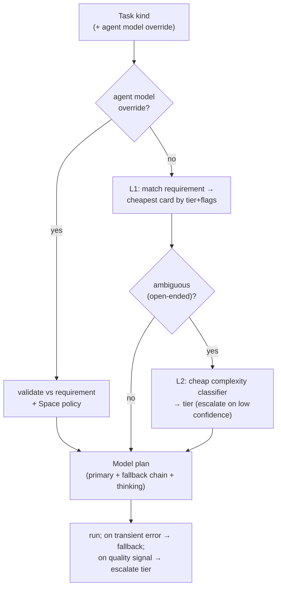

# AI Models

> **Status:** Approved
>
> **Version:** 1.0   ·   **Last updated:** 2026-06-08
>
> **Purpose:** The **inference layer** every other spec abstracts over when it says "typically an LLM" — *which model (and tier) runs each task*, **how the System detects the right model**, the **catalog of models by purpose**, the **local-vs-remote** policy (P1), and the **runtime** (structured output, prompt caching, token budgeting, fallback). Resolves the agent `model` field ([agents](agents.md) REQ-AGENT-07) and memory's embedding stack to concrete choices.
>
> **Depends on:** [constitution](constitution.md), [agents](agents.md), [memory](memory.md), [secrets](secrets.md)   ·   **Defers mechanics to:** [app-architecture](app-architecture.md), [inbox](inbox.md), [curator](curator.md), [prompt-injection](prompt-injection.md), [privacy-security](privacy-security.md)

> Requirement tag: **AIM**

---

## 1. Purpose & Scope

Every conceptual spec offloads its "an LLM does X" to here. This spec owns:

- the **model card** — how a model is described (capabilities, cost, context, hosting);
- **tiers** (Fast · Standard · Strong) + orthogonal capability flags (reasoning, vision, embedding);
- **selection / routing** — *how the System detects the right model for a task* (the user's first question);
- the **catalog by purpose** — *what models we can use for what* (the user's second question);
- **local-vs-remote** policy (P1), and the **runtime** (structured output, caching, tokens, fallback).

It is **provider-agnostic**: Claude is the recommended default (memory's `anthropic-sdk-go`), but any provider that fits the model card is usable.

## 2. Non-Goals / Out of Scope

- **Not the prompt contracts.** The actual prompts (extraction, recall, synthesis, routing) live in their feature specs ([inbox](inbox.md), [memory](memory.md), [situations](situations.md), [curator](curator.md), [agent-orchestration](agent-orchestration.md)); this spec serves them a model.
- **Not the vector store / persistence.** The DB, the `vec0` column, and ID format are [app-architecture](app-architecture.md); this spec owns the **embedding model** that feeds them.
- **Not credential storage.** API keys are [secrets](secrets.md) handles (REQ-AIM-13).
- **Not the agent definition.** The `model` field is [agents](agents.md) REQ-AGENT-07; this spec defines what it resolves to.
- **Not a frozen ranking.** The catalog (§5.14) is a dated snapshot, not a normative list.

## 3. Background & Rationale

A self-hosted assistant runs a *lot* of model calls of very different shapes — high-volume cheap extraction, occasional deep synthesis, embeddings on every write, the odd vision task. Sending all of them to one frontier model is wasteful; sending them all to a small model is wrong. The discipline is **tiering + routing**: describe each model by capability, describe each task by need, and match them — cheaply by default, with a smarter pass only when it's ambiguous (the RouteLLM / semantic-router consensus). And because the System is **self-hosted and private (P1)**, the default leans **local** (embeddings, high-volume cheap tasks), reaching for a remote frontier model only for what genuinely needs it, and only with the user's opt-in.

The shape is grounded in OpenClaw's real model layer — a capability catalog, per-agent `{primary, fallbacks}`, automatic fallback on auth/billing/timeout/rate-limit, separate models per purpose, local Ollama + provider auto-detect — minus the per-message chat ergonomics, plus an explicit **task→requirement** registry.

## 4. Concepts & Definitions

- **Model card** — a model's capability/cost/context/hosting descriptor (§5.2).
- **Tier** — Fast · Standard · Strong: the cost/capability band (§5.3).
- **Capability flag** — orthogonal: `reasoning`, `vision`, `embedding`.
- **Task requirement** — what a System task kind needs from a model (§5.4).
- **Selection / routing** — picking a concrete model for a task (§5.5).
- **Fallback chain** — ordered alternates tried on failure (§5.6).
- **Hosting** — `local` (in-process / Ollama, no egress) vs `remote` (hosted API).

## 5. Detailed Specification

### 5.1 The inference layer

> **REQ-AIM-01.** All model use flows through this layer. A feature spec names a **task** and a **prompt contract**; this layer returns a **model plan** (a concrete model + fallback chain + thinking level) and runs the call. The layer is **provider-agnostic** — Anthropic, OpenAI, Google, Bedrock, or a local runtime — selected by **model card**, not hard-coded.

### 5.2 Model capabilities — the card

> **REQ-AIM-02.** Every model is described by a **card**: `provider`/`id`, `tier`, **input modalities** (`text`/`image`/`audio`), **`reasoning`** (extended-thinking capable), **`contextTokens`**, **`maxTokens`**, **`cost`** (input / output / cache-read / cache-write per Mtok), **latency class**, and **`hosting`** (`local`/`remote`). Selection (§5.5) reads only the card — never a hard-coded model name. (After OpenClaw's `ModelDefinitionConfig`.)

### 5.3 Tiers

> **REQ-AIM-03.** Models sit in three **tiers** — **Fast** (cheap, high-volume), **Standard** (balanced), **Strong** (frontier reasoning/coding) — plus **orthogonal capability flags** (`reasoning`, `vision`, `embedding`) that a tier does not imply. A task asks for *at least* a tier and the flags it needs; the System picks the **cheapest model that satisfies** them.

### 5.4 Task → requirement

> **REQ-AIM-04.** Each System **task kind** declares its model requirement (min tier + flags + structured-output need):
> | Task kind | Min tier | Needs |
> |---|---|---|
> | extract / classify / route / title ([inbox](inbox.md), [signals](signals.md)) | Fast | JSON |
> | recall embedding ([memory](memory.md)) | — | `embedding` |
> | situation / insight reasoning-detection | Standard | JSON |
> | narrative / synthesis ([narrative](narrative.md)) | Strong | reasoning, JSON |
> | reflection / consolidation ([memory](memory.md) REQ-MEM-15) | Strong | reasoning |
> | orchestration plan/route/review ([agent-orchestration](agent-orchestration.md)) | Standard–Strong | JSON |
> | vision (image Signal) | Standard | `vision` |
>
> The registry is the System's answer to *"what does this task need?"* — the input to selection.

### 5.5 Selection / routing — *how to detect the right model*

> **REQ-AIM-05.** Selection is **deterministic-then-semantic** (mirroring [agent-orchestration](agent-orchestration.md) REQ-AORCH-03):
> - **L1 (default, ~free):** match the task's requirement (§5.4) to the **cheapest card** that satisfies its tier + flags. This handles the overwhelming majority deterministically.
> - **L2 (on ambiguity):** for open-ended work whose difficulty isn't obvious, a **cheap classifier** estimates complexity (`simple/medium/complex/reasoning` → tier) and **escalates to a stronger tier on low confidence** (the RouteLLM / semantic-router pattern).
> - **Override:** the agent's **`model`** field — `{primary, fallbacks}` or `inherit` ([agents](agents.md) REQ-AGENT-07) — always wins; the System validates it against the requirement and the per-Space policy (§5.7).

### 5.6 Fallback & escalation

> **REQ-AIM-06.** A model plan carries a **fallback chain**. The System fails over to the next model on **transient/availability errors** — auth (401/402), billing/credit, timeout, rate-limit (provider cooldown) — without changing the answer's tier (after OpenClaw's `runWithModelFallback`). Separately, it **escalates a tier** on *quality* signals: a hard or oversized batch ([inbox](inbox.md) OQ-INBOX-4), a low-confidence L2 route, or a [reviewer](agent-orchestration.md) rejection. Fallback ≠ escalation: one preserves the tier, the other raises it.

### 5.7 Local vs remote (privacy, P1)

> **REQ-AIM-07.** Default **local** ([constitution](constitution.md) P1): **embeddings** and **high-volume cheap** tasks run on a local model (in-process / Ollama) with **no egress**. **Strong reasoning** may use a **remote** model, but content leaves the System **only on explicit opt-in** ([memory](memory.md) REQ-MEM-04). A **Space may be marked local-only**, forbidding any remote model for its tasks; selection then restricts the catalog to `hosting: local` and degrades the tier if needed (best-effort, surfaced).

### 5.8 Embeddings

> **REQ-AIM-08.** The **embedding model** is a catalog member with the `embedding` flag. There is **one embedding model across the shared semantic index** ([memory](memory.md) REQ-MEM-03), and its **output dimension must match the vector-store column** ([app-architecture](app-architecture.md)) — changing it requires a **re-index** (§9). Default **local** (BGE-M3 / `embeddinggemma` / fastembed `all-MiniLM`/`bge-small`); **remote optional** (OpenAI `text-embedding-3`, Voyage, Cohere) for higher retrieval quality on opt-in.

### 5.9 Structured output / tool use

> **REQ-AIM-09.** The prompt contracts ([inbox](inbox.md) REQ-INBOX-09, [memory](memory.md) §5.12, [situations](situations.md) REQ-SIT-14, [curator](curator.md), [agent-orchestration](agent-orchestration.md)) require **constrained JSON / tool-use** output. The layer requests native structured output where the card supports it, and **validates + repairs** (re-ask on schema violation) otherwise — a contract never trusts free-form text.

### 5.10 Prompt caching

> **REQ-AIM-10.** The large **static** prompt blocks — rule sets, the untrusted-content envelope ([prompt-injection](prompt-injection.md) REQ-PINJ-04), few-shot exemplars — are **cached** (provider prompt-caching where available) so high-volume contracts pay for them once. Cache keys are derived from the static block, not the per-call data.

### 5.11 Token budgeting & context

> **REQ-AIM-11.** The layer **counts tokens** (e.g. `tiktoken`), is **context-window-aware**, and **chunks / compacts** input that would overflow a card's `contextTokens`, reserving headroom for the output. A task that cannot fit even after compaction escalates to a larger-context card or is split.

### 5.12 Reasoning / thinking level

> **REQ-AIM-12.** Reasoning-capable cards expose a **thinking budget** (`off · low · medium · high`). The System sets it per task: **off** for extraction/classification, **higher** for synthesis/reflection/review — auto-enabling a low budget for reasoning models by default (after OpenClaw's `thinkingDefault`). More thinking is spent only where judgment, not throughput, matters.

### 5.13 Credentials via the broker

> **REQ-AIM-13.** Model API keys are **secrets**: a provider config names a **`secret://…` handle**, resolved by the [secrets](secrets.md) broker at call time and injected into the request **outside** any sandboxed worker (REQ-SEC-05). Keys are **never** inlined in config, logged, or placed in a model prompt.

### 5.14 The model catalog (researched snapshot)

> **REQ-AIM-14.** The System ships a **catalog** mapping **purpose → recommended models**, with cost/capability cards. The catalog is a **living, non-normative snapshot** (model names change monthly); the **durable** contract is the tier/capability mechanism (§5.2–§5.5). A snapshot as of **2026-06** is §8.4; the catalog is refreshed on a cadence (OQ-AIM-4), not pinned in the spec.

### 5.15 Fitness / evaluation

> **REQ-AIM-15.** The System judges *"is this model good for X"* from two sources: **published benchmarks** as priors (coding → SWE-bench; retrieval → MTEB; general → Arena) attached to each card, **and** the System's **own task-level success signals** — extraction validity, [reviewer](agent-orchestration.md) approve/reject rates, recall hit-rate — which adjust selection for *this* deployment over time. A model that keeps failing reviews for a task kind is demoted for it.

### 5.16 Ownership & non-duplication

> **REQ-AIM-16.** This spec **owns** the model card, tiers, selection/routing, the catalog, and the runtime knobs. It **references**: [agents](agents.md) REQ-AGENT-07 (the `model` field), [memory](memory.md) REQ-MEM-03/04 (the embedding substrate + local-default), [prompt-injection](prompt-injection.md) REQ-PINJ-15 (model-strength posture), [secrets](secrets.md) (keys). It **defers**: the prompt contracts to their feature specs; the vector store + client libraries to [app-architecture](app-architecture.md); the local-only enforcement to [privacy-security](privacy-security.md).

## 6. Visualizations

### 6.1 Selection flow



### 6.2 Tier × capability matrix

| Tier | Typical use | reasoning | vision | cost |
|---|---|---|---|---|
| **Fast** | extract · classify · route · title · embed-adjacent | rarely | optional | $ |
| **Standard** | detection · orchestration steps · light synthesis · vision | optional | often | $$ |
| **Strong** | narrative/synthesis · reflection · review · hard coding | yes | optional | $$$ |
| *(embedding)* | recall vectors (orthogonal, not an LLM tier) | — | — | ¢ |

## 7. Data Shapes

Conceptual ([app-architecture](app-architecture.md) owns persistence). Non-normative.

```go
type Tier string // "fast" | "standard" | "strong"
type Modality string // "text" | "image" | "audio" | "embedding"
type Hosting string // "local" | "remote"
type ThinkLevel string // "off" | "low" | "medium" | "high"

type Cost struct{ InputPerM, OutputPerM, CacheReadPerM, CacheWritePerM float64 } // USD / Mtok

// ModelCard describes one model; selection reads only this (REQ-AIM-02).
type ModelCard struct {
    ID            string // "anthropic/claude-opus-4-8"
    Provider      string
    Tier          Tier
    Input         []Modality
    Reasoning     bool
    ContextTokens int
    MaxTokens     int
    Cost          Cost
    Hosting       Hosting
    Bench         map[string]float64 // priors: "swe-bench", "mteb", "arena" (REQ-AIM-15)
}

// What a System task needs from a model (REQ-AIM-04).
type TaskKind string // "extract" | "classify" | "route" | "synthesize" | "reflect" | "review" | "vision" | "embed" | ...
type TaskRequirement struct {
    Kind      TaskKind
    MinTier   Tier
    Need      []Modality // e.g. image (vision), embedding (recall)
    Reasoning bool
    JSON      bool // structured-output contract (REQ-AIM-09)
    LocalOnly bool // per-Space privacy policy (REQ-AIM-07)
}

// The agent override (agents.md REQ-AGENT-07).
type AgentModel struct {
    Primary   string
    Fallbacks []string
    Inherit   bool
}

type Plan struct {
    Primary   ModelCard
    Fallbacks []ModelCard
    Thinking  ThinkLevel
}

// Selector turns a requirement (+ optional override) into a runnable plan (REQ-AIM-05/06).
type Selector interface {
    Pick(ctx context.Context, req TaskRequirement, override *AgentModel) (Plan, error)
}

// Router is the optional L2 complexity classifier (REQ-AIM-05).
type Router interface {
    Complexity(ctx context.Context, prompt string) (tier Tier, confidence float64)
}

// LLMClient is the provider-agnostic runtime (REQ-AIM-09/10/11).
type LLMClient interface {
    Complete(ctx context.Context, m ModelCard, req Request) (Response, error) // structured output, caching, tokens
    Embed(ctx context.Context, m ModelCard, texts []string) ([][]float32, error)
}
```

## 8. Examples & Use Cases

Cast per [constitution](constitution.md) §7.

### Example A — extraction (Fast + JSON, local-first)

The [Inbox](inbox.md) extractor runs on every batch — high volume. Requirement: `{Kind: extract, MinTier: fast, JSON: true}`. L1 picks the cheapest Fast card that does constrained JSON — a **local** model if it passes the contract's validation, else a Fast hosted model (Haiku-class). No L2, no thinking. Prompt-cached rule block (REQ-AIM-10).

### Example B — reflection (Strong + reasoning)

Memory's nightly reflection ([memory](memory.md) REQ-MEM-15) synthesizes clusters into durable knowledge. Requirement: `{Kind: reflect, MinTier: strong, Reasoning: true}`. L1 picks a Strong reasoning card (Opus-class), thinking `high`. If the user marked the Space **local-only**, selection restricts to local Strong models and surfaces the trade-off (REQ-AIM-07).

### Example C — a vision Signal

An image arrives as a Signal. Requirement: `{Kind: vision, MinTier: standard, Need: [image]}`. Selection picks a multimodal card; the rest of the pipeline is unchanged.

### Example D — embedding (recall)

Every write embeds its content for the shared index. Requirement: `{Kind: embed, Need: [embedding]}`. The single configured embedding model runs **locally** (no egress); its dimension matches the vector column (REQ-AIM-08).

### 8.4 Catalog snapshot — purpose → models (2026-06, **non-normative**)

| Purpose | Need | Local / self-host (default) | Remote (opt-in) |
|---|---|---|---|
| Orchestration · synthesis · reflection | Strong + reasoning | DeepSeek V4 · GLM-5.1 · Qwen3 (large) | **Claude Opus 4.8 / 4.7** · GPT-5.5 · Gemini 3.x |
| Fast · high-volume (extract · classify · route · title) | Fast + JSON | Qwen3 · Llama · Kimi-small (Ollama) | **Claude Haiku 4.5** · Gemini 3.5 Flash · GPT-5-mini |
| Coding · Ops | Strong/Standard + tools | MiniMax M3 · Qwen3-Coder · GLM-5.1 | **Claude Opus 4.7** · GPT-5.5 |
| Vision · multimodal | image input | MiniMax M3 · Kimi K2.6 | Gemini 3.5 Flash · Claude (vision) · GPT-5.x |
| Embeddings (recall) | `embedding` | **BGE-M3** · Nomic Embed v2 · embeddinggemma-300M · fastembed (MiniLM/bge-small) | OpenAI `text-embedding-3-large/-small` · Voyage `voyage-3-large` · Cohere `embed-v4` |

*"No single best" — the right model depends on workload, budget, and the Space's privacy policy; this table is refreshed on a cadence, not pinned (REQ-AIM-14).*

## 9. Edge Cases & Failure Modes

- **Model unavailable / rate-limited** — fail over down the fallback chain, same tier (REQ-AIM-06).
- **Embedding dimension change** — switching the embedding model changes the vector dimension → requires a full **re-index** of the shared store; not hot-swappable (REQ-AIM-08).
- **Local-only Space + Strong task** — restricted to local cards; if none meet the tier, degrade + surface the trade-off, never silently send remote (REQ-AIM-07).
- **Context overflow** — compact/chunk; if still too big, escalate to a larger-context card or split the task (REQ-AIM-11).
- **Contract JSON violation** — validate + repair (re-ask); never accept malformed contract output (REQ-AIM-09).
- **Catalog drift** — a named model is retired; the card is removed and selection falls to the next satisfying card; the snapshot is advisory (REQ-AIM-14).
- **Agent override violates policy** — an `inherit`/`{primary}` that a local-only Space forbids is rejected at validation (REQ-AIM-05/07).

## 10. Open Questions & Decisions

- **OQ-AIM-1** — The **L2 classifier**: a fine-tuned embedding head vs a tiny distilled model vs heuristic signals; confidence threshold for escalation.
- **OQ-AIM-2** — The **default local embedding model** + its dimension (BGE-M3 1024-d vs a 384-d MiniLM), and how `app-architecture` fixes the `vec0` column to it.
- **OQ-AIM-3** — Per-Space **model policy** (local-only, tier caps, allowed providers) — coordinate with [spaces](spaces.md); its config UI is a client surface (out of scope here).
- **OQ-AIM-4** — Catalog **refresh cadence** + whether cards are fetched live (provider model lists) or shipped and updated per release.
- **OQ-AIM-5** — Whether fitness signals (REQ-AIM-15) auto-adjust selection or only advise the user.

## 11. Review & Acceptance Checklist

- [ ] The model **card** (capabilities/cost/context/hosting) and **tiers** (Fast/Standard/Strong + flags) are defined (REQ-AIM-02/03).
- [ ] **Task→requirement** registry (REQ-AIM-04) and **deterministic-then-semantic selection** with the agent override answer *how to detect the right model* (REQ-AIM-05); fallback ≠ escalation (REQ-AIM-06).
- [ ] **Local-by-default / opt-in remote** (P1, REQ-AIM-07); the **embedding model** is single, dimension-locked (REQ-AIM-08); keys are **secret handles** (REQ-AIM-13).
- [ ] Runtime: structured-output + repair (REQ-AIM-09), prompt caching (REQ-AIM-10), token budgeting (REQ-AIM-11), thinking level (REQ-AIM-12).
- [ ] The **purpose→models catalog** (REQ-AIM-14, §8.4) is present and marked **non-normative**; fitness/evals specified (REQ-AIM-15).
- [ ] §7 gives Go enums/structs/interfaces. Examples use the [constitution](constitution.md) §7 cast.

## 12. Cross-References

- [agents](agents.md) REQ-AGENT-07 (the `model` field this resolves) · [memory](memory.md) REQ-MEM-03/04 (the shared embedding substrate, local-default) · [prompt-injection](prompt-injection.md) REQ-PINJ-15 (model-strength posture) · [secrets](secrets.md) (keys as handles).
- The prompt-contract consumers: [inbox](inbox.md) · [situations](situations.md) · [curator](curator.md) · [narrative](narrative.md) · [insights](insights.md) · [agent-orchestration](agent-orchestration.md).
- **Mechanics:** [app-architecture](app-architecture.md) (client libs + vector store) · [privacy-security](privacy-security.md) (local-only enforcement). Model policy is owned here; its config UI is a client surface (out of scope here).

**Design lineage.** Grounded in real code + the current landscape (read this session):

**◆ Source pattern — OpenClaw, the model capability card** (local: `src/config/types.models.ts`). Our `ModelCard` follows it:
```text
type ModelDefinitionConfig = {
  id; name; api;            // "anthropic-messages" | "openai-completions" | "google-generative-ai" | "bedrock-…"
  reasoning: boolean;
  input: Array<"text" | "image">;
  cost: { input; output; cacheRead; cacheWrite };
  contextWindow; maxTokens;
};
// per-agent: model = string | { primary?; fallbacks?[] }
```

**◆ Source pattern — OpenClaw, fallback ≠ escalation** (local: `src/agents/model-fallback.ts`). Our REQ-AIM-06:
> `runWithModelFallback(...)` falls back on **401/402 auth, billing/credit, timeout, and rate-limit** (provider cooldown) — primary → fallbacks → primary.

Also: **RouteLLM** (LMSYS — classifiers on Arena preference data) and the **semantic-router** 4-tier `SIMPLE/MEDIUM/COMPLEX/REASONING` (cheap classifier + frontier fallback on low confidence) ground REQ-AIM-05; the **June-2026 landscape** (Opus 4.8/4.7, GPT-5.5, Gemini 3.5 Flash; MiniMax M3 / GLM-5.1 / Kimi K2.6 / DeepSeek V4) and **embedding** rankings (MTEB: Cohere embed-v4, OpenAI text-3-large, BGE-M3) ground §8.4. Recommended Go libs (carried from the stub / [memory](memory.md)): `anthropics/anthropic-sdk-go` (structured output + prompt caching), `Anush008/fastembed-go` (local embeddings), `pkoukk/tiktoken-go` (tokens).

## 13. Changelog

- **2026-06-08 — v1.0** — **Approved.** The inference layer finalized; no requirement changes from v0.1. The purpose→models catalog (§8.4) remains a dated snapshot, maintained as the landscape moves.
- **2026-06-05 — v0.1** — Initial draft, replacing the stub. The provider-agnostic **inference layer** (REQ-AIM-01); the **model card** (REQ-AIM-02) and **tiers** Fast/Standard/Strong + flags (REQ-AIM-03); the **task→requirement** registry (REQ-AIM-04); **deterministic-then-semantic selection** answering *how to detect the right model* (REQ-AIM-05) with **fallback ≠ escalation** (REQ-AIM-06); **local-by-default / opt-in remote** (REQ-AIM-07); the single dimension-locked **embedding model** (REQ-AIM-08); **structured output + repair** (REQ-AIM-09), **prompt caching** (REQ-AIM-10), **token budgeting** (REQ-AIM-11), **thinking level** (REQ-AIM-12); **keys as secret handles** (REQ-AIM-13); the **researched purpose→models catalog snapshot** (REQ-AIM-14, §8.4) + **fitness/evals** (REQ-AIM-15); ownership (REQ-AIM-16). §7 gives Go enums/structs/interfaces. Code-grounded in OpenClaw (`types.models.ts`, `model-fallback.ts`) with verbatim ◆ Source-patterns; RouteLLM/semantic-router routing + the June-2026 model/embedding landscape cited; folded in the stub's recommended Go libs. In Review.
