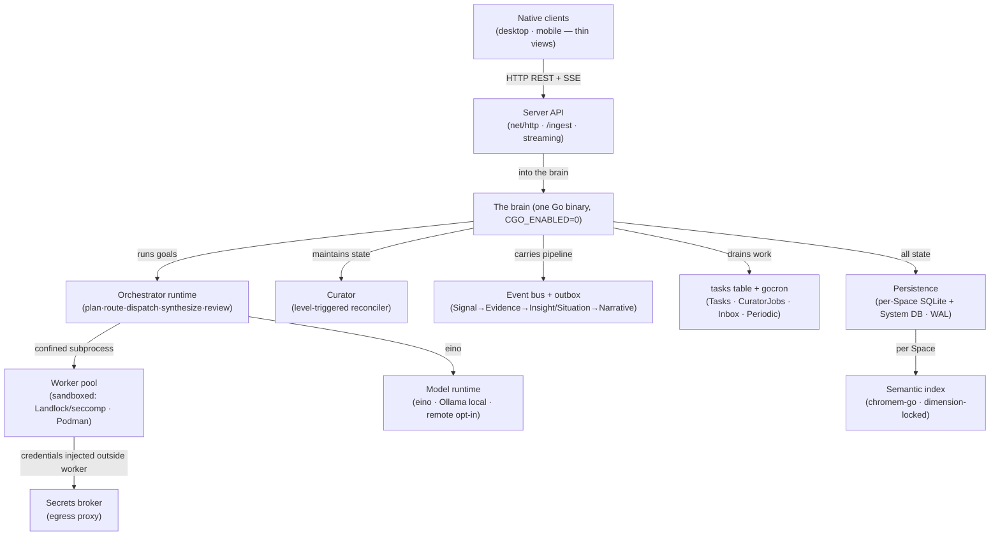
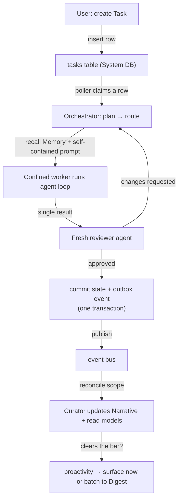
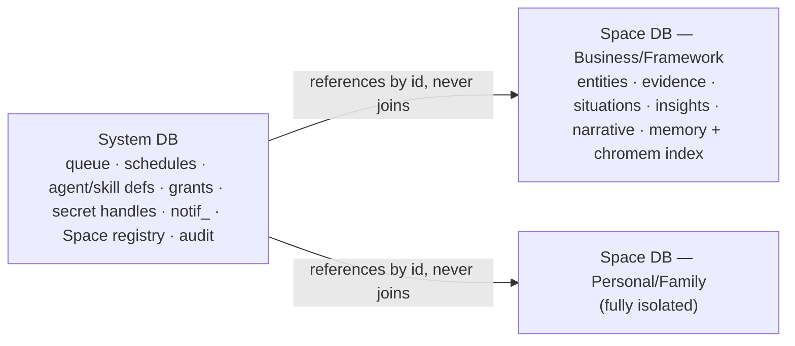

# App Architecture

> **Status:** Approved
>
> **Version:** 1.1   ·   **Last updated:** 2026-06-09
>
> **Purpose:** The concrete runtime architecture — the always-on self-hosted **Go server (the brain)** and its native clients: identity, persistence, the background runtime, the AI/vector/worker runtimes, the server↔client protocol, and the opinionated Go technology stack that realizes every conceptual spec.
>
> **Depends on:** [constitution](constitution.md), [data-model](data-model.md), [ai-models](ai-models.md), [memory](memory.md), [agent-orchestration](agent-orchestration.md), [sandboxing](sandboxing.md), [secrets](secrets.md), [tasks](tasks.md)   ·   **Related:** [stack](stack.md), [signals](signals.md), [inbox](inbox.md), [curator](curator.md), [entities](entities.md), [proactivity](proactivity.md), [privacy-security](privacy-security.md), [activity-log](activity-log.md)

> Requirement tag: **ARCH**

---

## 1. Purpose & Scope

This spec turns the conceptual suite into a **buildable system**. Nearly every other spec names a primitive and **defers its realization here**: the concrete ID format, persistence, the vector store, the queue and scheduler, the concurrency cap, the model and worker runtimes, the server↔client protocol, the Signal ingestion API. This document fixes all of them, and — because the System is **self-hosted and privacy-first (P1)** — commits to a concrete, **pure-Go, single-binary** Go technology stack with rationale.

It owns the **runtime architecture** and the **library choices** that implement it. It does **not** own each feature's semantics (those live in the feature specs) nor the build/project layout (that is [stack](stack.md)). Where this spec and a feature spec meet, the feature spec owns *what* and *why*; this spec owns *how it runs*.

## 2. Non-Goals / Out of Scope

- **Feature semantics** — what a Situation/Insight/Task/Agent *is* and *means* stays in its spec; this spec stores and runs them.
- **Build system, project layout, toolchain, dependency pinning** — owned by [stack](stack.md). This spec *names* libraries; stack *builds* them.
- **The authentication scheme** for client↔server and at-rest crypto — owned by [privacy-security](privacy-security.md); this spec wires it in.
- **Per-feature data shapes** — each spec's §7 owns its conceptual shape; this spec owns the physical schema, indexes, and IDs.
- **Sandbox profile semantics** — owned by [sandboxing](sandboxing.md); this spec owns the worker *process model* that the backends confine.

## 3. Background & Rationale

The target is an **always-on self-hosted brain**: one Go process that holds all state and logic — ingestion, the knowledge pipeline, Memory, Agents, Tasks, AI calls — with **native clients** (desktop, mobile) as thin, reconnecting views. The design pressure is **operational simplicity for a self-hoster**: it should be one binary you run, back up by copying a file, and trust with private data. That argues for **pure Go** (no CGo, so `CGO_ENABLED=0` cross-compiles to every OS as one static binary), **SQLite** (no database server), an **in-process** queue and event bus (no Redis/Postgres/broker), and **local-by-default** inference (Ollama) with remote models opt-in.

The patterns are drawn from how comparable systems are built. Single-binary self-hosted assistants (**AnythingLLM**) prove SQLite-everything is enough. Connector-as-worker ingestion (**Onyx/Danswer**) maps onto the Signal pipeline. Privacy-first second brains (**Khoj**) and standalone long-lived runtimes with SQLite memory (**Hermes**) match the always-on shape. For the agent runtime itself, **CloudWeGo eino** is the Go-native substrate (Claude support, graph orchestration, streaming, human-in-the-loop) behind [ai-models](ai-models.md)'s selector. Three structural patterns hold the system together: an **internal event bus with a transactional outbox** (the pipeline never drops a step across a crash), **level-triggered reconciliation** (the [Curator](curator.md) is a Kubernetes-controller-style loop that re-reads state rather than chasing events), and the **orchestrator-workers** model (a control loop dispatching isolated, confined subprocess workers, depth-1).

## 4. Concepts & Definitions

- **The server (the brain)** — the single always-on Go process holding all authoritative state and logic.
- **Native client** — a thin desktop/mobile view that connects when available; holds no authoritative state.
- **Space DB** — one SQLite file per [Space](spaces.md): its entities, Evidence, Situations, Insights, Narrative, Memory, and semantic index.
- **System DB** — one SQLite file for cross-Space infrastructure: the queue, schedules, agent/skill defs, grants, secret handles, `notif_` records, the Space registry, and the audit log.
- **Semantic index** — the per-Space vector store (chromem-go) behind recall/novelty/reinforcement ([memory](memory.md) REQ-MEM-03).
- **The queue** — one simple SQLite **`tasks` table** polled by a worker, draining Tasks, CuratorJobs, Inbox work, and Periodic enqueues.
- **Event bus / outbox** — in-process pub/sub carrying the pipeline, made crash-safe by a transactional outbox.
- **Reconciler** — a level-triggered loop that reads current state and patches gaps (the Curator).
- **Worker** — a confined subprocess running one agent loop in isolation.

## 5. Detailed Specification

### 5.1 Topology: one server brain, thin native clients, single binary

> **REQ-ARCH-01.** The System is an **always-on self-hosted Go server** that holds and runs everything — ingestion, the pipeline, Memory, Agents, Tasks, AI calls. **Native clients** (desktop, mobile) are **thin views/controls** that connect when available and hold no authoritative state (restating [overview](overview.md)). It ships as **one self-contained binary** (`CGO_ENABLED=0`), with any web UI embedded via `go:embed`; all state lives in **SQLite files on the host**, so the System is **restart-safe** and **backed up by copying files**.

### 5.2 Identity: `prefix_ULID`

> **REQ-ARCH-02.** Every entity id is **`<prefix>_<ULID>`** — the `prefix` from the [data-model](data-model.md) §5.1 catalog (`space_ story_ sit_ ins_ ev_ nar_ sig_ ent_ task_ mem_ ptask_ agent_ skill_ tool_ grant_ auth_ secret_ mcp_ conv_ msg_ notif_ cjob_ int_ wf_ wfr_`), and a **ULID** (26-char Crockford base32). ULIDs are **lexicographically/time-sortable** (so primary-key order is creation order, enabling efficient range scans and pagination), URL-safe, and globally unique without coordination. This resolves the "ULID vs slug" deferral fixed here per [data-model](data-model.md) §5.1.

### 5.3 Persistence: per-Space SQLite + a System DB, pure-Go

> **REQ-ARCH-03.** Persistence is **SQLite via `modernc.org/sqlite`** (pure-Go, no CGo). There is **one database file per [Space](spaces.md)** ([entities](entities.md) REQ-ENT-01) holding that Space's narrative-layer rows, entity tables, Memory, and semantic index; and **one System DB** for cross-Space infrastructure (§4). All files run in **WAL mode** (concurrent readers, one writer); a **connection manager** opens and caches a pooled handle per file (writer serialized, readers parallel). **Queries never join across Space DBs** — cross-Space isolation (P10) is physical; the System DB holds only non-Space-scoped infra and references Space rows by id, never by join.

### 5.4 Schema & migrations, including runtime DDL

> **REQ-ARCH-04.** Each DB carries a **versioned schema** whose **migration files are embedded into the binary** via `go:embed` and applied/upgraded **on startup** by **Atlas** (`ariga/atlas`, declarative) — the single binary **carries its own schema**; no external migration files ship or are looked up at runtime. **User-defined entity types** ([entities](entities.md) REQ-ENT-02/07) create/alter **real tables at runtime** through the same engine, transactionally with the entity catalog. **Destructive DDL** (drop column/type, table rebuild) is **Ask-first** ([entities](entities.md), [permissions](permissions.md)). Migration failures fail closed and are surfaced, never silently skipped.

### 5.5 Vector store / semantic index (pure-Go)

> **REQ-ARCH-05.** The shared **semantic index** ([memory](memory.md) REQ-MEM-03) — behind Insight recall, Signal novelty, Storyline resolution, and Evidence reinforcement — is realized with **`chromem-go`** (pure-Go, persisted, in-process), one collection per Space, **dimension-locked** to the active embedding model ([ai-models](ai-models.md); e.g. 384 for `all-MiniLM-L6-v2`). **Recall** is exhaustive cosine **KNN** (fine to ~1M items/Space) **re-ranked in Go** by the [memory](memory.md) REQ-MEM-10 score (relevance + recency + importance). Changing the embedding model or dimension requires a **re-index**. *This **revises** the stub's earlier `sqlite-vec`/CGo capture: pure-Go is chosen for single-binary distribution; **`mattn`+`sqlite-vec`** remains an **optional CGo upgrade** for very large indexes (OQ-ARCH-1).*

### 5.6 The background queue: deliberately simple, no engine

> **REQ-ARCH-06.** One **shared, simple queue** — a **SQLite `tasks` table polled by a worker** in the System DB (no external queue library) — carries **all** deferred work: [Tasks](tasks.md), CuratorJobs ([curator](curator.md)), [Inbox](inbox.md) processing, and [Periodic](periodic-tasks.md) enqueues. A pool of worker goroutines **atomically claims a `pending` row → `running` → `done`/`failed`** (`UPDATE … SET status='running' WHERE status='pending' … RETURNING`). There are **no** retries, leases, dead-letter, backoff, or priority ([tasks](tasks.md) §2) — replanning is the orchestrator's job, not the queue's. **The table *is* the queue**: all state is **plain SQLite rows**, so work **survives restart**. There is **no workflow / durable-execution engine** and **no broker**.

### 5.7 Scheduler

> **REQ-ARCH-07.** **`go-co-op/gocron`** runs the **UTC** schedule. A [Periodic Task](periodic-tasks.md) fires by **enqueuing a Task** (REQ-PTASK), nothing more: **skip-on-overlap**, **no catch-up replay**. The scheduler holds no execution logic — it is a clock that drops work on the queue (§5.6).

### 5.8 Concurrency & the cap

> **REQ-ARCH-08.** Independent leaves (no unmet `depends_on`) are dispatched **in parallel up to a global concurrency cap** — the knob [agent-orchestration](agent-orchestration.md) REQ-AORCH-04 defers here — defaulting to `min(NumCPU, N)`, with **per-Space and per-kind sub-caps** so one Space or job class can't starve others. Over-cap work **waits in the queue** (backpressure); the System never unboundedly fans out.

### 5.9 The orchestrator runtime

> **REQ-ARCH-09.** The deterministic **control loop** ([agent-orchestration](agent-orchestration.md) REQ-AORCH-01) runs as **plain Go**; only the **plan / route / review / replan** steps call a model (via **eino**, §5.11). The orchestrator performs **all Memory recall** ([memory](memory.md) REQ-MEM-16) and packs a **self-contained prompt** for each worker (REQ-AORCH-04). It is **depth-1**: workers never re-orchestrate — recursion lives in the *plan*, not in agent-spawning.

### 5.10 The worker runtime: confined subprocess + secrets outside it

> **REQ-ARCH-10.** A worker is a **confined subprocess** (`os/exec`), **supervised** (`cirello.io/oversight`), running **one agent loop in isolation** — it cannot see the orchestrator's conversation and receives only its dispatch prompt. The **whole worker** is sandboxed by the per-agent profile ([sandboxing](sandboxing.md) REQ-SBX-01/03) via the platform backend (Linux **Landlock+seccomp** through `go-landlock`, macOS **Seatbelt**, Windows **restricted-token**, or **rootless Podman**). The **secrets broker runs outside the worker** and injects credentials at point-of-use (§5.18, [secrets](secrets.md) REQ-SEC-05). **IPC**: a self-contained prompt in, a single typed result out (stdout / unix socket) — no shared memory, no ambient DB handle.

### 5.11 The model / inference runtime

> **REQ-ARCH-11.** **CloudWeGo `eino`** (+ `eino-ext`) is the **provider-agnostic substrate** behind [ai-models](ai-models.md)'s Selector/Router: `ChatModel` (including **Claude**), embeddings, tool-calling, and **streaming**. **`Ollama`** is the **local default** for chat and embeddings (P1, local-by-default); remote frontier models are **opt-in** ([ai-models](ai-models.md) REQ-AIM, [secrets](secrets.md) for keys). [ai-models](ai-models.md) owns selection/cards/tiers; this spec owns the **client wiring and streaming plumbing**.

### 5.12 Event bus + transactional outbox

> **REQ-ARCH-12.** An **in-process event bus** carries the pipeline **Signal → Evidence → Insight/Situation → Narrative** and surface notifications. A write that must publish uses the **transactional outbox**: the state change **and** the outbox row commit in **one SQLite transaction**; a poller then publishes and marks the row done. Delivery is **at-least-once**; consumers are **idempotent**. This guarantees the pipeline **never drops a step across a crash**.

### 5.13 Level-triggered reconciliation (the Curator)

> **REQ-ARCH-13.** The [Curator](curator.md) runs as a **Kubernetes-controller-style reconciler**: a trigger (event or schedule) merely **enqueues a reconcile** for a scope; the reconcile **re-reads current state** and **patches the gaps** (Situation status, Evidence salience, Narrative, Insight evaluation). It is **idempotent** and **level-triggered** — insensitive to *which* event arrived, so it survives **missed events and restarts**. It never depends on edge-triggered delivery for correctness.

### 5.14 Read models / surface projections

> **REQ-ARCH-14.** Client surfaces — Home → Attention-Needed, the Narrative/Digest, Storyline/Situation views — are served from **derived read projections** (CQRS-style) maintained by the Curator/pipeline, so reads are **cheap** and never block the write path. Projections are **rebuildable** from the source rows; they are a cache, not a source of truth.

### 5.15 Server↔client protocol

> **REQ-ARCH-15.** Native clients talk to the server over **HTTP/JSON REST** plus **Server-Sent Events** for streaming (model tokens, live Situation/Task updates). The server is **authoritative**; clients are **stateless, reconnecting views** that re-fetch on connect (offline-tolerant). Auth is a **local token/session** ([privacy-security](privacy-security.md) owns the scheme); the server binds to **loopback/LAN** by default. (Bidirectional WebSocket is a later option if mid-stream client control is needed — OQ-ARCH-3.)

### 5.16 Signal ingestion API

> **REQ-ARCH-16.** The [Signals](signals.md) ingestion endpoint (REQ-SIG-05) is realized as a **Space-scoped, authenticated `POST /ingest`** (JSON): it normalizes the payload into a Signal and drops it on the pipeline (§5.12). It is **rate-limited** and authenticated by the local token. This fixes the "wire format and auth scheme" deferred from [signals](signals.md).

### 5.17 Configuration & definition files

> **REQ-ARCH-17.** **Agent and Skill definitions** live on disk as **markdown + frontmatter** ([skills](skills.md) `SKILL.md`; [agents](agents.md) definitions) under the host config dir; **`spf13/viper`** loads config (env > file > defaults). **User definitions override built-ins by name.** **Settings**, quiet-hours/preferences ([proactivity](proactivity.md)), the **Space registry**, and **`notif_`** delivery records persist in the **System DB**. This fixes the agent/skill file-format/location and `notif_` persistence deferrals.

### 5.18 Secrets broker runtime

> **REQ-ARCH-18.** The **secrets broker** is an **in-server component outside the sandbox** that resolves `secret://` handles via pluggable providers and **injects at point-of-use** in one of three modes ([secrets](secrets.md) REQ-SEC-05): **`proxy`** (a loopback egress proxy that swaps a placeholder for the real credential on the outbound HTTPS request, so the value never enters the worker), **`env`** (a short-lived value in a specific subprocess's env), or **`header`** (the trusted in-server caller). It caches with a short TTL, **auto-refreshes OAuth**, and **redacts** secret-shaped values from logs/output.

### 5.19 Observability, lifecycle, build, backup

> **REQ-ARCH-19.** Logging is **`log/slog`** with an **OpenTelemetry** bridge; **graceful shutdown** uses `signal.NotifyContext` (drain in-flight workers, checkpoint the queue, close DBs); health endpoints report readiness. The **audit trail** ([activity-log](activity-log.md)) is a System-DB table the pipeline appends to (P3). Build is **`CGO_ENABLED=0 go build`** → one static binary with the **frontend and migration files embedded** (`go:embed`); **backup** is **copying the SQLite files** (System DB + each Space DB).

### 5.20 Technology choices (opinionated, researched)

> **REQ-ARCH-20.** The System commits to a **pure-Go, single-binary, no-external-broker** stack (§6.4 table): `modernc.org/sqlite`, `chromem-go`, Atlas (embedded migrations), a SQLite `tasks` table + poller, `gocron`, `eino` + Ollama, `oversight`, `go-landlock`, `net/http`+SSE, `slog`+OpenTelemetry, `viper`, `go:embed`. Each honors the self-hosted/privacy constraints; documented **upgrade paths** (CGo `sqlite-vec`, River, ConnectRPC, WebSocket) exist for scale/feature needs but are **not** the default. Concrete versions and pinning are [stack](stack.md).

### 5.21 Ownership & non-duplication

> **REQ-ARCH-21.** This spec **owns** the runtime, persistence, identity, concurrency, event/data flow, the AI/worker/secrets runtimes, the protocol, and the library choices. It **references** every feature spec it serves — each owns its *semantics*, this owns their *realization*. It **defers**: the build/project-layout/toolchain to [stack](stack.md); per-feature conceptual shapes to their specs; the client↔server auth scheme and at-rest crypto to [privacy-security](privacy-security.md).

## 6. Visualizations

### 6.1 The brain — layered architecture



### 6.2 A Task, end to end



### 6.3 Storage layout — isolation is physical



### 6.4 Technology choices

| Concern | Choice | Why (constraint honored) | Upgrade path |
|---|---|---|---|
| SQLite driver | `modernc.org/sqlite` | pure-Go, `CGO_ENABLED=0`, one static binary | `mattn/go-sqlite3` (CGo) |
| Vector index | `chromem-go` | pure-Go, in-process, dimension-locked | `sqlite-vec` (CGo) for huge indexes |
| Migrations | `ariga/atlas`, **embedded** via `go:embed` | declarative + runtime DDL; schema ships *in* the binary | `goose` |
| Queue | SQLite **`tasks` table + poller** | no library/broker, full control, restart-safe | `goqite` / River (if ever needed) |
| Scheduler | `go-co-op/gocron` | UTC cron, skip-on-overlap | `robfig/cron/v3` |
| AI substrate | `eino` (+ eino-ext) | Go-native, Claude, streaming, ADK | direct provider SDKs |
| Local inference | Ollama | local-by-default (P1) | remote frontier (opt-in) |
| Worker supervision | `os/exec` + `oversight` | confined subprocess, restartable | — |
| Sandbox | `go-landlock` + seccomp / Podman | per [sandboxing](sandboxing.md) | — |
| Transport | `net/http` REST + SSE | simple, native-client friendly | ConnectRPC / WebSocket |
| Logging / obs | `log/slog` + OpenTelemetry | stdlib, low overhead | — |
| Config | `spf13/viper` | env > file > defaults | — |
| Frontend bundling | `go:embed` | one binary | — |

## 7. Data Shapes

Conceptual; non-normative. SQLite (`modernc.org/sqlite`).

```go
// Identity (REQ-ARCH-02): "<prefix>_<ULID>", e.g. "task_01JQ8Z3K9V7M2N6Q1ABCDEFGH"
func NewID(prefix string) string { return prefix + "_" + ulid.Make().String() }

// System DB — the `tasks` queue table (REQ-ARCH-06); a poller atomically claims a row:
//   UPDATE tasks SET status='running' WHERE id =
//     (SELECT id FROM tasks WHERE status='pending' ORDER BY id LIMIT 1) RETURNING *;
type Job struct {
    ID     string // job id (prefix_ULID) — table primary key
    Status string // "pending" | "running" | "done" | "failed"
    Kind   string // "task" | "curator" | "inbox" | "periodic_fire"
    Ref    string // task_/cjob_/... id the job acts on
    Space  string // space_ scope (selects the Space DB)
}

// System DB — the transactional outbox (REQ-ARCH-12)
type Outbox struct {
    ID        string // notif-free infra id
    Space     string
    Topic     string // "evidence.created" | "situation.changed" | ...
    Payload   []byte // JSON
    Published bool
    CreatedAt string // ULID time ⇒ ordered
}

// Per-Space semantic index entry (chromem-go collection; REQ-ARCH-05)
type IndexDoc struct {
    ID        string    // mem_/ins_/story_/ev_
    Kind      string
    Embedding []float32 // len == locked dimension
    // content/importance/recency live in sibling Space-DB rows, re-ranked in Go
}
```

**File layout (host data dir):**

```
data/
  system.db                 # queue · schedules · defs · grants · secret handles · notif_ · registry · audit
  spaces/
    space_<ULID>.db          # one per Space: rows + chromem collection
config/
  agents/*.md   skills/*/SKILL.md   settings.toml
```

## 8. Examples & Use Cases

### Example A — a briefing Task, end to end (Given/When/Then)

- **Given** the user asks for *"prepare the Brightmoor status briefing"* in `Business/Brightmoor`.
- **When** the Task is created: it is enqueued as a **`pending` row in the `tasks` table** (System DB). A worker goroutine **claims the row** and and runs the **orchestrator** — plan → route. The orchestrator **recalls Memory** from the Space's chromem index and dispatches a **confined subprocess worker** with a self-contained prompt; the worker runs its agent loop in the sandbox, calling models via **eino/Ollama**, and returns one result. A **fresh reviewer** approves it.
- **Then** the state change + an outbox event commit in **one transaction**; the event bus publishes; the **Curator reconciles** `Business/Brightmoor`, refreshing the Narrative and read models; **proactivity** decides the briefing is ready and surfaces it. The whole run is plain SQLite rows — a restart mid-Task resumes from the queue (REQ-ARCH-06/12/13).

### Example B — a Signal becomes Evidence (narrative)

A Northwind Cloud pricing-page watcher calls `POST /ingest` (Space-scoped, token-authed). The payload is normalized into a Signal and dropped on the pipeline; distillation writes **Evidence** with an outbox event in one transaction. The Curator's **level-triggered** reconcile re-reads the Space, raises a `watch` Situation (*"Northwind bill likely to rise"*), and proactivity batches it into the morning Digest. Nothing was lost when the box restarted overnight — the outbox row was still `published=false` and replayed on boot (REQ-ARCH-12/13/16).

## 9. Edge Cases & Failure Modes

- **Crash mid-pipeline.** The outbox poller replays unpublished rows on restart; idempotent consumers dedup (REQ-ARCH-12).
- **Concurrent writers to one Space DB.** WAL + a serialized writer handle; readers proceed (REQ-ARCH-03).
- **Embedding model changed.** Dimension mismatch is rejected; a re-index is required before recall resumes (REQ-ARCH-05).
- **Runtime DDL on a populated table.** New required columns are added nullable and flagged; destructive changes are Ask-first (REQ-ARCH-04, [entities](entities.md)).
- **Index outgrows brute-force.** chromem-go stays fine to ~1M/Space; beyond, the CGo `sqlite-vec` upgrade path applies (REQ-ARCH-05, OQ-ARCH-1).
- **Worker hang.** Supervision enforces the sandbox wall-clock limit and kills/reports; the orchestrator replans (REQ-ARCH-10, [sandboxing](sandboxing.md)).

## 10. Open Questions & Decisions

- **OQ-ARCH-1** — The **scale threshold** at which a Space should switch from `chromem-go` to the CGo `sqlite-vec` index, and whether that is per-Space automatic.
- **OQ-ARCH-2** — The **System DB vs per-Space DB boundary** for a few ambiguous infra rows (e.g. cross-Space Entities correlation if ever added — [entities](entities.md) OQ-ENT-2).
- **OQ-ARCH-3** — Whether **WebSocket** is needed beyond SSE for mid-stream client control (approvals/interrupts), or REST callbacks suffice.
- **OQ-ARCH-4** — The concrete **concurrency-cap defaults** and per-kind sub-caps (tune with real workloads).
- **OQ-ARCH-5** — Whether to adopt **`sqlc`** (typed codegen) over plain `database/sql` now or in [stack](stack.md).

## 11. Review & Acceptance Checklist

- [ ] One self-hosted Go server (the brain) + thin native clients; single `CGO_ENABLED=0` binary; file backup (REQ-ARCH-01).
- [ ] `prefix_ULID` identity across the full catalog (REQ-ARCH-02).
- [ ] Per-Space SQLite + System DB, WAL, no cross-Space joins; pure-Go `modernc` (REQ-ARCH-03).
- [ ] **Embedded** (`go:embed`) Atlas migrations applied on startup; transactional runtime DDL; destructive = Ask-first (REQ-ARCH-04).
- [ ] chromem-go semantic index, dimension-locked, KNN + Go re-rank, re-index on model change (REQ-ARCH-05).
- [ ] One simple SQLite **`tasks`-table** queue (poller), no engine/retries/DLQ/broker; restart-safe (REQ-ARCH-06).
- [ ] `gocron` UTC scheduler that only enqueues Tasks (REQ-ARCH-07).
- [ ] Global concurrency cap + per-Space/per-kind sub-caps with backpressure (REQ-ARCH-08).
- [ ] Orchestrator in Go, LLM only at plan/route/review/replan; depth-1 (REQ-ARCH-09).
- [ ] Workers are confined subprocesses; secrets injected outside them (REQ-ARCH-10, -18).
- [ ] eino + Ollama runtime behind ai-models; streaming (REQ-ARCH-11).
- [ ] Event bus + transactional outbox; at-least-once, idempotent (REQ-ARCH-12).
- [ ] Curator is a level-triggered reconciler; survives missed events (REQ-ARCH-13).
- [ ] REST + SSE protocol; authoritative server, reconnecting clients (REQ-ARCH-15).
- [ ] `POST /ingest` Signal API (REQ-ARCH-16); on-disk agent/skill defs + System-DB settings/`notif_` (REQ-ARCH-17).
- [ ] Opinionated pure-Go stack with documented upgrade paths (REQ-ARCH-20).

## 12. Cross-References

- [data-model](data-model.md) — the ID-prefix catalog (§5.1) this spec gives a concrete format.
- [memory](memory.md) — the semantic index (REQ-MEM-03), recall score (REQ-MEM-10), orchestrator-recall (REQ-MEM-16).
- [ai-models](ai-models.md) — the provider-agnostic layer this spec wires to eino/Ollama; the embedding dimension lock.
- [agent-orchestration](agent-orchestration.md) — the control loop (REQ-AORCH-01), self-contained dispatch (REQ-AORCH-04), the concurrency cap.
- [tasks](tasks.md) / [periodic-tasks](periodic-tasks.md) — the no-engine queue (§2) and the cron-enqueues-a-Task model.
- [curator](curator.md) — the level-triggered reconciler realized here.
- [sandboxing](sandboxing.md) — the worker confinement backends (REQ-SBX-01/03).
- [secrets](secrets.md) — the broker and outside-the-worker injection (REQ-SEC-05).
- [entities](entities.md) — per-Space SQLite and runtime DDL.
- [signals](signals.md) — the ingestion API (REQ-SIG-05) wire format/auth fixed here.
- [stack](stack.md) — build, project layout, toolchain, version pinning.
- [privacy-security](privacy-security.md) — the client↔server auth scheme and at-rest crypto.

## 13. Changelog

- **2026-06-08 — v1.0** — **Approved.** The backbone runtime architecture + opinionated Go stack finalized; no requirement changes from v0.1. Moved from the untiered backlog into **Tier 3: Features** (§6.3); the §6.4 technology table remains the living record with upgrade paths.
- **2026-06-09 — v1.1** — ID-catalog alignment: added `int_`, `wf_`, and `wfr_` to REQ-ARCH-02 after Integrations and User Workflows introduced those prefixes. No runtime architecture change.
- **2026-06-08 — v0.1** — Initial full draft. Server-brain topology + single binary (REQ-ARCH-01); `prefix_ULID` identity (REQ-ARCH-02); per-Space + System SQLite, pure-Go `modernc` (REQ-ARCH-03); **embedded** (`go:embed`) Atlas migrations + runtime DDL (REQ-ARCH-04); **chromem-go** semantic index — *revising the stub's CGo sqlite-vec lean to pure-Go* (REQ-ARCH-05); the SQLite **`tasks`-table** queue (REQ-ARCH-06) + `gocron` (REQ-ARCH-07); concurrency cap (REQ-ARCH-08); orchestrator (REQ-ARCH-09) and confined-subprocess worker + secrets-outside-worker runtime (REQ-ARCH-10, -18); eino/Ollama model runtime (REQ-ARCH-11); event bus + transactional outbox (REQ-ARCH-12); level-triggered Curator reconciliation (REQ-ARCH-13); CQRS read models (REQ-ARCH-14); REST+SSE protocol (REQ-ARCH-15) and `POST /ingest` (REQ-ARCH-16); config/definition files (REQ-ARCH-17); observability/lifecycle/build/backup (REQ-ARCH-19); the opinionated technology table (REQ-ARCH-20); ownership (REQ-ARCH-21). Research-grounded (Go library survey + AnythingLLM/Onyx/Khoj/Hermes/eino). In Review.
- **2026-06-04 — v0.0** — Stub created (Planned); captured the vector-store and background-runtime decisions (since revised: vector store → pure-Go chromem-go).
