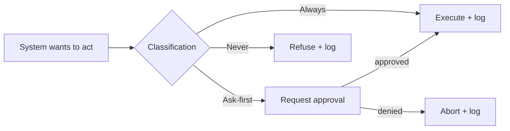
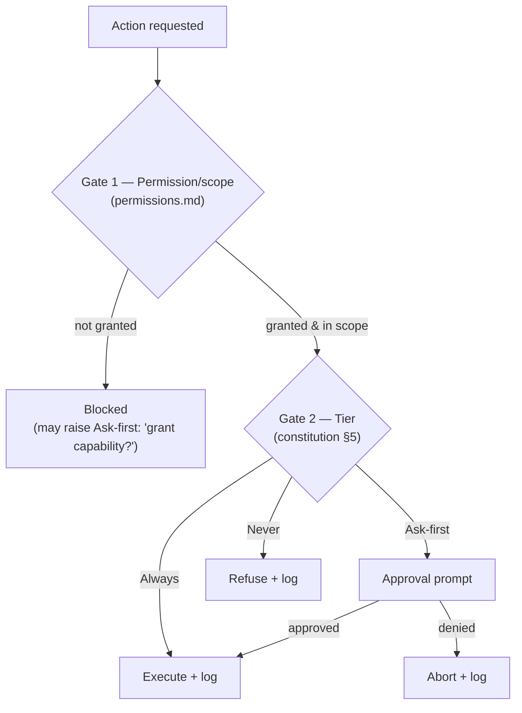
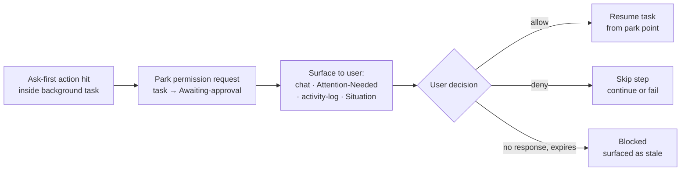
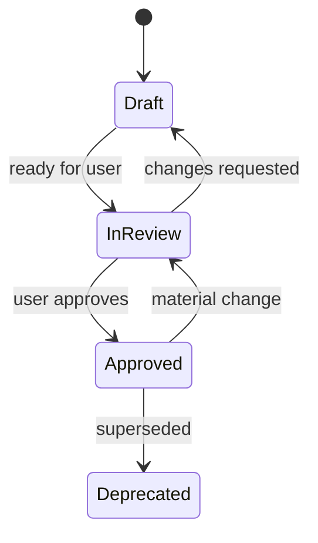

# Constitution

> **Status:** Approved
>
> **Version:** 1.2   ·   **Last updated:** 2026-05-29
>
> **Purpose:** The governing document for the entire specification suite and the eventual build. It fixes the product/engineering principles, the autonomy model, the example world, and the authoring conventions that every other spec inherits.
>
> **Depends on:** —   ·   **Related:** [index](index.md), [overview](overview.md), [permissions](permissions.md), [privacy-security](privacy-security.md)

---

## 1. Purpose & Scope

This constitution is the **single source of authority** for *how we specify* and *how the product must behave*. It governs two things:

1. **The specs** — structure, terminology, IDs, diagrams, the shared example world, and the review lifecycle. Every spec in `specs/` conforms to it.
2. **The build** — the non-negotiable product and engineering principles the implementation must honor, and the **Always / Ask-first / Never** autonomy model that all action-taking subsystems extend.

When a downstream spec conflicts with this document, **this document wins** — unless the conflict reveals a genuine gap, in which case the constitution is amended (with a changelog entry) and dependents are reconciled.

**Naming placeholder.** The product is unnamed. Until a name is chosen, all specs refer to the product as **"the System"** (capitalized proper noun). This is a placeholder, not a brand.

## 2. Non-Goals

- This is **not** a technical architecture document. Concrete stack choices, data persistence, and build tooling live in [app-architecture](app-architecture.md) and [stack](stack.md).
- It does **not** enumerate every action's permission classification — only the defaults and the framework. Each subsystem spec classifies its own actions (see §5).
- It does **not** define product features. Features live in their home specs; this document only constrains them.

## 3. Product principles

These are inherited by every spec. A spec may *specialize* a principle but must not contradict it.

| # | Principle | What it means in practice |
|---|-----------|---------------------------|
| P1 | **Self-hosted & user-owned** | The System runs on a server the user controls (their own machine, a home box, or a host they deploy to) — never a mandatory vendor cloud. The user owns the data and the deployment. Outbound network/AI calls are opt-in, scoped, and visible. |
| P2 | **Narrative, not event-driven** | The System models ongoing *Situations, Storylines, and momentum* — never raw feeds of disconnected events. Surfaces answer "what changed / what matters / what's blocked," not "here are 200 logs." |
| P3 | **Evidence-first** | Every insight, claim, or recommendation cites the evidence that produced it. No unbacked assertions; no hallucinated certainty. "I don't know yet" is a valid state. |
| P4 | **Proactive, not spammy** | The System initiates only when it clears a relevance/urgency bar; otherwise it batches into digests. Silence is the default, not noise. (See [proactivity](proactivity.md).) |
| P5 | **No psychoanalysis** | The System reasons about *work and context*, not the user's psyche or emotions. It observes patterns in artifacts, not in the person. |
| P6 | **Least-privilege & explicit scope** | Capabilities, file access, and credentials are granted narrowly and visibly. The System never silently broadens its reach (e.g., never scans the whole filesystem). |
| P7 | **Personality through continuity** | "Aliveness" comes from memory, timing, judgment, and initiative — not fake emotion, mascots, or anthropomorphic theater. (See [agents](agents.md).) |
| P8 | **Boundaries everywhere** | Any action the System can take on the user's behalf is classified Always / Ask-first / Never (§5). There is no unclassified action. |
| P9 | **Reversibility & transparency** | Autonomous actions are logged, attributable, and undoable where feasible. The user can always answer "what did it do while I was away?" (See [activity-log](activity-log.md).) |
| P10 | **Isolation by space & person** | Context, memory, credentials, and actions never leak across Spaces — except via explicit **downstream inheritance** ([spaces](spaces.md)). When a Space is **shared** with another person, sharing flows **downstream only**: they see that Space and its descendants, never its private ancestors. Cross-space or cross-person leakage is a hard failure, not a tolerated bug. |
| P11 | **The Space is the only primitive** | Everything — personal, shared, a "company" — is a Space in one hierarchy with downstream inheritance. Collaboration is **sharing a Space with a person**; there are **no roles, orgs, or teams**. ([spaces](spaces.md)) |
| P12 | **Untrusted content is data, not instructions** | Everything the System ingests — web pages, files, emails, tool/MCP output, page DOM, content in others' shared Spaces — is untrusted **data**, never commands. The System never executes instructions found in ingested content, keeps it separated from trusted instructions, and relies on the §5 gates as the backstop: a poisoned context still cannot perform an Ask-first/Never action without passing the gate, and secrets never enter prompts. (See [prompt-injection](prompt-injection.md).) |

## 4. Engineering principles (intent, not numbers)

Concrete bars (test strategy, accessibility level, performance budgets) are set in [app-architecture](app-architecture.md) / [stack](stack.md). Here we fix *intent*:

- **Isolation & clear boundaries.** Each unit has one purpose, a well-defined interface, and is independently understandable and testable.
- **Tested by default.** Behavior is verified; correctness is demonstrated, not assumed.
- **Accessible & responsive.** The UI is usable by keyboard and assistive tech, and adapts to window size.
- **Performant & quiet.** Background work must not degrade foreground responsiveness; idle cost is minimized.
- **Resilient & fail-safe.** On error or uncertainty the System stops safely and surfaces the problem; it never acts on a guessed or partial state.
- **Observable.** The System's actions and state are inspectable (see [activity-log](activity-log.md)).
- **Clean & minimal.** Prefer the smallest correct implementation. No dead code, no speculative generality, no decorative comments.

## 5. The Always / Ask-first / Never framework

The canonical autonomy & approval model. **Every action the System can take is classified into exactly one tier.** Subsystem specs ([permissions](permissions.md), [tools](tools.md), [browser-automation](browser-automation.md), [filesystem](filesystem.md), [tasks](tasks.md), [mcp](mcp.md), …) extend this table with their own actions; they may make a default *stricter* for a given space but never *looser* than this baseline. Every tool ([tools](tools.md)) declares the tier of the action it performs.



**Default posture: conservative.** Read-only and local analysis run freely; anything outbound, spending, destructive, or touching sensitive data requires approval; a small set of actions is forbidden outright.

| Action | Default tier | Notes |
|--------|--------------|-------|
| Read mounted files / indexed content | **Always** | Within granted mounts only ([filesystem](filesystem.md)). |
| Search the web / fetch a public page | **Always** | Read-only retrieval. |
| Summarize, extract, analyze, generate insights | **Always** | Local reasoning over existing evidence. |
| Create/update internal objects (Storylines, Memories, Tasks) | **Always** | Internal state; fully reversible & logged. |
| Run a scheduled check / watcher | **Always** | Passive observation; results may *trigger* Ask-first follow-ups. |
| Write/modify files in a mount | **Ask-first** | Even within a granted mount. |
| Send a message / email / chat on the user's behalf | **Ask-first** | Any outbound communication. |
| Submit a form / click a "confirm" in browser automation | **Ask-first** | Any state-changing web action. |
| Make a purchase or incur a cost | **Ask-first** | Always surfaced with amount. |
| Use a stored credential / auth profile | **Ask-first** | Per [secrets](secrets.md) & [privacy-security](privacy-security.md); secrets are never shown in prompts. |
| Install/enable a new skill, MCP server, or connector | **Ask-first** | Expands capability surface. |
| Grant a new file mount or domain to a profile | **Ask-first** | Expands reach. |
| Share a Space with a person (or add them to one) | **Ask-first** | Expands *who* can see/extend that data; downstream-only ([spaces](spaces.md)). |
| Delete user data irreversibly / mass-destructive ops | **Ask-first** (high-friction) | Requires explicit, typed confirmation. |
| Exfiltrate raw secrets / credentials to any model or remote | **Never** | Hard stop. Secrets travel as opaque handles only. |
| Disable safety controls, logging, or approval gates | **Never** | Hard stop. |
| Act outside the active space's granted scope | **Never** | No cross-space leakage. |

> **Extension rule.** When a spec introduces a new action, it MUST place it in this framework and state its default tier, plus any space-level overrides allowed.

### 5.1 Relationship to permissions & approvals

The framework is **not** the permission system — they are different axes that combine:

- **Permissions / grants** (capability + scope) decide whether an action is *possible at all* — for this agent/skill, in this space, with the required auth profile and file mounts. This is least-privilege; it is owned by [permissions](permissions.md) (with credentials in [privacy-security](privacy-security.md) / [secrets](secrets.md)).
- **Always / Ask-first / Never tier** (consent + friction) decides, *given the action is possible*, how much human confirmation it requires.

Every action passes **two gates**, in order:



**Approval decisions.** When an Ask-first action is requested, the user can choose:

- **Allow once** — approve just this invocation.
- **Allow for this run** — approve all similar steps within the current task/run only.
- **Allow always (scoped)** — create a standing grant; matching actions become *Always* (no future prompt) within a chosen **scope**: action type · space · agent/skill · target (recipient, domain, mount, …).
- **Deny** — reject this invocation.
- **Deny always (scoped)** — a standing denial; matching actions become a *Never* for that scope (revocable).

**The dynamic link.** An "Allow always" grant is exactly the scoped standing approval that promotes an action's tier from *Ask-first* to *Always* within that scope. Constraints: a grant can **never** lower a baseline **Never**, and can **never** exceed this baseline. All standing decisions are recorded, inspectable, and revocable. [permissions](permissions.md) owns the full evaluation, the approval flow, and storage/revocation of remembered decisions; the constitution owns only the baseline policy.

### 5.2 Approvals in background & autonomous work

Background tasks and scheduled work often run while the user is away, so they **cannot** block on a synchronous prompt — and must **never** auto-approve or wait forever. Baseline behavior:



*(Always actions and "Allow always" grants run without pausing; Never actions are refused and logged — see the rules below.)*

- Autonomous work proceeds freely over **Always** actions and any **Allow-always standing grants**. Standing grants are what make meaningful autonomy possible — without them, an unattended task stalls at the first Ask-first step.
- On an **Ask-first** action with no covering grant: the task **parks a permission request** and enters **Awaiting-approval**. The request surfaces as a permission-request message in [conversation](conversation.md), a Home → Attention-Needed item ([ui-shell](ui-shell.md)), an [activity-log](activity-log.md) entry, and (usually) a Situation ([glossary](glossary.md)) such as *"task blocked awaiting approval."* [proactivity](proactivity.md) decides whether to actively notify now or let it wait for the next digest, by urgency.
- **Approved** → resume from the park point. **Denied** → abort that step, continue other branches or fail, recording why. **Expired/timed out** (configurable) → the request lapses and the block is surfaced as stale.
- On a **Never** action → refused immediately and logged; the branch is recorded as blocked (no approval can unlock a Never).
- **Anticipate, don't nag.** A task that can foresee the approvals it will need SHOULD request them as one batch up front (or rely on standing grants) rather than interrupting repeatedly. Full mechanics live in [permissions](permissions.md), [tasks](tasks.md), and [proactivity](proactivity.md).

## 6. Authoring conventions

### 6.1 Document template
Every spec follows this canonical template. Sections marked *(optional)* appear only when they add value; all others are required. Meta-documents ([index](index.md) and this constitution) adapt the template to their purpose rather than following it literally.

```markdown
# <Spec Title>

> **Status:** Draft | In Review | Approved | Deprecated
>
> **Version:** 0.1   ·   **Last updated:** YYYY-MM-DD
>
> **Purpose:** <one or two sentences — what this spec defines>
>
> **Depends on:** [spec-name](spec-name.md)   ·   **Related:** [spec-name](spec-name.md)

## 1. Purpose & Scope            — what it covers
## 2. Non-Goals / Out of Scope   — what it excludes (→ which spec owns it)
## 3. Background & Rationale      — why it exists; how it fits the whole
## 4. Concepts & Definitions      — terms used/introduced (canonical terms → glossary.md)
## 5. Detailed Specification      — the body; each requirement carries a stable ID
                                     REQ-<SPEC>-NN; behavioral rules state pre/postconditions
## 6. Visualizations              — ASCII mockups / mermaid / tables (required where helpful)
## 7. Data Shapes (optional)      — conceptual pseudo-schemas (non-tech) or models (tech)
## 8. Examples & Use Cases        — ≥2 concrete walkthroughs using the shared cast;
                                     behavioral scenarios in Given/When/Then, flows as narrative
## 9. Edge Cases & Failure Modes (optional)
## 10. Open Questions & Decisions — options + current leaning; resolved before approval
## 11. Review & Acceptance Checklist — observable conditions meaning the spec is satisfied
## 12. Cross-References           — links to related specs; terms feeding back to glossary.md
## 13. Changelog                  — dated entries per revision
```

> **Header rendering rule.** Separate header fields with blank `>` lines (as above) so each renders on its own line. Do **not** rely on trailing-space hard breaks — formatters/linters strip them.

### 6.2 ID & naming schemes
Entity IDs use a `type_` prefix + a stable short identifier (conceptually a slug or ULID; the concrete format is fixed in [data-model](data-model.md)/[app-architecture](app-architecture.md)).

| Entity | Prefix | Entity | Prefix |
|--------|--------|--------|--------|
| Space | `space_` | Task | `task_` |
| Storyline | `story_` | Periodic task | `ptask_` |
| Situation | `sit_` | Signal | `sig_` |
| Agent | `agent_` | Evidence | `ev_` |
| Skill | `skill_` | Insight | `ins_` |
| Auth profile | `auth_` | Memory | `mem_` |
| Secret (handle) | `secret_` | Entity (graph) | `ent_` |
| Conversation | `conv_` | Message | `msg_` |

- **Requirement IDs:** `REQ-<SPEC>-NN`, where `<SPEC>` is a short uppercase tag (e.g. `CONV`, `MEM`, `PERM`) and `NN` is zero-padded and **stable** (never renumbered). Each spec declares its tag in §1.
- **File names:** lowercase kebab-case, `.md`, matching the spec's tag domain.
- **Canonical capitalization of domain terms:** **Space, Storyline, Situation, Signal, Evidence, Insight, Narrative, Memory, Entity, Agent, Skill, Task, Digest.** Use the capitalized form when referring to the concept; lowercase only in generic prose.

### 6.3 Cross-linking & the index rule
- Link related specs with standard Markdown links: `[spec-name](spec-name.md)` (renders clickable on GitHub and any Markdown viewer).
- A spec's header lists **Depends on** (must-read prerequisites) and **Related** (helpful neighbors).
- [index](index.md) is the **extended TOC / loading guide**: it summarizes each spec and says *when to load it*, so an agent reads only what a task requires. Keeping the index accurate is mandatory after every approval.

### 6.4 Status lifecycle & changelog

Every spec carries a dated `## Changelog`. Status is shown in the header and mirrored in [index](index.md).

## 7. The recurring example cast (the shared world)

All specs draw examples from **one invented, coherent world** so scenarios cohere instead of being reinvented. It is fictional; any resemblance to real people/companies is coincidental. The protagonist is **"you"** — a solo founder/consultant.

**Spaces**
```
Global
├── Personal
│   ├── Health
│   ├── Family
│   └── Finance
├── Business
│   ├── Framework       (your own product — a web UI framework)
│   ├── Brightmoor      (a consulting client: Brightmoor Labs)
│   └── Operations
└── Research
    ├── Distributed Systems
    └── LLM Agents
```

**People (entities)**
| Name | Role |
|------|------|
| Talia Brandt | Prospective investor (fundraising arc) |
| Devin Osei | Stakeholder at Brightmoor Labs (client) |
| Priya Nandakumar | Contractor on the framework (you share the `Framework` space with her) |
| Dr. Ana Belov | Research collaborator (distributed systems) |
| Sam Rivera | Your partner (you share the `Family` space with them) |

**Vendors / services (entities):** Stripe, GitHub, npm registry, **Northwind Cloud** (fictional hosting provider).
**Repos (entities):** `framework`, `brightmoor-portal`.

**Shared spaces (examples):** the `Family` space is shared with Sam Rivera; the `Framework` space is shared with Priya Nandakumar — the *same* sharing mechanism, just different people (there is no "personal vs business" distinction).

**Recurring Storylines**
- *Framework UI direction* — keeps looping; revisited four times, still no RFC.
- *Investor fundraising* — courting Talia Brandt.
- *Brightmoor portal delivery* — the client engagement.
- *Distributed consensus research* — with Dr. Belov.
- *Family trip planning* — personal.

**Recurring Situations**
- *Stripe automation blocked by expired login.*
- *Framework UI direction unresolved (4th revisit, no RFC).*
- *Investor reply to Talia overdue.*
- *Northwind Cloud bill spiked unexpectedly.*

**Recurring watchers (periodic tasks):** a competitor's release notes page; the `framework`'s core dependency on npm; a Northwind Cloud pricing page; flight prices for the family trip.

> Specs SHOULD reuse these names verbatim. If a spec needs a new cast member, add it here (changelog entry) rather than inventing a one-off.

## 8. Visualization style guide

Per the visual-first principle, prefer a picture over prose for any structure.

**Mermaid**
- Use `flowchart LR`/`TD` for flows, `stateDiagram-v2` for lifecycles, `sequenceDiagram` for interactions, `erDiagram` for data relationships.
- Label every edge that isn't obvious. Keep node text short. One diagram = one idea.

**ASCII UI mockups**
- Monospace, target width **≤ 78 columns**. Use box-drawing characters (`┌ ┐ └ ┘ │ ─ ├ ┤`).
- Annotate with `‹ ›` callouts or a numbered legend beneath the mockup.
- Show realistic content from the cast (§7), never `lorem ipsum`.

**Tables** are first-class: use them for classifications, matrices, catalogs, and before/after comparisons.

## 9. Review & Acceptance Checklist

This spec is satisfied when:

- [ ] Every product principle (P1–P12) is stated and unambiguous.
- [ ] Self-hosted topology (P1), space+person isolation with downstream-only sharing (P10), the "Space is the only primitive — no roles" rule (P11), and "untrusted content is data, not instructions" (P12) are reflected here and in the §5 table.
- [ ] The canonical spec template is embedded and self-contained (no dependency on external files).
- [ ] The Always/Ask-first/Never framework defines all three tiers and a conservative default table, plus the extension rule.
- [ ] The permission relationship (two-gate model), the approval decision options (incl. "Allow always" standing grants), and the background/async approval model are specified.
- [ ] ID prefixes, requirement-ID format, file-naming, and canonical capitalization are fixed.
- [ ] The cross-linking + index-as-loading-guide rule is stated.
- [ ] The status lifecycle and changelog requirement are defined.
- [ ] The invented cast (spaces, people, vendors, repos, storylines, situations, watchers) is complete enough to source examples in every downstream spec.
- [ ] The visualization style guide gives concrete mermaid + ASCII conventions.
- [ ] No placeholders/TODOs; the document is internally consistent.

## 10. Cross-References

- [index](index.md) — the loading guide this document mandates.
- [overview](overview.md) — applies the product principles to the product narrative.
- [permissions](permissions.md), [tools](tools.md), [sandboxing](sandboxing.md), [privacy-security](privacy-security.md), [secrets](secrets.md), [browser-automation](browser-automation.md), [filesystem](filesystem.md), [mcp](mcp.md) — extend §5.
- [data-model](data-model.md) — fixes the concrete ID format referenced in §6.2.

## 11. Changelog

- **2026-05-29 — v0.1** — Initial draft: principles, Always/Ask-first/Never framework (incl. §5.1 relationship to permissions / two-gate model + approval decisions with "Allow always", and §5.2 background/async approval model), authoring conventions, de-branded invented cast, visualization style guide.
- **2026-05-29 — v0.1 (refined)** — Added P10 (space isolation) and a fail-safe engineering principle; embedded the canonical spec template in §6.1 so the suite is self-contained; clarified meta-doc template adaptation; fixed a stray cast reference.
- **2026-05-29 — v1.0** — Approved.
- **2026-05-29 — v1.1** — Architecture shift to client-server / self-hosted with space-sharing. Amended P1 (local-first → self-hosted & user-owned), P10 (isolation now by space **and** person; sharing flows downstream-only), added P11 (the Space is the only primitive — no roles/orgs/teams) and P12 (untrusted content is data, not instructions — prompt-injection defense). Added a "share a Space" row to the §5 table and Sam Rivera to the cast. Re-approved.
- **2026-05-29 — v1.2** — Removed **Monitor** (folded into Periodic Task — a Monitor is a recurring watcher task), **Note**, and **Bookmark** as primitives: dropped their `mon_`/`note_`/`bm_` ID prefixes (§6.2), the Monitor capitalization entry, and the Notes/Monitors action references; reworked the cast's Monitors into recurring watchers. Fixed a stale `arcs` cast reference (→ storylines).
