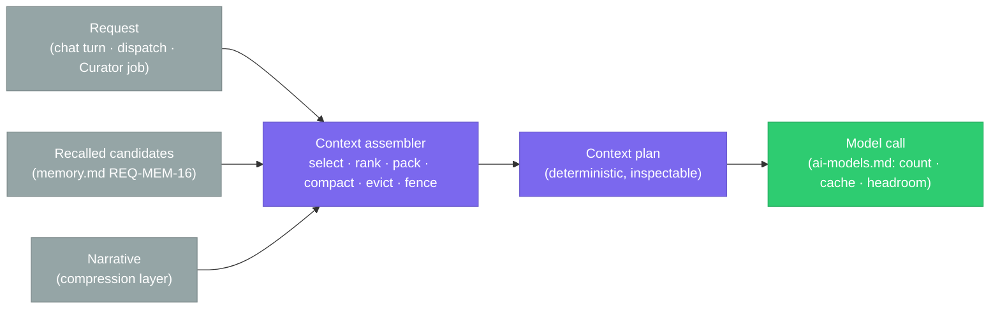
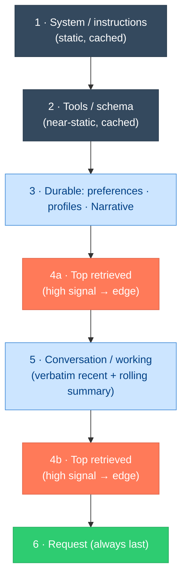
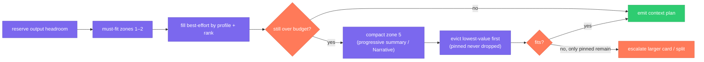

# Context Management

> **Status:** Approved
>
> **Version:** 1.1   ·   **Last updated:** 2026-06-10
>
> **Purpose:** The **working-context assembly layer** — how the System builds the exact prompt window for a single model call: the **token budget** split across its zones, **selection & packing** (recency × relevance × importance, ordered for cache stability and against "lost in the middle"), **compaction** and **eviction** under pressure, the **deterministic context contract** that makes assembly inspectable, and the **isolation/fencing** rules. It sits *between* recall ([memory](memory.md)) and the model call ([ai-models](ai-models.md)) and owns neither.
>
> **Depends on:** [constitution](constitution.md), [glossary](glossary.md), [memory](memory.md), [ai-models](ai-models.md), [agent-orchestration](agent-orchestration.md)   ·   **Related:** [agents](agents.md), [narrative](narrative.md), [prompt-injection](prompt-injection.md), [curator](curator.md), [token-cost-management](token-cost-management.md)

> Requirement tag: **CTX**

---

## 1. Purpose & Scope

Every LLM call in the System is made against a finite **context window**. *What* goes into that window, in *what order*, at *what priority*, and *what happens when it doesn't fit* is the single largest lever on answer quality and cost — "most failures in production AI agents aren't model failures, they are context failures" (◆ Source pattern below). This spec owns the **assembler**: the deterministic step that turns a request (a chat turn, a Curator job, an orchestrator dispatch) plus its recalled material into one **packed, budgeted, fenced prompt**.

It owns:

- the **context window as zones** with a **token budget** per zone and reserved **output headroom** (§5.2–§5.3);
- **selection & packing** — choosing items by recency × relevance × importance, de-duplicating, and **ordering** for KV-cache stability and against the lost-in-the-middle effect (§5.4–§5.6);
- **compaction** (progressive/rolling summarization, with the [Narrative](narrative.md) as the compression artifact) and **eviction** under budget pressure (§5.7–§5.8);
- the **context contract** — a deterministic, inspectable assembly (same inputs → same window) (§5.9);
- **isolation** (per-Space, no bleed) and **fencing** of untrusted content (§5.10).

## 2. Non-Goals / Out of Scope

- **Not memory recall or the store.** *Which* durable items are relevant, how they are scored/decayed, and the embedding substrate are owned by [memory](memory.md) (REQ-MEM-04/10/11). This layer is **handed** recalled candidates and decides what survives into the window; it never queries the index itself.
- **Not the model call or token mechanics.** Counting tokens, prompt caching, the thinking budget, structured output, and per-card context limits are [ai-models](ai-models.md) (REQ-AIM-10/11/12). This layer produces an ordered, budgeted **plan**; that layer executes it.
- **Not cost accounting.** Budgets/caps, metering, and per-Space/Task attribution are [token-cost-management](token-cost-management.md); context trimming is a *lever* it pulls, not its ledger.
- **Not the prompt contracts.** The system prompts and schemas live in their feature specs ([curator](curator.md), [memory](memory.md), [agent-orchestration](agent-orchestration.md), [narrative](narrative.md)); this layer *places* them in the window.
- **Not the injection defense.** The threat model and the canonical envelope are [prompt-injection](prompt-injection.md) (REQ-PINJ-04); this layer is the consumer that **applies** the envelope to every untrusted item it packs.

## 3. Background & Rationale

A model call is only as good as its window, and the window is small relative to everything the System knows. Three well-established findings shape the design:

- **The window is a budget, not a bucket.** The discipline is to find "the smallest possible set of high-signal tokens that maximize the likelihood of some desired outcome" — over-stuffing degrades reasoning and cost alike (◆ Anthropic, *effective context engineering*). So assembly is **zoned and budgeted**, with output headroom reserved up front.
- **Position matters — "lost in the middle."** Models use information at the **beginning and end** of a long context far better than the middle; accuracy follows a U-shaped curve (Liu et al., 2023). So packing is **ordered**, not a flat dump: stable instructions first, the most relevant retrieved material at the **edges**, the request last.
- **A stable prefix is free; a churning prefix is not.** Prompt caching reuses the KV-cache for an **identical leading prefix**; the System pays for the static rule blocks once if they never move ([ai-models](ai-models.md) REQ-AIM-10). So the assembler keeps the prefix **byte-stable** and pushes volatile, per-call data toward the tail.

The System already has a purpose-built compression artifact: the **[Narrative](narrative.md)** is explicitly the System's *context-compression layer* — "instead of loading 500 notes, 80 files, and 30 tasks into a model, the System loads the *current understanding*" (REQ-NAR-06). Context assembly **prefers the Narrative** over raw history wherever it can, and treats progressive summarization as producing more of the same kind of artifact. This spec makes the implicit assembler explicit, deterministic, and inspectable — the missing seam between *recall decides what's relevant* ([memory](memory.md)) and *the call runs* ([ai-models](ai-models.md)).

## 4. Concepts & Definitions

Canonical terms in [glossary](glossary.md). Terms this spec uses:

- **Working context** — the assembled prompt window for **one** model call (not durable state; rebuilt per call).
- **Zone** — a labelled region of the window with a priority and a budget share (§5.2).
- **Budget** — the token allocation for the call: input zones + reserved **output headroom** (§5.3).
- **Packing** — ordering selected items into zones for cache stability and edge-placement (§5.6).
- **Compaction** — replacing a span of context with a shorter summary that preserves load-bearing detail (§5.7).
- **Eviction** — dropping items that don't fit the budget, lowest-value first; **pinning** exempts items (§5.8).
- **Context plan** — the deterministic, inspectable output of assembly: the ordered, budgeted, fenced item list (§5.9).
- **Context budget profile** — the per-call-kind template of zone shares (§5.3).

## 5. Detailed Specification

### 5.1 The assembler

> **REQ-CTX-01.** Every model call is preceded by a **context-assembly step** that takes a **request** (call kind, scope, the trusted instruction/prompt-contract, the user/goal text) plus **recalled candidates** ([memory](memory.md) REQ-MEM-16) and produces a **context plan** (§5.9): an ordered, zoned, budgeted, fenced list of items ready to render into the window. The assembler is **plain deterministic code**, not an LLM — only **compaction** (§5.7) calls a model. It is invoked by the **orchestrator** for worker dispatch ([agent-orchestration](agent-orchestration.md) REQ-AORCH-04), by the **System** for a user-facing chat turn, and by the **Curator** for a maintenance job ([curator](curator.md)); it never runs *inside* an isolated worker (which receives an already-assembled, self-contained prompt — [agents](agents.md) REQ-AGENT-11/13).

### 5.2 The window as zones

> **REQ-CTX-02.** The working context is organized into **ordered zones**, fixed lowest-churn-first so the cacheable prefix is stable and the highest-signal material lands at the **edges** (§5.6):
>
> | # | Zone | Holds | Churn | Placement |
> |---|------|-------|-------|-----------|
> | 1 | **System / instructions** | the agent persona + the prompt contract's static rule block ([agents](agents.md) REQ-AGENT-04) | static | head (cached) |
> | 2 | **Tool / schema** | available tool definitions + output schema ([ai-models](ai-models.md) REQ-AIM-09) | near-static | head (cached) |
> | 3 | **Durable context** | recalled `preference`/`profile` Memory + the relevant **[Narrative](narrative.md)** (the compression layer) | slow | upper |
> | 4 | **Retrieved evidence** | top-K recalled Evidence/Insights/Storyline summaries for *this* request | per-call | edges (§5.6) |
> | 5 | **Conversation / working** | recent turns or the running summary + scratch notes | per-call | lower |
> | 6 | **Request** | the current user message / subtask goal / job target | per-call | **tail (last)** |
>
> Zones 1–2 are the **stable prefix**; zones 3–6 are volatile and carry the per-call data. This zone order is the house standard every call kind inherits (§5.3), aligning system-prompt-first → tools → durable memory → retrieved → history → request (◆ Anthropic ordering).

### 5.3 The budget & output headroom

> **REQ-CTX-03.** Assembly is **budget-driven**. Given the chosen card's `contextTokens` ([ai-models](ai-models.md) REQ-AIM-02), the assembler first **reserves output headroom** (enough for the largest plausible response / structured output), then distributes the remaining input budget across zones per a **context budget profile** for the call kind. Zones 1–2 are **must-fit** (a call without its instructions/schema is invalid); zones 3–5 are **best-effort** and compete for the remainder by priority. Token counts come from [ai-models](ai-models.md) (REQ-AIM-11) — this layer owns the **split**, that layer owns the **count**. Default profiles (shares of the input budget, tunable, OQ-CTX-1):
>
> | Call kind | Sys+Tools | Durable | Retrieved | Conversation | Headroom posture |
> |-----------|-----------|---------|-----------|--------------|------------------|
> | **Chat turn** | as-needed | ~20% | ~20% | ~40% | generous (open-ended) |
> | **Orchestrator worker dispatch** | as-needed | ~15% | ~50% | ~15% | task-sized |
> | **Curator job** (extract/evaluate) | as-needed | ~10% | ~70% | — | small (JSON) |
> | **Narrative synthesis** | as-needed | ~25% | ~55% | — | medium |
>
> A profile is a **starting allocation**, not a hard wall: an under-filled zone donates its slack to a contended one before any eviction (§5.8).

### 5.4 Selection — what is eligible

> **REQ-CTX-04.** The assembler selects from a **bounded candidate pool**, never "everything." Pool members are: the recalled Memory/Evidence/Insights handed in by the orchestrator/System ([memory](memory.md) REQ-MEM-16), the scope's [Narrative](narrative.md), and the conversation/working state of the request. The assembler **does not widen** this pool by issuing its own recall — if a worker needs more, it returns to the orchestrator, which recalls and re-dispatches (the memory-stateless seam, [agents](agents.md) REQ-AGENT-13). Selection within the pool prefers the **just-in-time** posture where applicable: a compact reference (an id, a Narrative pointer, a file path) is packed instead of the full payload when the consumer can expand it on demand (◆ Anthropic, *just-in-time context*).

### 5.5 Ranking — recency × relevance × importance

> **REQ-CTX-05.** Items in the **retrieved** zone (4) are ranked for inclusion by the **same three signals Memory recall already scores** — **relevance** (embedding similarity to the request), **recency**, and **importance** ([memory](memory.md) REQ-MEM-10) — and the assembler **reuses those scores rather than recomputing them**. On top of recall's ranking it applies two assembly-only rules: **(a) de-duplication** — near-identical items (the same fact restated, a Narrative clause that already subsumes an Evidence line) collapse to the single most authoritative form, so the budget is never spent twice on one idea; and **(b) coverage** — when two items tie, prefer the one that adds a *new* facet of the request over a redundant reinforcement (the retrieve → rerank → truncate discipline, ◆ RAG packing). Ties below the relevance floor are dropped, not guessed (mirrors [memory](memory.md) REQ-MEM-04).

### 5.6 Packing & ordering — cache stability and "lost in the middle"

> **REQ-CTX-06.** Selected items are **ordered**, not concatenated arbitrarily, under two constraints:
> - **Stable prefix first.** Zones 1–2 (system, tools, schema) are emitted **byte-identical** across calls so the provider's prompt cache hits on the leading prefix ([ai-models](ai-models.md) REQ-AIM-10); nothing volatile (timestamps, per-call ids, recalled text) may appear before the last cache breakpoint. Per-call data lives strictly in zones 3–6.
> - **Edges over middle.** Within the budgeted volatile region, the **highest-ranked** retrieved items (§5.5) are placed at the **start and end**, and the **current request is always the final element**, because models attend best to the beginning and end of a long context and degrade in the middle (Liu et al. — the **lost-in-the-middle** effect). Low-rank filler, if any survives, sits in the middle where its weak signal does least harm.
>
> The **[Narrative](narrative.md) is packed before raw history** wherever both are eligible: it is the System's pre-computed compression of that history (REQ-NAR-06), so it earns its place in zone 3 ahead of zone 5.

### 5.7 Compaction — progressive summarization

> **REQ-CTX-07.** When the conversation/working zone (5) would overflow its budget, the assembler **compacts** rather than blindly truncating: it replaces an older span with a **shorter summary that preserves load-bearing detail** — decisions, unresolved questions, commitments, error states — and discards redundancy (◆ Anthropic, *compaction*). Compaction is **hierarchical and rolling**: recent turns stay verbatim; older turns fold into a running summary; older summaries fold into an even higher-level one. Compaction is the **one LLM step** in assembly and reuses an existing contract where one fits — a chat/working span compacts via [memory](memory.md)-style distillation, and **Space/Storyline state is compacted by reusing the [Narrative](narrative.md), never re-summarized ad hoc** (the Narrative is the canonical artifact; assembly *consumes* it, the [curator](curator.md) *maintains* it, REQ-CUR-08). A compacted summary is itself an item that can be recalled and re-packed. As a real model call, compaction runs through the inference layer as the registered **`compact` task kind** ([ai-models](ai-models.md) REQ-AIM-04) and **emits a usage record** like any other call ([token-cost-management](token-cost-management.md) REQ-TOK-01) — it is selected, budgeted, and metered, never an off-the-books call.

### 5.8 Eviction — what drops first under pressure

> **REQ-CTX-08.** When the plan still exceeds budget after compaction, the assembler **evicts** in a fixed lowest-value-first order, and the order is **deterministic** so the same overflow always resolves the same way:
>
> 1. **Low-rank retrieved filler** (zone 4 below a relevance cutoff).
> 2. **Older conversation detail** already captured by a compaction summary (zone 5).
> 3. **Redundant durable items** a higher-priority item or the Narrative already covers (zone 3).
> 4. **Best-effort retrieved items**, trimming the tail of the §5.5 ranking until the budget fits.
>
> **Pinning overrides eviction.** Items marked **pinned** — the prompt contract's rules (zones 1–2), a hard-constraint `preference`/`profile` Memory (high importance, [memory](memory.md) REQ-MEM-12), the current request (zone 6), and any item the caller explicitly pins — are **never evicted**; if must-fit items alone overflow the card, the call **escalates to a larger-context card or splits** ([ai-models](ai-models.md) REQ-AIM-11) rather than dropping a pinned item. Recency alone never pins: a recent but low-signal turn is evictable; a stale but high-importance constraint is not (the LRU-failure guard, mirroring [memory](memory.md) REQ-MEM-12).

### 5.9 The context contract — deterministic & inspectable

> **REQ-CTX-09.** Assembly is a **deterministic function of its inputs**: the same request + the same candidate pool + the same budget profile **must** produce the **same context plan** (same items, same order, same compaction). No hidden state, wall-clock jitter, or nondeterministic ranking enters the assembler — recall scores are taken as given (§5.5), and the only model call (compaction, §5.7) is itself cached and keyed on its input span. The plan is an **inspectable object** (§7): for any model call the System can answer *"exactly what was in the window, why each item was there, and what was evicted"* — feeding the [activity-log](activity-log.md) and satisfying P3 (evidence-first) and P9 (observability). Determinism is also what makes prompt-cache keys stable (REQ-CTX-06).

### 5.10 Isolation & fencing

> **REQ-CTX-10.** Assembly is **Space-isolated and injection-safe**:
> - **No cross-Space bleed.** A plan is built from **one Space's** candidate pool; the assembler never mixes items across sibling or private-ancestor Spaces, and downstream-inherited context enters only through recall, which is already downstream-only ([memory](memory.md) REQ-MEM-04, [constitution](constitution.md) P10). A single plan is **single-Space**; cross-Space requests are separate calls.
> - **Untrusted content is fenced.** Every item that originated from ingested/untrusted material (Evidence distilled from a web page, an email, tool/MCP output, a recalled summary of any of these) is wrapped in the **canonical untrusted-content envelope** ([prompt-injection](prompt-injection.md) REQ-PINJ-04) **as it is packed** — the assembler is the enforcement point for P12 at window-assembly time. Trusted instructions (zones 1–2) sit **outside** any envelope and are the only authority ([prompt-injection](prompt-injection.md) REQ-PINJ-05). The static envelope boilerplate lives in the cacheable prefix so fencing costs nothing per call ([ai-models](ai-models.md) REQ-AIM-10).

### 5.11 Ownership & non-duplication

> **REQ-CTX-11.** This spec **owns** the assembler, the zone model, the budget split, selection/packing/ordering, compaction policy, eviction order, the context contract, and assembly-time fencing/isolation. It **references**: [memory](memory.md) (recall and its relevance/recency/importance scores — *reused, not recomputed*), [ai-models](ai-models.md) (token counting, caching, headroom, context limits, the model call), [narrative](narrative.md) (the compression artifact it prefers and consumes), [agent-orchestration](agent-orchestration.md)/[agents](agents.md) (the orchestrator-injects-recall seam it sits behind), and [prompt-injection](prompt-injection.md) (the envelope it applies). It **defers**: cost accounting to [token-cost-management](token-cost-management.md); the prompt contracts to their feature specs; persistence/runtime to [app-architecture](app-architecture.md).

## 6. Visualizations

### 6.1 Where assembly sits — the seam between recall and the call



### 6.2 The zoned window — stable prefix, edges over middle



*Stable prefix (1–2) hits the prompt cache; the strongest retrieved items bracket the volatile middle (4a/4b) against the lost-in-the-middle effect; the request is always the final token block.*

### 6.3 Budget resolution order



## 7. Data Shapes

Conceptual — not a storage schema ([app-architecture](app-architecture.md) owns persistence). The **context plan** is transient (rebuilt per call) but **inspectable** (§5.9). IDs per [data-model](data-model.md).

```ts
type Zone =
  | "system" | "tools" | "durable" | "retrieved" | "conversation" | "request";

interface ContextItem {
  id: string;                 // mem_ / ev_ / ins_ / nar_ / conv-span / "instructions"
  zone: Zone;
  text: string;               // already enveloped if `untrusted` (REQ-CTX-10)
  tokens: number;             // counted by ai-models (REQ-AIM-11)
  // ranking signals REUSED from recall (memory.md REQ-MEM-10) — not recomputed:
  relevance: number;
  recency: number;
  importance: number;
  untrusted: boolean;         // → wrapped in the canonical envelope (prompt-injection REQ-PINJ-04)
  pinned: boolean;            // exempt from eviction (REQ-CTX-08)
  compacted_from?: string[];  // ids this summary replaced (REQ-CTX-07)
}

interface BudgetProfile {     // per call kind (REQ-CTX-03)
  callKind: "chat" | "dispatch" | "curator" | "narrative";
  outputHeadroom: number;     // tokens reserved for the response
  shares: Partial<Record<Zone, number>>; // fractions of the input budget
}

interface ContextPlan {       // the deterministic, inspectable output (REQ-CTX-09)
  space_id: string;           // exactly one Space (REQ-CTX-10)
  card_context_tokens: number;
  budget: BudgetProfile;
  items: ContextItem[];       // ordered exactly as they render into the window (REQ-CTX-06)
  evicted: Array<{ id: string; reason: "low_rank" | "compacted" | "redundant" | "budget" }>;
  cache_prefix_end: number;   // index where the stable cacheable prefix ends (REQ-CTX-06)
}
```

## 8. Examples & Use Cases

Cast per [constitution](constitution.md) §7.

### Example A — a chat turn opens from the Narrative, not 500 notes (narrative)

You open a chat about **Framework** pricing. The System recalls candidates ([memory](memory.md) REQ-MEM-16) and hands them to the assembler. Assembly packs zone 1–2 (the chat assistant's static persona + tool schema, byte-stable → cache hit), then zone 3: your *"prefers terse briefings"* `preference` Memory and the **`Business` Space Narrative** — the compression of those 500 notes (REQ-CTX-06, [narrative](narrative.md) REQ-NAR-06). The two most relevant retrieved Evidence items (the recent pricing decision, the Northwind bill spike) bracket the window at the edges (REQ-CTX-06); the request — your message — is last. No raw note dump; the window is small, high-signal, and cache-warm.

### Example B — worker dispatch: a self-contained, budgeted prompt (Given/When/Then)

- **Given** the orchestrator dispatches a `Research` worker for *"Pull recent Brightmoor decisions"* ([agent-orchestration](agent-orchestration.md) Example A) and has recalled the relevant Memory/Evidence,
- **When** the assembler builds the dispatch plan under the **dispatch** profile (~50% retrieved, task-sized headroom, REQ-CTX-03),
- **Then** it emits a **self-contained** plan (REQ-CTX-04): static `Research` rules in the cached prefix, the recalled Brightmoor decisions ranked and edge-placed, each Evidence item that came from Devin's emails **fenced in the untrusted-content envelope** (REQ-CTX-10), and the subtask goal last. The worker never queries Memory itself ([agents](agents.md) REQ-AGENT-13); it receives only this window.

### Example C — a long Curator job compacts instead of overflowing (narrative)

A `memory.compress` Curator job ([curator](curator.md) REQ-CUR-09) clusters 42 Evidence records about Framework architecture. The candidate pool exceeds the Curator profile's retrieved budget. The assembler **does not truncate blindly**: it compacts the oldest Evidence spans into a rolling summary preserving decisions and open questions (REQ-CTX-07), keeps the newest records verbatim, and — because Space-level state is involved — **reuses the existing `Business` Narrative** rather than re-summarizing it ad hoc. The job's distillation contract ([memory](memory.md) REQ-MEM-15) runs against a window that fits, deterministically (REQ-CTX-09).

### Example D — budget pressure evicts filler, never the constraint (narrative)

Assembling a chat window, a hard-constraint `preference` Memory (*"never auto-send outbound email"*, importance 9) and ten loosely-relevant Insights all compete for zone 3–4. Over budget after compaction, the assembler evicts the low-rank Insights first (REQ-CTX-08 step 1), then trims the retrieved tail — but the high-importance constraint is **pinned** and survives even though it wasn't recently used, avoiding the LRU failure where a rare-but-critical fact is wrongly dropped (REQ-CTX-08; [memory](memory.md) REQ-MEM-12). The `evicted` list records exactly what fell out and why (REQ-CTX-09).

## 9. Edge Cases & Failure Modes

- **Must-fit overflow.** If the pinned/instruction zones alone exceed the card, the call **escalates to a larger-context card or splits** ([ai-models](ai-models.md) REQ-AIM-11) — it never silently drops rules or the request (REQ-CTX-08).
- **Lost-in-the-middle regression.** A flat concatenation would bury the key item mid-window; edge-placement (REQ-CTX-06) is the guard, validated by the Liu et al. U-curve.
- **Prefix churn kills the cache.** A timestamp or per-call id leaking into zones 1–2 silently destroys cache hits; the contract forbids any volatile data before `cache_prefix_end` (REQ-CTX-06/09).
- **Compaction information loss.** Over-aggressive summarization can drop a load-bearing decision; compaction is instructed to **preserve** decisions/open-questions/commitments and prefers the audited [Narrative](narrative.md) over ad-hoc summaries (REQ-CTX-07).
- **Duplicate spend.** The same fact arriving as Evidence *and* as a Narrative clause wastes budget; de-duplication collapses it to the authoritative form (REQ-CTX-05).
- **Cross-Space bleed.** A plan is single-Space by construction; a request spanning Spaces is separate calls, never one mixed window (REQ-CTX-10, P10).
- **Untrusted item unfenced.** Any item with `untrusted = true` that reaches the window without the envelope is a P12 violation; the assembler is the single enforcement point (REQ-CTX-10).
- **Stale-but-critical eviction.** Recency is not a pin; importance is — a seldom-used hard constraint is never evicted ahead of recent filler (REQ-CTX-08).

## 10. Open Questions & Decisions

- **OQ-CTX-1** — The concrete **budget-profile shares** per call kind and the **output-headroom** sizing (§5.3). Fixed defaults now; tune empirically with [token-cost-management](token-cost-management.md) and [ai-models](ai-models.md).
- **OQ-CTX-2** — The **compaction trigger threshold** (fraction of zone-5 budget) and how many hierarchical summary levels to keep before folding into durable [Memory](memory.md) (§5.7). Coordinate with [memory](memory.md) OQ-MEM-1.
- **OQ-CTX-3** — Whether to adopt the provider's **native context-editing / memory-tool** primitives (automatic stale-tool-result clearing, ~84% token reduction reported) as the §5.7/§5.8 mechanism on capable cards, or keep assembly fully System-side for determinism (REQ-CTX-09). ◆ Anthropic *context management*. Leaning System-side for the contract, with native clearing as an opt-in optimization.
- **OQ-CTX-4** — Exactly how much **re-ranking** the assembler may add on top of recall's scores (§5.5) before it is effectively recomputing relevance (which belongs to [memory](memory.md)). Keep it to de-dup + coverage for now.
- **OQ-CTX-5** — Whether the **context plan** is persisted for replay/audit or only emitted to the [activity-log](activity-log.md) as a summary (§5.9). Coordinate with [app-architecture](app-architecture.md).

## 11. Review & Acceptance Checklist

- [ ] A deterministic **assembler** sits between recall and the model call; it is plain code except for compaction (REQ-CTX-01).
- [ ] The window is **zoned** lowest-churn-first with a stable cacheable prefix and edge-placement (REQ-CTX-02/06).
- [ ] Assembly is **budget-driven** with reserved output headroom and per-call profiles; it owns the split, [ai-models](ai-models.md) owns the count (REQ-CTX-03).
- [ ] Selection draws from a **bounded pool** without widening recall; ranking **reuses** recall's relevance/recency/importance, adding only de-dup + coverage (REQ-CTX-04/05).
- [ ] Packing orders for **cache stability** and against **lost-in-the-middle**, and prefers the **[Narrative](narrative.md)** over raw history (REQ-CTX-06).
- [ ] **Compaction** is progressive/rolling, preserves load-bearing detail, and reuses the Narrative / Memory contracts rather than ad-hoc summaries (REQ-CTX-07).
- [ ] **Eviction** is fixed lowest-value-first; **pinning** protects rules/constraints/request; stale-but-critical is never dropped for recent filler (REQ-CTX-08).
- [ ] The **context contract** is deterministic and inspectable — same inputs → same window; the plan answers "what was in the window and why" (REQ-CTX-09).
- [ ] Assembly is **single-Space** with **no bleed**, and **fences every untrusted item** in the canonical envelope (REQ-CTX-10, P10/P12).
- [ ] Ownership vs [memory](memory.md)/[ai-models](ai-models.md)/[narrative](narrative.md)/[token-cost-management](token-cost-management.md) is stated; nothing is re-spec'd (REQ-CTX-11). Examples use the [constitution](constitution.md) §7 cast; no placeholders.

## 12. Cross-References

- [memory](memory.md) — recall (REQ-MEM-16) hands this layer its candidate pool; the relevance/recency/importance scores (REQ-MEM-10) this layer **reuses**, and the LRU-failure / importance discipline (REQ-MEM-12) eviction mirrors.
- [ai-models](ai-models.md) — token counting and context-overflow handling (REQ-AIM-11), prompt caching of the stable prefix (REQ-AIM-10), and the model call this layer plans for.
- [narrative](narrative.md) — the System's **context-compression layer** (REQ-NAR-06) this layer prefers and consumes; compaction reuses it rather than re-summarizing.
- [agent-orchestration](agent-orchestration.md) / [agents](agents.md) — the orchestrator-injects-recall, memory-stateless, self-contained-prompt seam (REQ-AORCH-04, REQ-AGENT-13) this assembler implements.
- [prompt-injection](prompt-injection.md) — the canonical untrusted-content envelope (REQ-PINJ-04) applied at pack time. [curator](curator.md) — the maintenance jobs whose windows this assembles. [token-cost-management](token-cost-management.md) — the cost ledger; trimming is its lever, not its accounting.

**Design lineage.** Grounded in current context-engineering practice and the canonical literature (read this session):

- **◆ Source pattern — Anthropic, "Effective context engineering for AI agents"** (`anthropic.com/engineering/effective-context-engineering-for-ai-agents`). The governing maxim — *"find the smallest possible set of high-signal tokens that maximize the likelihood of some desired outcome"* — grounds the budget discipline (REQ-CTX-03); the recommended ordering (system instructions → tools → durable memory → retrieved → history) grounds the zone model (REQ-CTX-02); *just-in-time* lightweight references ground REQ-CTX-04; **compaction** ("summarize near the limit, preserving architectural decisions and unresolved bugs") grounds REQ-CTX-07; structured note-taking and sub-agent distillation ground the Narrative-as-artifact preference.
- **◆ Source pattern — Liu et al., "Lost in the Middle: How Language Models Use Long Contexts"** (arXiv 2307.03172, TACL 2024). *Performance is highest when relevant information is at the **beginning or end** and degrades in the **middle*** — the direct basis for edge-placement (REQ-CTX-06).
- **◆ Source pattern — Anthropic prompt caching & context management** (`platform.claude.com/docs` — *prompt-caching*, *context-editing*, *compaction*, *memory-tool*). The KV-cache hits only on an **identical leading prefix** (stable-prefix-first, REQ-CTX-06); native **context editing** auto-clears stale tool results near the limit (≈84% token reduction, +39% with the memory tool) — the optimization weighed in OQ-CTX-3.
- **MemGPT / Letta** (Packer et al., arXiv 2310.08560) — OS-style **virtual context**: fixed **core memory** (≈ our pinned durable zone) + paged **archival/recall** storage (≈ recall feeding zones 3–4). We adopt the *budgeted-window + page-in-relevant* model but keep paging **orchestrator-driven and deterministic**, not agent-self-managed (the memory-stateless seam).
- **RAG context packing** (retrieve → rerank → truncate; recency-aware rerankers) grounds the §5.5 selection discipline; **Cognition, "Don't Build Multi-Agents"** (`cognition.ai/blog/dont-build-multi-agents`) grounds the *share context thoroughly, keep writes single-threaded* posture that the orchestrator-assembled, single-Space plan honors.

## 13. Changelog

- **2026-06-10 — v1.1** — **(remains Approved.)** REQ-CTX-07 now states that compaction — assembly's one LLM step — runs as the registered **`compact` task kind** ([ai-models](ai-models.md) REQ-AIM-04) and **emits a usage record** ([token-cost-management](token-cost-management.md) REQ-TOK-01), so it is selected, budgeted, and metered like any other call. No requirement IDs changed; no cross-references broken.
- **2026-06-09 — v1.0** — **Approved.** Moved from the untiered backlog into **Tier 3: Features** (§6.3); no requirement changes from v0.1.
- **2026-06-08 — v0.1** — Initial draft. The **working-context assembler** as the deterministic seam between recall ([memory](memory.md)) and the model call ([ai-models](ai-models.md)) (REQ-CTX-01); the **zoned window** with a stable cacheable prefix (REQ-CTX-02); **budget-driven** assembly with reserved output headroom and per-call profiles (REQ-CTX-03); **bounded selection** without widening recall (REQ-CTX-04) and **ranking that reuses** recall's relevance/recency/importance plus de-dup + coverage (REQ-CTX-05); **packing/ordering** for cache stability and against lost-in-the-middle, preferring the [Narrative](narrative.md) (REQ-CTX-06); **progressive/rolling compaction** reusing the Narrative/Memory contracts (REQ-CTX-07); fixed lowest-value-first **eviction** with **pinning** and the stale-but-critical guard (REQ-CTX-08); the deterministic, inspectable **context contract** (REQ-CTX-09); **single-Space isolation + envelope fencing** at pack time (REQ-CTX-10); ownership/non-duplication (REQ-CTX-11). Grounded in Anthropic context-engineering, Liu et al. lost-in-the-middle, Anthropic prompt-caching/context-management, MemGPT/Letta, RAG packing, and Cognition. In Review.
