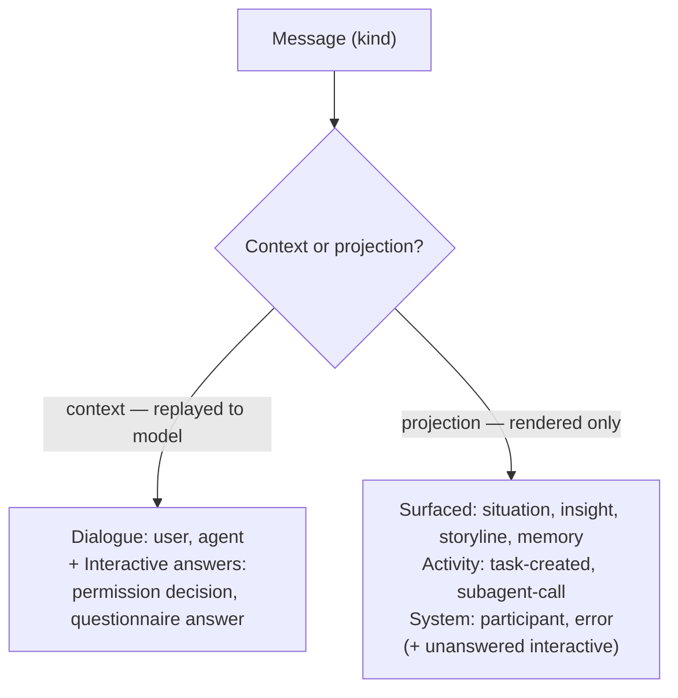
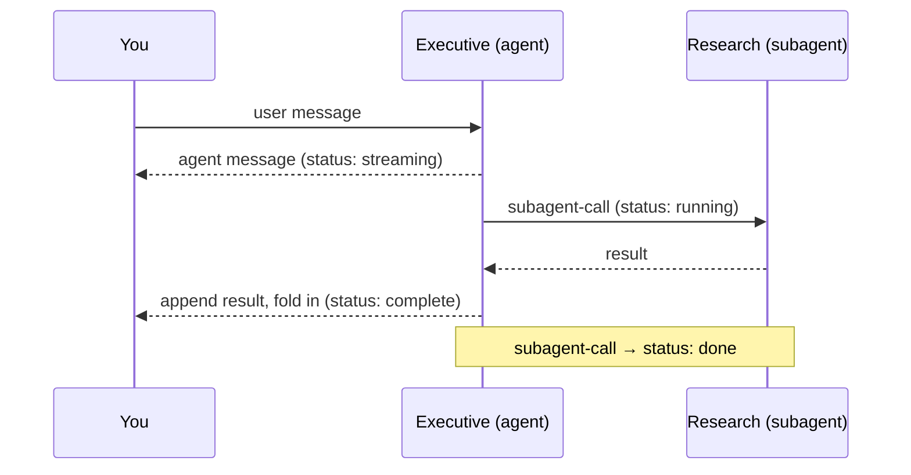

# Conversation

> **Status:** In Review
>
> **Version:** 0.1   ·   **Last updated:** 2026-06-11
>
> **Purpose:** The chat surface — the **primary** way the user interacts with the System. Defines the **Conversation** (`conv_`) and **Message** (`msg_`) primitives, the **message-kind taxonomy** (your messages, multi-agent messages, interactive requests, surfaced-primitive cards, and system markers), the **multi-participant roster**, the **living-channel** behavior (in-flight Task spawn + folded result, agent-initiated threads), **streaming**, and the **persistence + transport** contract.
>
> **Depends on:** [constitution](constitution.md), [how-it-works](how-it-works.md), [app-architecture](app-architecture.md), [agents](agents.md), [proactivity](proactivity.md)   ·   **Related:** [tasks](tasks.md), [agent-orchestration](agent-orchestration.md), [permissions](permissions.md), [situations](situations.md), [insights](insights.md), [storylines](storylines.md), [memory](memory.md), [evidence](evidence.md), [context-management](context-management.md), [activity-log](activity-log.md), [data-model](data-model.md)

---

## 1. Purpose & Scope

Chat is the **primary surface** of the System ([how-it-works](how-it-works.md) REQ-HOW-17): the other surfaces (Home, Calendar, Search, Settings, Activity log) open *from* it. This spec defines **what a Conversation is**, **what a Message is**, the **kinds of message** the surface renders, and **how conversations and messages behave** — multi-agent participation, the living channel, streaming, ordering, persistence, and the client↔server transport.

The spec's requirement tag is **`CONV`**; requirements are `REQ-CONV-NN`.

This spec **owns**:

- The **Conversation** and **Message** primitives and their lifecycle.
- The **message-kind taxonomy** — the five families and the full field definition of every kind.
- The **participant roster** and the multi-agent model (named, bounded participants).
- The **living-channel** mechanics: mid-conversation Task spawn and result folding, agent-initiated conversations.
- **Streaming** semantics (message status, chunk/append/end).
- **Message ordering**, pagination, persistence shape, and the **SSE + REST transport** for the chat surface.

## 2. Non-Goals / Out of Scope

- **Detecting what to surface.** Whether a Situation or Insight is worth showing is owned by [situations](situations.md) / [insights](insights.md); a surfaced-primitive Message only *renders a reference* to a primitive owned elsewhere.
- **The injection bar.** *Whether* and *when* the System may inject into a conversation, start a new one, or send a push is owned by [proactivity](proactivity.md) (the relevance/urgency bar, quiet hours, anti-spam, the chat-injection cap). This spec owns the *rendering and the message model*, not the *policy that admits a candidate*.
- **Agent definitions.** The roster (`Executive`/`Research`/`Ops`/`Reviewer`), personas, and the run loop are owned by [agents](agents.md); the orchestration that dispatches subagents is [agent-orchestration](agent-orchestration.md). This spec references an Agent by id.
- **Task semantics.** The Task lifecycle, decomposition, and approval-park are owned by [tasks](tasks.md); an activity Message references a `task_`.
- **Approval policy.** The Always/Ask-first/Never tiers and the standing-grant model are the [constitution](constitution.md) §5 / [permissions](permissions.md); a `permission` Message is the *in-conversation rendering* of a parked Ask-first request.
- **Context assembly.** How dialogue becomes the model's working context is [context-management](context-management.md); this spec only declares which Message kinds are eligible context (§5.3).
- **Concrete realization.** The `conv_`/`msg_` ULID format, the per-Space SQLite engine, the SSE plumbing, and the client↔server auth scheme are owned by [app-architecture](app-architecture.md) / [privacy-security](privacy-security.md). §7 specifies the conversation-specific tables, frames, and endpoints *consistent with* those owners.
- **The chat *view*.** Pixel layout, theming, and component structure are the client's. §6 gives reference mockups only.

## 3. Background & Rationale

A working person's tools capture **events** — messages, commits, notifications — but a feed of events is not understanding ([how-it-works](how-it-works.md) §3). The System answers "where does this stand / what's blocked / what changed" *in the conversation*, so the conversation cannot be a request/response box. It is a **living channel** (REQ-HOW-18): agents are named participants, a background agent can spawn a Task mid-reply and fold the result in, and an agent can open a new conversation when it observes a need.

That makes the chat log heterogeneous: it interleaves **dialogue** (you and the agents), **interactive requests** (an approval, a question), **surfaced primitives** (a Situation, an Insight), **in-flight work** (a spawned Task), and **system markers** (an agent joined). Mature messaging systems model exactly this split — Slack tags membership and system events as message *subtypes* with a `hidden` flag, Matrix separates content messages (`m.room.message`) from **state events** (`m.room.member` for join/leave), and the agent-UI protocol (AG-UI) carries an explicit `activity` role for frontend-only UI events that are **never sent to the model**. The taxonomy here adopts that organizing axis: a **discriminated union on `kind`**, grouped into families, with one family boundary that matters above all — **which messages are conversation context (replayed to the model) and which are UI projections (rendered, never fed back)** (§5.3).

The frontend already encodes a working prototype of this taxonomy (`frontend/src/lib/conversation.ts`): a 13-kind union, an agent roster matching [agents](agents.md), and approval `Decision` values matching the [constitution](constitution.md). This spec reconciles that prototype into a justified taxonomy and pins the behavior and transport behind it.

## 4. Concepts & Definitions

Canonical terms (→ [glossary](glossary.md)): **Conversation**, **Message**, **Agent**, **Situation**, **Insight**, **Storyline**, **Memory**, **Evidence**, **Task**, **Digest**.

| Term | Definition |
|------|------------|
| **Conversation** (`conv_`) | A persistent, ordered stream of Messages within exactly one [Space](spaces.md), with a **participant roster** (the user plus zero or more Agents). The unit a "thread" refers to. |
| **Message** (`msg_`) | A single entry in a Conversation, discriminated by **`kind`**. Time-sortable by its ULID id (creation order). |
| **Participant** | A party that can author dialogue in a Conversation: the **user** or a named **Agent**. Roster changes are marked by `participant` Messages (§5.7). |
| **Kind** | The Message discriminator; one of the twelve values in §5.1, grouped into five **families**. |
| **Family** | A grouping of kinds with shared behavior: **Dialogue · Interactive · Surfaced-primitive · Activity · System**. |
| **Context message** | A Message replayed into the model's working context (Dialogue + the *answer* of an Interactive). Distinct from a **projection** Message, which is rendered for the human only (§5.3). |
| **Projection / card** | A Message that renders a *reference* to a primitive owned by another spec (a Situation, Insight, Storyline, Memory, Task); the primitive is the source of truth, the card is a view of it. |
| **Living channel** | The behavior whereby a Conversation enriches itself in-flight (spawned Tasks fold results back) and agents may initiate new Conversations (§5.8). |

## 5. Detailed Specification

### 5.1 The Conversation and Message primitives

> **REQ-CONV-01.** A **Conversation** (`conv_`) is a Space-scoped, ordered stream of Messages with a **participant roster** and a lifecycle `active → archived`. It is created by the **user** (opening a chat) or by an **Agent** (agent-initiated, §5.8, gated by [proactivity](proactivity.md)). A Conversation belongs to **exactly one Space** ([spaces](spaces.md)); it never spans Spaces, and its Messages, participants, and surfaced primitives all resolve within that Space's isolation boundary.

> **REQ-CONV-02.** A **Message** (`msg_`) is one entry in a Conversation, discriminated by a single **`kind`** field (§5.1 table). Every Message carries: `id` (`msg_`ULID), `conversation_id`, `kind`, `author` (`user` · an `agent_` id · `system`), `created_at`, and a kind-specific payload. Messages are **append-only** in creation order; a Message's *mutable status* (streaming, an approval decision, a Task's progress, a resolved Situation) may change after creation, but its position in the stream does not. Message id is a ULID, so **stream order = creation order** ([app-architecture](app-architecture.md) REQ-ARCH-02), giving stable pagination without a separate sequence column.

> **REQ-CONV-03.** The twelve message **kinds** and their five **families**:

| Kind | Family | Author | Purpose |
|------|--------|--------|---------|
| `user` | **Dialogue** | user | Your message. |
| `agent` | **Dialogue** | agent | An Agent's reply — a named, bounded participant. |
| `permission` | **Interactive** | system (on behalf of an agent) | An Ask-first approval request parked in the conversation ([constitution](constitution.md) §5.2). |
| `questionnaire` | **Interactive** | agent | An Agent asks you a structured question (options or free text). |
| `situation` | **Surfaced primitive** | system | A [Situation](situations.md) surfaced inline (a card). |
| `insight` | **Surfaced primitive** | system | An [Insight](insights.md) surfaced inline. |
| `storyline` | **Surfaced primitive** | system / agent | A [Storyline](storylines.md) surfaced — created or updated (the `phase` field). |
| `memory` | **Surfaced primitive** | system | A durable [Memory](memory.md) the Curator saved, acknowledged inline. |
| `task-created` | **Activity** | agent | A [Task](tasks.md) was spawned mid-conversation (links to it). |
| `subagent-call` | **Activity** | agent | An Agent delegated to a subagent ([agent-orchestration](agent-orchestration.md)); shows status + result. |
| `participant` | **System** | system | An Agent **joined** or **left** the conversation. |
| `error` | **System** | system | A turn failed; offers retry. |

> **REQ-CONV-04 (taxonomy is closed).** `kind` is a **closed enum**. A new surface concern is added by **extending this enum with a changelog entry** (and placing the kind in a family), never by an open-ended "type" string. This keeps the client's render dispatch total and the context/projection split (§5.3) decidable.

### 5.2 Authorship and the participant roster

> **REQ-CONV-05.** A Conversation has a **participant roster**: the **user** (always present) plus zero or more **Agents**, each identified by its `agent_` id ([agents](agents.md)). Multiple Agents may participate in one Conversation simultaneously ("multi-agent"); each `agent` Message names its author, so the client can render distinct senders. An Agent enters the roster when first addressed or dispatched into the Conversation and is marked by a `participant` **joined** Message; it leaves (and is marked **left**) when its work in the Conversation completes or it is dismissed.

> **REQ-CONV-06.** "Your messages" are exactly the `user`-kind Messages; "other messages" are the `agent`-kind Messages, distinguished by `agent_id`; "service messages" are everything in the Interactive, Surfaced-primitive, Activity, and System families. The roster plus the `author` field is the **single source of sender identity** — there is no separate per-Message display-name carried on the wire; the client resolves an `agent_id` to its name/persona via [agents](agents.md).

### 5.3 The context-vs-projection axis (the load-bearing split)

> **REQ-CONV-07.** Every Message is either a **context message** or a **projection**:
>
> - **Context messages** — `user` and `agent` Dialogue, plus the **resolved answer** of an Interactive (`permission` decision, `questionnaire` answer). These are eligible to be replayed into a model's working context by [context-management](context-management.md).
> - **Projections** — `situation`, `insight`, `storyline`, `memory`, `task-created`, `subagent-call`, `participant`, `error`, and the *unanswered* form of an Interactive. These are **rendered for the human and are never fed back into the prompt as conversation content.** A projection that the model must reason over enters context through its **primitive** (e.g. the Situation itself via recall), not through the chat card.

This is the single most important rule in the spec: it prevents the heterogeneous chat log from polluting the very context window it feeds, and it makes a surfaced card a *view of a primitive* rather than a second copy of it.

### 5.4 Dialogue family — `user`, `agent`

> **REQ-CONV-08.** A **`user`** Message carries `body` (text) and optional `attachments` (file references). A **`user`** Message is the canonical conversation-driving event: posting one may **spawn a Task** ([how-it-works](how-it-works.md) REQ-HOW-08) and resumes any agent turn awaiting input.

> **REQ-CONV-09.** An **`agent`** Message carries `agent_id`, `body` (Markdown), an optional **reasoning trace** (`thinking`, an ordered list of step summaries — the projection of the agent's internal reasoning, shown collapsed), optional cited **`evidence`** (references to [Evidence](evidence.md) — P3, evidence-first), optional `attachments`, and a mutable **`status`** (`streaming → complete`, or `error`; §5.9). Evidence on an `agent` Message is a reference list, not inline copies; the citation renders as a chip that opens the Evidence. The `thinking` trace is a **projection** (not replayed to the model — §5.3).

### 5.5 Interactive family — `permission`, `questionnaire`

> **REQ-CONV-10.** A **`permission`** Message is the in-conversation rendering of an **Ask-first** action that a Task **parked** ([constitution](constitution.md) §5.2, [permissions](permissions.md)). It carries the requesting `agent_id`, the `action` (the tier-classified action), a human `detail`, and a mutable **`decision`** drawn from the constitution's approval options — `allow-once` · `allow-run` · `allow-always` · `deny` (frontend `Decision`). Until decided it is `pending`; the user's decision is the **context** part (§5.3) and drives [permissions](permissions.md):
> - `allow-*` → the parked Task **resumes** from its park point; `allow-always` additionally creates a scoped standing **grant** ([permissions](permissions.md)).
> - `deny` → the parked **leaf Task is cancelled** (`permission_denied`, [tasks](tasks.md) REQ-TASK-07/09); the card renders the outcome.
> - **timeout** (configurable) → the request lapses, the leaf Task is cancelled (`permission_timeout`), and the card renders as **stale** (§5.2 of the constitution). A `permission` Message is **never auto-approved** and **never blocks the conversation UI** — other Messages continue to stream around it.

> **REQ-CONV-11.** A **`questionnaire`** Message is an Agent asking the user a structured question: `agent_id`, `question`, `options[]` (multiple choice) or free-text, and a mutable **`answer`**. The answer is a **context** message (§5.3) — it feeds the asking Agent's next turn. Use a `questionnaire` for a *content* decision the Agent needs ("which repo?"); use a `permission` for an *authorization* decision the gate needs. They are different axes ([constitution](constitution.md) §5.1) and must not be conflated.

### 5.6 Surfaced-primitive family — `situation`, `insight`, `storyline`, `memory`

> **REQ-CONV-12.** A surfaced-primitive Message is a **card** that renders a **reference** to a primitive owned by another spec. It carries the primitive's id (`ref` → `sit_` · `ins_` · `story_` · `mem_`) and a **denormalized display snapshot** sufficient to render without a second fetch; the **primitive remains the source of truth**. The fields the snapshot carries per kind:
>
> | Kind | `ref` | Snapshot fields (display only) | Home spec |
> |------|-------|-------------------------------|-----------|
> | `situation` | `sit_` | `title`, `detail`, `attention`, `category`, `storyline?`, `actions[]`, mutable `resolved?` | [situations](situations.md) |
> | `insight` | `ins_` | `category`, `body`, `evidence[]` | [insights](insights.md) |
> | `storyline` | `story_` | `phase` (`started` \| `updated`), `title`, `momentum`, `detail`, `agent_id?` | [storylines](storylines.md) |
> | `memory` | `mem_` | `content` | [memory](memory.md) |
>
> The `storyline` kind covers **both** a newly-created Storyline (`phase: "started"`) and a momentum/summary update (`phase: "updated"`) — one kind, distinguished by a field, not two kinds.

> **REQ-CONV-13.** When a surfaced primitive **changes after it was carded** (a Situation is resolved elsewhere, a Storyline's momentum shifts), the card's snapshot is updated in place via a `message.updated` frame (§7.3) — the card always reflects current primitive state. A surfaced-primitive Message is **deduplicated** within a Conversation on `(conversation_id, ref)`: the same primitive is carded **at most once** per Conversation; a later change updates the existing card rather than posting a new one.

> **REQ-CONV-14.** A surfaced-primitive Message enters a Conversation **only when [proactivity](proactivity.md) admits it** through the **chat-injection channel** (REQ-PROACT-04) and within the **chat-injection cap** (OQ-PROACT-4 / [insights](insights.md) OQ-INS-1). It is written via the **transactional outbox** ([app-architecture](app-architecture.md) REQ-ARCH-12) so that a crash never drops or double-posts a card; the `(conversation_id, ref)` dedup (REQ-CONV-13) makes the at-least-once delivery idempotent.

### 5.7 Activity family — `task-created`, `subagent-call`; and System — `participant`, `error`

> **REQ-CONV-15.** A **`task-created`** Message marks that an Agent **spawned a [Task](tasks.md)** in-flight: `agent_id`, `task_id`, `title`. It links to the Task; the Task's own lifecycle is owned by [tasks](tasks.md). A **`subagent-call`** Message marks a **delegation** ([agent-orchestration](agent-orchestration.md)): `agent_id` (caller), `subagent_id` (callee), `task` (the dispatch summary), a mutable **`status`** (`running` → `done` \| `failed`), optional `steps[]` (the subagent's progress trace, a projection), and an optional `result`. Both are **Activity** projections (§5.3) — they show *that work is happening*; the worker itself is isolated and never exposes the orchestrator's conversation ([app-architecture](app-architecture.md) REQ-ARCH-10).

> **REQ-CONV-16.** A **`participant`** Message is a typed roster event: `agent_id` and `event` (`joined` \| `left`). It replaces a free-text divider with a structured marker (the Matrix/Slack membership-event pattern). An **`error`** Message carries `body` and is **retryable**: a retry re-runs the failed turn and, on success, the `error` Message is superseded by the produced `agent` Message. Both are System projections (§5.3). *Pure visual dividers (a date separator) are client rendering, not Messages.*

### 5.8 The living channel

> **REQ-CONV-17 (in-flight enrichment).** Within a Conversation the user is engaged in, an Agent may **spawn a Task mid-reply** and either **fold the result into its reply** or **post it as a contextual Activity Message** ([how-it-works](how-it-works.md) REQ-HOW-18). The mechanism: the `agent` reply is created in `streaming` status; a `task-created`/`subagent-call` Message references the spawned work; when the work returns, the Agent either continues streaming the same `agent` Message with the result folded in (then `complete`) or the Activity Message's `result` is filled and its `status` set to `done`. A folded/embedded Message carries a `parent_id` pointing at the `agent` Message that spawned it (§7.2), so the client can group enrichment under the reply that triggered it.

> **REQ-CONV-18 (agent-initiated conversations).** An Agent may **start a new Conversation** when it observes a need (REQ-HOW-18). Inside an already-engaged Conversation agents act **freely**; **starting a new Conversation or sending a push must clear the [proactivity](proactivity.md) urgency bar and respect quiet hours** (REQ-HOW-19, REQ-PROACT-04). The new Conversation is created with the initiating Agent already in its roster (a `participant` joined Message) and typically opens with a surfaced-primitive card explaining why.

> **REQ-CONV-19 (no nested threads in v1).** A Conversation is a **flat ordered stream**. "Thread" means a Conversation, not an in-message reply tree. Enrichment grouping uses `parent_id` (REQ-CONV-17) for visual nesting of folded results, but there is no separate threaded-reply surface in v1 (deferred — OQ-CONV-2).

### 5.9 Streaming

> **REQ-CONV-20.** A Message that is produced incrementally (an `agent` reply) has a mutable **`status`**: `streaming → complete`, or `error`. Streaming follows **create → append → end**: the Message is created (status `streaming`, possibly empty `body`), text arrives as ordered **chunks** appended to `body`, and an **end** transition sets `complete` (the AG-UI `TEXT_MESSAGE_START → CONTENT → END` shape). On the wire these map to the `message.created` / `message.delta` / `message.completed` SSE frames (§7.3). A client that connects mid-stream receives the current partial via the **snapshot** (REQ-CONV-22) and then live `message.delta` frames. If a stream is interrupted (agent leaves, worker dies), the Message is finalized to `error` (or `complete` if a partial is usable), never left `streaming` forever.

### 5.10 Ordering, pagination, retention

> **REQ-CONV-21.** Messages are ordered by `id` (ULID, creation-time-sortable). Pagination is **keyset** on `id`: a client fetches the most recent N and pages backward with `before=<msg_id>` (efficient range scans, no offset drift — [app-architecture](app-architecture.md) REQ-ARCH-02). Total order across multiple concurrent Agents is by ULID; the server assigns ids on write, so order is server-authoritative.

> **REQ-CONV-22 (snapshot + reconnect).** Clients are **stateless, reconnecting views** ([app-architecture](app-architecture.md) REQ-ARCH-15). On connect a client **GETs a snapshot** (the Conversation + the most recent page of Messages with their current mutable status) and then opens the **SSE stream** for live frames. A reconnect re-fetches the snapshot; no client-side authoritative state is assumed.

### 5.11 Ownership

> **REQ-CONV-23.** This spec **owns**: the Conversation/Message primitives and lifecycle, the `kind` taxonomy and families, the context-vs-projection split, the participant roster, the living-channel mechanics, streaming semantics, message ordering/pagination, and the conversation-specific persistence tables, SSE frames, and REST endpoints. It **references**: [constitution](constitution.md) §5.2 (parked approvals), [permissions](permissions.md) (decisions/grants), [proactivity](proactivity.md) (the injection bar/cap), [agents](agents.md) (the roster), [tasks](tasks.md)/[agent-orchestration](agent-orchestration.md) (Activity references), [situations](situations.md)/[insights](insights.md)/[storylines](storylines.md)/[memory](memory.md) (surfaced primitives), [context-management](context-management.md) (which kinds are context). It **defers**: the `conv_`/`msg_` ULID format, the per-Space SQLite engine and the outbox, the SSE wire transport, and the auth scheme to [app-architecture](app-architecture.md)/[privacy-security](privacy-security.md); the chat *view* to the client.

## 6. Visualizations

### 6.1 Message families and the context axis



### 6.2 Reference chat mockup (the `Business / Brightmoor` Space)

```
┌──────────────────────────────────────────────────────────────────────┐
│  Brightmoor  ·  Executive, Research                          conv_…7Q  │
├──────────────────────────────────────────────────────────────────────┤
│                                                                        │
│                              Where's the Brightmoor portal?    14:02 ‹1│
│                                                                        │
│  ─────────────────────  Research joined  ─────────────────────      ‹2│
│                                                                        │
│  ⚙ Executive → Research  ·  running                                 ‹3│
│     check brightmoor-portal repo + Devin's last message                │
│                                                                        │
│  ◐ Executive                                                  14:02 ‹4│
│     Devin signed off this morning. One CI flake on the payments        │
│     test — nothing blocking.                                           │
│     ▸ thought through 3 steps    [ ev: Devin · mail ] [ ev: CI · web ] │
│                                                                        │
│  🔒 Ask-first · Ops                                                  ‹5│
│     Use the Stripe credential to re-run the payout export.             │
│     [ Allow once ] [ For this run ] [ Always ] [ Deny ]                │
│                                                                        │
├──────────────────────────────────────────────────────────────────────┤
│  Message…                                                       [ ↑ ]  │
└──────────────────────────────────────────────────────────────────────┘
```

Legend: ‹1 `user` · ‹2 `participant` joined · ‹3 `subagent-call` (status running) · ‹4 `agent` (◐ = streaming; thinking trace + Evidence chips) · ‹5 `permission` (pending, parked — does not block the stream above it).

### 6.3 In-flight enrichment + streaming lifecycle



## 7. Data Shapes

### 7.1 The Message union (conceptual; mirrors `frontend/src/lib/conversation.ts`)

```typescript
type Kind =
  | "user" | "agent"                          // Dialogue
  | "permission" | "questionnaire"            // Interactive
  | "situation" | "insight" | "storyline" | "memory"  // Surfaced primitive
  | "task-created" | "subagent-call"          // Activity
  | "participant" | "error";                  // System

interface BaseMessage {
  id: string;                 // msg_ULID
  conversationId: string;     // conv_ULID
  author: "user" | AgentId | "system";
  createdAt: string;
  parentId?: string;          // folded/embedded under an agent message
}

type Message =
  | (BaseMessage & { kind: "user"; body: string; attachments?: FileRef[] })
  | (BaseMessage & { kind: "agent"; agentId: AgentId; body: string;
      status: "streaming" | "complete" | "error";
      thinking?: string[]; evidence?: EvidenceRef[]; attachments?: FileRef[] })
  | (BaseMessage & { kind: "permission"; agentId: AgentId; action: string;
      detail: string; decision?: Decision; state: "pending" | "resolved" | "stale" })
  | (BaseMessage & { kind: "questionnaire"; agentId: AgentId; question: string;
      options?: string[]; answer?: string })
  | (BaseMessage & { kind: "situation"; ref: string; title: string; detail: string;
      attention: number; category?: SituationCategory; storyline?: string;
      actions: string[]; resolved?: string })
  | (BaseMessage & { kind: "insight"; ref: string; category: InsightCategory;
      body: string; evidence?: EvidenceRef[] })
  | (BaseMessage & { kind: "storyline"; ref: string; phase: "started" | "updated";
      title: string; momentum?: Momentum; detail: string; agentId?: AgentId })
  | (BaseMessage & { kind: "memory"; ref: string; content: string })
  | (BaseMessage & { kind: "task-created"; agentId: AgentId; taskId: string; title: string })
  | (BaseMessage & { kind: "subagent-call"; agentId: AgentId; subagentId: AgentId;
      task: string; status: "running" | "done" | "failed"; steps?: string[]; result?: string })
  | (BaseMessage & { kind: "participant"; agentId: AgentId; event: "joined" | "left" })
  | (BaseMessage & { kind: "error"; body: string });

type AgentId = "executive" | "research" | "ops" | "reviewer" | string;  // → agents.md
type Decision = "allow-once" | "allow-run" | "allow-always" | "deny";   // → constitution §5.1
```

This reconciles the frontend prototype by **merging** `storyline-started` into `storyline` (`phase` field) and **replacing** the free-text `event` kind with the typed `participant` kind. Surfaced-primitive kinds gain a `ref` to their primitive (REQ-CONV-12).

### 7.2 Persistence (per-Space SQLite — [app-architecture](app-architecture.md) REQ-ARCH-03)

```sql
-- in space_<ULID>.db
CREATE TABLE conversations (
  id          TEXT PRIMARY KEY,           -- conv_ULID
  title       TEXT,
  status      TEXT NOT NULL,              -- active | archived
  started_by  TEXT NOT NULL,              -- user | agent_<id>
  created_at  TEXT NOT NULL,              -- ULID time => ordered
  updated_at  TEXT NOT NULL
);

CREATE TABLE messages (
  id              TEXT PRIMARY KEY,       -- msg_ULID (order = creation order)
  conversation_id TEXT NOT NULL REFERENCES conversations(id),
  kind            TEXT NOT NULL,
  author          TEXT NOT NULL,          -- user | agent_<id> | system
  parent_id       TEXT REFERENCES messages(id),
  ref             TEXT,                   -- surfaced primitive: sit_/ins_/story_/mem_; activity: task_
  status          TEXT,                   -- streaming|complete|error | pending|resolved|stale | running|done|failed
  payload         TEXT NOT NULL,          -- kind-specific JSON (body, snapshot, etc.)
  created_at      TEXT NOT NULL
);
CREATE INDEX messages_by_conv ON messages(conversation_id, id);
CREATE UNIQUE INDEX messages_card_dedup ON messages(conversation_id, ref)
  WHERE ref IS NOT NULL AND kind IN ('situation','insight','storyline','memory');

CREATE TABLE conversation_participants (
  conversation_id TEXT NOT NULL REFERENCES conversations(id),
  agent_id        TEXT NOT NULL,
  joined_at       TEXT NOT NULL,
  left_at         TEXT,
  PRIMARY KEY (conversation_id, agent_id)
);
```

The `messages_card_dedup` partial unique index enforces REQ-CONV-13 (one card per primitive per Conversation) and makes outbox replay idempotent (REQ-CONV-14). `conversation_participants` is the roster; `participant` Messages are its timeline.

### 7.3 Transport — SSE frames + REST endpoints ([app-architecture](app-architecture.md) REQ-ARCH-15: REST + SSE)

**SSE frames** on `GET /conversations/:id/stream` (each frame's `data` is a JSON Message or patch):

| Frame `event:` | `data` | Meaning |
|----------------|--------|---------|
| `message.created` | full Message | A new Message appended (incl. a `streaming` agent reply, a `participant`, a card). |
| `message.delta` | `{ id, chunk }` | A text chunk appended to a streaming Message (REQ-CONV-20). |
| `message.completed` | `{ id, status }` | A streaming Message finalized (`complete` \| `error`). |
| `message.updated` | full Message | A mutable Message changed: `permission` decision, `questionnaire` answer, `subagent-call` status/result, or a card snapshot (REQ-CONV-13). |

**REST endpoints** (Space-scoped, token-authed, loopback/LAN — [privacy-security](privacy-security.md) owns auth):

| Method · Path | Purpose |
|---------------|---------|
| `GET /spaces/:space/conversations` | List Conversations in a Space. |
| `POST /spaces/:space/conversations` | Open a Conversation (user-initiated). |
| `GET /conversations/:id` | Snapshot: Conversation + roster + recent Messages (REQ-CONV-22). |
| `GET /conversations/:id/messages?before=<msg>&limit=N` | Keyset page backward (REQ-CONV-21). |
| `POST /conversations/:id/messages` | Post a `user` Message. |
| `GET /conversations/:id/stream` | SSE live frames. |
| `POST /conversations/:id/messages/:msg/decision` | Resolve a `permission` (`{ decision }`) → [permissions](permissions.md). |
| `POST /conversations/:id/messages/:msg/answer` | Answer a `questionnaire` (`{ answer }`). |
| `POST /conversations/:id/messages/:msg/action` | Invoke a `situation` suggested action. |

Agent-initiated Conversations (§5.8) are created server-side through the same model (not via the user `POST`), gated by [proactivity](proactivity.md); the client learns of them on its next snapshot/stream.

## 8. Examples & Use Cases

### Example A — "Reads your mind in chat" (in-flight enrichment)

**Given** you are in the `Brightmoor` Conversation with the `Executive`. **When** you post *"Where's the Brightmoor portal?"* (`user` Message), the Executive begins an `agent` reply in `streaming` status and spawns a Research subagent (`subagent-call`, status `running`) to check the `brightmoor-portal` repo and Devin's last message. **Then** Research returns; the Executive folds the result into the same `agent` Message and finalizes it `complete` — *"Devin signed off this morning; one CI flake on the payments test, nothing blocking"* — citing two Evidence references; the `subagent-call` flips to `done`. You never asked it to look ([how-it-works](how-it-works.md) Example B; REQ-CONV-17).

### Example B — A parked approval in the conversation

**Given** an `Ops` Task running in the `Brightmoor` Space hits an **Ask-first** action — use the **Stripe** credential to re-run the payout export — while you are present in the Conversation. **When** the Task parks the request ([constitution](constitution.md) §5.2), a `participant` joined Message marks Ops entering the roster and a `permission` Message renders (`pending`) — *"Use the Stripe credential to re-run the payout export"* — with `allow-once / for this run / always / deny`. Other Messages keep streaming around it (REQ-CONV-10). **Then** you tap **Allow once**: the decision posts to `POST …/decision`, the parked Task **resumes**, Ops finishes and posts an `agent` confirmation, and a `participant` left Message marks Ops leaving. Had you tapped **Deny**, the leaf Task would be cancelled (`permission_denied`) and the card would render the outcome.

### Example C — Agent-initiated conversation (clears the urgency bar)

**Given** the Situation *"Investor reply to Talia overdue"* climbs in Attention score over three days ([situations](situations.md), [proactivity](proactivity.md)). **When** it clears the **urgency bar** and quiet hours allow (REQ-HOW-19, REQ-PROACT-04), the `Executive` **starts a new Conversation** in the `Business` Space: it is created with Executive in the roster (`participant` joined) and opens with a `situation` card (`ref → sit_…`, attention badge, the suggested action *"draft a follow-up to Talia"*). **Then** you either invoke the action (`POST …/action`) or reply in dialogue — the card stays in sync if the Situation is resolved elsewhere (REQ-CONV-13).

## 9. Edge Cases & Failure Modes

| Case | Behavior |
|------|----------|
| Client connects mid-stream | Snapshot returns the partial `agent` Message (status `streaming`); live `message.delta` frames continue it (REQ-CONV-22). |
| Stream interrupted (agent leaves / worker dies) | Message finalized to `error` (or `complete` if a partial is usable) — never stuck `streaming` (REQ-CONV-20); a `participant` left Message is emitted. |
| Permission times out | Card → `stale`; leaf Task cancelled `permission_timeout`; never auto-approved ([constitution](constitution.md) §5.2). |
| Carded primitive changes after posting | `message.updated` refreshes the snapshot in place; never a duplicate card (REQ-CONV-13). |
| Same primitive surfaced twice | Deduped on `(conversation_id, ref)` via the partial unique index; the update path runs instead (REQ-CONV-14). |
| Injection cap reached | Further candidates are **not** injected; [proactivity](proactivity.md) batches them to Home/Digest instead (REQ-CONV-14, OQ-PROACT-4). |
| Outbox replay after crash | At-least-once delivery + the dedup index ⇒ idempotent card creation ([app-architecture](app-architecture.md) REQ-ARCH-12). |
| Conversation with no Agents yet | Valid — roster is just the user until an Agent is addressed or dispatched. |
| Cross-Space reference | Forbidden — a Conversation and all its refs resolve within one Space ([constitution](constitution.md) P10; REQ-CONV-01). |

## 10. Open Questions & Decisions

- **D-CONV-1 (decided).** `storyline-started` is **merged** into `storyline` via the `phase` field; the free-text `event` kind is **replaced** by the typed `participant` kind. The taxonomy is the twelve kinds in §5.1.
- **D-CONV-2 (decided).** A Conversation is a **flat stream**; "thread" = a Conversation. In-message reply trees are **out of scope for v1** (enrichment uses `parent_id` grouping only).
- **OQ-CONV-1.** The **chat-injection cap** value (how many surfaced cards may enter one Conversation before it crowds the chat) — owned by [proactivity](proactivity.md) OQ-PROACT-4 / [insights](insights.md) OQ-INS-1. Load-bearing for REQ-CONV-14's *number*, not its mechanism.
- **OQ-CONV-2.** Whether `memory` cards need an anti-spam sub-cap of their own (kept as a kind, but routine Memory writes are frequent) — coordinate with [proactivity](proactivity.md).
- **OQ-CONV-3.** Whether **mid-stream client control** (interrupt/cancel a streaming reply) needs WebSocket beyond SSE — tracked by [app-architecture](app-architecture.md) OQ-ARCH-3.
- **OQ-CONV-4.** User **edit/delete** of a posted Message and its effect on context — deferred.
- **FOLLOW-UP-CONV-1 (frontend, non-spec).** Align `frontend/src/lib/conversation.ts` to this taxonomy: merge `storyline-started` → `storyline` (`phase`), replace `event` → `participant`, add `ref` to surfaced-primitive kinds. Separately (housekeeping the inspection surfaced): the unused `FileTreeRoot`/`MOUNTED_TREES` carried in `ConversationData`, and the overlap between `lib/storyline.ts` and `lib/narrative.ts`. Tracked as a code task, not part of this spec.

## 11. Review & Acceptance Checklist

- [ ] The Conversation (`conv_`) and Message (`msg_`) primitives, lifecycle, and Space-scoping are defined (REQ-CONV-01/02).
- [ ] The twelve kinds and five families are enumerated, each kind's fields fully defined (REQ-CONV-03…16).
- [ ] The context-vs-projection split is stated and assigns every kind (REQ-CONV-07).
- [ ] "Your messages / multi-agent messages / service messages" map cleanly onto kinds + roster (REQ-CONV-05/06).
- [ ] The living channel — in-flight Task spawn + folded result, agent-initiated Conversations gated by [proactivity](proactivity.md) — is specified and drawn (REQ-CONV-17/18; §6.3).
- [ ] Streaming (status + create/append/end), ordering (ULID keyset), and snapshot/reconnect are defined (REQ-CONV-20/21/22).
- [ ] Persistence tables, SSE frames, and REST endpoints are given and consistent with [app-architecture](app-architecture.md) (REST+SSE, per-Space SQLite, outbox) — §7.
- [ ] `permission`/`questionnaire` reconcile with [constitution](constitution.md) §5.2 and [permissions](permissions.md); surfaced primitives defer semantics to their home specs (REQ-CONV-10/11/12).
- [ ] ≥2 examples use the cast; edge cases and failure modes are covered (§8, §9).
- [ ] No placeholders; the taxonomy is closed and internally consistent (REQ-CONV-04).

## 12. Cross-References

- [how-it-works](how-it-works.md) §5.13 — chat as the primary, living-channel surface (REQ-HOW-17/18/19).
- [constitution](constitution.md) §5.2 — parked approvals in background work; the approval decision options.
- [proactivity](proactivity.md) — the chat-injection channel, the urgency bar, quiet hours, the injection cap.
- [agents](agents.md) — the participant roster (`Executive`/`Research`/`Ops`/`Reviewer` + user-defined).
- [tasks](tasks.md) / [agent-orchestration](agent-orchestration.md) — Activity references (`task-created`, `subagent-call`).
- [situations](situations.md) / [insights](insights.md) / [storylines](storylines.md) / [memory](memory.md) — the surfaced primitives the cards reference.
- [context-management](context-management.md) — consumes the context-vs-projection split (which kinds are eligible context).
- [app-architecture](app-architecture.md) — `prefix_ULID`, per-Space SQLite, the outbox, REST+SSE.
- Terms feeding back to [glossary](glossary.md): **Conversation**, **Message**.

## 13. Changelog

- **2026-06-11 — v0.1** — Initial draft. Defines the **Conversation** (`conv_`) and **Message** (`msg_`) primitives; a **closed twelve-kind taxonomy** in five families (Dialogue · Interactive · Surfaced-primitive · Activity · System) reconciled from the frontend prototype (`storyline-started` merged into `storyline` via `phase`; free-text `event` replaced by typed `participant` joined/left); the load-bearing **context-vs-projection** split (REQ-CONV-07); the **multi-participant roster** and "your / multi-agent / service" mapping; the **living channel** (in-flight Task spawn + folded result, agent-initiated Conversations gated by [proactivity](proactivity.md)); **streaming** (status + create/append/end) and **ULID keyset ordering** with snapshot/reconnect; and the **full transport** — per-Space SQLite tables (with a card-dedup partial unique index), SSE frames, and REST endpoints — consistent with [app-architecture](app-architecture.md) (REST+SSE, outbox, `prefix_ULID`). Research-grounded in agent-UI/messaging patterns (AG-UI roles incl. the model-vs-UI `activity` split; Slack message subtypes/`hidden`; Matrix content-vs-state events; OpenAI discriminated message union). Frontend type-alignment and dead-code housekeeping logged as a non-spec follow-up (FOLLOW-UP-CONV-1). **Moved from the untiered backlog into Tier 3: Features** (📝 In Review).
