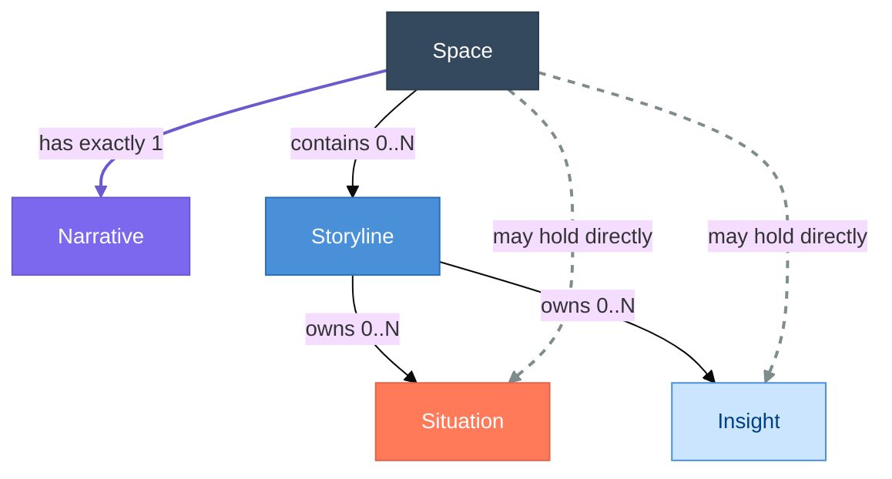
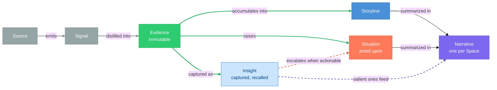

# Data Model

> **Status:** Approved
>
> **Version:** 1.3   ·   **Last updated:** 2026-06-09
>
> **Purpose:** The canonical conceptual entity-relationship model for the System — how the narrative-layer primitives (Space, Storyline, Situation, Insight, Evidence, Narrative) relate, what each owns, and how they are identified. It fixes the **Situation ↔ Insight boundary** and the **capture-and-retrieve Insight**.
>
> **Depends on:** [constitution](constitution.md)   ·   **Related:** [glossary](glossary.md), [spaces](spaces.md), [signals](signals.md), [insights](insights.md), [memory](memory.md), [entities](entities.md), [ui-shell](ui-shell.md)

> Requirement tag: **DM**

---

## 1. Purpose & Scope

This spec is the **conceptual map** that every narrative-layer feature spec builds on. It defines the entities, their **relationships**, their **identity** (ID prefixes), and the few cross-cutting invariants (containment, the pipeline, Status/Momentum) that must stay consistent across specs.

Its depth is concentrated on the **narrative layer** — **Space, Storyline, Situation, Insight, Evidence, Narrative** — because that is where the two closest primitives, Situation and Insight, must be kept distinct. Other entities (Task, Agent, Skill, Tool, Memory, Entity, Conversation) appear here only at **relationship granularity**; their full shapes live in their own specs.

A central commitment of this model: an **Insight is a lightweight, evidence-backed captured note** retrieved by semantic relevance, while a **Situation** carries the heavier, lifecycle-managed role of a condition that needs action.

## 2. Non-Goals / Out of Scope

- **Not persistence or storage tech.** Table layouts, the concrete ID format (ULID vs slug), indexes, and the embedding model/library are owned by [app-architecture](app-architecture.md) / [stack](stack.md) and the relevant feature specs.
- **Not the mechanics of any primitive.** *How* Situations are detected, *how* Insights are captured and recalled, *how* Storylines are promoted/merged — those live in [situations](situations.md), [insights](insights.md), [storylines](storylines.md). This spec fixes only what they share.
- **Not the surfacing UI.** Where these appear is owned by [ui-shell](ui-shell.md) and [conversation](conversation.md).

## 3. Background & Rationale

The System models a user's world as a few durable primitives rather than a feed of events (P2), and those primitives must mean the same thing in every surface and every spec. This document fixes their relationships in one place so the feature specs share one model.

Two primitives sit especially close — **Situation** and **Insight** — because both are evidence-backed, both attach to Storylines, and both can carry a direction. The model keeps them distinct by separating them on **role**:

- A **Situation** is an operational condition the user must *act on*; it is few, heavy, and lifecycle-managed until resolved.
- An **Insight** is a discovery worth *remembering*; it is many, cheap, and retrieved when relevant.

This split lets the System do two different jobs well. It captures discoveries **liberally and cheaply** — recording a small note costs almost nothing — and puts its intelligence into **retrieval**, surfacing the right note by semantic relevance at the moment it matters. It reserves the heavier machinery (Attention scoring, suggested actions, a resolution lifecycle) for the comparatively few conditions that demand action. Evidence underpins both: nothing is asserted without a citable fact (P3).

## 4. Concepts & Definitions

Canonical definitions live in [glossary](glossary.md); this spec uses them and refines two. Quick orientation:

- **Space** — the only primitive container; everything lives in one ([spaces](spaces.md), P11).
- **Storyline** — a long-running narrative thread; the **continuity container** for related work.
- **Situation** — a persistent **operational condition that needs awareness/action now**; *acted upon*; lives until resolved. *(See §5.4.)*
- **Insight** — a lightweight, evidence-backed **captured note of non-obvious discovered info**; *recalled* by semantic relevance; expires. *(See §5.5.)*
- **Evidence** — a normalized, attributable, **immutable** fact distilled from Signals; the citable substance behind everything (P3).
- **Narrative** — the editable **synthesis** at **Space or Storyline** scope: current state, active Storylines, risks (REQ-DM-16).

## 5. Detailed Specification

### 5.1 Entity catalog & identity

> **REQ-DM-01.** Every entity instance carries a stable, type-prefixed ID per [constitution](constitution.md) §6.2 (the concrete format is fixed in [app-architecture](app-architecture.md)). IDs are never reused or renumbered.

| Entity | Prefix | Owned by | In this spec |
|--------|--------|----------|--------------|
| Space | `space_` | [spaces](spaces.md) | container (relationships only) |
| Storyline | `story_` | [storylines](storylines.md) | **modeled** |
| Situation | `sit_` | [situations](situations.md) | **modeled** |
| Insight | `ins_` | [insights](insights.md) | **modeled** |
| Evidence | `ev_` | [evidence](evidence.md) | **modeled** |
| Narrative | `nar_` | [narrative](narrative.md) | **modeled** (Space or Storyline scope) |
| Signal | `sig_` | [signals](signals.md) | upstream (relationship only) |
| Entity (graph) | `ent_` | [entities](entities.md) | cross-link (relationship only) |
| Task | `task_` | [tasks](tasks.md) | relationship only |
| Periodic Task | `ptask_` | [periodic-tasks](periodic-tasks.md) | relationship only |
| Agent | `agent_` | [agents](agents.md) | infrastructure (not modeled) |
| Skill | `skill_` | [skills](skills.md) | infrastructure (not modeled) |
| Tool | `tool_` | [tools](tools.md) | infrastructure (not modeled) |
| Grant | `grant_` | [permissions](permissions.md) | infrastructure (not modeled) |
| Auth profile | `auth_` | [secrets](secrets.md) / [permissions](permissions.md) | infrastructure (not modeled) |
| Secret (handle) | `secret_` | [secrets](secrets.md) | infrastructure (not modeled) |
| MCP server | `mcp_` | [mcp](mcp.md) | infrastructure (not modeled) |
| Conversation | `conv_` | [conversation](conversation.md) | surface (not modeled) |
| Message | `msg_` | [conversation](conversation.md) | surface (not modeled) |
| Notification | `notif_` | [proactivity](proactivity.md) | surface (not modeled) |
| Curator job | `cjob_` | [curator](curator.md) | infrastructure (not modeled) |
| Integration | `int_` | [integrations](integrations.md) | upstream source (not modeled) |
| User Workflow | `wf_` | [user-workflows](user_workflows.md) | automation source (not modeled) |
| Workflow run | `wfr_` | [user-workflows](user_workflows.md) | audit/run history (not modeled) |
| Memory | `mem_` | [memory](memory.md) | relationship only |

> **REQ-DM-02.** Every entity except Space belongs to **exactly one** Space (`space_id`). Context, Evidence, Situations, and Insights never leak across Spaces except via explicit **downstream inheritance** ([spaces](spaces.md), P10).

### 5.2 Containment & ownership

> **REQ-DM-03.** The containment hierarchy is **`Space ⊃ Storyline ⊃ { Situation, Insight, Evidence-links, Task, … }`**. A Situation or Insight MAY exist at **Space level without a Storyline** (e.g. a freshly captured Insight not yet attached); attachment to a Storyline is a relationship, not a precondition for existence.

A Storyline **aggregates** rather than exclusively owns: the same Evidence or Entity may relate to several Storylines. A Situation or Insight has **at most one** owning Storyline at a time.

### 5.3 The knowledge pipeline (relationships)

> **REQ-DM-04.** Knowledge flows **Signal → Evidence → (Storyline / Situation) → Insight**, and is synthesized in the **Narrative** (restates [glossary](glossary.md) REQ-CON-01). Evidence is **immutable** once distilled; every Insight, Situation, and surfaced claim **cites the Evidence** behind it (P3). The Insight is the *captured-knowledge layer* (many small notes) and the Narrative is the *synthesis layer* (one per Space).

### 5.4 Situation vs Insight — the boundary

The two are separated by **role**, not by category vocabulary.

> **REQ-DM-05.** A **Situation** is a persistent operational condition that needs awareness/action *now*; it is **acted upon** and lives until **resolved**. An **Insight** is a lightweight captured discovery; it is **recalled** by relevance and eventually **expires**. They are different kinds of object and MUST NOT be modeled with a shared category enum.

| | **Situation** | **Insight** |
|---|---|---|
| Answers | "What is true that matters and needs action now?" | "What did we discover that's worth knowing/surfacing?" |
| Verb | **acted upon** (resolve it) | **recalled** (retrieve when relevant) |
| Weight | heavy: lifecycle, Attention score, suggested actions | light: a note + a kind + an embedding |
| Cardinality | few, managed | many, cheap |
| Ends by | **resolution** | **expiry** |
| Surfaced by | Attention score → Home Attention-Needed | semantic relevance → chat / Home / Digest |

> **REQ-DM-06.** An Insight MAY **escalate into** a Situation when its content becomes actionable. The spawned Situation links back to the originating Insight (`spawned_from_insight_id`); the Insight is **not** duplicated into the Situation's role. Escalation is one-way and recorded.

### 5.5 The Insight (capture-and-retrieve)

The Insight follows a **capture-and-retrieve** model: capture is cheap and liberal, and the intelligence is in **retrieval**.

> **REQ-DM-07.** An Insight is a **small, evidence-backed note**: a short `title` plus a 1–3 sentence `body` (the "little message"). **One Insight = one note = one `kind`.**

> **REQ-DM-08.** **Capture is an Always action** — "summarize, extract, analyze, generate insights" and "create internal objects" are baseline-Always ([constitution](constitution.md) §5). Agents/detectors capture Insights **liberally and with low ceremony** as they process Evidence. Creation is never gated, ranked, or Ask-first; recording a note costs no more than the analysis that produced it.

> **REQ-DM-09.** An Insight's `kind` is exactly one of a small **taxonomy** tuned for operational intelligence:
>
> | `kind` | Captures | Cast example |
> |--------|----------|--------------|
> | `observation` | a discrete noticing worth searching back for | "Northwind's status page added a 'maintenance windows' section." |
> | `connection` | a link across Storylines/Entities (synthesis) | "Your *Distributed consensus* research and the *Framework* routing problem both point at the same ordering guarantee." |
> | `risk` | a discovered downside worth knowing | "The `framework` core dep is one maintainer with no recent releases." |
> | `opportunity` | a discovered upside | "A new library matches the concurrency model you sketched for *Framework*." |
> | `prediction` | an inferred future likelihood | "At the current cadence, the routing decision will slip past the Talia demo." |
> | `context` | a durable learned fact about a person/company/preference | "Devin Osei prefers decisions in writing before calls." |
>
> The taxonomy is deliberately small: `momentum` is a Storyline property (§5.6), and `decision` / `dependency` / `blocker` are **Situation** categories ([situations](situations.md)) — each belongs to its own primitive, not to Insight.

> **REQ-DM-10.** Every Insight carries a **semantic vector (embedding)** derived from its content. **Recall is by semantic similarity + recency** — "conceptually related, not just keyword matches." This is where the System's intelligence about Insights lives: **at read-time, not write-time.** (The embedding model and search mechanics are owned by [insights](insights.md) / [memory](memory.md).)

> **REQ-DM-11.** An Insight is **scoped to a Space**. It MAY be **promoted to a broader (ancestor) Space** when it is more widely relevant — mirroring a "project-local vs global" split via [spaces](spaces.md) downstream inheritance.

> **REQ-DM-12.** Insight lifecycle is lightweight: **`active → expired → archived`**. New corroborating Evidence **reinforces** an existing Insight (updates `confidence` and `last_seen_at`) rather than creating a duplicate; near-duplicate captures are **deduped by embedding similarity** ([insights](insights.md) owns the threshold).

> **REQ-DM-13.** **Capture-cheap, surface-selective.** Because capture is liberal, surfacing applies a **relevance/recency bar** so the user sees only what matters — silence is the default (P4). High capture volume MUST NOT translate into high surfacing volume.

**How capture works.** Capture is **agent-initiated**: as the System's agents and detectors process Evidence, they record discoveries directly as Insights, with low ceremony and no approval step (REQ-DM-08). Three properties keep the captured set clean and useful:

- **Atomic, single-kind notes.** Each Insight is one note carrying one `kind`, so dedup, recall, and surfacing operate on clean units.
- **Space-scoped, with promotion.** An Insight belongs to the Space whose work produced it, and may be promoted to an ancestor Space when it becomes more broadly relevant (REQ-DM-11).
- **Read-time intelligence.** Creation carries no ranking; relevance is computed at retrieval from the embedding and recency (REQ-DM-10).

### 5.6 Status & Momentum

**Status** (lifecycle phase) and **Momentum** (movement) are distinct axes.

> **REQ-DM-14.** **Status is per-type, drawn from a shared vocabulary** (so the words mean the same thing everywhere, but each type uses only the states that apply):
>
> | Type | Status values |
> |------|---------------|
> | Storyline | `candidate · active · dormant · archived` |
> | Situation | `active · blocked · resolved` (plus `snoozed · dismissed`, owned by [situations](situations.md)) |
> | Insight | `active · expired · archived` |

> **REQ-DM-15.** **Momentum is orthogonal to Status.** A Storyline's **Momentum** (`advancing · steady · stalled · looping`, per [glossary](glossary.md)) describes *movement*, while **Status** describes *lifecycle phase*. The "growing / stalled" nuance lives in **Momentum**, never duplicated into Status. *Example:* the *Framework UI direction* Storyline is `active` (Status) but `looping` (Momentum).

### 5.7 Narrative as the synthesis layer

> **REQ-DM-16.** A **Narrative** (`nar_`) is the editable synthesis at **Space** or **Storyline** scope: **at most one per Space** and **at most one per Storyline**. The **Space** Narrative synthesizes the Space's active Storylines, open Situations, and salient Insights; the **Storyline** Narrative is that Storyline's running `summary` ([storylines](storylines.md) REQ-STORY-08), given structure. A Narrative is human-readable and human-**editable**, and doubles as the System's context-compression layer ([narrative](narrative.md)). It is *not* a feed and *not* a dump. (A "global" view is the root Space's Narrative; whether very large Spaces need sub-Space Narratives below the Space level remains open — [glossary](glossary.md) OQ-CON-1, [narrative](narrative.md) OQ-NAR-3.)

### 5.8 The Evidence (typed and append-only)

> **REQ-DM-17.** Evidence (`ev_`) is a **typed, append-only fact**. Each item carries exactly one `type` from a small catalog (`observation · statement · decision · promise · change · relationship · activity`, owned by [evidence](evidence.md) REQ-EV-02), links the `signal_ids` it was distilled from, and **aggregates into** Storylines and links Entities — it may belong to several (REQ-DM-03). It is **never edited in place**: when reality moves, a **new** Evidence record is added, and interpretations built on it ([Insights](insights.md), [Situations](situations.md), the Narrative) change while the fact does not. The Evidence `type` vocabulary is **disjoint from** Situation `category`s and Insight `kind`s (REQ-DM-05) — those *interpret* Evidence; they are not Evidence. (Signal ingestion that produces Evidence is owned by [signals](signals.md); the type catalog and graph mechanics by [evidence](evidence.md).)

## 6. Visualizations

### 6.1 Containment & ownership (narrative layer)



*A Situation or Insight is usually owned by a Storyline, but may sit directly in a Space (REQ-DM-03). Evidence backing and the Signal → … → Narrative flow are in §6.2.*

### 6.2 The pipeline



*Capture is liberal (many Insights); surfacing is selective (REQ-DM-13). Intelligence about Insights lives in semantic **recall**, not in creation.*

## 7. Data Shapes

Conceptual shapes — **not** a storage schema (persistence is [app-architecture](app-architecture.md)). IDs per §5.1; timestamps abbreviated.

```ts
interface Storyline {
  id: string;                 // story_
  space_id: string;
  title: string;
  summary: string;
  status: "candidate" | "active" | "dormant" | "archived";
  momentum: "advancing" | "steady" | "stalled" | "looping";
  situation_ids: string[];
  insight_ids: string[];
  evidence_ids: string[];
  task_ids: string[];
  entity_ids: string[];
  related_storyline_ids: string[];
  last_activity_at: Date;
}

interface Situation {
  id: string;                 // sit_
  space_id: string;
  storyline_id?: string;
  title: string;
  summary: string;
  category: string;           // catalog owned by situations.md (blocker, decision, dependency, overdue, contradiction, approval, watch)
  status: "active" | "blocked" | "resolved" | "snoozed" | "dismissed";
  attention_score: number;    // ranks the briefing
  evidence_ids: string[];     // required (P3)
  suggested_actions: string[];
  related_entities: string[];
  related_tasks: string[];
  spawned_from_insight_id?: string;
  resolved_at?: Date;
}

interface Insight {           // a little captured message
  id: string;                 // ins_
  space_id: string;
  storyline_id?: string;
  kind: "observation" | "connection" | "risk" | "opportunity" | "prediction" | "context";
  title: string;              // short
  body: string;               // 1–3 sentences — the message
  evidence_ids: string[];     // required (P3)
  embedding: number[];        // semantic vector for recall (model owned by insights.md/memory.md)
  confidence: number;
  status: "active" | "expired" | "archived";
  entity_ids: string[];
  spawned_situation_id?: string;
  created_at: Date;
  last_seen_at: Date;         // bumped on reinforcement
}

interface Evidence {          // immutable, append-only
  id: string;                 // ev_
  space_id: string;
  type:                       // the kind of fact (catalog owned by evidence.md)
    | "observation" | "statement" | "decision" | "promise"
    | "change" | "relationship" | "activity";
  signal_ids: string[];       // one or more Signals distilled into this fact
  claim: string;              // the normalized fact
  provenance: string;         // where it came from, when
  storyline_ids: string[];    // aggregates into (may be several)
  entity_ids: string[];       // graph links to Entities
  metadata: Record<string, unknown>;
  captured_at: Date;
}

interface Narrative {         // editable synthesis; scope = Space or Storyline (catalog/shape owned by narrative.md)
  id: string;                 // nar_
  scope: "space" | "storyline";
  scope_id: string;           // space_ or story_
  current_state: string;
  direction: string;
  momentum: string;           // prose; canonical Momentum enum stays on the Storyline
  friction: string;
  open_questions: string[];
  next_step: string;
  body: string;               // rendered Narrative Markdown — synthesized + human-edited
  evidence_ids: string[];     // provenance (P3)
  situation_ids: string[];
  insight_ids: string[];
  confidence: number;
  generated_at: Date;
  updated_at: Date;
}
```

## 8. Examples & Use Cases

### Example A — an Insight is captured, then recalled (narrative)
A watcher on Northwind Cloud's pricing page and two competitor pages distills **Evidence** that three vendors cut entry-tier pricing in 30 days. An agent captures a small **Insight** — `kind: connection`, *"Three hosting vendors cut entry pricing this month — the market looks like it's moving downmarket."* — backed by that Evidence, scoped to the `Business` Space, embedded for recall. Nothing is pushed; it cleared no urgency bar. **Three weeks later** you open a chat about Framework pricing. Semantic recall surfaces the Insight into context, and the assistant opens from it instead of rediscovering it. *(Capture-cheap, surface-selective — REQ-DM-08, -10, -13.)*

### Example B — Situation vs Insight, and escalation (Given/When/Then)
- **Given** an `observation` Insight: *"Stripe's automation login looks close to its expiry window."*
- **When** the next billing run fails because the login has actually expired,
- **Then** the System raises a **Situation** *"Stripe automation blocked by expired login"* (`category: blocker`, `status: blocked`, high `attention_score`, suggested action *Re-authenticate*), with `spawned_from_insight_id` pointing back at the Insight (REQ-DM-06). The Situation is **acted upon** and surfaces in Home → Attention-Needed; the Insight stays a recallable note. The two never share a category (REQ-DM-05).

## 9. Edge Cases & Failure Modes

- **Insight spam.** Liberal capture could flood surfaces. Mitigated structurally: surfacing applies a relevance/recency bar (REQ-DM-13, P4); capture volume ≠ surfacing volume.
- **Duplicate Insights.** Repeated Evidence about the same thing must **reinforce**, not multiply. Resolved by embedding-similarity dedup → bump `confidence`/`last_seen_at` (REQ-DM-12).
- **Stale Insights.** A `prediction` whose horizon passed, or an `observation` overtaken by events, transitions to `expired` and stops surfacing while remaining searchable.
- **Orphaned narrative objects.** A Situation/Insight may exist without a Storyline (REQ-DM-03); it still belongs to a Space (REQ-DM-02) and is reachable via the Space's Narrative.
- **Cross-Space leakage.** An Insight promoted to an ancestor Space (REQ-DM-11) flows **downstream only**; it never exposes a sibling or private-ancestor Space (P10).

## 10. Open Questions & Decisions

- **OQ-DM-1** — Does an Insight's `embedding` live with the Insight or in a shared semantic index? (Resolve in [insights](insights.md)/[memory](memory.md); conceptually it is *of* the Insight.)
- **OQ-DM-2** — Should `connection` Insights be allowed to link **across Spaces** (the one case where a discovery is inherently cross-Space), or only within the nearest common ancestor Space? (Resolve with [spaces](spaces.md).)
- **OQ-DM-3** — Is there a `confidence` floor below which an Insight is captured but never surfaced, or is recency+similarity sufficient? (Resolve in [insights](insights.md).)

## 11. Review & Acceptance Checklist

- [ ] Every entity has an ID prefix (§5.1), and every Space-scoped entity belongs to a Space (REQ-DM-02) with an owning feature spec.
- [ ] The containment hierarchy and the pipeline restate the glossary invariants without contradicting them (REQ-DM-03, -04).
- [ ] The Situation ↔ Insight boundary is stated by **role**, with **no shared category enum**, and the escalation path is one-way and recorded (REQ-DM-05, -06).
- [ ] The Insight is fully specified: atomic single-kind note, Always/liberal capture, `kind` taxonomy, embedding-based read-time recall, Space scope, lightweight lifecycle, capture-cheap/surface-selective (REQ-DM-07…-13).
- [ ] Status is per-type from a shared vocabulary, with Momentum orthogonal (REQ-DM-14, -15).
- [ ] Evidence is typed and append-only, aggregating into Storylines and linking Entities, with a `type` vocabulary disjoint from Situation/Insight (REQ-DM-17; [evidence](evidence.md)).
- [ ] No persistence/storage-tech or embedding-library detail leaked in; examples use the [constitution](constitution.md) §7 cast; capitalization per §6.2.
- [ ] No placeholders/TODOs; internally consistent with [glossary](glossary.md).

## 12. Cross-References

- [constitution](constitution.md) — ID/capitalization rules (§6.2), the Always/Ask-first/Never table (§5), the cast (§7).
- [glossary](glossary.md) — canonical definitions; this spec specifies the Situation, Insight, and Evidence relationships in depth.
- [storylines](storylines.md) / [situations](situations.md) / [insights](insights.md) — the feature specs that own each primitive's mechanics.
- [signals](signals.md) — Signal ingestion → Evidence. [evidence](evidence.md) — the Evidence type catalog, immutability, and graph mechanics. [narrative](narrative.md) — the Narrative synthesis (Space/Storyline scope). [memory](memory.md) — capture, retention, and semantic recall. [entities](entities.md) — the Entity graph. [spaces](spaces.md) — scope, inheritance, isolation.
- [app-architecture](app-architecture.md) — the concrete ID format and persistence this model abstracts over.

## 13. Changelog

- **2026-06-03 — v0.1** — Initial draft. Narrative-layer entity-relationship model: ID catalog, containment and pipeline invariants, the Situation ↔ Insight boundary by role (REQ-DM-05/06), the capture-and-retrieve Insight with its `kind` taxonomy (REQ-DM-07…-13), and per-type Status with orthogonal Momentum (REQ-DM-14/15).
- **2026-06-03 — v1.0** — Approved.
- **2026-06-03 — v1.0 (note)** — Clarified the Situation `category` examples to the action-shaped catalog owned by [situations](situations.md), disjoint from Insight `kind`s per REQ-DM-05 (editorial; the rule is unchanged).
- **2026-06-04 — v1.1** — Extended Evidence to a **typed, append-only** fact: added the `type` enum and `storyline_ids`/`entity_ids`/`metadata` to the Evidence shape (§7), added §5.8 / REQ-DM-17, and moved Evidence ownership to the new [evidence](evidence.md) feature spec (with [signals](signals.md) owning the Signal). The conceptual pipeline (REQ-DM-04) is unchanged — the new [inbox](inbox.md) is the *mechanism* of the Signal → Evidence arrow, not a new node.
- **2026-06-04 — v1.2** — Extended the **Narrative** to **Space *or* Storyline** scope (REQ-DM-16): gave it a `nar_` id and a structured, scoped shape (§7), moved ownership to the new [narrative](narrative.md) feature spec, and reframed the Storyline `summary` as the Storyline-scoped Narrative ([storylines](storylines.md) REQ-STORY-08). "Global" = the root Space's Narrative; sub-Space Narratives remain open (OQ-CON-1 / OQ-NAR-3).
- **2026-06-09 — v1.3** — Expanded the ID catalog to include infrastructure, surface, Integration, and User Workflow prefixes (`ptask_`, `agent_`, `skill_`, `tool_`, `grant_`, `auth_`, `secret_`, `mcp_`, `conv_`, `msg_`, `notif_`, `cjob_`, `int_`, `wf_`, `wfr_`) so [app-architecture](app-architecture.md) REQ-ARCH-02 has a complete canonical source.
