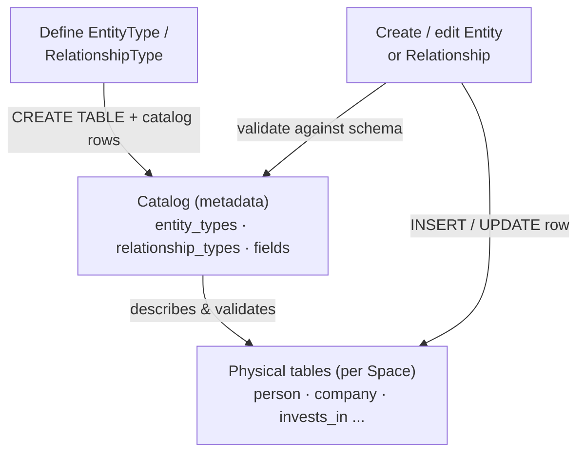
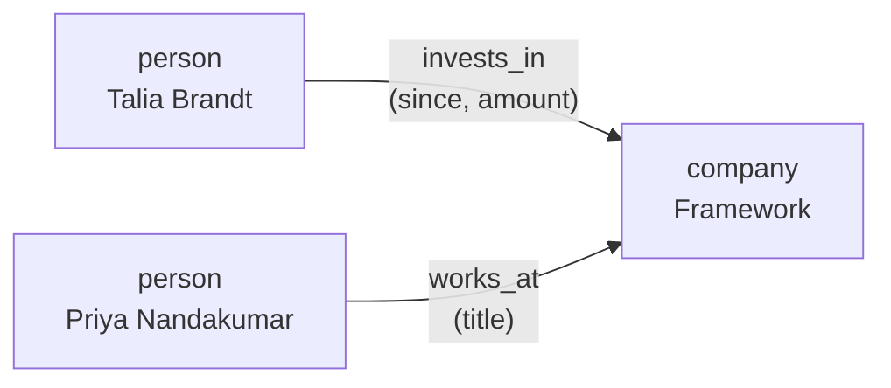

# Entities

> **Status:** Approved
>
> **Version:** 1.1   ·   **Last updated:** 2026-06-10
>
> **Purpose:** The Entity & relationship graph — a Space-scoped, SQL-backed "dynamic CRM" of real-world things (people, companies, repos, …) and the typed, directed relationships between them.
>
> **Depends on:** [constitution](constitution.md), [data-model](data-model.md), [glossary](glossary.md)   ·   **Related:** [spaces](spaces.md), [evidence](evidence.md), [signals](signals.md), [app-architecture](app-architecture.md)

> Requirement tag: **ENT**

---

## 1. Purpose & Scope

This spec defines the **Entity graph**: a per-Space store of **entities** (real-world things) and **relationships** (typed, directed links between them), shaped like a **small, dynamic CRM**. Its defining property is that it is **fully SQL-backed** — every user-defined *type* is a real SQLite table, every *field* is a real column, every *relationship type* is a real join table with foreign keys. There is no generic attribute-bag or EAV layer; the schema *is* the model.

The model is **dynamic**: users (and, later, the System) define new entity types and relationship types at runtime, each with its own field schema. One built-in type ships by default — **`person`**. Everything else is created on demand.

In scope: the type system (entity types, relationship types, field schemas), the entity and relationship records, the **catalog** that describes them, validation, the SQL-as-DDL lifecycle, and per-Space isolation.

## 2. Non-Goals / Out of Scope

- **Entity resolution / linking from the pipeline.** Turning a Signal's `entity_hints` ([signals](signals.md) REQ-SIG-13) or an Evidence `entity_ids` link ([evidence](evidence.md) REQ-EV-07) into a concrete `ent_` is **deferred** (§10, OQ-ENT-3). This spec defines the store those references point at; it does not (yet) populate it automatically.
- **The `relationship` Evidence type.** [evidence](evidence.md) owns the *immutable, attributable fact* "Talia invests in Framework." This spec owns the *mutable, live edge* in the graph. The boundary is fixed in §5.9; the auto-population hook is deferred.
- **Merge / dedup of duplicate entities, and the LLM entity-resolution prompt.** Deferred (§10, OQ-ENT-2/3).
- **The database engine, migration runner, and connection management.** Owned by [app-architecture](app-architecture.md); this spec specifies the *logical* SQL model and the DDL each operation implies, not the plumbing.
- **Cross-Space identity correlation.** A person known in two Spaces is two independent records (§5.8); a "same-as" link across Spaces is future work (OQ-ENT-2).

## 3. Background & Rationale

The narrative layer is organized **vertically by topic**: `Space ⊃ Storyline ⊃ { Situation, Insight, Evidence }` ([data-model](data-model.md) REQ-DM-03). That answers *"what is happening on this thread?"* but cannot answer *"what do we know about **Talia Brandt**?"* — because Talia recurs across many Storylines.

Entities are the **horizontal** layer that cuts across topics: the join key that lets the System pivot from topic-organized to thing-organized knowledge. [data-model](data-model.md) REQ-DM-01 already reserves the `ent_` identity and marks it *owned by this spec*; this document fills it in.

Making it **SQL-backed with a table per type** (rather than a generic graph or key-value store) buys three things: real columns and constraints (type safety, foreign keys, `CHECK`s enforced by the engine, not app code); ordinary SQL for querying the CRM; and a model a user can inspect and reason about directly. Keeping it **per-Space** makes the System's isolation guarantee (P10) *physical* — one database file per Space, no shared rows to leak.

## 4. Concepts & Definitions

Canonical term **Entity** is defined in [glossary](glossary.md); this spec introduces the type system around it.

- **Entity** (`ent_`) — an instance: a real-world thing of some EntityType, with a display name and field values. *Example:* `Talia Brandt` (a `person`).
- **EntityType** (`etype_`) — a user-defined kind of entity, realized as a **real SQLite table**. `person` is the one built-in. *Example:* `company`, `repo`.
- **Relationship** (`rel_`) — an instance: a **directed** link `(from ent_, type, to ent_)` plus field values. *Example:* `Talia --invests_in--> Framework`.
- **RelationshipType** (`rtype_`) — a user-defined kind of relationship, realized as a real **join table**; constrains a `from`-EntityType to a `to`-EntityType and carries its own field schema. *Example:* `invests_in (person → company) { since, amount }`.
- **Field** — one attribute of an entity or relationship type; a real **column** with a **kind** (`string · date · number · money · enum`) and a `required` flag.
- **Catalog** — a small fixed set of metadata tables that record what types and fields exist, including the semantics SQLite columns cannot express (enum options, `money`, required-ness, display names). The catalog is the **source of truth** for "what types exist"; the physical tables hold the data.

## 5. Detailed Specification

### 5.1 The graph is per-Space and SQL-backed

> **REQ-ENT-01.** The Entity graph is **scoped to a Space** and **fully SQL-backed**. Each Space has its **own database** (one SQLite file per Space); entity types, relationship types, and records exist only within that Space and never span Spaces (REQ-ENT-08). Every type is a real table and every field a real column — there is no generic attribute-bag, EAV, or schemaless document layer.

### 5.2 Entity types are user-defined tables; `person` is built-in

> **REQ-ENT-02.** An **EntityType** is defined at runtime and realized as a **real SQLite table** whose columns are its fields. Exactly one type is **built-in** and present in every Space: **`person`**. All other types (`company`, `repo`, …) are created on demand. Defining an EntityType issues `CREATE TABLE` and writes the corresponding catalog rows (REQ-ENT-05) in one transaction.

### 5.3 Entities are validated instances with a stable id

> **REQ-ENT-03.** An **Entity** is a row in its type's table. Every entity carries a **stable global id** (`ent_…`, the table's primary key — not a bare rowid) and a **display name**; remaining columns are the type's fields. On create/update, field values are **validated against the catalog schema** (kind, enum membership, required-ness). The `ent_` id is what relationships and other specs ([data-model](data-model.md) REQ-DM-01) reference.

### 5.4 Relationship types are directed, typed join tables

> **REQ-ENT-04.** A **RelationshipType** is defined at runtime and realized as a real **join table**. It is **directed** and constrains a `from`-EntityType to a `to`-EntityType; it carries its **own field schema**. The join table holds `from_id` / `to_id` **foreign keys** referencing the two entity tables, plus a column per relationship field. A **Relationship** is a row in that table, with `from`/`to` satisfying the type constraint and fields validated against the catalog. *Example:* `invests_in (person → company) { since: date, amount: money }`.

### 5.5 The catalog describes what tables cannot

> **REQ-ENT-05.** A small fixed **catalog** of metadata tables (`entity_types`, `relationship_types`, `fields`) records every type and field, including semantics SQLite columns cannot express: **enum** options, the **`money`** kind, **required-ness**, and **display** names. The catalog is the **source of truth** for which types exist and how to validate them; the physical tables are the source of truth for the data. The two are kept consistent transactionally (REQ-ENT-02, REQ-ENT-07).

### 5.6 Field kinds map to columns plus validation

> **REQ-ENT-06.** Each field has a **kind** that maps to a SQLite column and an app-level rule: `string → TEXT`, `date → TEXT` (ISO-8601), `number → REAL/INTEGER`, `money → INTEGER` (minor units) or `REAL`, `enum → TEXT` with a `CHECK` and the allowed set stored in the catalog. SQLite's dynamic typing is backstopped by **catalog-driven validation** on every write.

### 5.7 Lifecycle is DDL; schema evolution is conservative

> **REQ-ENT-07.** Type and field changes are **DDL operations**, bounded by what SQLite supports safely:
> - **Add a field** → `ALTER TABLE ADD COLUMN` (nullable). A newly **required** field is added nullable and enforced **going forward**; pre-existing rows are **flagged incomplete**, never rejected or back-filled with guesses.
> - **Remove a field** → `DROP COLUMN` (SQLite ≥ 3.35) — **destructive, Ask-first** (REQ-ENT-09).
> - **Delete a type** with live rows → **blocked** unless explicitly confirmed (Ask-first).
> - **Create / update** entities and relationships → ordinary `INSERT` / `UPDATE` after validation.

### 5.8 Per-Space isolation

> **REQ-ENT-08.** Types and records are **never shared across Spaces**. The same real-world thing referenced in two Spaces is **two independent entities** in two databases; there is no implicit cross-Space identity. (A future opt-in "same-as" correlation is OQ-ENT-2.) This makes the P10 isolation guarantee physical: a Space's CRM is a single file with no rows visible to another Space.

### 5.9 Autonomy classification & integrity

> **REQ-ENT-09.** Per the [constitution](constitution.md) §5 extension rule, this spec classifies its actions:
> - **Always** (execute + log): reading entities/relationships/types; **creating or updating** an entity, relationship, type, or **adding** a field — these are edits to the user's own Space data, low-stakes and reversible.
> - **Ask-first**: any **destructive schema change** — `DROP COLUMN`, deleting a type, or a **cascading** entity delete that would remove dependent relationships.
> - Referential integrity is enforced by **foreign keys**; the `ON DELETE` policy for an entity referenced by relationships is governed by REQ-ENT-07/09 (default **restrict**, cascade only on confirm — OQ-ENT-4).

### 5.10 Ownership & non-duplication

> **REQ-ENT-10.** This spec **owns** the entity/relationship type system, the records, the catalog, the SQL-as-model, and **dynamic-DDL identifier safety** (REQ-ENT-11). It **references**: [data-model](data-model.md) REQ-DM-01 (the `ent_` identity it realizes), [evidence](evidence.md) REQ-EV-07 (the evidence graph that *links to* entities), [spaces](spaces.md) (the Space scope). It **defers**: the DB engine, migration runner, and persistence plumbing to [app-architecture](app-architecture.md); resolution of [signals](signals.md) `entity_hints` and the LLM entity-resolution/merge prompt to future work (§10).

### 5.11 Dynamic-DDL identifier safety

> **REQ-ENT-11.** Because user-defined (and, later, System/LLM-defined) entity-type, relationship-type, and field names become **raw SQL identifiers** in `CREATE TABLE` / `ALTER TABLE` / column references (REQ-ENT-02/04/05/07), every such name **MUST** be made safe before any DDL or DML is issued:
> - **Safe grammar.** A name must match a restrictive identifier grammar — ASCII letter or underscore, then letters/digits/underscores (e.g. `^[A-Za-z_][A-Za-z0-9_]*$`), bounded in length and case-folded for uniqueness. Names failing the grammar are **rejected at definition time** (Always-action validation, REQ-ENT-09); there is no auto-mangling into something else.
> - **Reserved-name blocklist.** A name must not collide with the **catalog tables** (`entity_types`, `relationship_types`, `fields`), SQLite internals (`sqlite_*`, e.g. `sqlite_master`/`sqlite_sequence`), SQL reserved words, or the reserved physical-column names (`id`, `name`, `from_id`, `to_id`). Collisions are **rejected**, never silently shadowed.
> - **Quoted, namespaced physical names.** Physical table names are **namespaced** to keep user types out of the catalog/internal namespace — entity-type tables as `ent_<type>`, relationship-type tables as `rel_<type>` — and **every** identifier (table and column) is **always emitted double-quoted** (`"ent_company"`, `"tier"`) in generated DDL/DML, so a name can never break out of its identifier position into injectable SQL. The **catalog `name`** stays the user-facing logical name; the namespaced quoted form is the **physical** name the engine sees.
>
> Grammar + blocklist + mandatory quoting together make dynamic DDL safe: a type named `entity_types`, `sqlite_master`, or `fields` is **rejected**, and no validly-named type can collide with or inject into the catalog or engine internals. This realizes the **P10 isolation** guarantee at the schema level — see REQ-ENT-08.

## 6. Visualizations

### 6.1 Two layers — catalog drives physical tables



### 6.2 An example graph — typed, directed relationships with fields



Each box is a **row** in a real table (`person`); each arrow is a **row** in a real join table (`invests_in`, `works_at`) whose `from_id` / `to_id` are foreign keys.

## 7. Data Shapes

Non-normative — concrete SQL for the model ([app-architecture](app-architecture.md) owns the engine). Per-Space database.

```sql
-- Catalog: the source of truth for "what types exist" (REQ-ENT-05)
CREATE TABLE entity_types (
  name     TEXT PRIMARY KEY,          -- 'person', 'company'
  display  TEXT NOT NULL,
  builtin  INTEGER NOT NULL DEFAULT 0 -- person = 1
);

CREATE TABLE relationship_types (
  name       TEXT PRIMARY KEY,        -- 'invests_in'
  from_type  TEXT NOT NULL REFERENCES entity_types(name),
  to_type    TEXT NOT NULL REFERENCES entity_types(name),
  display    TEXT NOT NULL
);

CREATE TABLE fields (
  owner_kind  TEXT NOT NULL CHECK (owner_kind IN ('entity','relationship')),
  owner_type  TEXT NOT NULL,          -- 'person' or 'invests_in'
  name        TEXT NOT NULL,          -- the column name
  kind        TEXT NOT NULL CHECK (kind IN ('string','date','number','money','enum')),
  required    INTEGER NOT NULL DEFAULT 0,
  enum_values TEXT,                   -- JSON array when kind = 'enum'
  PRIMARY KEY (owner_kind, owner_type, name)
);
```

```sql
-- Physical tables, generated from the catalog (REQ-ENT-02/04). Names are grammar-checked,
-- blocklist-screened, namespaced (ent_/rel_), and always quoted in generated DDL (REQ-ENT-11).
CREATE TABLE "ent_person" (           -- the built-in EntityType (logical name 'person')
  "id"    TEXT PRIMARY KEY,           -- 'ent_...' stable global id
  "name"  TEXT NOT NULL,              -- display name
  "email" TEXT,
  "role"  TEXT
);

CREATE TABLE "rel_invests_in" (       -- RelationshipType person -> company
  "id"      TEXT PRIMARY KEY,         -- 'rel_...'
  "from_id" TEXT NOT NULL REFERENCES "ent_person"(id)  ON DELETE RESTRICT,
  "to_id"   TEXT NOT NULL REFERENCES "ent_company"(id) ON DELETE RESTRICT,
  "since"   TEXT,                     -- date (ISO-8601)
  "amount"  INTEGER                   -- money (minor units)
);
```

## 8. Examples & Use Cases

### Example A — defining a type is a `CREATE TABLE` (Given/When/Then)

- **Given** the `Framework` Space, whose database has only the built-in `person` table.
- **When** the user defines a `company` EntityType with fields `domain: string`, `tier: enum[free, pro, enterprise]`.
- **Then** — after the name `company` and its fields pass the safe grammar + reserved-name blocklist (REQ-ENT-11) — the System runs `CREATE TABLE "ent_company" ("id" TEXT PRIMARY KEY, "name" TEXT NOT NULL, "domain" TEXT, "tier" TEXT CHECK ("tier" IN ('free','pro','enterprise')))` (namespaced, fully quoted), writes the `entity_types` and `fields` catalog rows in the same transaction (Always; logged), and `Northwind Cloud` can now be added as a `company` row. Had the user named the type `entity_types` or `sqlite_master`, definition would have been **rejected** before any DDL.

### Example B — a typed relationship with fields (narrative)

In the `Framework` Space, `Talia Brandt` exists as a `person` and `Framework` as a `company`. The user defines an `invests_in` RelationshipType (`person → company`) carrying `since: date` and `amount: money`, then records `Talia --invests_in--> Framework, since 2026-04, amount $2M`. This is one row in the `invests_in` join table; its `from_id` and `to_id` foreign keys guarantee both endpoints exist and are of the right types. Separately, `Priya Nandakumar` (`person`) `works_at` `Framework` with `title: "contractor"`.

### Example C — isolation across Spaces (narrative)

`Talia Brandt` is also mentioned in the `Family` Space's database. That is a **separate** `person` row with its own `ent_` id; nothing about the `Framework` Talia — her investment, her email — is visible there. The same name, two independent records, two files (REQ-ENT-08).

## 9. Edge Cases & Failure Modes

- **Required field added to a populated table.** Added nullable; existing rows flagged *incomplete* rather than rejected; new writes must supply it (REQ-ENT-07).
- **Relationship type referencing a missing entity type.** Definition is **rejected** — `from_type`/`to_type` must already exist in `entity_types` (FK in the catalog).
- **Type/field name collides with the catalog, an SQLite internal, or a reserved column.** A name like `entity_types`, `fields`, `sqlite_master`, or `id` is **rejected at definition time** by the grammar + reserved-name blocklist; it can never reach DDL or shadow the catalog (REQ-ENT-11).
- **Type/field name with quotes, spaces, or SQL metacharacters.** Fails the safe grammar and is rejected; and because every generated identifier is **always double-quoted and namespaced**, a name can never break out of its identifier position into injectable SQL (REQ-ENT-11).
- **Deleting an entity that relationships point to.** Default `ON DELETE RESTRICT` blocks it; a cascading delete is **Ask-first** (REQ-ENT-09).
- **Enum value outside the allowed set.** Rejected by the column `CHECK` and by catalog validation (REQ-ENT-06).
- **Two rows that are the same real-world thing.** Tolerated in v1 (no auto-merge); dedup/merge is deferred (OQ-ENT-3).
- **`DROP COLUMN` on SQLite < 3.35.** Requires a table rebuild; treated as a destructive, Ask-first migration owned by [app-architecture](app-architecture.md).

## 10. Open Questions & Decisions

- **OQ-ENT-1** — The **field-kind set** (`string/date/number/money/enum`): is it fixed, or extensible with custom kinds (e.g. `url`, `reference-to-entity`)? *Leaning: fixed for v1; reference-to-entity is what relationships are for.*
- **OQ-ENT-2** — **Cross-Space correlation:** an opt-in "same-as" link so one real-world person can be recognized across Spaces without sharing data. *Leaning: deferred; isolation first.*
- **OQ-ENT-3** — **Pipeline integration:** how a Signal's `entity_hints` and the `relationship` **Evidence** type ([evidence](evidence.md)) *propose* entities/relationships into the graph, and the LLM **entity-resolution/merge** prompt. *Leaning: a later version; v1 is the manual/direct store these hooks will target.*
- **OQ-ENT-4** — **Default `ON DELETE` policy** (restrict vs. set-null vs. cascade) per relationship type, and whether it is configurable in the catalog.

## 11. Review & Acceptance Checklist

- [ ] The graph is **per-Space**, one SQLite database per Space, no cross-Space rows (REQ-ENT-01, -08).
- [ ] Each EntityType is a **real table**; `person` is built-in; defining a type emits `CREATE TABLE` + catalog rows transactionally (REQ-ENT-02).
- [ ] Entities carry a stable **`ent_` id** and validate against the catalog schema (REQ-ENT-03).
- [ ] RelationshipTypes are **directed join tables** with `from`/`to` type constraints and FKs; relationships validate (REQ-ENT-04).
- [ ] The **catalog** records enum/money/required/display and is the source of truth for type existence (REQ-ENT-05).
- [ ] Field kinds map to columns with catalog-driven validation (REQ-ENT-06).
- [ ] Schema evolution is **conservative** (add nullable, flag incomplete) and destructive DDL is **Ask-first** (REQ-ENT-07, -09).
- [ ] Actions are classified into the Always / Ask-first framework (REQ-ENT-09).
- [ ] Dynamic-DDL identifier safety: names pass a **safe grammar** + **reserved-name blocklist** (catalog/`sqlite_*`/reserved cols), and physical names are **namespaced (`ent_`/`rel_`) and always quoted** (REQ-ENT-11).
- [ ] Boundaries with [evidence](evidence.md), [data-model](data-model.md), [signals](signals.md), and [app-architecture](app-architecture.md) hold; no redefinition (REQ-ENT-10).

## 12. Cross-References

- [data-model](data-model.md) — reserves the `ent_` identity and marks it owned here (REQ-DM-01); the canonical narrative-layer model this graph cross-links.
- [evidence](evidence.md) — the evidence graph links Evidence to Entities (REQ-EV-07); the `relationship` Evidence type is the *immutable fact*, distinct from this spec's *live edge* (§5.9).
- [signals](signals.md) — `entity_hints` from tiered resolution (REQ-SIG-13) are the future inputs to this store (OQ-ENT-3).
- [spaces](spaces.md) — the Space scope and isolation this graph realizes physically.
- [app-architecture](app-architecture.md) — owns the SQLite engine, migration runner, and persistence; this spec specifies the logical model and the DDL each action implies.
- [glossary](glossary.md) — canonical **Entity** definition.

## 13. Changelog

- **2026-06-10 — v1.1** — **Dynamic-DDL identifier safety + P10 isolation citation fix.** User/System/LLM-defined type and field names become **raw SQL identifiers** in `CREATE TABLE`/`ALTER TABLE` (REQ-ENT-02/05), yet nothing mandated validation or quoting — a type named `entity_types`, `sqlite_master`, or `fields` could collide with the catalog/engine internals, and unquoted dynamic identifiers risked SQL injection. Added **REQ-ENT-11** (§5.11): names validated against a **safe grammar** + a **reserved-name blocklist** (catalog tables, `sqlite_*`, SQL keywords, reserved physical columns), rejected at definition time; physical names always **namespaced (`ent_`/`rel_`) and double-quoted** in generated DDL/DML so they cannot collide with or inject into the catalog. Threaded into REQ-ENT-10 ownership, the §7 physical-table SQL (now quoted/namespaced), §8 Example A, two §9 edge cases, and the §11 checklist. Also fixed the **P1→P10** isolation miscitation in §3 and REQ-ENT-08 (isolation is **P10**, not P1). No REQ IDs renumbered.
- **2026-06-08 — v1.0** — **Approved.** No material change from v0.1; pipeline resolution/merge and cross-Space correlation remain open questions (OQ-ENT-2/3) tracked for a later revision.
- **2026-06-08 — v0.1** — Initial draft. Entity graph as a per-Space, SQL-backed dynamic CRM: user-defined entity types as real tables with `person` built-in (REQ-ENT-02); validated entity instances with stable `ent_` ids (REQ-ENT-03); directed, schema'd relationship types as FK join tables (REQ-ENT-04); the catalog metadata layer (REQ-ENT-05); field-kind→column mapping (REQ-ENT-06); DDL lifecycle with conservative schema evolution (REQ-ENT-07); per-Space isolation (REQ-ENT-08); autonomy classification and referential integrity (REQ-ENT-09); ownership boundaries with data-model/evidence/signals/app-architecture (REQ-ENT-10). Pipeline resolution, dedup/merge, and cross-Space correlation deferred (OQ-ENT-2/3). In Review.
- **2026-06-04 — v0.0** — Stub created (Planned).
