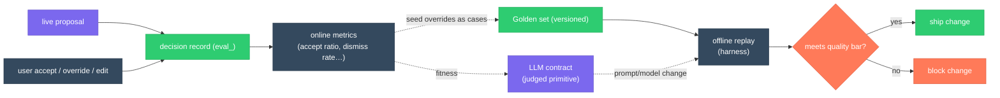

# Evals

> **Status:** In Review
>
> **Version:** 0.1   ·   **Last updated:** 2026-06-10
>
> **Purpose:** The **quality layer** for the LLM judgments the product is made of — *which* model-judged primitives need evals, the **quality bars** each must declare (accuracy/precision/recall or calibration + an error budget), the **versioned golden sets** that regression-gate them, the **accept/override telemetry** that becomes the tuning corpus, and the **eval harness** (offline replay + online metric collection) that ties them together.
>
> **Depends on:** [constitution](constitution.md), [glossary](glossary.md), [ai-models](ai-models.md)   ·   **Related:** [curator](curator.md), [inbox](inbox.md), [situations](situations.md), [storylines](storylines.md), [narrative](narrative.md), [memory](memory.md), [proactivity](proactivity.md), [evidence](evidence.md)

> Requirement tag: **EVAL**

---

## 1. Purpose & Scope

The System's value is its **judgments**: it classifies Momentum, scores Attention, extracts Evidence, merges Storylines, keeps or drops Insights, decides whether to interrupt, and writes Narratives. Every one of these is produced — wholly or in part — by an **LLM**, and every one is **hallucination-prone**. A wrong judgment does not just degrade a feature; it destroys the **trust the product sells** (P3 evidence-first, "no hallucinated certainty"): a Narrative that asserts a decision that was never made, a `blocker` Situation that was already resolved, or a confident merge that collapses two distinct threads is worse than no output at all.

Each such judgment therefore carries a **quality requirement**: a measurable accuracy target, a labeled corpus to measure against, calibration of its confidence, and a durable record of whether its proposals were right. This spec **owns**:

- the **methodology**: which judgments need evals and *why* (§5.1–5.2);
- the **quality-bar requirement**: every LLM contract must declare measurable targets + an error budget (§5.3);
- the **golden-set requirement**: a versioned, labeled corpus per contract, regression-gated (§5.4);
- the **accept/override telemetry contract**: the decision log of proposed-vs-accepted outcomes that becomes the online metric source and the tuning corpus (§5.5–5.6);
- the **eval harness** concept: offline replay against golden sets + online metric collection (§5.7).

## 2. Non-Goals / Out of Scope

- **Not the concrete per-feature thresholds.** The *numeric* quality bar for each contract (e.g. "Momentum classification macro-F1 ≥ 0.80") is **owned by the contract's home spec** — this spec mandates that one exists and fixes its shape, not its value (§5.3, §5.8).
- **Not persistence.** The storage of golden sets, eval runs, and the telemetry record (tables, retention, IDs) is [app-architecture](app-architecture.md).
- **Not surfacing.** Whether an eval regression or a low-quality run is shown to the user is [proactivity](proactivity.md) (the relevance/urgency bar); this spec defines *what is measured and recorded*.
- **Not model selection.** Which model runs a contract is [ai-models](ai-models.md) — though the **fitness signals** this spec produces feed that selection ([ai-models](ai-models.md) REQ-AIM-15).
- **Not the prompt contracts themselves.** The system prompts / schemas live in their feature specs; evals measures their *outputs*, it does not redefine them.
- **Not human-edit mechanics.** *How* a user edits a Narrative or dismisses an Insight is the feature spec's; evals only consumes the *fact* that they did as a label.

## 3. Background & Rationale

A generative system without evals is undefined behavior: you cannot tell a regression from noise, you cannot safely change a prompt or swap a model, and you have no honest answer to *"is it actually right?"* Two industry disciplines shape this spec.

**First, evals are tests for non-deterministic code.** Just as [constitution](constitution.md) §4 demands "tested by default — correctness is demonstrated, not assumed," an LLM contract is demonstrated correct against a **golden set**: a held-out, human-labeled corpus of inputs with known-good outputs, scored by a metric appropriate to the judgment (classification → F1; extraction → faithfulness/recall; ranking → calibration). The golden set is **versioned and regression-gated** — a prompt or model change that drops a contract below its bar fails the gate, exactly as a unit-test regression blocks a merge.

**Second, the cheapest, highest-signal labels are already being produced by the user.** Every time the user **accepts, edits, dismisses, or overrides** a proposal — accepts a Curator merge, dismisses an Insight, edits a Narrative clause, ignores a notification — they hand the System a free label about whether that judgment was right. The System already records pieces of this (the `notif_` delivery record's `dismissed`/`acted` outcome — [proactivity](proactivity.md) REQ-PROACT-10; the Curator's propose-vs-auto split — [curator](curator.md) REQ-CUR-14; the Inbox observability view — [inbox](inbox.md) REQ-INBOX-14). This spec **generalizes that scattered pattern into one decision-log/telemetry contract** so that *every* model judgment leaves an accept/override trail — the online metric and the growing tuning corpus that golden sets are seeded from.

The result is a two-clock loop: **offline** (golden-set replay gates changes before they ship) and **online** (accept/override telemetry measures live quality and surfaces drift). Neither replaces the other — offline catches regressions pre-flight; online catches reality the golden set didn't anticipate.

## 4. Concepts & Definitions

- **Judged primitive** — a product output produced by an LLM contract whose correctness is a trust property (§5.1).
- **Quality bar** — the declared target metric(s) + acceptable **error budget** for one contract (§5.3).
- **Golden set** — a versioned, labeled corpus of `(input, expected output)` cases for one contract; the offline regression gate (§5.4).
- **Decision record** — one telemetry row capturing a proposed judgment and its eventual accepted/overridden outcome (`eval_`, §5.5).
- **Accept/override telemetry** — the stream of decision records; the online metric source and tuning corpus (§5.6).
- **Eval harness** — the mechanism that replays golden sets offline and aggregates decision records online into metrics (§5.7).
- **Calibration** — for confidence-bearing judgments, the agreement between stated confidence and observed correctness (§5.3).

## 5. Detailed Specification

### 5.1 Which judgments need evals

> **REQ-EVAL-01.** Every **judged primitive** — a product output produced wholly or partly by an LLM contract whose wrongness damages trust (P3) — **must be covered by an eval** (a quality bar §5.3 + a golden set §5.4 + telemetry §5.5). The v1 set of judged primitives, with their owning contract:
>
> | # | Judged primitive | Owning LLM contract | Dominant failure |
> |---|------------------|---------------------|------------------|
> | 1 | **Momentum classification** (`advancing/steady/stalled/looping`) | [storylines](storylines.md) REQ-STORY-06 / curation REQ-STORY-13 | mislabels movement (calls a looping thread `advancing`) |
> | 2 | **Attention score** (ranks Attention-Needed) | [situations](situations.md) REQ-SIT-06 (+ detector REQ-SIT-14) | mis-ranks — buries the urgent, surfaces the trivial |
> | 3 | **Evidence extraction fidelity** | [inbox](inbox.md) REQ-INBOX-09 (extraction contract) | hallucinates a fact / records an interpretation as Evidence (violates [evidence](evidence.md) REQ-EV-05) |
> | 4 | **Curator merge/split** & **insight-evaluation** | [curator](curator.md) §5.16 (merge/split), §5.17 (insight-evaluate) | over-merges distinct threads; keeps noise / drops signal |
> | 5 | **Proactivity relevance judge** | [proactivity](proactivity.md) REQ-PROACT-11 | interrupts when it shouldn't (cry-wolf) / suppresses the urgent |
> | 6 | **Narrative quality** | [narrative](narrative.md) REQ-NAR-10 | asserts an unbacked claim; contradicts Momentum/Status (violates REQ-NAR-07/08) |
>
> The list is **extensible**: any spec introducing a new LLM contract that emits a user-trusted judgment MUST register it here (its own row + a quality bar in its spec). Deterministic outputs (decay math, fingerprint dedup) are **not** judged primitives and need no eval.

### 5.2 What an eval is, here

> **REQ-EVAL-02.** An **eval** for a judged primitive has three parts that always travel together: (a) a **quality bar** (§5.3) — the measurable target and error budget; (b) a **golden set** (§5.4) — the versioned labeled corpus it is scored against offline; and (c) **accept/override telemetry** (§5.5) — the live decision records that measure it online. A primitive is "covered" only when all three exist. Evals are **tests for non-deterministic code** ([constitution](constitution.md) §4): the same discipline as unit tests, with statistical metrics instead of exact equality.

### 5.3 The quality-bar requirement

> **REQ-EVAL-03.** Each LLM contract that emits a judged primitive **MUST declare a quality bar** in its home spec: one or more **target metrics** matched to the judgment's shape, plus an explicit **error budget** (the tolerated miss rate). The metric family by shape:
>
> | Judgment shape | Primitive(s) | Metric family |
> |----------------|--------------|---------------|
> | **Classification** (fixed label set) | Momentum (1) | accuracy / **macro-F1** / confusion matrix |
> | **Extraction** (facts from text) | Evidence fidelity (3) | **faithfulness** (no hallucinated facts), precision/recall vs. labeled facts, interpretation-leak rate |
> | **Ranking / scoring** | Attention (2) | rank correlation + **calibration** (does score predict the user acting?) |
> | **Binary / proposal** (keep/drop, merge/split, interrupt/hold) | Curator eval & merge (4), Proactivity judge (5) | **precision / recall** (+ which to favor — see below) + calibration of stated `confidence` |
> | **Generation** (free text) | Narrative (6) | **claim-faithfulness** (every claim Evidence-traceable), edit-distance vs. human edits, contradiction rate |
>
> The bar also fixes the **asymmetry** — which error is worse — so the budget isn't symmetric where the cost isn't: Evidence extraction favors **precision** (a hallucinated fact is worse than a missed one — fail-closed, [evidence](evidence.md) REQ-EV-04); Curator merge favors **precision** (over-merging destroys information and is hard to undo — [curator](curator.md) REQ-CUR-15); the Attention/Proactivity judges favor **not crying wolf** (a false interrupt costs trust — [proactivity](proactivity.md) REQ-PROACT-06). **Confidence-bearing** contracts (merge/split, situation detection) additionally declare a **calibration** target so the auto-vs-propose threshold ([curator](curator.md) REQ-CUR-14, OQ-CUR-2) rests on honest confidence, not vibes.

### 5.4 The golden-set requirement

> **REQ-EVAL-04.** Each judged primitive **MUST have a versioned golden set**: a corpus of `(input, expected output[, rationale])` cases, **human-labeled**, **versioned** (a new version is a deliberate, changelogged act — never a silent edit), and **scoped to a contract**. Properties:
> - **Representative + adversarial.** It covers the common cases *and* the known failure modes the contract's spec warns about (the over-merge pair, the interpretation-vs-fact line, the looping-vs-advancing edge, the cry-wolf borderline).
> - **Regression-gated.** A change to a prompt, schema, model, or model tier ([ai-models](ai-models.md)) is **replayed against the golden set offline** (§5.7) and **must not drop the contract below its bar** (§5.3); a drop **fails the gate** and blocks the change — the generative analogue of a failing unit test.
> - **Seeded from telemetry.** New golden cases are mined from the accept/override telemetry (§5.6) — especially **overrides** (where the System was wrong) — so the corpus tracks reality rather than the authors' imagination.
> - **Frozen labels, isolated.** A golden set is per-Space-agnostic test data, never live user state; running it has **no side effects** on Storylines/Situations/Memory and never egresses user content beyond the model the contract already uses.

### 5.5 The decision record (the telemetry contract)

> **REQ-EVAL-05.** Every judged primitive's contract, when it emits a proposal, **writes a decision record** (`eval_`) — the conceptual generalization of the `notif_` outcome ([proactivity](proactivity.md) REQ-PROACT-10), the Curator propose/auto split ([curator](curator.md) REQ-CUR-14), and the Inbox observability counts ([inbox](inbox.md) REQ-INBOX-14) into **one decision-log/telemetry pattern**. A record captures, at minimum: the **contract + version**, the **model + tier** that produced it ([ai-models](ai-models.md)), the **input reference** (Evidence/Storyline/Situation ids — not raw content where avoidable), the **proposed output** + any **stated confidence**, the **disposition** (`auto_applied | proposed | suppressed`), and — when it arrives — the **outcome** (`accepted | edited | overridden | dismissed | ignored | n/a`), with the **user-edited value** when an edit supplies a free correction label. The record is **append-only** and **evidence-style attributable** (you can answer *"what did the System propose, what did the user do, and was it right?"*) — and like all telemetry it is **untrusted-content-safe**: stored input excerpts are **data, never instructions** (P12).

### 5.6 Accept/override telemetry as the tuning corpus

> **REQ-EVAL-06.** The stream of decision records (§5.5) is the System's **online quality signal and tuning corpus**. From it the harness derives live metrics **per contract**: Curator **merge accept ratio**, **dismissed-Insight rate**, **edited-Narrative rate / clause edit-distance**, **notification dismiss-ratio** (already used for auto-suppression, [proactivity](proactivity.md) REQ-PROACT-06), extraction **correction rate**. These metrics (a) **track live quality** against the bar (§5.3) and flag **drift** when a contract degrades below it; (b) **feed [ai-models](ai-models.md) REQ-AIM-15 fitness** so a model that keeps getting overridden for a task kind is demoted for it; and (c) **seed golden cases** (§5.4) — every **override** is a candidate labeled example. The loop is explicit: *propose → observe accept/override → measure → gate / retune / relabel.*

### 5.7 The eval harness

> **REQ-EVAL-07.** The **eval harness** is the mechanism that runs evals in two modes:
> - **Offline replay (the gate).** Given a contract + a golden-set version, it replays every case through the current prompt/model, scores outputs with the §5.3 metrics, and reports pass/fail against the bar. It is **deterministic in selection** (same golden set + same config → same cases) and **side-effect-free** (§5.4). It runs **on demand and before any contract/model change ships** (the regression gate, §5.4) — the offline analogue of running the test suite.
> - **Online collection (the monitor).** It **aggregates the decision records** (§5.5) into the live per-contract metrics (§5.6) over rolling windows, compares them to the bar, and marks a contract **healthy / degraded** — degradation being surfaced via [proactivity](proactivity.md) (out of scope here) and feeding [ai-models](ai-models.md) fitness.
>
> The harness is **infrastructure, not a user feature** — like the Inbox observability view ([inbox](inbox.md) REQ-INBOX-14), it is for debugging, regression-gating, and tuning, never a surface the user is expected to triage. Its concrete runtime/storage is [app-architecture](app-architecture.md).

### 5.8 Ownership & non-duplication

> **REQ-EVAL-08.** This spec **owns** the eval **methodology**, the **quality-bar requirement** (that one must exist + its shape), the **golden-set requirement**, the **decision-log/telemetry contract** (`eval_`), and the **harness** concept. It **defers**: the **concrete numeric threshold** for each bar to the contract's home spec ([storylines](storylines.md)/[situations](situations.md)/[inbox](inbox.md)/[curator](curator.md)/[proactivity](proactivity.md)/[narrative](narrative.md)); **persistence/runtime** to [app-architecture](app-architecture.md); **surfacing** of regressions to [proactivity](proactivity.md); **model selection/fitness** to [ai-models](ai-models.md) REQ-AIM-15 (it produces the signal that spec consumes). It **does not** redefine any prompt contract — it measures their outputs.

## 6. Visualizations

### 6.1 The two-clock eval loop



### 6.2 Metric family per judged primitive

| Primitive | Shape | Primary metric | Favored side / extra |
|-----------|-------|----------------|----------------------|
| Momentum | classification | macro-F1 | confusion on `looping↔advancing` |
| Attention score | ranking | rank-corr + calibration | does score predict "acted"? |
| Evidence extraction | extraction | faithfulness + precision | **precision** (no hallucination) |
| Curator merge/split | proposal + confidence | precision + calibration | **precision** (over-merge is costly) |
| Insight evaluate | binary keep/drop | precision/recall | recall of genuinely useful |
| Proactivity judge | binary interrupt/hold | precision | **don't cry wolf** |
| Narrative | generation | claim-faithfulness | contradiction rate vs Momentum |

## 7. Data Shapes

Conceptual — not a storage schema ([app-architecture](app-architecture.md) owns persistence). IDs per [data-model](data-model.md) §5.1; `eval_` is internal infrastructure.

```ts
interface QualityBar {            // declared in the contract's home spec; this spec fixes the shape (§5.3)
  contract: string;               // e.g. "curator.merge_split", "inbox.extract"
  metrics: Array<{ name: string; target: number }>; // e.g. {name:"macro_f1", target:0.80}
  errorBudget: number;            // tolerated miss rate
  favors?: "precision" | "recall" | "calibration"; // the asymmetry (§5.3)
}

interface GoldenSet {             // versioned labeled corpus (§5.4)
  contract: string;
  version: string;                // bumped deliberately; changelogged
  cases: Array<{ input: unknown; expected: unknown; rationale?: string; adversarial?: boolean }>;
}

interface DecisionRecord {        // eval_ — the telemetry contract (§5.5)
  id: string;                     // eval_
  contract: string;
  contract_version: string;
  model: string; tier: string;    // ai-models
  input_ref: string[];            // ev_/story_/sit_ ids — references, not raw content
  proposed: unknown;
  confidence?: number;
  disposition: "auto_applied" | "proposed" | "suppressed";
  outcome?: "accepted" | "edited" | "overridden" | "dismissed" | "ignored" | "n/a";
  edited_value?: unknown;         // the free correction label when the user edits (§5.6)
  created_at: Date;
  resolved_at?: Date;
}

interface EvalRun {               // one offline replay (§5.7)
  contract: string;
  golden_version: string;
  scores: Record<string, number>;
  passed: boolean;                // met the bar?
}
```

## 8. Examples & Use Cases

Cast per [constitution](constitution.md) §7.

### Example A — a Curator merge is overridden, and that override becomes a golden case (Given/When/Then)

- **Given** the hourly `storyline.merge_candidates` job ([curator](curator.md) REQ-CUR-05) proposes merging *"Brightmoor portal delivery"* with *"Brightmoor billing integration"* at confidence 0.74 — below the auto threshold, so it surfaces as a `propose_merge` for **Devin**'s engagement,
- **When** the user **rejects** it (the two share the client and some files but are genuinely distinct threads), the merge/split contract writes a `DecisionRecord` (`contract: curator.merge_split`, `proposed: merge`, `confidence: 0.74`, `disposition: proposed`, `outcome: overridden`),
- **Then** (a) the online **merge accept ratio** for that contract ticks down (REQ-EVAL-06); (b) the rejected pair — with its overlap set — is mined into the **golden set** as an adversarial *"do-not-merge"* case (REQ-EVAL-04); and (c) when the next prompt tweak is replayed offline, it must still answer *"leave apart"* on this case or it **fails the gate** (REQ-EVAL-07). The judgment that was wrong once is now a test that prevents it recurring.

### Example B — an extraction prompt change is gated before it ships

- **Given** the Inbox extraction contract ([inbox](inbox.md) REQ-INBOX-09) has a golden set of labeled `(batch → expected facts)` cases including the adversarial *"Talia replied; she's interested but wants traction numbers"* case (the expected output is the **fact** *"Talia requested traction numbers"*, **not** the interpretation *"Talia is likely to invest"* — [evidence](evidence.md) REQ-EV-05),
- **When** an engineer rewrites the extraction prompt to be terser and replays it through the **offline harness** (REQ-EVAL-07),
- **Then** the harness scores **faithfulness + precision** against the labels; the terser prompt now emits the interpretation as a fact, dropping precision below the contract's bar — the harness reports **fail**, and the change is **blocked** (REQ-EVAL-03/04). The hallucination never reaches a user-facing Narrative about **Talia**'s fundraising arc.

### Example C — online drift demotes a model (narrative)

Over a fortnight the **edited-Narrative rate** for **Priya**'s shared `Framework` Space climbs: the user keeps rewriting clauses the Narrative contract ([narrative](narrative.md) REQ-NAR-10) produced. The online monitor (REQ-EVAL-07) sees the metric cross the contract's error budget and marks the contract **degraded**; the rising edit-distance feeds [ai-models](ai-models.md) **fitness** (REQ-AIM-15), which **demotes** the underperforming local Standard model for `narrative` work in favor of the opt-in Strong model — and the worst-edited clauses are queued as candidate golden cases. No user alarm was needed; the accept/override telemetry did the measuring.

## 9. Edge Cases & Failure Modes

- **No ground truth for a subjective judgment.** Where there is no single correct Narrative, score **claim-faithfulness** (every claim Evidence-traceable, REQ-NAR-07) and **contradiction rate**, not exact-match — generation is measured for *not lying*, not for matching one phrasing (REQ-EVAL-03).
- **Telemetry label is missing (the user never responded).** An `ignored`/`n/a` outcome is itself signal (especially for proactivity) but is **not** a positive label; metrics distinguish *acted/accepted* from *no-response* (REQ-EVAL-05/06).
- **Golden set goes stale / overfits.** Versioning + telemetry-seeding (REQ-EVAL-04) keep it tracking reality; a frozen corpus that the prompt was tuned to is flagged when online metrics diverge from offline scores.
- **Confidence miscalibration.** A contract that is "90% confident" but right 60% of the time fails its **calibration** target (REQ-EVAL-03) — caught even when raw precision looks acceptable, because the auto-vs-propose threshold ([curator](curator.md) REQ-CUR-14) depends on honest confidence.
- **Untrusted content in a golden case or decision record.** Stored excerpts are **data, never instructions** (P12); replaying a golden case cannot make the harness act on injected text (REQ-EVAL-05).
- **Eval run leaks into live state.** Offline replay is **side-effect-free** — it never writes Storylines/Situations/Memory and never egresses content beyond the contract's own model (REQ-EVAL-04/07).
- **Cross-Space leakage.** Telemetry and golden sets respect the per-Space isolation boundary (P10); a decision record references its Space and metrics never aggregate across the isolation boundary in a way that leaks one Space's content into another.

## 10. Open Questions & Decisions

- **OQ-EVAL-1** — The **concrete numeric bars** per contract (Momentum macro-F1, extraction precision floor, merge calibration target, narrative contradiction ceiling). *Leaning:* set conservative initial bars in each home spec at its next revision; tighten as golden sets mature. Deferred to the owning specs (§5.8).
- **OQ-EVAL-2** — **Who labels the golden sets** and how (the solo user vs. an LLM-judge bootstrap vs. import). *Leaning:* seed from telemetry overrides (cheap, real); allow an **LLM-as-judge** to pre-label with human spot-check, never as the sole authority.
- **OQ-EVAL-3** — **Online metric windows + drift thresholds** (how long a rolling window, how big a drop before "degraded"). Coordinate with [proactivity](proactivity.md) surfacing and [app-architecture](app-architecture.md).
- **OQ-EVAL-4** — Whether the offline gate is **advisory or blocking** in a solo self-hosted deployment (no CI). *Leaning:* blocking for shipped releases of the System; advisory for a user's local prompt experiments.
- **OQ-EVAL-5** — Retention of decision records and whether old records are distilled (echoing [memory](memory.md) compression) rather than kept verbatim — [app-architecture](app-architecture.md).

## 11. Review & Acceptance Checklist

- [ ] The six v1 **judged primitives** are enumerated with their owning contract and dominant failure; the list is declared extensible (REQ-EVAL-01).
- [ ] An eval = **quality bar + golden set + telemetry**, all three required for "covered" (REQ-EVAL-02).
- [ ] Every judged contract **must declare a quality bar** — target metric(s) matched to shape + an **error budget** + the **asymmetry** + calibration where confidence-bearing; values deferred to home specs (REQ-EVAL-03).
- [ ] Every judged primitive **must have a versioned, representative+adversarial, regression-gated, telemetry-seeded, side-effect-free golden set** (REQ-EVAL-04).
- [ ] The **decision record** (`eval_`) generalizes the `notif_`/Curator-propose/Inbox-observability pattern into one append-only, attributable, P12-safe telemetry contract (REQ-EVAL-05).
- [ ] Accept/override telemetry yields **per-contract online metrics** that track quality, flag drift, feed [ai-models](ai-models.md) fitness, and seed golden cases (REQ-EVAL-06).
- [ ] The **eval harness** runs offline replay (the regression gate) + online collection (the monitor); it is infrastructure, not a user surface (REQ-EVAL-07).
- [ ] Ownership/deferral is explicit (REQ-EVAL-08). Examples use the [constitution](constitution.md) §7 cast (Talia, Devin, Priya, Brightmoor); no placeholders.

## 12. Cross-References

- [ai-models](ai-models.md) — REQ-AIM-15 fitness/evals consumes this spec's signals; selection/tiering is owned there. This spec supplies the *measurement*.
- [curator](curator.md) — REQ-CUR-14 (auto-vs-propose, the confidence threshold this spec's calibration target validates), §5.16/§5.17 (merge/split + insight-evaluation contracts evaluated here).
- [inbox](inbox.md) — REQ-INBOX-09 (extraction contract), REQ-INBOX-14 (the observability view this telemetry contract generalizes).
- [situations](situations.md) (REQ-SIT-06 Attention, REQ-SIT-14 detector) · [storylines](storylines.md) (REQ-STORY-06 Momentum, REQ-STORY-13 curation) · [narrative](narrative.md) (REQ-NAR-07/10 claim-faithfulness) · [memory](memory.md) (REQ-MEM-13/14/15 contracts) · [proactivity](proactivity.md) (REQ-PROACT-06/10/11 dismiss-ratio + `notif_` + the relevance judge).
- [evidence](evidence.md) — REQ-EV-04/05 (fail-closed, facts-not-conclusions — the bar extraction fidelity is measured against).
- [app-architecture](app-architecture.md) — persistence/runtime of golden sets, decision records, and the harness. [constitution](constitution.md) — §4 (tested-by-default), P3 (evidence-first), P10 (isolation), P12 (untrusted content).

## 13. Changelog

- **2026-06-10 — v0.1** — Initial draft. The **quality layer** for the System's LLM judgments. Enumerates the six v1 **judged primitives** — Momentum, Attention, Evidence-extraction fidelity, Curator merge/split & insight-evaluation, the proactivity relevance judge, Narrative quality (REQ-EVAL-01); defines an eval as **quality bar + golden set + telemetry** (REQ-EVAL-02); the **quality-bar requirement** with metric-by-shape, error budget, asymmetry, and calibration (REQ-EVAL-03); the **versioned, regression-gated, telemetry-seeded golden-set requirement** (REQ-EVAL-04); the **decision-record (`eval_`) telemetry contract** generalizing the `notif_`/Curator-propose/Inbox-observability pattern (REQ-EVAL-05); **accept/override telemetry as the online metric + tuning corpus** feeding ai-models fitness (REQ-EVAL-06); the **eval harness** (offline replay gate + online monitor) (REQ-EVAL-07); and ownership/deferral (REQ-EVAL-08). Defers concrete thresholds to the owning specs, persistence to app-architecture, surfacing to proactivity. Status Draft.
