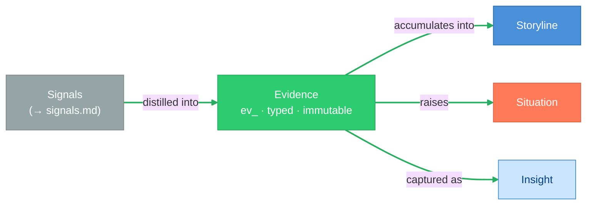
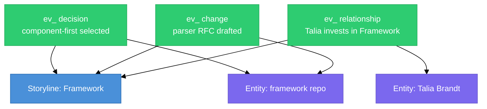

# Evidence

> **Status:** Approved
>
> **Version:** 1.0   ·   **Last updated:** 2026-06-04
>
> **Purpose:** The Evidence feature end-to-end — what an Evidence item is, its type catalog, why it is immutable and append-only, how it is created from Signals, the provenance it carries, the evidence graph it forms, and how it makes every conclusion explainable. The source-of-truth layer of the knowledge pipeline.
>
> **Depends on:** [constitution](constitution.md), [data-model](data-model.md), [glossary](glossary.md)   ·   **Related:** [signals](signals.md), [inbox](inbox.md), [storylines](storylines.md), [situations](situations.md), [insights](insights.md), [entities](entities.md), [memory](memory.md)

> Requirement tag: **EV**

---

## 1. Purpose & Scope

**Evidence** is the System's **source of truth** — a normalized, attributable, **immutable** fact distilled from one or more [Signals](signals.md). It answers *"what do we know?"* and, just as importantly, *"why do we believe it?"* Every Insight, Situation, Narrative line, and recommendation must be explainable through Evidence; without it, the System is guessing rather than reasoning.

This spec owns the Evidence's **mechanics**: its **type catalog**, the **immutability / append-only** rule, how it is **created from Signals**, the **provenance** it carries, the **evidence graph** it forms with Storylines and Entities, the **explainability** contract that backs every claim, and where Evidence is **user-visible**. The canonical entity *shape* and identity are fixed in [data-model](data-model.md) §7; this spec applies and deepens them.

## 2. Non-Goals / Out of Scope

- **Not Signals or ingestion.** Sources, normalization, fingerprint dedup, scoring, and the ingestion API are owned by [signals](signals.md); here, Evidence is the *output* of distillation.
- **Not the processing pipeline.** The Inbox, batching, and the Fast/Batch processor tiers that *propose* Evidence are owned by [inbox](inbox.md).
- **Not interpretation.** Conclusions, conditions, and synthesis live in [situations](situations.md), [insights](insights.md), and the Narrative ([narrative](narrative.md)); Evidence holds **facts only** (§5.5).
- **Not the entity-relationship model.** The `ev_` identity, Space scoping, and the pipeline position are fixed in [data-model](data-model.md); this spec does not redefine them.
- **Not persistence or the embedding index.** Storage, indexing, and semantic search are [app-architecture](app-architecture.md) / [memory](memory.md).

## 3. Background & Rationale

Reasoning is only as trustworthy as the facts under it. The System keeps a hard line between **observation** and **conclusion**: Signals are noisy observations that might matter; Evidence is the small set of facts the System has **accepted as true** and is willing to be held to. Putting a fact on the record is deliberately more expensive than emitting a Signal — Evidence is created only when something has been *proven useful* (§5.4).

Two properties make Evidence load-bearing. First, it is **immutable**: a fact, once distilled, never changes — only *interpretations* change (§5.3). This is what lets the System explain itself months later and lets a user trust that a cited fact still means what it said. Second, it is **typed and attributed**: knowing that a fact is a `promise` versus a `decision`, and exactly where it came from, is what turns a pile of facts into a graph the rest of the System can reason over (§5.2, §5.7). Evidence is the foundation of **trust**, as Signals are the foundation of **discovery** ([signals](signals.md)).

## 4. Concepts & Definitions

Canonical definitions are in [glossary](glossary.md); relationships and the entity shape in [data-model](data-model.md). Terms this spec uses:

- **Claim** — the normalized fact itself, stated as a fact (not a conclusion).
- **Type** — the kind of fact (§5.2): `observation · statement · decision · promise · change · relationship · activity`.
- **Provenance** — where the fact came from and when; the attribution that makes it traceable (§5.6).
- **Evidence graph** — the web of Evidence linked to Storylines and Entities (§5.7).
- **Proposal** — a candidate Evidence emitted by a processor before it is committed (§5.4).
- **Reinforcement** — corroborating a fact with additional Signals rather than duplicating it (§5.10).

## 5. Detailed Specification

### 5.1 What Evidence is

> **REQ-EV-01.** An Evidence item (`ev_`) is a **normalized, attributable, immutable fact** distilled from one or more [Signals](signals.md), scoped to exactly one Space ([data-model](data-model.md) REQ-DM-02, -04). It is a first-class narrative-layer primitive: the **citable substance** behind everything (P3). One Evidence item states **one fact**.

### 5.2 The type catalog

> **REQ-EV-02.** Every Evidence item carries exactly one **type** describing the **kind of fact**. The catalog is small and disjoint; processors choose the type that fits what was proven:

| `type` | The fact is… | Cast example |
|--------|--------------|--------------|
| `observation` | a noticed state of the world | *Northwind Cloud reduced its entry-tier price on 2026-05-28.* |
| `statement` | something a person/source asserted | *Talia said: "I want churn metrics before Friday."* |
| `decision` | a choice that was made | *Component-first architecture selected for Framework.* |
| `promise` | a commitment with an owner (and often a due date) | *Devin promised the portal content review by Wednesday.* |
| `change` | a tracked thing changed | *`components.md` added named slots to the component design.* |
| `relationship` | a durable link between Entities | *Talia Brandt is an investor in Framework.* |
| `activity` | the user did/engaged with something | *User collected three articles on capability-based security.* |

The type vocabulary is **disjoint from** Situation `category`s ([situations](situations.md)) and Insight `kind`s ([insights](insights.md)): those interpret Evidence, they are not Evidence. A `promise` fact, for instance, is what a downstream `overdue` Situation is *built from* — the fact and the condition are different objects.

### 5.3 Immutability & append-only

> **REQ-EV-03.** Evidence is **immutable and append-only**: it is **never edited, overwritten, or reinterpreted** in place ([data-model](data-model.md) §4, §5.3). When reality moves, the System records **new** Evidence rather than mutating the old. *Example:* a promise does not "change" — three facts are recorded over time: a `promise` created, an `observation`/`statement` that it was updated, and an `observation` that it was fulfilled. The history is the record. Interpretations built on Evidence ([Insights](insights.md), [Situations](situations.md), the Narrative) may change freely; the Evidence under them does not.

### 5.4 Creation from Signals

> **REQ-EV-04.** Evidence is **created by processors that propose facts** from surviving [Signals](signals.md); a Signal never writes Evidence directly (REQ-SIG-10). The governing question is *"did this prove something useful?"* — not *"should this become memory?"*. A processor extracts candidate facts, and Evidence is committed only when confidence is sufficient; low-confidence candidates are deferred or dropped at the [inbox](inbox.md) layer, never recorded as fact. *Example:* a `change` Signal on `components.md` is extracted into two facts — *"named slots added to the component design"* (`change`) and the still-open question it raises is **not** Evidence (it becomes a `decision` Situation downstream, not a fact).

### 5.5 Factual, not interpretive

> **REQ-EV-05.** Evidence holds **facts, never conclusions**. *"User discussed Rust in 18 conversations"* is Evidence; *"User likes Rust"* is an interpretation and is not. Interpretation belongs to [Insights](insights.md) (discoveries), [Situations](situations.md) (conditions), and the Narrative ([narrative](narrative.md)) (synthesis). Keeping Evidence interpretation-free is what lets those layers change their minds without rewriting history (REQ-EV-03).

### 5.6 Provenance & attribution

> **REQ-EV-06.** Every Evidence item carries **provenance** — where the fact came from and when — and links the `signal_ids` it was distilled from. Provenance makes every fact **traceable** back to its source(s), which is the precondition for explainability (§5.8) and for a user to audit or correct the record. *Example:* *"Northwind raised the Pro tier 18% on 2026-05-28 (source: pricing-page diff)."*

### 5.7 The evidence graph

> **REQ-EV-07.** Evidence **links into a graph**: each item may attach to one or more Storylines (it *aggregates into* them — the same fact may belong to several, [data-model](data-model.md) REQ-DM-03) and to one or more Entities ([entities](entities.md)). This graph is what powers [Storylines](storylines.md) (accumulating Evidence on a topic), [Situations](situations.md) (raised from Evidence), [Insights](insights.md) (captured from Evidence), search, and recommendations. *Example:* facts about the `Framework` repo, the parser RFC, and Talia's investment all link to the `Framework` Storyline and to their respective Entities.

### 5.8 Explainability & trust

> **REQ-EV-08.** Every [Insight](insights.md), [Situation](situations.md), and surfaced claim **must cite the Evidence** behind it ([constitution](constitution.md) P3, restating [glossary](glossary.md) REQ-CON-02). The contract is strict: **if the System cannot point to Evidence, the conclusion must not exist.** This is what lets the System answer *"why do you believe that?"* — and what makes a wrong conclusion correctable by inspecting the facts under it rather than arguing with the model.

### 5.9 Visibility

> **REQ-EV-09.** Unlike [Signals](signals.md), which are internal infrastructure, **Evidence is user-visible**. It surfaces as the cited basis inside Storylines, Situations, Insight explanations, Narrative provenance, and knowledge-graph views. Users do not browse a raw "evidence feed"; they encounter Evidence as the **provenance** of the concepts they already care about ([conversation](conversation.md) and the client surface, out of scope here).

### 5.10 Dedup & reinforcement across Signals

> **REQ-EV-10.** When multiple Signals attest to the **same fact**, the System **reinforces** the existing Evidence — appending `signal_ids` and updating provenance — rather than recording a duplicate. Genuinely distinct facts become distinct Evidence. This Evidence-level merge, together with [signals](signals.md) fingerprint dedup (REQ-SIG-06), **resolves** [glossary](glossary.md) OQ-CON-2: signal-level dedup removes identical *inputs*; evidence-level reinforcement consolidates corroborating *facts*.

## 6. Visualizations

### 6.1 Signal → Evidence → consumers



### 6.2 Immutability — a promise over time (append-only)


*Three immutable records, not one mutated row. The downstream `overdue` Situation and its resolution are interpretations over this history (REQ-EV-03, [situations](situations.md)).*

### 6.3 The evidence graph



## 7. Data Shapes

The canonical Evidence shape is fixed in [data-model](data-model.md) §7; it is reproduced here for convenience and **adds no fields beyond it**. Conceptual shape — not a storage schema. IDs per [data-model](data-model.md) §5.1; timestamps abbreviated.

```ts
interface Evidence {          // immutable, append-only
  id: string;                 // ev_
  space_id: string;
  type:
    | "observation" | "statement" | "decision" | "promise"
    | "change" | "relationship" | "activity";
  signal_ids: string[];       // one or more Signals distilled into this fact
  claim: string;              // the normalized fact, stated as fact
  provenance: string;         // where it came from, when (REQ-EV-06)
  storyline_ids: string[];    // aggregates into (may be several) (REQ-EV-07)
  entity_ids: string[];       // graph links to Entities
  metadata: Record<string, unknown>;
  captured_at: Date;
}
```

## 8. Examples & Use Cases

### Example A — a file change becomes typed Evidence (Given/When/Then)
- **Given** a `change` Signal that `components.md` was edited under the `Framework` Storyline,
- **When** a Batch processor extracts the change,
- **Then** it proposes one `change` Evidence — *"named slots added to the component design"* (provenance: the file diff; `signal_ids` set; linked to the `Framework` Storyline and the `framework` Entity). The open routing question it raises is **not** Evidence; it becomes a `decision` Situation downstream (REQ-EV-04/05).

### Example B — a promise, recorded append-only (narrative)
An email connector Signal yields a `promise` Evidence: *"Talia requested churn metrics before Friday."* On Friday no metrics exist; the System does **not** edit the promise — it records a new `observation` Evidence that the deadline passed, and a downstream `overdue` Situation cites both (REQ-EV-03, REQ-EV-08). When metrics are sent, a third `observation` closes the history.

### Example C — corroboration reinforces, not duplicates (narrative)
Three `activity` Signals — a Playwright bookmark, a `browser` visit, and a `chat` mention — all attest that the user is exploring browser automation. Rather than three near-identical facts, the System records **one** `activity` Evidence and reinforces it by appending each `signal_id` and broadening provenance (REQ-EV-10), keeping the `Browser automation` Storyline clean.

## 9. Edge Cases & Failure Modes

- **Contradictory Evidence.** Two facts conflict (plan says local-first; a new fact requires Northwind Cloud). Both are kept — Evidence is append-only — and the conflict is surfaced as a `contradiction` Situation, never resolved by overwriting a fact (REQ-EV-03, [situations](situations.md)).
- **Low-confidence proposals.** A candidate fact the processor is unsure of is **not** recorded; it is deferred/dropped upstream ([inbox](inbox.md)). Evidence carries no "maybe" — recording a fact is an assertion of belief (REQ-EV-04).
- **Interpretation leaking into a claim.** A `claim` that reads as a conclusion ("user prefers Rust") must be rejected or rewritten to the underlying fact ("user chose Rust for 3 of 3 recent projects"); review enforces REQ-EV-05.
- **Provenance gaps.** A fact whose source cannot be attributed is not Evidence; traceability is mandatory (REQ-EV-06), so an unattributable candidate is dropped rather than recorded blind.
- **Orphaned Evidence.** Evidence may exist before it links to any Storyline; it still belongs to a Space (REQ-DM-02) and may be attached later as the graph fills in (REQ-EV-07).
- **Correcting a wrong fact.** A genuinely mistaken Evidence item is **superseded** by a new corrective fact (and may be marked superseded by interpretation), never silently edited — the audit trail is the point (REQ-EV-03).

## 10. Open Questions & Decisions

- **OQ-EV-1** — Does Evidence carry an explicit **confidence** field, or is confidence handled entirely upstream at proposal time (so anything recorded is "believed")? The canonical shape currently omits it (§7); revisit with [inbox](inbox.md).
- **OQ-EV-2** — How is a superseded/corrected fact marked so consumers prefer the latest without the old fact vanishing from the audit trail? (Coordinate with [memory](memory.md).)
- **OQ-EV-3** — The precise boundary between **reinforcement** (one fact, more Signals) and a **new** fact (REQ-EV-10) — jointly with [signals](signals.md) (OQ-SIG-3) resolving [glossary](glossary.md) OQ-CON-2.

## 11. Review & Acceptance Checklist

- [ ] Evidence is a normalized, attributable, immutable, Space-scoped fact — the citable substance (REQ-EV-01; [data-model](data-model.md) REQ-DM-04).
- [ ] The type catalog (`observation/statement/decision/promise/change/relationship/activity`) is specified and disjoint from Situation/Insight vocabularies (REQ-EV-02).
- [ ] Immutability / append-only is specified, with state changes recorded as new facts (REQ-EV-03).
- [ ] Creation-from-Signals is propose-then-commit on sufficient confidence; Signals never write Evidence directly (REQ-EV-04; [signals](signals.md) REQ-SIG-10).
- [ ] Evidence holds facts, never conclusions; interpretation lives downstream (REQ-EV-05).
- [ ] Provenance/attribution and the evidence graph (Storyline + Entity links) are specified (REQ-EV-06, -07).
- [ ] The explainability contract — every claim cites Evidence or must not exist — is stated (REQ-EV-08; P3, [glossary](glossary.md) REQ-CON-02).
- [ ] Visibility (user-visible as provenance) and dedup/reinforcement resolving OQ-CON-2 are specified (REQ-EV-09, -10). Examples use the [constitution](constitution.md) §7 cast; no placeholders.

## 12. Cross-References

- [data-model](data-model.md) — the canonical `Evidence` entity, the immutability invariant, and the `Signal → Evidence → …` pipeline this spec deepens (REQ-DM-04, -17).
- [glossary](glossary.md) — canonical Evidence definition; REQ-CON-02 (evidence-backing) and OQ-CON-2 (dedup), resolved jointly here and in [signals](signals.md).
- [signals](signals.md) — the raw input that Evidence is distilled from; fingerprint dedup vs evidence-level reinforcement.
- [inbox](inbox.md) — the processors that *propose* Evidence and the confidence gate behind committing it.
- [situations](situations.md) / [insights](insights.md) / [storylines](storylines.md) — the interpretation and continuity layers that cite, are raised from, and accumulate Evidence. [entities](entities.md) — graph link targets. [narrative](narrative.md) — the Narrative that synthesizes Evidence-backed state. [memory](memory.md) — capture/retention/recall.

## 13. Changelog

- **2026-06-04 — v0.1** — Initial draft. Evidence as the immutable, attributable, citable fact (REQ-EV-01); the type catalog disjoint from Situation/Insight vocabularies (REQ-EV-02); immutability/append-only with history-as-record (REQ-EV-03); propose-then-commit creation from Signals (REQ-EV-04); facts-not-conclusions (REQ-EV-05); provenance/attribution (REQ-EV-06); the evidence graph over Storylines and Entities (REQ-EV-07); the explainability contract (REQ-EV-08, P3); user-visibility as provenance (REQ-EV-09); dedup/reinforcement resolving OQ-CON-2 (REQ-EV-10). Accompanies the extended canonical Evidence shape in [data-model](data-model.md) v1.1 (REQ-DM-17).
- **2026-06-04 — v1.0** — Approved.
