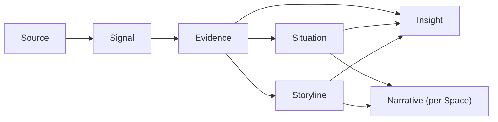

# Glossary

> **Status:** Approved
>
> **Version:** 1.0   ·   **Last updated:** 2026-05-29
>
> **Purpose:** The canonical glossary — the shared vocabulary every other spec uses. Each term gets one authoritative definition, a cast example, and how it relates to the others; full mechanics live in each term's dedicated spec.
>
> **Load this when:** A domain term is unclear, or you're about to define/use a term in another spec (check it matches here first).
>
> **Depends on:** [constitution](constitution.md)   ·   **Related:** [spaces](spaces.md), [signals](signals.md), [insights](insights.md), [memory](memory.md), [entities](entities.md), [data-model](data-model.md)

> Requirement tag: **CON**

---

## 1. Purpose & Scope

This is the **dictionary** for the System. It fixes what each term *means* and how the terms relate, so 38 specs stay consistent. For each term it gives: a **definition**, an **example** from the cast ([constitution](constitution.md) §7), and a **→ pointer** to the dedicated spec that owns the full mechanics.

It is intentionally a **glossary, not a manual**: it does not explain *how* anything works (that's the dedicated specs) or *how data is stored* (that's [data-model](data-model.md)). When a definition here and a dedicated spec disagree, the dedicated spec wins for mechanics, but the **term's meaning here is canonical** — update both together.

## 2. Non-Goals

- Not the mechanics of any subsystem (see the dedicated specs).
- Not the data schema / persistence ([data-model](data-model.md), [app-architecture](app-architecture.md)).
- Not an exhaustive UI vocabulary (surfaces are defined in their own specs).

## 3. Background & Rationale

A system that "remembers, connects, and continues" needs a stable, shared language. If "Storyline" means one thing in `home-and-briefings` and another in `insights`, the product fractures. One glossary, owned here, keeps every spec — and the eventual code — speaking the same words.

## 4. How to read this glossary

Each entry: **Term** (`id-prefix`) — definition. *Example:* … · *Relates to:* … · *→ spec.* Domain terms are always capitalized when they denote the concept ([constitution](constitution.md) §6.2). The **knowledge pipeline** is the spine; read it first.

## 5. The vocabulary

> **REQ-CON-01.** Knowledge flows **Signal → Evidence → (Storyline / Situation) → Insight**, and is summarized in the **Narrative**. **REQ-CON-02.** Every Insight and surfaced claim must cite the Evidence behind it (Constitution P3).

- **Space** (`space_`) — the **only primitive** and universal organizing container: a node in one hierarchy, with **downstream inheritance** (children inherit a parent's config/context). Everything else lives inside a Space. *Example:* `Business/Framework`. *→ [spaces](spaces.md).* (Constitution P11)

- **Storyline** (`story_`) — a long-running **narrative thread** of related work and events inside a Space; carries Momentum, Status, Evidence, and related Entities. *Example:* the *Framework UI direction* Storyline, looping for months. *Relates to:* draws on Evidence; spawns Insights; summarized in the Narrative.
- **Situation** (`sit_`) — an **operational state that needs awareness now**; carries an Attention score, Status, Evidence, and suggested actions; usually tied to a Storyline. *Example:* *Stripe automation blocked by expired login.* *Relates to:* surfaced in Home → Attention-Needed ([home-and-briefings](home-and-briefings.md)).
- **Momentum** — how a Storyline is **moving**: *advancing · steady · stalled · looping.* Drives "what's progressing vs stuck." *Example:* the Framework UI direction's Momentum = *looping* (revisited four times, no RFC).
- **Attention score** — how much a Situation **needs the user now**; ranks the briefing. *Example:* an overdue reply to Talia scores higher each day it slips.
- **Status** — the lifecycle state of a Storyline or Situation (*active · blocked · resolved · dormant*).
- **Signal** (`sig_`) — a **meaningful change entering the System** from a source: a message, file change, web/page change, browser activity, a scheduled watcher run, or an external connector. The raw input unit. *Example:* the competitor's release-notes page changed overnight. *→ [signals](signals.md).*
- **Evidence** (`ev_`) — a **normalized, attributable fact** distilled from one or more Signals, carrying provenance (where it came from, when). The citable substance behind everything. *Example:* "Northwind raised the Pro tier 18% on 2026-05-28 (source: pricing page diff)."
- **Insight** (`ins_`) — a **synthesized observation** that is evidence-backed and actionable. Categories: *contradiction · opportunity · risk · stale work · dependency · anomaly · repetition · synthesis.* *Example:* a *repetition* Insight: "You've revisited the Framework routing decision four times without an RFC." *→ [insights](insights.md).*
- **Narrative** — the **editable per-Space summary**: current state, active Storylines, risks. It is both human-editable memory *and* the System's context-compression layer. One Narrative per Space. *Example:* the `Framework` Space's Narrative opens with "Converging on component model; routing still unresolved." *→ [memory](memory.md).*
- **Memory** (`mem_`) — **durable distilled knowledge** the System retains and retrieves (facts, preferences, summaries), subject to retention/decay. *Example:* it remembers you prefer terse briefings. *→ [memory](memory.md).*
- **Entity** (`ent_`) — a **real-world thing** tracked in a knowledge graph (person, company, product, repo), linking Storylines and Evidence. *Example:* `Stripe`, `Talia Brandt`, the `framework` repo. *→ [entities](entities.md).*

- **Task** (`task_`) — a **unit of work** with a lifecycle and events; created by the user, an Agent, a Signal/Insight, or from chat. *Example:* "Draft the Framework RFC skeleton." *→ [tasks](tasks.md).*
- **Periodic Task** (`ptask_`) — a **recurring/scheduled** Task, including a **watcher** that polls a source and emits a Signal on meaningful change. *Example:* nightly Memory distillation; a watch on Northwind's pricing page; the weekly Digest. *→ [periodic-tasks](periodic-tasks.md).*

- **Agent** (`agent_`) — a **scoped, role-based actor** (Executive · Research · Browser · Memory Curator · Ops), observable and bounded by Always/Ask-first/Never. *→ [agents](agents.md), [agent-orchestration](agent-orchestration.md).*
- **Skill** (`skill_`) — a **packaged capability**: a bundle of Tools, prompts, permissions, and a sandbox policy that an Agent receives and a Space constrains. *Example:* a "release-watcher" Skill. *→ [skills](skills.md).*
- **Tool** — a **single callable capability** with a typed input/output contract and a declared risk tier; the unit a Skill bundles and an Agent invokes. *Example:* `fetch_page`, `send_email`. *→ [tools](tools.md).*

- **Conversation** (`conv_`) / **Message** (`msg_`) — a **chat thread** scoped to a Space/Storyline, and its typed messages (user, assistant, Insight card, permission request, artifact, task-progress embed, …). *→ [conversation](conversation.md).*
- **Digest** — a **periodic roll-up briefing** (daily · weekly · space · blocked-work · insight). *→ [home-and-briefings](home-and-briefings.md).*

## 6. Visualizations

### 6.1 The knowledge pipeline

*Everything above lives inside a **Space**. **Entities** link across Storylines/Evidence; **Memory** retains the distilled result; **Agents/Tasks** drive the flow on the server.*

### 6.2 Where each term is owned

| Layer | Terms | Owned by |
|------|-------|----------|
| Container | Space | [spaces](spaces.md) |
| Narrative | Storyline, Situation, Momentum, Attention score, Status | [glossary](glossary.md) (here) + surfaced in [home-and-briefings](home-and-briefings.md) |
| Pipeline | Signal, Evidence, Insight, Narrative, Memory, Entity | [signals](signals.md), [insights](insights.md), [memory](memory.md), [entities](entities.md) |
| Work | Task, Periodic Task | [tasks](tasks.md), [periodic-tasks](periodic-tasks.md) |
| Capability | Agent, Skill, Tool | [agents](agents.md), [skills](skills.md), [tools](tools.md) |
| Surfaces | Conversation, Message, Digest | [conversation](conversation.md), [home-and-briefings](home-and-briefings.md) |

## 7. Data Shapes

*(Not here — the conceptual entity-relationship model is [data-model](data-model.md); this glossary only names and defines.)*

## 8. Examples & Use Cases

### Example A — a change becomes understanding (narrative)
A periodic watcher on the competitor's release-notes page detects a change → a **Signal**. The System normalizes it into **Evidence** ("competitor shipped feature X, 2026-05-28"). That Evidence attaches to the *Framework UI direction* **Storyline** and, combined with three prior revisits, produces a *repetition* **Insight** ("you keep circling routing without deciding"). The `Framework` Space's **Narrative** is updated to reflect the unresolved decision, and its **Momentum** stays *looping*.

## 9. Open Questions & Decisions

- **OQ-CON-1** — Is there exactly one **Narrative** per Space, or can large Spaces have sub-Narratives? (Resolve in [memory](memory.md)/[spaces](spaces.md).)
- **OQ-CON-2** — Does **Evidence** dedupe/merge across multiple Signals, and where does that live? (Resolve in [signals](signals.md)/[memory](memory.md).)
- **OQ-CON-3** — Is **Status** a shared enum across Storyline and Situation, or per-type? (Resolve in [data-model](data-model.md).)

## 10. Review & Acceptance Checklist

- [ ] Every core term has a one-line canonical definition, a cast example, and a pointer to its owning spec.
- [ ] The knowledge pipeline (Signal → Evidence → Storyline/Situation → Insight → Narrative) is stated as an invariant (REQ-CON-01) with evidence-backing (REQ-CON-02).
- [ ] The supporting attributes (Momentum, Attention score) are defined as first-class.
- [ ] No mechanics or data-schema detail leaked in; no placeholders.
- [ ] Term capitalization matches [constitution](constitution.md) §6.2.

## 11. Cross-References

- [constitution](constitution.md) — capitalization rules (§6.2) and the example cast (§7).
- [spaces](spaces.md) — Space.
- [signals](signals.md) / [insights](insights.md) / [memory](memory.md) / [entities](entities.md) — the pipeline terms in depth.
- [data-model](data-model.md) — how these entities relate and are identified.

## 12. Changelog

- **2026-05-29 — v0.1** — Initial glossary: container, narrative layer (with Momentum/Attention/Promise/Open question), knowledge pipeline, work & automation, capability, surfaces; pipeline diagram + ownership table; Storyline/Narrative naming.
- **2026-05-29 — v0.2** — Renamed `concepts` → `glossary`. Flattened §5 into a single vocabulary list (removed the thematic subsections 5.1–5.6); moved the pipeline invariant (REQ-CON-01/02) to the head of §5.
- **2026-05-29 — v0.3** — Removed terms **Person** (sharing deferred), **Open question**, and **Promise** (with its Example B and the `promise-tracking` Insight category — a Promise is memory-like, not a first-class type).
- **2026-05-29 — v1.0** — Removed **Monitor** (folded into **Periodic Task** — a Monitor is a recurring watcher task) and **Note**/**Bookmark**. **Approved.**
