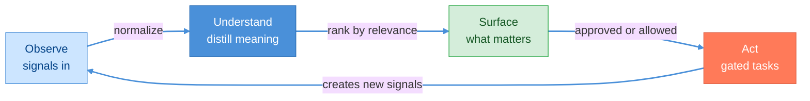
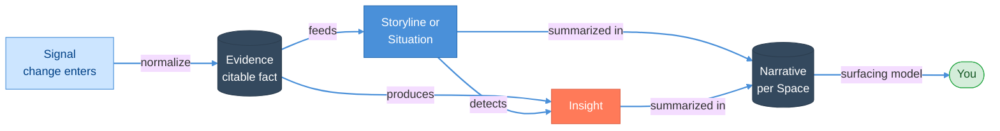
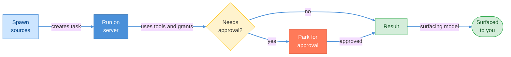
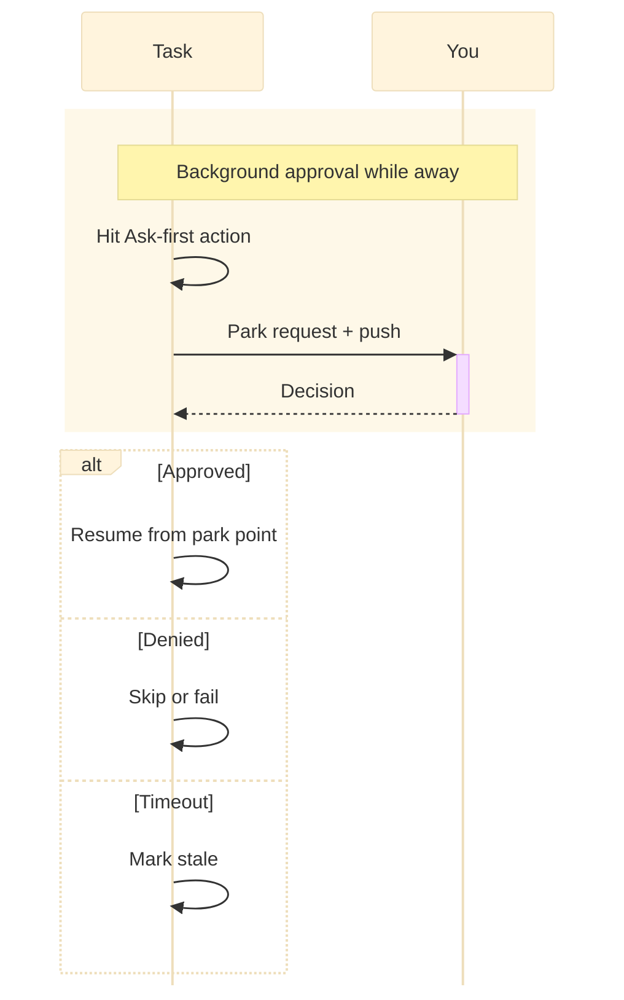
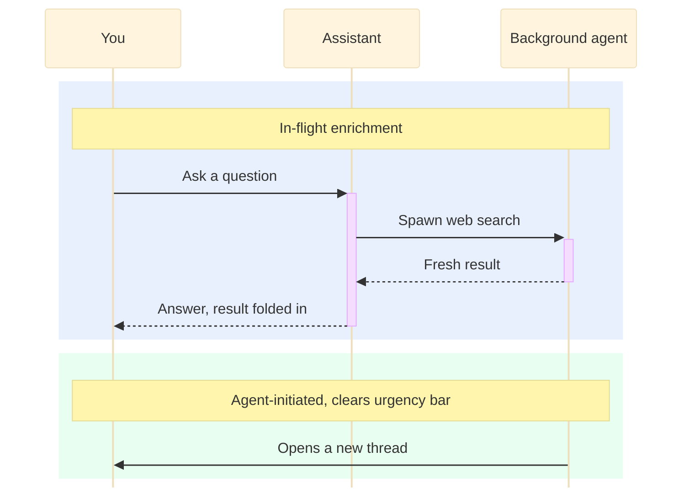

# How It Works

> **Status:** In Review
>
> **Version:** 0.2   ·   **Last updated:** 2026-06-09
>
> **Purpose:** The end-to-end story of how the System works, plus its full feature catalog — written for an investor or a new user, not an engineer. It explains *what every feature does and how they connect*; the deep mechanics of each live in that feature's own spec.
>
> **Depends on:** [constitution](constitution.md), [overview](overview.md), [glossary](glossary.md)   ·   **Related:** [spaces](spaces.md), [tasks](tasks.md), [periodic-tasks](periodic-tasks.md), [signals](signals.md), [agents](agents.md), [agent-orchestration](agent-orchestration.md), [tools](tools.md), [skills](skills.md), [permissions](permissions.md), [memory](memory.md), [insights](insights.md), [entities](entities.md), [ui-shell](ui-shell.md), [proactivity](proactivity.md), [conversation](conversation.md), [calendar](calendar.md), [browser-automation](browser-automation.md), [filesystem](filesystem.md), [mcp](mcp.md), [activity-log](activity-log.md), [privacy-security](privacy-security.md), [ai-models](ai-models.md), [ui-shell](ui-shell.md), [settings](settings.md), [data-model](data-model.md)

> Requirement tag: **HOW**

---

## 1. Purpose & Scope

This spec is the **guided tour** of the System: how it takes in the world, turns it into durable understanding, does work on your behalf, and surfaces only what matters — all while running on a server you own, even when you're asleep.

It is written at **product altitude**: every feature is described by *what it does and how it connects to the others*. It deliberately contains **no implementation detail** — no data schemas, interfaces, APIs, or algorithms. Each feature named here has its own dedicated spec that carries those "nerdy" details; this document links to them. If you want to know *how a thing is built*, follow the link.

Requirement IDs in this spec use the tag **`HOW`** (`REQ-HOW-NN`).

## 2. Non-Goals / Out of Scope

- **Not implementation.** Structures, protocols, and build details live in each feature's spec and in [app-architecture](app-architecture.md) / [stack](stack.md).
- **Not the vision.** The "why" and positioning live in [overview](overview.md).
- **Not definitions.** Canonical term meanings live in [glossary](glossary.md).
- **Out of scope here:** Space sharing (deferred), first-run onboarding ([ui-shell](ui-shell.md)/[settings](settings.md) will own it), and undo/reversibility detail ([activity-log](activity-log.md)/[permissions](permissions.md)). They are mentioned only where a flow touches them.

## 3. Background & Rationale

A working person's context is scattered across chat, files, browser tabs, dashboards, and memory. Existing tools capture **events** — messages, commits, notifications — but events are not understanding. You're left to reassemble "where does this stand?", "what's blocking me?", and "what changed?" by hand, over and over.

The System treats **ongoing context as the product**: it continuously observes the sources you point it at, distills them into durable understanding, surfaces only what matters, and keeps working while you're away. "Keeps thinking while away" is impossible on a client alone — so the System is **client-server**: an always-on, self-hosted server is the brain, and clients are views that connect when available (see [overview](overview.md) §3, §5.4).

## 4. Concepts & Definitions

This spec uses the canonical vocabulary from [glossary](glossary.md) — **Space, Storyline, Situation, Signal, Evidence, Insight, Narrative, Memory, Entity, Agent, Skill, Tool, Task, Periodic Task, Conversation, Digest** — and the example cast (you, the `Framework` product, Brightmoor, Talia, Devin, Sam, Dr. Belov) fixed in [constitution](constitution.md) §7. It introduces no new terms; it shows how the existing ones work together.

## 5. Detailed Specification

### 5.1 The operating loop & data flows

> **REQ-HOW-01.** The System runs a continuous loop on the always-on server — **Observe → Understand → Surface → Act** — independent of whether any client is connected.

At feature altitude, data moves along one spine — raw input becomes citable fact becomes tracked narrative becomes actionable insight becomes a summary you can read:

The **server** holds and runs all of this (ingestion, the pipeline, Memory, Agents, Tasks, AI calls); **clients** (desktop, mobile companion) are windows onto it and connect when available. *See [app-architecture](app-architecture.md) for the mechanics.*

### 5.2 Spaces & inheritance

> **REQ-HOW-02.** Everything the System knows or does happens **inside a Space**. Spaces form one hierarchy with **downstream inheritance**: a child inherits its parent's configuration and context, and may override it. Context never leaks across Spaces ([constitution](constitution.md) P10/P11).

You organize work as Spaces — e.g. `Business/Framework`, `Business/Brightmoor`, `Research/Distributed Systems`. Settings, mounts, and Agents set on `Business` flow down to `Framework` unless `Framework` overrides them. The active Space scopes what the System can see and do. *See [spaces](spaces.md).*

### 5.3 Signals & ingestion

> **REQ-HOW-03.** A **Signal** is any meaningful change entering the System. Sources include messages, file changes, web/page changes, browser activity, **watcher runs** (recurring tasks that poll a source), connectors, and a **public ingestion API**.

> **REQ-HOW-04.** The ingestion API lets *any external tool* POST a Signal into a Space. It is **authenticated, Space-scoped, and rate-limited**, and everything it accepts is treated as **untrusted data, never instructions** ([constitution](constitution.md) P12).

*Example:* a competitor's release-notes page changes overnight (a watcher run); your CI posts a build failure through the API; an email arrives via a connector — each becomes a Signal in the right Space. *See [signals](signals.md).*

### 5.4 Integrations, local sources, and outbound connectors

> **REQ-HOW-05.** The System connects to external systems under **least privilege** — every integration is granted narrowly and visibly, never silently broadened.

- **Browser automation** — isolated browser profiles that log in, fill forms, extract data, and watch pages; state-changing actions are approval-gated. *See [browser-automation](browser-automation.md).*
- **Filesystem** — scoped folder mounts; files become Signals; the System never scans the whole disk. *See [filesystem](filesystem.md).*
- **Inbound Integrations** — email, calendar, chat, task-tracking, and code-host accounts that poll external services and emit Signals into one Space. *See [integrations](integrations.md).*
- **Outbound Tools / MCP / Skills** — capabilities the System calls to act on the world, scoped per Space and gated by permissions. *See [tools](tools.md), [mcp](mcp.md), [skills](skills.md).*
- **Ingestion API** — the open door of §5.3 for anything else.

### 5.5 From signal to understanding

> **REQ-HOW-06.** Signals are distilled into **Evidence** (normalized, attributable facts), which feed **Storylines** (long-running threads) and **Situations** (states needing attention now), and produce **Insights**. Every Insight cites its Evidence ([constitution](constitution.md) P3).

- **Storylines** carry **Momentum** — *advancing · steady · stalled · looping* — so you see what's progressing vs stuck (e.g. the *Framework UI direction* Storyline is *looping*).
- **Situations** carry an **Attention score** that ranks the briefing (e.g. *investor reply to Talia overdue* climbs each day it slips).
- **Insights** are the proactive catch: *contradiction · opportunity · risk · stale work · dependency · anomaly · repetition · synthesis* — e.g. "you've revisited routing four times without an RFC."

*See [insights](insights.md); the pipeline invariant is [glossary](glossary.md) REQ-CON-01/02.*

### 5.6 Memory management & Entities

> **REQ-HOW-07.** The System maintains durable **Memory** (facts, preferences, summaries) subject to retention/decay, retrievable by meaning, and a per-Space **Narrative** — the editable summary of where a Space stands and the System's own context-compression layer.

It also maintains **Entities** — a knowledge graph of people, companies, products, and repos (`Stripe`, `Talia Brandt`, the `framework` repo) that links Storylines and Evidence together. *See [memory](memory.md), [entities](entities.md).*

### 5.7 Tasks

> **REQ-HOW-08.** A **Task** is a unit of work with a lifecycle. Tasks are **spawned** by: you, an Agent, a Signal or Insight, a chat message, or a schedule (a Periodic Task).

> **REQ-HOW-09.** A Task can read and analyze, create/update internal objects, call Tools, run on the server in the background, and request approval for anything beyond its standing permissions. Its **results** flow to you via the Surfacing Model (§5.12).

Spawn sources are: you, an Agent, a Signal or Insight, a chat message, or a schedule. *See [tasks](tasks.md).*

### 5.8 Tools & Skills

> **REQ-HOW-10.** A **Tool** is a single capability a Task invokes (e.g. `fetch_page`, `send_email`), each carrying a declared risk tier. A **Skill** is a packaged bundle of Tools (plus prompts and permissions) that an Agent receives and a Space constrains.

A Task uses Tools to get things done; the tier of each Tool determines whether it runs freely or needs approval (§5.10). *See [tools](tools.md), [skills](skills.md).*

### 5.9 Agents & orchestration

> **REQ-HOW-11.** Work is carried out by **Agents** — scoped, role-based actors (`Executive`, `Research`, `Ops`, `Reviewer`, plus user-defined specializations such as a browser-focused `Ops`) that act *for the user*. Agents **delegate and hand off** to one another, routing approvals as needed. Background state-maintenance (keeping Storylines/Situations/Insights/Narratives coherent) is a separate concern, handled by the **Curator** engine ([curator](curator.md)).

> **REQ-HOW-12.** "Aliveness" comes from **continuity** — memory, timing, judgment, and initiative — not fake emotion or mascots ([constitution](constitution.md) P7). The Research Agent that advanced Dr. Belov's consensus question yesterday receives the relevant remembered context when it resumes today.

*See [agents](agents.md), [agent-orchestration](agent-orchestration.md).*

### 5.10 Permissions & approvals

> **REQ-HOW-13.** Every action is classified **Always / Ask-first / Never** ([constitution](constitution.md) §5). Tasks run freely over **Always** actions and any **standing grants**; an **Ask-first** action with no covering grant **parks** the task and requests approval; **Never** is refused.

> **REQ-HOW-14.** When a background task parks an approval while you're away, it surfaces the request (and can push to your phone); on approval it **resumes from the park point**, on denial it skips or fails, on timeout it lapses and is shown as stale.

*See [permissions](permissions.md).*

### 5.11 Periodic tasks & watchers

> **REQ-HOW-15.** A **Periodic Task** is a UTC schedule that enqueues a Task. A **watcher** is a scheduled Task that polls a source and emits a Signal on meaningful change. Periodic Tasks do **not** replay missed fires after downtime; the schedule resumes at the next due time.

*Examples:* nightly Memory distillation; the weekly Digest; a watcher on Northwind Cloud's pricing page; a watcher on the `framework`'s key npm dependency. *See [periodic-tasks](periodic-tasks.md).*

### 5.12 The Surfacing Model

> **REQ-HOW-16.** Every output the System actively surfaces reaches you through exactly one of four v1 channels — there is no hidden delivery path:

| Channel | Used for |
|---------|----------|
| **Conversation** | direct replies, in-flight enrichment, agent-initiated threads (§5.13) |
| **Home → Attention-Needed** | Situations and parked approvals that need you now |
| **Digest** | batched, non-urgent roll-ups (daily/weekly) |
| **Push notification** | the urgent subset, to your device |

Quiet Storyline and Situation changes are state updates, not delivery channels; you see them when opening the relevant surface. Which active channel a result takes is decided by urgency and your proactivity settings (§5.16), never by the feature that produced it.

### 5.13 Conversation / chat (the primary surface)

> **REQ-HOW-17.** Chat is the **primary** way you interact with the System. The other surfaces (Home, Calendar, Search, Settings, Activity log) open *from* chat on demand — the System lives in the conversation.

> **REQ-HOW-18.** A Conversation is a **living channel**, not a request/response box:
> - Agents appear as named, bounded participants.
> - Mid-conversation, a background agent can **spawn a Task** (e.g. a web search) and **fold the result into the reply** or post it as a contextual result.
> - Agents can **start a new Conversation** when they observe a need.

> **REQ-HOW-19.** This respects anti-spam (§5.16): inside a conversation you're already engaged in, agents act freely; **starting a new conversation or sending a push** must clear the urgency bar and respect quiet hours.

*See [conversation](conversation.md), [proactivity](proactivity.md).*

### 5.14 Calendar

> **REQ-HOW-20.** The Calendar shows time-based work and events in one view: Tasks with due dates, Periodic-Task and watcher runs, deadlines, and events.

*Example:* "Brightmoor portal estimate due Friday" sits alongside the nightly distillation run and the weekly Digest. *See [calendar](calendar.md).*

### 5.15 Surfaces tour (chat-first)

All reachable from chat:
- **Home / Briefings / Digests** — open any client and, in three sentences, know where everything stands; daily briefing + weekly Digest. *See [ui-shell](ui-shell.md).*
- **Search & command palette** — find anything across your Spaces; run commands fast. *See [ui-shell](ui-shell.md).*
- **Activity log** — the auditable trail: "what did it do while I was away?" *See [activity-log](activity-log.md).*
- **Settings** — global and per-Space configuration. *See [settings](settings.md).*

### 5.16 Proactivity

> **REQ-HOW-21.** Silence is the default ([constitution](constitution.md) P4). The System initiates only when a change clears a **relevance/urgency bar**; otherwise it batches into Digests. **Quiet hours** and **anti-spam** govern interruptions; the urgent subset is **pushed to your devices**, including the mobile companion.

*See [proactivity](proactivity.md).*

### 5.17 Trust & control

> **REQ-HOW-22.** The product is trustworthy by construction:
> - **Self-hosted & user-owned** — your server, your data, no mandatory vendor cloud (P1).
> - **Evidence-first & auditable** — every claim cites Evidence (P3); every autonomous action is logged (P9, [activity-log](activity-log.md)).
> - **Approval-gated autonomy** — Always/Ask-first/Never with standing grants (P8, §5.10).
> - **Injection-resistant** — ingested content is data, not instructions (P12); secrets never enter prompts.
> - **Optional local/private models** — sensitive Spaces can run on local models.

*See [privacy-security](privacy-security.md), [prompt-injection](prompt-injection.md), [ai-models](ai-models.md).*

### 5.18 Platform shape

> **REQ-HOW-23.** One **always-on, self-hosted server** is the brain; **native clients** connect to it — a **desktop** client and a **mobile companion** (notifications, approvals on the go, quick capture, viewing briefings). AI uses a **provider abstraction** with routing, and an **optional local model** path for privacy.

*See [app-architecture](app-architecture.md), [stack](stack.md), [ai-models](ai-models.md).*

## 6. Visualizations

The diagrams above are the core set: the **operating loop** and **end-to-end data flow** (§5.1), the **Task lifecycle** (§5.7), the **approval/park/resume** flow (§5.10), and the **living-channel conversation** (§5.13). The "a morning while you were away" timeline lives in [overview](overview.md) §6.2 and is not duplicated here.

## 7. Data Shapes

*(Not applicable — this spec defines no data. The conceptual entity-relationship model is [data-model](data-model.md).)*

## 8. Examples & Use Cases

### Example A — "It worked while you slept" (Given/When/Then)
- **Given** a watcher on Northwind Cloud's pricing page, no standing grant to act on changes, and your desktop **closed**.
- **When** the page changes overnight and the follow-up would *email Devin about the cost impact*.
- **Then** the server does the Always parts autonomously (detect → Evidence → attach to the *Operations* Storyline), **parks** the outbound email as Ask-first, and **pushes it to your phone**. You approve from the mobile companion; the task resumes; the change appears in your morning briefing. *(P2, P3, §5.10, §5.12.)*

### Example B — "Reads your mind in chat" (narrative)
You ask in chat, *"Where's the Brightmoor portal?"* While the assistant answers, a background agent spawns a Task to check the `brightmoor-portal` repo and Devin's last message, then folds the fresh result into the reply: *"Devin signed off this morning; one CI flake on the payments test, nothing blocking."* You never asked it to look — it surfaced what you needed (§5.13).

### Example C — "Anything can feed it" (Given/When/Then)
- **Given** an external CI tool holding a Space-scoped API token for `Business/Framework`.
- **When** a nightly build breaks and the tool **POSTs a Signal** through the ingestion API.
- **Then** the Signal is normalized into Evidence (untrusted-as-data), attached to the *Framework UI direction* Storyline, and — because it contradicts a "release is green" assumption — raised as a *risk* **Insight** in your briefing. *(§5.3, §5.4, §5.5.)*

## 9. Edge Cases & Failure Modes

- **Nothing to say.** The briefing says so plainly rather than manufacturing activity (P4).
- **All clients offline.** The server keeps working and queues results and parked approvals; they arrive on reconnect, pushed where possible.
- **Approval expires.** A parked request lapses on timeout and is surfaced as stale, never auto-approved.
- **Over-reach temptation.** If a flow seems to need broad access or unattended outbound action, scope is narrowed or an approval added — never loosen P6/P8.
- **Uncertainty.** On error or ambiguous state the System stops safely and surfaces the problem rather than acting on a guess.

## 10. Open Questions & Decisions

- **D-1 — Chat-first positioning.** Decided: chat is primary; other surfaces open from it (§5.13).
- **D-2 — Proactive chat vs anti-spam.** Decided: free inside an active conversation; new threads and pushes are gated by urgency + quiet hours (§5.13, §5.16).
- **D-3 — Ingestion API posture.** Decided: authenticated, Space-scoped, rate-limited, untrusted-as-data (§5.3).
- **D-4 — Folded-in Monitor.** Decided: watching a source is a Periodic Task (watcher), not a separate primitive (§5.11).
- **Out of scope (noted):** sharing, onboarding, and undo are deferred to their own specs.
- **OQ-HOW-1** — Where exactly does the urgency bar live (per-Space override vs global)? (Resolve in [proactivity](proactivity.md)/[settings](settings.md).)

## 11. Review & Acceptance Checklist

- [ ] Every agreed feature has a §5 subsection (signals/ingestion + API, integrations, pipeline, memory/entities, tasks, tools/skills, agents/orchestration, permissions, periodic tasks/watchers, surfacing, conversation, calendar, surfaces, proactivity, trust, platform).
- [ ] The knowledge pipeline and the Surfacing Model are both stated explicitly.
- [ ] The chat "living channel" (in-flight task spawn + result injection + agent-initiated threads) is described and drawn.
- [ ] At least two end-to-end examples use the shared cast and current vocabulary.
- [ ] Diagrams follow the mermaid skill (init block, colored nodes, labeled arrows) and each conveys one idea.
- [ ] No implementation/tech detail leaked in (no schemas/APIs/protocols beyond naming the ingestion API as a feature).
- [ ] No removed/deferred concepts referenced (Monitor as primitive, Note, Bookmark, Person, Promise, Open question, sharing, Wails).

## 12. Cross-References

- [overview](overview.md) — the vision this spec operationalizes.
- [glossary](glossary.md) — the terms used throughout.
- [constitution](constitution.md) — principles (P1–P12) and the Always/Ask-first/Never model the flows obey.
- Every feature named in §5 → its dedicated spec (linked inline) for the deep detail.

## 13. Changelog

- **2026-06-09 — v0.2** — Reconciled the product-altitude tour with approved mechanics: inbound Integrations are separate from outbound Tools/MCP/Skills, the built-in Agent roster is `Executive`/`Research`/`Ops`/`Reviewer` with `Browser` as an `Ops` specialization, Periodic Tasks do not replay missed fires, and v1 active surfacing uses the four [proactivity](proactivity.md) channels.
- **2026-05-29 — v0.1** — Initial draft. Built via the interview → gaps → contradictions → expand process: full feature catalog at product altitude; operating-loop + data-flow + task-lifecycle + approval + living-channel diagrams (mermaid-skill compliant); Markdown links; chat-first positioning; public Signal-ingestion API; Monitor folded into watcher Periodic Tasks; sharing/onboarding/undo out of scope.
