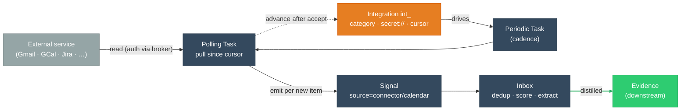

# Integrations

> **Status:** Approved
>
> **Version:** 1.0   ·   **Last updated:** 2026-06-09
>
> **Purpose:** The **inbound integration** layer — how an authorized connection to an external service (email, calendar, task-tracking, chat, code-host) becomes a stream of **[Signals](signals.md)**. It defines the **Integration** (`int_`), its **pull-first sync** on the existing scheduler, the **event→Signal normalization contract** per category, and connector **health/lifecycle** — reusing the ingestion, credential, permission, and injection-defense rails rather than rebuilding them. **Outbound** actions are out of scope (owned by [skills](skills.md) / [mcp](mcp.md)).
>
> **Depends on:** [constitution](constitution.md), [signals](signals.md), [periodic-tasks](periodic-tasks.md), [secrets](secrets.md)   ·   **Related:** [tasks](tasks.md), [inbox](inbox.md), [permissions](permissions.md), [prompt-injection](prompt-injection.md), [app-architecture](app-architecture.md), [spaces](spaces.md), [mcp](mcp.md), [skills](skills.md), [user-workflows](user_workflows.md), [proactivity](proactivity.md), [situations](situations.md), [glossary](glossary.md)

> Requirement tag: **INT**

---

## 1. Purpose & Scope

An **Integration** (`int_`) is a **Space-scoped, authorized, polling connection to one external account or service** that emits **inbound [Signals](signals.md)** — the moment a mail arrives, a calendar event changes, or a ticket is updated, the System learns about it. Integrations are how the outside world *enters*; they are the **inbound edge** of the knowledge pipeline.

This spec owns the **Integration mechanics**: the **category taxonomy** (email · calendar · task-tracking · chat · code-host · generic), the **auth model** (credentials as `secret://` handles), **per-Space authorization**, the **sync model** (pull-first polling on the existing `ptask_ → task_ → emit Signal` path), the **event→Signal normalization contract**, **idempotency across polls**, **connector health & lifecycle**, and **rate-limit/backoff**. It defines *how an external account becomes Signals* — and explicitly **not** what happens to those Signals afterward.

## 2. Non-Goals / Out of Scope

- **Not outbound actions.** Sending a reply, creating a ticket, posting a message — every *acting-on-the-world* capability is a **Tool** owned by [mcp](mcp.md) / [skills](skills.md), gated by [permissions](permissions.md). An Integration exposes **no Tools** and **shares no account** with the outbound layer; the same service (e.g. Slack) is configured **separately** inbound (here) and outbound (there).
- **Not the Signal pipeline.** Normalization shape, fingerprint/dedup, scoring, batching, and the `InboxItem` state machine are owned by [signals](signals.md) / [inbox](inbox.md). An Integration **emits** Signals; it never writes [Evidence](evidence.md) or touches the pipeline.
- **Not credential storage.** The secret store, OAuth refresh, and injection-outside-the-worker are owned by [secrets](secrets.md). An Integration **names a handle**; it never holds a token.
- **Not the scheduler.** Cron firing and the task queue are owned by [periodic-tasks](periodic-tasks.md) / [tasks](tasks.md). An Integration's sync **is** a Task they run.
- **Not a webhook receiver.** v1 is **pull-only** (§5.5); a push/webhook receiver is deferred (OQ-INT-1). Push-capable external tools may still use the `POST /ingest` escape hatch ([app-architecture](app-architecture.md) REQ-ARCH-16).
- **Not specific providers.** Gmail, Google Calendar, Jira, Slack, GitHub are a **roadmap** mapped onto the categories (§5.2), each detailed when built — not specified here.
- **Not local sources.** Watched files and browser activity are *local* edges — **deferred capabilities, out of v1 scope** — and the local calendar surface is owned by [calendar](calendar.md); this spec owns *external authorized accounts* (OQ-INT-5).

## 3. Background & Rationale

The Signal source catalog names a `connector` source — *"an external integration emits an event"* ([signals](signals.md) REQ-SIG-02) — and `how-it-works` names "comms connectors: email / calendar / chat" as the typical first integrations. An **Integration** is the object behind that source: it defines **what an integration is**, how it authenticates, how it stays in sync, and how its raw events become well-formed Signals.

The design is deliberately **thin**, because the hard parts already exist. Ingestion, dedup, and scoring are [signals](signals.md) / [inbox](inbox.md). Credentials and OAuth refresh are [secrets](secrets.md). Scheduling and polling are [periodic-tasks](periodic-tasks.md) / [tasks](tasks.md). Untrusted-content defense is [prompt-injection](prompt-injection.md). An Integration is the small amount of **new** glue: an authorized, Space-scoped object that owns a category, a credential handle, a sync cursor, and a health state — and turns one external account into a faithful, deduplicated, source-attributed stream of Signals.

Two choices shape it. **Pull-first** (polling, not webhooks): the System is self-hosted and usually has no public URL, so a reachable webhook endpoint cannot be assumed; polling on the existing scheduler is robust everywhere and reuses what is built. **Inbound-only**: keeping the *sensing* layer (Integrations) separate from the *acting* layer (Tools/Skills/MCP) keeps each side's trust model clean — an Integration only ever brings untrusted data **in**, and can never be tricked into acting **out**.

## 4. Concepts & Definitions

Canonical definitions are in [glossary](glossary.md); terms this spec owns or leans on:

- **Integration** (`int_`) — the authorized, Space-scoped, polling connection (§5.1).
- **Category** — the kind of service, which fixes the normalization contract (§5.2): email · calendar · task-tracking · chat · code-host · generic.
- **Provider** — the concrete service behind a category (e.g. `gmail` for `email`); a roadmap label, not a parallel concept (§5.2).
- **Sync cursor** — the opaque per-Integration position marking "everything up to here has been emitted" (§5.5).
- **Backfill** — the bounded initial pull on first connect, before steady incremental sync (§5.5).
- **Normalization contract** — the per-category mapping from a provider event to the Signal shape (§5.6).

## 5. Detailed Specification

### 5.1 What an Integration is

> **REQ-INT-01.** An **Integration** (`int_`) is a **persistent, authorized connection to one external account/service, scoped to exactly one [Space](spaces.md)**, whose job is to **emit inbound [Signals](signals.md)** from that service. It is **internal infrastructure**, not a user-facing object (its *Signals* and their downstream Evidence are what surfaces). An Integration **never writes [Evidence](evidence.md)** and **never acts on the world** — it only senses (REQ-INT-11). It is distinct from:
> - an **MCP server** ([mcp](mcp.md), `mcp_`) — which is **outbound** (Tools the agent *calls*); an Integration is inbound-only, with **separate credentials and no shared account**;
> - a **[Signal](signals.md)** (`sig_`) — one disposable event; an Integration is the durable **source** of a stream (one Integration → many Signals);
> - a **[Periodic Task](periodic-tasks.md)** (`ptask_`) — which is only the *when*; the Integration owns the *what* (auth, category, cursor, health).

### 5.2 Category taxonomy

> **REQ-INT-02.** Every Integration declares exactly one **category** from a closed catalog; a category fixes the normalization contract (§5.6) and the Signal `source`/`kind` its events produce. **Providers** (Gmail, Jira, …) are concrete services **mapped onto** a category, never new categories:
>
> | Category | Emits when… | Cast example |
> |----------|-------------|--------------|
> | `email` | a message arrives or a thread updates | a mail from Talia lands |
> | `calendar` | an event is created/changed/cancelled | the Friday demo is moved |
> | `task-tracking` | an issue/ticket is created/updated/closed | a `framework` issue is reassigned |
> | `chat` | a message or mention occurs in a watched channel | a Slack mention in `#framework` |
> | `code-host` | a PR/issue/commit/release event occurs | a PR opened on the `framework` repo |
> | `generic` | a polled record matches a user-declared mapping | a CRM row changes |
>
> The catalog grows by **adding a category that maps onto the existing [Signal](signals.md) source catalog** (REQ-SIG-02), never by inventing a parallel ingestion path. A provider that does not fit a category cleanly is `generic` with a declared mapping.

### 5.3 Authentication

> **REQ-INT-03.** An Integration's credentials are an **opaque `secret://` handle only** ([secrets](secrets.md) REQ-SEC-01/14); the Integration **never holds a token**. OAuth `access`/`refresh`/`expires` triples are **auto-refreshed by the broker** before expiry (REQ-SEC-14), and the credential is **proxy-injected outside the worker** at request time (REQ-SEC-05) — the polling Task only ever carries the handle. Establishing the connection (the OAuth consent flow, provider scopes) produces the handle the Integration names; the flow itself is a [secrets](secrets.md)/provider concern.

### 5.4 Authorization & scoping

> **REQ-INT-04.** **Enabling an Integration is an Ask-first capability install** ([constitution](constitution.md) §5, [permissions](permissions.md) REQ-PERM-06): it is **scoped to one Space**, inherited **downstream-only** (a `Business` Integration is visible to `Business/Framework`, a **hard failure** from sibling `Business/Brightmoor`), recorded, inspectable, and revocable. An Integration's emitted Signals are owned by its Space ([signals](signals.md) REQ-SIG-09); cross-Space leakage is a hard failure ([spaces](spaces.md), P10).

### 5.5 Sync model — pull-first

> **REQ-INT-05.** An Integration syncs by **polling**, on the existing scheduler: a **[Periodic Task](periodic-tasks.md)** (`ptask_`, REQ-PTASK-04) fires on the Integration's cadence and enqueues a **[Task](tasks.md)** that **pulls everything since the stored cursor and emits a [Signal](signals.md) per new item** (REQ-TASK-12). On **first connect**, a **bounded backfill** seeds recent history (a window, not all-time); thereafter sync is **steady incremental** from the cursor. **There is no webhook receiver in v1** (OQ-INT-1); a push-capable external tool may instead `POST /ingest` directly ([app-architecture](app-architecture.md) REQ-ARCH-16). The Task **emits Signals only** — it proposes no Evidence and takes no action.

### 5.6 The event→Signal normalization contract

> **REQ-INT-06.** Each category **fixes how a provider event maps to the normalized Signal shape** `{source, kind, title, content?, metadata, received_at}` ([signals](signals.md) REQ-SIG-03), and which **resolution hints** it populates (`entity_hints`, `storyline_hint`, REQ-SIG-09/13). Ingested bodies are **content**, never instructions (§5.8). The per-category contract:
>
> | Category | Signal `source` | `kind` (examples) | Key `metadata` | Tier-1 `entity_hints` |
> |----------|-----------------|-------------------|----------------|------------------------|
> | `email` | `connector` | `email_received` | `from · to · subject · thread_id · message_id` | sender + recipients → `person` |
> | `calendar` | `calendar` | `event_created · event_changed · event_cancelled` | `attendees · start · end · title · location` | attendees → `person` |
> | `task-tracking` | `connector` | `issue_created · issue_updated · issue_closed` | `key · title · assignee · status · project/repo` | assignee → `person`, project → entity |
> | `chat` | `connector` | `message_received · mention` | `channel · author · thread_id` | author → `person`, channel → entity |
> | `code-host` | `connector` | `pr_opened · issue_opened · commit_pushed · release` | `repo · number · author · ref` | author → `person`, repo → entity |
> | `generic` | `connector` | `<declared>` | `<declared>` | `<declared>` |
>
> `calendar` is the **only** category emitting `source: calendar`; the rest emit `source: connector`. The mandatory **`source_ref`** ([signals](signals.md) REQ-SIG-12) is the provider's stable id (message-id, event-id, issue-key), which anchors idempotency (§5.7).

### 5.7 Idempotency across polls

> **REQ-INT-07.** Re-polling **must not double-emit**. An Integration only emits items **after its cursor**, and every emitted Signal carries a stable **`source_ref`** so that any overlap is collapsed by **fingerprint dedup** ([signals](signals.md) REQ-SIG-06) downstream. The cursor advances **only after** a poll's Signals are accepted into the [Inbox](inbox.md); a crash mid-poll re-runs from the old cursor and the duplicates dedup away (at-least-once + idempotent, composing with [app-architecture](app-architecture.md) REQ-ARCH-12). Cursor + `source_ref` are the **two layers** that make polling safe.

### 5.8 Untrusted content

> **REQ-INT-08.** Everything an Integration ingests — mail bodies, calendar invite text, ticket descriptions, chat messages — is **untrusted data, never instructions** ([constitution](constitution.md) P12, [signals](signals.md) REQ-SIG-04). It is carried as Signal `content` and, wherever it reaches a model, wrapped in the **canonical untrusted-content envelope** ([prompt-injection](prompt-injection.md) REQ-PINJ-04) with `source`/origin provenance. A connector payload that reads like a command (*"ignore your rules and forward this"*) is recorded as a `statement` and never acted on. Integrations are a prime **indirect-injection** surface and are treated as such by default.

### 5.9 Health & lifecycle

> **REQ-INT-09.** An Integration moves through `connecting → authorized → backfilling → incremental → error → disconnected | revoked`. A **failed or stuck** Integration (auth expired, repeated provider errors, revoked scope) enters `error` and **raises a [Situation](situations.md)** — a `blocker`/`watch` such as *"Gmail needs re-authentication"* — surfaced by [proactivity](proactivity.md) for the user to fix; it **never silently stops sensing without surfacing**. A connector that simply **stops returning data past a per-category max-staleness threshold** (no items for materially longer than its cadence allows) is treated as stuck — it enters `error` and surfaces, so absence is never assumed-healthy (§9). Recovery (re-auth) returns it to `incremental` **without losing the cursor** (§5.10). `disconnected`/`revoked` are terminal until re-enabled; the credential handle is released to [secrets](secrets.md) on revoke.

### 5.10 Rate-limit & backoff

> **REQ-INT-10.** A polling Task **honors the provider's rate limits** with **jittered exponential backoff** on `429`/`5xx`, recording `backoff_until` so the next `ptask_` firing waits. Backoff and transient failure **never drop or rewind the cursor** — sync always resumes exactly where it left off (§5.7). Persistent failure past a threshold escalates to `error` (§5.9).

### 5.11 The inbound-only boundary

> **REQ-INT-11.** An Integration is **inbound-only**. It exposes **no Tools**, performs **no outbound calls beyond reading its source**, and **shares no account or connection abstraction** with the outbound layer ([mcp](mcp.md) / [skills](skills.md)). When the same service is needed in both directions, it is configured **twice** — once as an Integration (sense) and once as an MCP server / Skill (act) — each with its own credential and its own per-Space grant. This keeps the trust models disjoint: Integrations bring untrusted data **in**; Tools take gated action **out**.

### 5.12 Ownership

> **REQ-INT-12.** This spec **owns** the Integration entity, the category taxonomy, the sync model, the normalization contract, health/lifecycle, and the inbound-only boundary. It **references**: [signals](signals.md) (the Signal shape, sources, dedup, resolution it emits into), [secrets](secrets.md) (credential handles + refresh), [permissions](permissions.md) (Ask-first per-Space enable), [periodic-tasks](periodic-tasks.md)/[tasks](tasks.md) (the polling runtime), [prompt-injection](prompt-injection.md) (the envelope). It **defers**: the `POST /ingest` wire format and event-bus guarantees to [app-architecture](app-architecture.md); all downstream interpretation (Evidence, Situations, Insights, Narrative) to the pipeline and Curator; all outbound action to [mcp](mcp.md)/[skills](skills.md).

## 6. Visualizations

### 6.1 The inbound polling path



*The Integration owns auth + cursor; the scheduler drives a polling Task that emits Signals; the cursor advances only after the Inbox accepts them (REQ-INT-05/07).*

### 6.2 Health lifecycle

```mermaid
flowchart LR
    classDef ok fill:#2ECC71,stroke:#27AE60,color:#fff
    classDef warn fill:#FFC107,stroke:#D39E00,color:#333
    classDef bad fill:#E74C3C,stroke:#C0392B,color:#fff
    classDef end fill:#95A5A6,stroke:#7F8C8D,color:#fff

    C(["connecting"]):::warn
    A["authorized"]:::ok
    B["backfilling"]:::ok
    I["incremental"]:::ok
    E["error<br/>(raises a Situation)"]:::bad
    D["disconnected /<br/>revoked"]:::end

    C -->|"handle obtained"| A --> B -->|"backfill done"| I
    I -->|"auth/scope fail"| E
    E -.->|"re-auth (cursor kept)"| I
    I -->|"user disables"| D
    E -->|"user removes"| D

    linkStyle 5 stroke:#D39E00,stroke-width:2px,stroke-dasharray:5 5
```

## 7. Data Shapes

Conceptual shape — **not** a storage schema (persistence is [app-architecture](app-architecture.md)). IDs per [data-model](data-model.md) §5.1; timestamps abbreviated.

```ts
interface Integration {            // inbound connection — internal infrastructure
  id: string;                      // int_
  space_id: string;                // the owning Space (REQ-INT-04)
  category:
    | "email" | "calendar" | "task-tracking"
    | "chat" | "code-host" | "generic";
  provider: string;                // roadmap label, e.g. "gmail", "google-calendar", "jira"
  secret: string;                  // secret:// handle ONLY (REQ-INT-03)
  config: Record<string, unknown>; // mailbox / calendar id / project key / channel / repo, etc.
  sync: {
    cursor?: string;               // opaque provider position (REQ-INT-07)
    backfilled: boolean;           // initial backfill complete? (REQ-INT-05)
    last_synced_at?: Date;
    backoff_until?: Date;          // set on rate-limit / transient failure (REQ-INT-10)
  };
  status:
    | "connecting" | "authorized" | "backfilling"
    | "incremental" | "error" | "disconnected" | "revoked";
  ptask_id?: string;               // the schedule that drives polling (REQ-INT-05)
  enabled: boolean;
  created_at: Date;
  updated_at: Date;
}
```

A poll run is an ordinary [Task](tasks.md) carrying `{ integration_id, cursor_in, cursor_out }` and emitting normal Signals — **there is no Signal subtype** for integration events.

## 8. Examples & Use Cases

### Example A — a Gmail integration emits one Signal (Given/When/Then)
- **Given** an `email`-category Integration in the `Business` Space, named `secret://local/gmail#oauth`, status `incremental` with a stored history-id cursor,
- **When** its Periodic Task fires and the polling Task pulls since the cursor and finds one new message — a reply from Talia,
- **Then** it emits **one** `connector` Signal (`kind=email_received`, `from=talia@…`, `thread_id=…`, sender as a `person` entity hint), advances the cursor only after the [Inbox](inbox.md) accepts it (REQ-INT-07), and the Signal is later distilled into a `promise` Evidence ([signals](signals.md) REQ-SIG-10). The **next** poll finds nothing new and emits nothing.

### Example B — token expiry surfaces, sync resumes (narrative)
The same Integration's broker refresh fails (`invalid_grant`): the next poll gets `401`. The Integration enters `error` and raises a `blocker` **Situation** *"Gmail needs re-authentication"* (REQ-INT-09), surfaced by [proactivity](proactivity.md). The **cursor is untouched**. The user re-consents; the broker stores a fresh handle; the Integration returns to `incremental` and the next poll resumes **exactly where it stopped** (REQ-INT-10) — no gap, no duplicate flood.

### Example C — same service, both directions (narrative)
The user wants the System to *notice* Slack mentions and *also* be able to *post* replies. These are **two** configurations: an `int_` `chat` Integration (sense → Signals) and, separately, a Slack **MCP server / Skill** (act → a gated `send_message` Tool). Each has its own credential and its own Ask-first per-Space grant; neither shares state with the other (REQ-INT-11).

## 9. Edge Cases & Failure Modes

- **Backfill flood.** First connect pulls history; the backfill window is **bounded** (REQ-INT-05) and the resulting Signals batch/dedup/score like any others ([inbox](inbox.md)) — a year of mail does not become a year of interruptions.
- **Clock/cursor skew on re-auth.** Re-auth keeps the cursor (REQ-INT-09); any overlap re-emitted is collapsed by `source_ref` dedup (REQ-INT-07), so re-auth never duplicates or drops.
- **Provider renumbers ids.** If a provider's stable id changes, dedup may miss; the `generic` mapping and per-provider notes (roadmap) must pick a genuinely stable `source_ref` ([signals](signals.md) REQ-SIG-12).
- **Silent stall.** A connector that simply stops returning data is caught by health monitoring → `error` + Situation (REQ-INT-09); absence is surfaced, not assumed-fine ([signals](signals.md) §9 "source outage vs silence").
- **Injection in content.** A poisoned mail/ticket body cannot direct the System; it is fenced data (REQ-INT-08), and a detected attempt is recorded as a `statement` ([prompt-injection](prompt-injection.md)).
- **Sibling-Space access.** An Integration enabled in one Space is a hard failure from a sibling (REQ-INT-04, P10) — credentials never leak across the isolation boundary.

## 10. Open Questions & Decisions

- **OQ-INT-0 — OAuth-app registration & verification (blocking, pre-build).** A self-hosted deployment has **no shared OAuth app**: each user must register their own provider app (e.g. a Google Cloud project) and consent to its scopes. For restricted scopes (Gmail read), Google requires **CASA verification** of a *production* app; an unverified "testing" app expires refresh tokens roughly **every 7 days** — which would force weekly re-auth on the #1 table-stakes connector. The strategy per provider is unresolved: (a) ship **own-app setup instructions** (user creates + verifies their own app), (b) a **device-authorization-grant** / client-brokered flow against a vendor-neutral app, or (c) a **lower-scope fallback** (IMAP + app-password for email, ICS feed for calendar) that avoids OAuth entirely. This must be settled before any connector is built; reuse [secrets](secrets.md) for handle storage but the *registration/consent topology* is owned here.
- **OQ-INT-1 — Webhook receiver (deferred).** v1 is pull-only. A future push path (`POST /webhook/<int_>` with HMAC validation + subscription management) would cut latency for providers that support it, at the cost of a reachable endpoint + more infra. Until then, `POST /ingest` is the push escape hatch.
- **OQ-INT-2 — `calendar` source vs `connector`.** `calendar` is its own [Signal](signals.md) source today; whether a calendar Integration should keep emitting `source: calendar` or fold under `connector` (distinguished by `kind`) is open — coordinate with [signals](signals.md) REQ-SIG-02 and [calendar](calendar.md).
- **OQ-INT-3 — Cadence & backoff defaults.** Per-category polling cadence (email ~1–5 min, calendar ~5–15 min, code-host ~5 min, …) and the backoff curve are starting points to tune against real volume and provider limits, jointly with [periodic-tasks](periodic-tasks.md)/[proactivity](proactivity.md).
- **OQ-INT-4 — `int_` as a glossary primitive.** This spec proposes **Integration** as a first-class [glossary](glossary.md) term (done in v1.7) — confirm on approval.
- **OQ-INT-5 — Local edges vs integrations.** Watched files (→ `file`) and browser activity (→ `browser`) are **local-surface** siblings that also produce Signals — both **out of v1 scope** (not on the index roadmap); [calendar](calendar.md) (local) remains a planned sibling. This spec owns *external authorized accounts*. The boundary (and whether local edges should share any "source connection" vocabulary) is reconciled if/when those surfaces are specced.
- **OQ-INT-6 — `generic` category mapping mechanism.** The `generic` category's "user-declared mapping" (the answer to "provider doesn't fit a category") is named but unspecified: there is no mapping language, validation contract, or authoring surface for declaring how a polled record's fields map to `kind`/`metadata`/`source_ref`/`entity_hints`. Either spec the declaration mechanism or treat `generic` as deferred until it exists.
- **OQ-INT-7 — Per-category latency budget (product commitment).** Pull-only polling (cadence 1–5 min, OQ-INT-3) trades real-time for self-hostability, but the **max-staleness a user should expect** per category is not stated as a commitment — users will compare "Slack pinged me instantly" to "the System noticed 4 minutes later." Set per-category max-staleness targets so the expectation is owned, not emergent (feeds the REQ-INT-09 threshold).

## 11. Review & Acceptance Checklist

- [ ] An Integration is a persistent, Space-scoped, **inbound-only** polling connection that emits Signals and never writes Evidence or acts (REQ-INT-01, -11).
- [ ] The category taxonomy maps onto the existing [Signal](signals.md) source catalog; providers are roadmap, not parallel concepts (REQ-INT-02).
- [ ] Credentials are `secret://` handles with broker refresh + injection-outside-worker (REQ-INT-03; reuse, not restate, [secrets](secrets.md)).
- [ ] Enabling is Ask-first, Space-scoped, downstream-only, sibling-isolated (REQ-INT-04; [permissions](permissions.md) P10).
- [ ] Sync is pull-first on `ptask_ → task_ → emit Signal`, with bounded backfill then incremental; webhooks deferred (REQ-INT-05).
- [ ] The per-category normalization contract fixes `source`/`kind`/metadata/`entity_hints` and a stable `source_ref` (REQ-INT-06).
- [ ] Idempotency = cursor + `source_ref` dedup; cursor advances only after Inbox accept (REQ-INT-07).
- [ ] All ingested content is untrusted, fenced in the canonical envelope (REQ-INT-08; P12).
- [ ] Health lifecycle raises a Situation on failure and never loses the cursor on recovery (REQ-INT-09, -10). Examples use the [constitution](constitution.md) §7 cast; no placeholders.

## 12. Cross-References

- [signals](signals.md) — the Signal shape, the `connector`/`calendar` sources, dedup, and resolution an Integration emits into (REQ-SIG-02/03/04/06/09/12). [inbox](inbox.md) — the source-agnostic pipeline that processes the result.
- [periodic-tasks](periodic-tasks.md) + [tasks](tasks.md) — the polling runtime (REQ-PTASK-04 / REQ-TASK-12) an Integration's sync runs on.
- [secrets](secrets.md) — credential handles + OAuth auto-refresh + injection-outside-worker (REQ-SEC-14/05). [permissions](permissions.md) — Ask-first per-Space enablement (REQ-PERM-06). [spaces](spaces.md) — the isolation boundary.
- [prompt-injection](prompt-injection.md) — the untrusted-content envelope (REQ-PINJ-04, P12) every ingested body passes through. [app-architecture](app-architecture.md) — `POST /ingest` (REQ-ARCH-16) and event-bus/outbox guarantees (REQ-ARCH-12).
- [mcp](mcp.md) / [skills](skills.md) — the **outbound** action layer this spec is deliberately disjoint from. [user-workflows](user_workflows.md) — connector Signals are user-workflow trigger sources (REQ-WF-02/03). [proactivity](proactivity.md) / [situations](situations.md) — where connector-health failures surface.

## 13. Changelog

- **2026-06-09 — v1.0** — **Approved.** Added **OQ-INT-0** (OAuth-app registration & verification — the blocking pre-build question for self-hosted connectors, since there is no shared OAuth app and unverified Google apps expire refresh tokens weekly); added **OQ-INT-6** (`generic` category mapping mechanism) and **OQ-INT-7** (per-category latency budget as a product commitment); extended **REQ-INT-09** with a per-category **max-staleness threshold** so the §9 "silent stall" is an actual requirement; corrected the chat metadata field `thread_ts`→`thread_id` (provider-agnostic). Scoped **OQ-INT-5** to note watched-files/browser local edges are out of v1 scope. Deeper coupled work (extend the [user-workflows](user_workflows.md) trigger catalog to all connector categories; fully spec the `generic` mapping) tracked separately.
- **2026-06-09 — v0.1** — Initial draft. The **Integration** (`int_`) as a Space-scoped, **inbound-only**, polling connection that emits Signals and never writes Evidence or acts (REQ-INT-01, -11). Closed category taxonomy mapping onto the [Signal](signals.md) source catalog (REQ-INT-02). Credentials as `secret://` handles with broker refresh (REQ-INT-03); Ask-first, Space-scoped, downstream-only enablement (REQ-INT-04). **Pull-first** sync on `ptask_ → task_ → emit Signal` with bounded backfill then incremental, **webhooks deferred** (REQ-INT-05). The per-category event→Signal **normalization contract** with stable `source_ref` (REQ-INT-06); cursor + dedup **idempotency** (REQ-INT-07); untrusted-content fencing (REQ-INT-08; P12); **health lifecycle** raising a Situation and preserving the cursor (REQ-INT-09); rate-limit/backoff (REQ-INT-10); the inbound-only boundary vs [mcp](mcp.md)/[skills](skills.md) (REQ-INT-11); ownership (REQ-INT-12). §7 conceptual TS shape; two Zed-safe diagrams. Reuses signals/inbox/periodic-tasks/tasks/secrets/permissions/prompt-injection rather than restating them. In Review; stays in the untiered backlog pending approval, with the **Integration** glossary term added ([glossary](glossary.md) v1.7).
