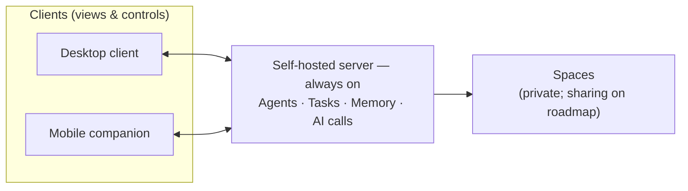
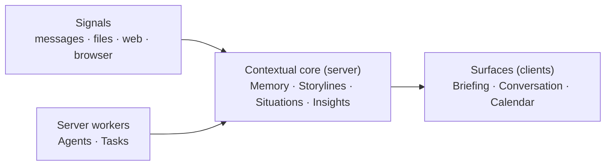

# Overview

> **Status:** Approved
>
> **Version:** 1.3   ·   **Last updated:** 2026-06-10
>
> **Purpose:** The product north-star — what the System is, who it's for, what it deliberately is *not*, the goals, the headline use cases, and what success feels like. The no-tech vision every other spec deepens.
>
> **Depends on:** [constitution](constitution.md)   ·   **Related:** [glossary](glossary.md), [spaces](spaces.md), [how-it-works](how-it-works.md)

> Requirement tag: **OVR**

---

## 1. Purpose & Scope

This spec defines the **product**, not its mechanics: the vision, audience, goals, positioning, and success criteria. Where it states a product-level requirement (self-hosted, client-server), that requirement binds the suite; *how* each is realized lives downstream. Collaboration by **sharing a Space** is a **roadmap (post-v1) capability** the architecture is designed to support, not a v1-binding feature.

It covers: vision · audience · goals · non-goals · how it's deployed (at a product level) · headline use cases · product philosophy · what success feels like · onboarding at a glance.

It does **not** cover: domain definitions ([glossary](glossary.md)), how the System operates ([how-it-works](how-it-works.md)), or any implementation ([app-architecture](app-architecture.md), [stack](stack.md)).

## 2. Non-Goals

- **REQ-OVR-01 — No vendor cloud / not multi-tenant SaaS.** The System is **self-hosted**: it runs on a server the user controls, and there is no provider holding their data. One deployment serves one user-or-group, not many tenants.
- **REQ-OVR-02 — No roles / orgs / teams / RBAC / SSO.** There is deliberately no permission-role system, no org/team objects — everything is a Space + inheritance ([constitution](constitution.md) P11). When collaboration arrives (roadmap, post-v1), it is modeled as **sharing a Space with a person** — never as roles or org structures. **Sharing itself is deferred** (out of v1 scope; see [spaces](spaces.md), [how-it-works](how-it-works.md) §2).
- **Not a general coding assistant.** It can *work with* code/repos as context, but it is not an IDE copilot.
- **Multi-device is via multiple clients to one server**, not peer-to-peer sync between devices. (A manual export/import for backup/migration is a possible future addition — see §10.)

## 3. Background & Rationale

A working person's context is scattered across chat logs, files, browser tabs, notes, dashboards, and their own memory. Tools capture **events** — messages, commits, notifications, tasks — but events are not understanding. People are left to reassemble "where does this stand?", "what's blocking me?", and "what changed since I last looked?" by hand, repeatedly, across every project and every part of life.

Meanwhile, LLMs made conversational assistance cheap — but most products stopped at *chat-with-tools*: reactive, forgetful between sessions, and silent the moment you close the window. They don't *maintain* anything.

The opportunity: treat **ongoing context as the product**. Continuously observe the sources you point it at — turning their changes into **Signals** — distill those into durable understanding, surface only what matters, and keep working while you're away.

**Why this requires a server.** "Keeps thinking while you're away" is impossible on a client alone — a desktop or phone can't run background work when the machine is off or asleep. So the System is **client-server**: an **always-on, self-hosted server** is the brain (it runs the Periodic Tasks, Agents, Signal ingestion, and Memory distillation, plus the AI calls, 24/7), and **clients are views and controls** that connect when available. The server keeps working whether or not anyone's looking.

## 4. Concepts & Definitions

This spec uses domain terms (Space, Storyline, Situation, Signal, Evidence, Insight, Narrative, Memory, Digest, sharing) at an intuitive level. Canonical definitions live in [glossary](glossary.md); the example world (you, the `Framework` product, Brightmoor, Talia, Sam, …) is fixed in [constitution](constitution.md) §7.

## 5. Detailed Specification

### 5.1 Vision

> **The System is a self-hosted operational intelligence that maintains continuous contextual awareness across your work, research, and life — and keeps thinking while you're away.** It models work as living *Situations and Storylines*, not feeds of events; it surfaces what changed, what matters, and what's blocked; and it acts on your behalf under explicit, approval-gated control. Its Space model is **designed so that any Space can later be shared with anyone** — so the same system can grow to serve one person or many (sharing is a deferred, post-v1 capability). It should feel like a sharp **chief-of-staff + research assistant + operations dashboard** — alive, aware, proactive — without ever being creepy, spammy, or fake.

### 5.2 What it is / What it is not

| It looks like… | …but it actually is | Why the difference matters |
|---|---|---|
| A chatbot with tools | An always-on context engine running on a server, without you in the loop | **REQ-OVR-03** — value persists between sessions and survives closing every client |
| A notes app (Notion/Obsidian) | A system that *generates and maintains* its own knowledge from the Signals it ingests | You don't hand-file everything; it distills and connects automatically |
| A task manager (Todoist/Linear) | A model of *situations & momentum*, where tasks are one signal among many | It tracks "the investor reply is overdue," not just a checkbox |
| A dashboard / analytics | An *operational briefing* — what to pay attention to | It answers "what matters now?", not "here are 40 charts" |
| A team/enterprise SaaS (roles, orgs, admin) | A self-hosted system whose collaboration model is just *sharing a Space* (a roadmap capability) | No roles/permissions matrices — you own the deployment, and collaboration (when it lands) is by space, not role |

### 5.3 Who it's for

Anyone who has to hold many moving contexts together — projects, clients, research, life admin — and (on the roadmap) the people they share that work with. v1 is **standalone**, and the Space model is designed so it can later be **shared**: one person now, several people sharing Spaces once sharing ships, with no assumption about size or "solo." It rewards technical users (repo/folder mounts, browser automation) but doesn't require them. There is **no "personal vs business" tier** — it's the same Spaces model either way, and the future sharing path is identical whether you'd share `Family` with a partner or a whole `Company` space with colleagues.

### 5.4 How it's deployed (at a product level)

- **One self-hosted server**, deployed anywhere the user controls. It is the always-on brain.
- **Desktop and mobile clients** connect to it. The **mobile client is a companion** — notifications, approving/denying permission requests on the go, quick capture, and viewing briefings/situations — which fits naturally because the *server* does the heavy, long-running work.
- Mechanics (deployment, sync, offline) live in [app-architecture](app-architecture.md) / [stack](stack.md).

### 5.5 Goals

- **G1 — Maintain awareness.** Continuously turn raw Signals into durable, queryable understanding across all contexts.
- **G2 — Surface signal, suppress noise.** Tell the user what changed, what matters, what's blocked — and stay silent otherwise (P4).
- **G3 — Keep working while away.** Run research, monitoring, and automation autonomously on the always-on server, within approved bounds ([constitution](constitution.md) §5).
- **G4 — Be trustworthy.** Self-hosted, evidence-first, approval-gated, fully auditable, injection-resistant (P1, P3, P8, P9, P12).
- **G5 — Feel alive through continuity, not theater.** Earn the sense of an aware partner via Memory, timing, and judgment — never fake emotion (P7).
- **G6 — Collaborate by sharing (roadmap).** A post-v1 goal: let people work in the same context by sharing Spaces with anyone — no roles, no setup ceremony (P11, [spaces](spaces.md)). The Space primitive is designed for this now; the capability itself is deferred beyond v1.

### 5.6 Headline use cases

1. **Project & work continuity.** Across `Framework`, `Brightmoor`, and research Spaces, the System keeps Storylines and Situations current — "the *Framework UI direction* has looped four times with no RFC," "the Brightmoor portal is blocked on Devin's sign-off."
2. **Autonomous research.** You point it at a question (e.g. consensus approaches with Dr. Belov); it keeps searching, reading, and synthesizing on the server, returning evidence-backed findings rather than a one-shot answer.
3. **Browser automation.** In isolated profiles it logs in, fills forms, extracts data, and watches pages — e.g. detecting that the *Stripe automation is blocked by an expired login* and flagging it.
4. **Watching & Digests.** A periodic task watches a competitor's release notes, the `framework`'s key npm dependency, Northwind Cloud's pricing, and flight prices for the family trip — rolling only meaningful changes into a morning briefing and a weekly Digest.
5. **Sharing a context (roadmap).** A post-v1 capability the Space model is built for: share the `Brightmoor` space with Devin, or `Family` with Sam — it appears in their menu and they extend it. The same mechanism would cover a client, a contractor, or a partner. *(Deferred — not in v1; see [how-it-works](how-it-works.md) §2, [spaces](spaces.md).)*

### 5.7 Product philosophy

The System is **narrative-driven, not event-driven** (P2): it models stories and operational states, not logs. Its "personality" is **continuity, timing, and judgment** (P7) — it notices recurring patterns, references prior context, continues investigations, challenges weak ideas, and surfaces contradictions, always **evidence-first** (P3) and never psychoanalyzing (P5). It is **proactive but quiet** (P4): silence is the default. And it is **trustworthy by construction** — self-hosted, least-privilege, space/person-isolated, approval-gated, auditable, and resistant to prompt injection (P1, P6, P8–P12). These are the constitution's binding principles applied to the product.

### 5.8 What success feels like

- You open any client and, in three sentences, know exactly where everything stands.
- You feel it **kept thinking while you were away** — research advanced, a price dropped, a doc changed, a promise came due — and it tells you only the parts worth knowing.
- It **catches what you'd miss**: a looping decision, an overdue reply, a blocked automation, a contradiction between two notes.
- You **trust it with autonomy** because every consequential action is gated and every past action is inspectable.
- **(Roadmap) Sharing just works**: once sharing ships, a space you share shows up for the other person and they can build on it — no roles to configure.
- It never makes you feel **watched, nagged, or managed**. When it's quiet, that's correct.

**REQ-OVR-04 — measurable proxies for success.** The bullets above are qualitative; these are the observable signals that they're being met (targets/thresholds owned by [proactivity](proactivity.md) and the client surfaces):

- **Dismiss ratio on proactive surfacings** — the share of Attention-Needed items and pushes the user dismisses without acting. A low, stable ratio means the relevance/urgency bar is calibrated (P4); a rising one is the early warning of nagging.
- **Evidence-backed briefing rate** — the % of briefing claims that carry a valid, resolvable Evidence link. Targets ~100%; any unbacked claim is a P3 violation, so this is the headline trust metric.
- **False-interrupt rate** — the share of *interrupting* surfacings (push / new thread) that the user later judges didn't warrant interruption. Distinct from dismiss ratio: this measures the urgent subset specifically.
- **Time-to-first-value** — elapsed time from install to the first briefing the user rates as worth reading (the cold-start "magic moment"; see [roadmap](roadmap.md) §5.4). Shorter is better; it is the cold-start arc's success measure.
- **Quiet-day correctness** — on days with no meaningful change, the share where the System stayed silent / said "nothing needs you" rather than manufacturing activity (P4; §5.8 "When it's quiet, that's correct").

### 5.9 Onboarding at a glance

First use is about **establishing scope, not configuration**: stand up the server (self-host it wherever you like), connect a desktop or mobile client, create your first Spaces, optionally mount a folder, connect a browser profile — and state a few things you care about. (Sharing a Space with someone is a roadmap addition, not part of v1 onboarding.) From there the server begins observing and briefing. The principle is **incremental, visible reach** (P6): nothing is assumed. Full flows live in [spaces](spaces.md) and the client surfaces (out of scope here). Because the product's value accrues from *accumulated* Evidence, a fresh install is an empty room on day 1; the **first-two-weeks arc** — what the user sees and why they stay until the first real briefing — is owned by [roadmap](roadmap.md) §5.4.

## 6. Visualizations

### 6.1 The System at a glance

### 6.2 A morning, on a timeline

| Time | What the server did while away | What a client surfaces |
|------|--------------------------------|------------------------|
| overnight | npm dep for `framework` shipped a major; competitor posted release notes | "Two release changes touch your roadmap — 1 may be a breaking upgrade." |
| overnight | Stripe automation run hit an expired login | Attention-Needed: "Stripe automation blocked — reconnect login to resume." |
| 06:00 | research agent advanced the consensus question | "3 new sources on consensus; one contradicts Dr. Belov's assumption." |
| 07:10 | a permission request was parked (outbound email to Devin) | Push to your phone: "Approve sending the cost-impact note to Devin?" |
| 08:30 | you open a client | A 3-sentence briefing + the items above, nothing else. |

## 7. Data Shapes

*(Not applicable — overview defines no data. See [data-model](data-model.md).)*

## 8. Examples & Use Cases

### Example A — "Re-entering a looping decision" (narrative)
You haven't touched the `Framework` Space in two weeks. You open a client. The System: *"The Framework UI direction is looping again — you've revisited the component approach four times since March, each time without writing the RFC you said you'd write. Three notes contradict each other on routing. Want me to draft the RFC skeleton from those notes?"* This is P2 (narrative), P3 (evidence), and P7 (continuity, gentle challenge) at once.

### Example B — "Autonomy with a guardrail" (Given/When/Then)
- **Given** a periodic task watching Northwind Cloud's pricing page, no standing grant to act on changes, and your desktop is **closed**.
- **When** the page changes overnight and the server's follow-up would *email Devin to flag the cost impact*.
- **Then** the server does the Always parts autonomously (detect, summarize, attach Evidence to the *Operations* Storyline) but **parks** the outbound email as an Ask-first request and **pushes it to your phone** — you approve from the mobile companion, and the server resumes. (Per [constitution](constitution.md) §5.2.)

### Example C — "Quiet is correct" (Given/When/Then)
- **Given** a normal day with no meaningful changes across any Space.
- **When** the user opens a client.
- **Then** the briefing says so plainly ("Nothing needs you this morning; consensus research is continuing") rather than manufacturing activity (P4).

### Example D — "Sharing a Space" (roadmap; Given/When/Then)
*This illustrates the post-v1 sharing capability the Space model is designed for. Sharing is **deferred** — not part of v1 (see [how-it-works](how-it-works.md) §2, [spaces](spaces.md)).*
- **Given** you own the `Brightmoor` space and want Devin involved.
- **When** you share `Brightmoor` with Devin (once sharing ships).
- **Then** it appears in **Devin's** menu; he can open and **extend** it (add child Spaces, Evidence), and you both work the same context — while your private ancestor spaces (`Personal`, `Finance`) remain invisible to him (downstream-only, P10). No roles were configured.

## 9. Edge Cases & Failure Modes

- **Nothing to say.** The System reports "no change worth your attention" rather than padding briefings.
- **All clients offline.** The server keeps working and queues briefings, results, and **parked approvals**; they appear when a client reconnects (push where possible).
- **Over-reach temptation.** If a use case seems to need broad machine access or unattended outbound action, narrow scope or add an approval — don't loosen P6/P8.
- **Shared-space privacy (roadmap invariant).** When sharing ships, it must never expose the owner's private ancestor spaces (P10); if a future feature can't honor that, it's wrong.

## 10. Open Questions & Decisions

- **OQ-1 — Product name.** Deferred; no suitable domain is free. Specs use "the System" ([constitution](constitution.md) §1).
- **OQ-2 — Export/import.** Peer sync is a non-goal, but a manual export/import for backup/migration is likely desirable. Deferred ([privacy-security](privacy-security.md) / [app-architecture](app-architecture.md)).
- **OQ-3 — Mobile parity.** Companion-first is decided; whether mobile later grows toward parity is open.
- **OQ-4 — Onboarding depth.** How far to simplify for non-technical users without diluting the power-user core. Revisit with the client surface (out of scope here).
- **OQ-5 — Monetization / sustainability.** The suite states no revenue model, yet every shipping competitor has one ([comparison](comparison.md) §2). Self-hosted/user-owned (P1) rules out a data-holding SaaS, but not sustainability: options include a **paid binary / one-time license**, **paid support & updates**, a **hosted-for-clients** managed deployment (run-it-for-you, still single-tenant), or pure donation/OSS. Undecided; the choice shapes positioning and the cold-start funnel ([roadmap](roadmap.md)). Deferred.
- **OQ-6 — Push transport vs. no-vendor-cloud.** Native mobile push (the urgent subset, [how-it-works](how-it-works.md) §5.16) realistically needs a **relay** — APNs/FCM, or a self-run/third-party push gateway — which tensions with P1's *no mandatory vendor cloud*. The transport decision (optional opt-in relay? self-hosted gateway? degrade to poll-only?) is deferred to [app-architecture](app-architecture.md) / [proactivity](proactivity.md); noted here as an open product-level tension.

## 11. Review & Acceptance Checklist

- [ ] The vision (§5.1) states the product in one quotable paragraph, not solo-bound.
- [ ] "What it is / is not" distinguishes the System from chatbot, notes app, task manager, dashboard, and team SaaS.
- [ ] Audience (§5.3) makes no solo/one-person assumption and states standalone-or-shared with no personal/business tier.
- [ ] Goals (G1–G6) and non-goals (no vendor cloud, no roles/orgs, not a coding assistant) are explicit.
- [ ] The client-server / always-on-server rationale is stated (why a client alone can't deliver "keeps thinking while away").
- [ ] All five hero use cases are present and grounded in the cast (sharing shown as a roadmap/post-v1 capability, not a v1 feature).
- [ ] Philosophy ties back to the constitution's principles (P1–P12).
- [ ] At least two end-to-end examples, with behavioral ones in Given/When/Then, incl. a sharing example marked as roadmap/deferred.
- [ ] No tech detail leaks in (no Go/Wails specifics); no placeholders/TODOs.

## 12. Cross-References

- [constitution](constitution.md) — the principles (P1–P12) and example cast this spec applies.
- [spaces](spaces.md) — the hierarchy and sharing behind the multi-context and collaboration use cases.
- [glossary](glossary.md) — definitions used loosely here.
- [how-it-works](how-it-works.md) — the operating loop that realizes this vision.
- [narrative](narrative.md) — the briefing content in §5.8/§6.2; its rendering is a client surface (out of scope here).

## 13. Changelog

- **2026-05-29 — v0.1** — Initial draft: vision, anti-positioning, audience, goals/non-goals, four hero use cases, philosophy, success, onboarding, concept map + timeline + three examples.
- **2026-05-29 — v0.2** — Reframed to the settled architecture: client-server / self-hosted always-on server (with rationale), desktop + mobile companion clients, share-with-anyone (no roles/orgs/tiers), prompt-injection resilience (P12). Removed solo/one-person framing and the no-mobile/no-multi-device/no-team non-goals; added G6 (collaborate by sharing), use case #5, Example D (sharing), and a deployment diagram.
- **2026-05-29 — v1.0** — Terminology pass (Signals, canonical capitalization); approved.
- **2026-05-29 — v1.1** — Removed **Monitor** (folded into Periodic Task), **Note**, and **Bookmark**: reworked use case #4 (Monitoring → Watching), the deployment/at-a-glance diagrams, the Signals sources, the term list, and the sharing example accordingly.
- **2026-06-10 — v1.3** — Added **REQ-OVR-04** (§5.8) with five **measurable success proxies** — dismiss ratio, Evidence-backed briefing rate, false-interrupt rate, time-to-first-value, quiet-day correctness. Added a one-line pointer from §5.9 onboarding to the new [roadmap](roadmap.md) §5.4 first-two-weeks / cold-start arc. Added two Open Questions: **OQ-5** monetization/sustainability — paid binary vs support vs hosted-for-clients — and **OQ-6** native push needing a relay (APNs/FCM) in tension with P1 no-vendor-cloud, transport deferred to app-architecture/proactivity. No vision/principle change.
- **2026-06-10 — v1.2** — Reframed **sharing as a deferred, post-v1 roadmap capability** (not a v1-binding feature), conforming to the deferred-sharing decision and [how-it-works](how-it-works.md)/[spaces](spaces.md). Updated §1 scope, REQ-OVR-02, the vision (§5.1), the anti-positioning table, audience (§5.3), the deployment diagram, G6, hero use case #5, success bullet (§5.8), onboarding (§5.9), Example D, the shared-space edge case, and the acceptance checklist; the Space primitive is still described as designed to support sharing later.
