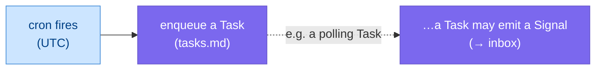

# Periodic Tasks

> **Status:** Approved
>
> **Version:** 1.1   ·   **Last updated:** 2026-06-10
>
> **Purpose:** Recurring/scheduled work — `ptask_`: a **cron schedule that enqueues a [Task](tasks.md)**. Nothing more (it may mark an obviously-atomic template for the **cheap execution path**).
>
> **Depends on:** [constitution](constitution.md), [data-model](data-model.md), [glossary](glossary.md), [tasks](tasks.md)   ·   **Related:** [signals](signals.md), [inbox](inbox.md), [curator](curator.md), [memory](memory.md), [app-architecture](app-architecture.md), [token-cost-management](token-cost-management.md)

> Requirement tag: **PTASK**

---

## 1. Purpose & Scope

A **Periodic Task** (`ptask_`) is **a cron schedule that enqueues a [Task](tasks.md)**. When the schedule fires, the System enqueues the configured Task into the task queue — that is the entire mechanism. There is **no watcher concept** and **no run lifecycle**: a "watcher" is simply a regular Task that polls a source and **emits a [Signal](signals.md)** ([tasks](tasks.md) REQ-TASK-12), scheduled by being a Periodic Task.

This spec owns only the **schedule** and the **enqueue**. The Task that gets enqueued — its planning, execution, and everything else — is [tasks](tasks.md). The scheduler runtime is [app-architecture](app-architecture.md).

## 2. Non-Goals / Out of Scope

- **Not the Task.** What the enqueued Task does (plan/route/execute/review/approval) is [tasks](tasks.md).
- **Not the scheduler runtime.** The cron engine and persistence are [app-architecture](app-architecture.md).
- **Not Signal mechanics.** What a Signal is and how it's processed is [signals](signals.md) / [inbox](inbox.md).
- **Deliberately absent:** a watcher type, a per-run state machine, catch-up of missed runs, overlap locks, retries. None of it — a Periodic Task just enqueues a Task on schedule.

## 3. Background & Rationale

Scheduling should be the thinnest possible thing: *"at this cadence, enqueue this Task."* Everything that used to look like watcher/run machinery is already handled elsewhere — a Task can **emit a Signal** (so polling/watching is just a scheduled Task), and the Task's own lifecycle (tasks.md) covers execution. So a Periodic Task carries no state beyond its schedule and what it last enqueued.

## 4. Concepts & Definitions

- **Periodic Task** — a schedule (`ptask_`) that enqueues a [Task](tasks.md) when it fires.
- **Task template** — the goal (and optional assigned role) of the Task to enqueue.

## 5. Detailed Specification

### 5.1 What a Periodic Task is

> **REQ-PTASK-01.** A Periodic Task (`ptask_`) is a **cron schedule** in one Space ([data-model](data-model.md) REQ-DM-02) that, when it fires, **enqueues a [Task](tasks.md)** into the task queue. It holds no run lifecycle of its own.

### 5.2 Schedule

> **REQ-PTASK-02.** A Periodic Task carries a **cron expression** interpreted in **UTC**, and exposes its **`next_run_at`**.

### 5.3 The enqueue

> **REQ-PTASK-03.** When the schedule fires, the System **enqueues the configured Task** (a `task_template`: a goal, optionally an `assigned_role`) into the queue ([tasks](tasks.md)). The Periodic Task's job ends there — the enqueued Task takes over with its own lifecycle. The Periodic Task records `last_enqueued_at`.

### 5.4 Watching is just a Task that emits a Signal

> **REQ-PTASK-04.** There is **no watcher primitive**. To "watch" a source, schedule a Periodic Task that enqueues a Task whose goal is to **poll the source and emit a [Signal](signals.md) on a meaningful change** ([tasks](tasks.md) REQ-TASK-12). The Signal flows into the [Inbox](inbox.md) like any other.

### 5.5 Cheap path for atomic template tasks

> **REQ-PTASK-06.** A high-frequency Periodic Task whose template is **obviously atomic** (a single, well-understood action — e.g. a poll-and-maybe-emit-a-Signal per REQ-PTASK-04) must not pay the **full** plan → route → execute → review pipeline on **every** fire — that is cost without value at cadence. The `task_template` may declare the enqueued Task **atomic** (`atomic: true`), which marks it for the Task's **cheap execution path**: it is run **directly as a single leaf** — **no decomposition** (the planner's "atomic ⇒ no children", [tasks](tasks.md) REQ-TASK-04) and **no reviewer call** unless it is risk-bearing ([tasks](tasks.md) REQ-TASK-08's risk-based rule — a pure poll/read-only fire skips review). This is a **hint** the enqueued Task honors, not a separate execution model; if the goal turns out non-atomic, the normal pipeline still applies. Per-Task budgets ([tasks](tasks.md) REQ-TASK-16) and token/cost accounting ([token-cost-management](token-cost-management.md)) bound the spend either way.

### 5.6 Lifecycle

> **REQ-PTASK-05.** A Periodic Task is **`enabled / paused / disabled`**. A `paused`/`disabled` schedule does not fire. There is no missed-run catch-up and no overlap handling — if the System was off when a schedule was due, it simply fires at its next scheduled time.

## 6. Visualizations



## 7. Data Shapes

Conceptual — not a storage schema ([app-architecture](app-architecture.md)).

```ts
interface PeriodicTask {
  id: string;                 // ptask_
  space_id: string;
  title: string;
  schedule: string;           // cron expression (UTC)
  task_template: {            // the Task to enqueue on each fire
    goal: string;
    assigned_role?: string;
    atomic?: boolean;         // cheap-path hint (REQ-PTASK-06): run as a single leaf, skip planning; review only if risk-bearing
  };
  status: "enabled" | "paused" | "disabled";
  last_enqueued_at?: Date;
  next_run_at?: Date;
  created_at: Date;
}
```

## 8. Examples & Use Cases

### Example A — a scheduled briefing-prep (narrative)
A Periodic Task fires nightly (UTC) and **enqueues a Task** *"distill today's Memory"* (REQ-PTASK-03); the enqueued Task runs through the normal task pipeline. The Periodic Task itself just fired and recorded `last_enqueued_at`.

### Example B — watching a page (narrative)
To watch Northwind's pricing, a Periodic Task fires each morning and enqueues a Task *"poll Northwind's pricing page; if it changed, emit a Signal."* On a change the Task **emits a [Signal](signals.md)** into the [Inbox](inbox.md) (REQ-PTASK-04, [tasks](tasks.md) REQ-TASK-12) — no watcher primitive involved.

## 9. Edge Cases & Failure Modes

- **Downtime.** Missed fires are not replayed; the schedule resumes at its next time (REQ-PTASK-05).
- **Overlap.** If the previously enqueued Task is still running when the schedule fires again, that's the **Task's** concern (tasks.md), not the schedule's — the schedule just enqueues again.
- **Paused.** A `paused` Periodic Task does not fire until re-enabled.

## 10. Open Questions & Decisions

- **OQ-PTASK-1** — The cron **runtime** (a SQLite schedule table + poller, or a small cron library) — owned by [app-architecture](app-architecture.md).
- **OQ-PTASK-2** — Whether a Periodic Task should dedupe (skip enqueuing if its last Task is still pending). Default: no — it just enqueues.

## 11. Review & Acceptance Checklist

- [ ] A Periodic Task is **a cron schedule that enqueues a Task** — nothing more (REQ-PTASK-01/02/03).
- [ ] **No watcher primitive** — watching is a Task that emits a Signal (REQ-PTASK-04).
- [ ] Lifecycle is `enabled/paused/disabled`; **no runs, no catch-up, no overlap locks** (REQ-PTASK-05). Examples use the [constitution](constitution.md) §7 cast; no placeholders; no machinery.
- [ ] An obviously-atomic template may take the **cheap path** (`atomic` hint): run as a single leaf, skip planning, review only if risk-bearing (REQ-PTASK-06, → [tasks](tasks.md) REQ-TASK-04/08).

## 12. Cross-References

- [tasks](tasks.md) — the Task a Periodic Task enqueues; a Task's ability to emit a Signal (REQ-TASK-12); the cheap-path's no-planning/risk-based-review behavior (REQ-TASK-04/08) and per-Task budget (REQ-TASK-16).
- [signals](signals.md) / [inbox](inbox.md) — where an emitted Signal goes.
- [curator](curator.md) / [memory](memory.md) — common scheduled work (cleanup, distillation) enqueued as Tasks.
- [app-architecture](app-architecture.md) — the cron runtime. [token-cost-management](token-cost-management.md) — the spend the cheap path reduces.

## 13. Changelog

- **2026-06-04 — v0.1** — Initial draft (Periodic Task + watcher + runs).
- **2026-06-04 — v0.2** — **Gutted to the minimal model:** a Periodic Task is just **a cron schedule that enqueues a [Task](tasks.md)** (REQ-PTASK-01/03). **Removed the watcher primitive** — watching is a Task that emits a Signal (REQ-PTASK-04, [tasks](tasks.md) REQ-TASK-12) — and **removed runs / catch-up / overlap** machinery (REQ-PTASK-05).
- **2026-06-04 — v1.0** — Approved.
- **2026-06-10 — v1.1** — **(stays Approved.)** Added **REQ-PTASK-06 (§5.5)**: a Periodic Task firing at cadence must not pay the full plan→route→execute→review pipeline on an **obviously-atomic** template. The `task_template` may declare `atomic: true` (new field in the §7 shape), a hint that the enqueued Task runs **directly as a single leaf** — no decomposition ([tasks](tasks.md) REQ-TASK-04) and no reviewer call unless risk-bearing ([tasks](tasks.md) REQ-TASK-08), bounded either way by the per-Task budget ([tasks](tasks.md) REQ-TASK-16). Renumbered Lifecycle to §5.6 (REQ-PTASK-05 unchanged); added [token-cost-management](token-cost-management.md) to Related/cross-refs; updated the §11 checklist.
