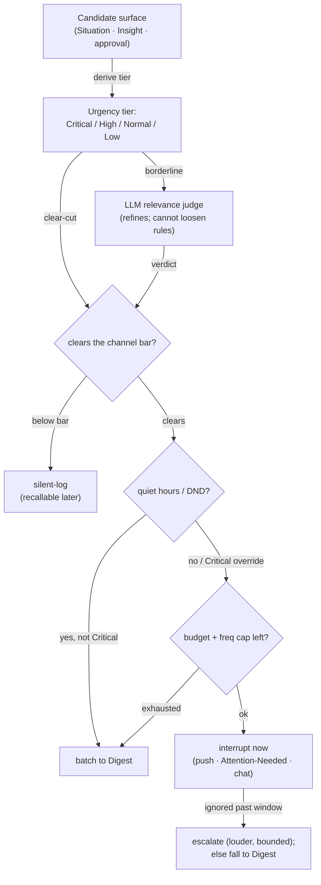

# Proactivity

> **Status:** Approved
>
> **Version:** 1.0   ·   **Last updated:** 2026-06-08
>
> **Purpose:** When and how the System **initiates contact** — the relevance/urgency bar, urgency tiers, channels, quiet hours, anti-spam, and escalation — so that liberal capture never becomes notification spam (P4).
>
> **Depends on:** [constitution](constitution.md), [situations](situations.md), [insights](insights.md), [glossary](glossary.md)   ·   **Related:** [conversation](conversation.md), [tasks](tasks.md), [curator](curator.md), [data-model](data-model.md), [ai-models](ai-models.md), [activity-log](activity-log.md)

> Requirement tag: **PROACT**

---

## 1. Purpose & Scope

This spec defines **proactivity**: the policy layer that decides **whether, when, and how** the System initiates contact with the user. The System captures liberally — Signals become Evidence, Insights, and Situations — but principle **P4** ([constitution](constitution.md) line 39) makes **silence the default**. Proactivity is the gate between *what the System knows* and *what it tells you, now*.

It owns: the **relevance/urgency bar**, **urgency tiers**, the **interrupt-now / batch-to-Digest / silent-log** decision, **per-channel thresholds**, **quiet hours**, **anti-spam** (a notification budget, frequency caps, dedup, dismiss-ratio suppression), **escalation**, the **user controls and feedback loop**, the **delivery record** (`notif_`), and a **surfacing-relevance LLM judge** for borderline cases.

It does **not** detect what is important (that is [situations](situations.md) / [insights](insights.md)) nor render the surfaces (those are [conversation](conversation.md) and the client surface, out of scope here); it decides what crosses the bar to reach them.

## 2. Non-Goals / Out of Scope

- **Detecting importance** — the Situation **Attention score** ([situations](situations.md) REQ-SIT-06) and Insight capture ([insights](insights.md)) are inputs, not redefined here.
- **Rendering the surfaces** — rendering the **Attention-Needed** list and the **Digest** is owned by the client (out of scope here); chat rendering by [conversation](conversation.md). Proactivity decides eligibility and timing; it owns the *policy*, not the *view*.
- **The Ask-first approval mechanics** — owned by [constitution](constitution.md) §5.2 / [tasks](tasks.md) REQ-TASK-07; proactivity decides how loudly to surface a parked approval.
- **Where preferences are stored** — quiet-hours windows and per-category settings are stored as standing preferences (client config surface, out of scope here); proactivity defines their semantics.
- **The Curator keep/drop decision** — [curator](curator.md) REQ-CUR-07 decides what is *kept*; proactivity decides what is *surfaced*.

## 3. Background & Rationale

A System that watches your work, research, and life produces a constant stream of candidate things-to-say. Naively surfacing them would make it a firehose — and the research on proactive assistants is blunt about the cost: users tolerate only a handful of unsolicited notifications a day, a single ill-timed interruption can triple error rates during focused work, and once an assistant "cries wolf" its alerts get muted wholesale (after which most users abandon it). The scarce resource is **user attention**, and proactivity is its budget-keeper.

The design principle is therefore **deterministic restraint with a thin layer of judgment**: a candidate is mapped to an **urgency tier** from signals the System already computes, then run through a **deterministic bar** (channel threshold × quiet hours × budget) that decides interrupt / batch / log. Clear-cut cases never call a model. Only **borderline** cases consult a cheap **LLM relevance judge**, which can *refine* but never loosen the hard rules (Critical override, quiet hours, budget). Everything surfaced says **why** (P3) and is recorded (`notif_`), so the System can dedup repeats, escalate the genuinely urgent, and **learn from what you dismiss** — turning the volume down on categories you ignore.

## 4. Concepts & Definitions

- **Candidate** — a thing the System *could* surface: a [Situation](situations.md), a surfaceable [Insight](insights.md), or a parked **approval** ([tasks](tasks.md) REQ-TASK-07).
- **Urgency tier** — `Critical · High · Normal · Low`; derived, not user-set.
- **Relevance/urgency bar** — the per-channel, per-moment threshold a candidate must clear to surface (P4).
- **Disposition** — the outcome: **interrupt-now**, **batch-to-Digest**, or **silent-log**.
- **Channel** — a delivery path: **chat injection · Home → Attention-Needed · native push · Digest**.
- **Quiet hours** — user-defined windows when non-Critical surfaces are held.
- **Notification budget** — a cap on interruptive surfaces per period (anti-spam).
- **Delivery record** (`notif_`) — one row per proactive surface: channel, urgency, source, timestamp, and outcome (delivered / dismissed / acted / snoozed).

## 5. Detailed Specification

### 5.1 Silence is the default; the relevance/urgency bar

> **REQ-PROACT-01.** Nothing is proactively surfaced unless it clears a **relevance/urgency bar** for the **channel** and the **moment** (P4, [constitution](constitution.md) line 39). Liberal capture ([insights](insights.md) REQ-INS-12, [data-model](data-model.md) REQ-DM-13) MUST NOT become liberal surfacing: high capture volume with quiet output is the **correct** behavior. A candidate that clears no bar is **silent-logged** — recorded and recallable later, never pushed.

### 5.2 Urgency tiers are derived, not set

> **REQ-PROACT-02.** Every candidate is assigned an **urgency tier** — `Critical · High · Normal · Low` — **derived** from signals the System already computes: a [Situation](situations.md)'s **Attention score** + category (REQ-SIT-06), an [Insight](insights.md)'s actionability ([insights](insights.md) REQ-INS-14), or a parked approval's **deadline** ([tasks](tasks.md) REQ-TASK-07). The tier is not user-set; it sets the **delivery aggressiveness** (§5.3/5.4).

### 5.3 The surface decision: interrupt / batch / log

> **REQ-PROACT-03.** Each candidate resolves to exactly one **disposition** — **interrupt-now**, **batch-to-Digest**, or **silent-log** — as a deterministic function of (**urgency tier** × **channel bar** × **quiet hours** × **remaining budget**). The pipeline is: derive tier → (borderline? consult the §5.11 judge) → clears the channel bar? → quiet hours? → budget left? → disposition. A failure or absent signal resolves **toward silence** (batch or log), never toward more noise.

### 5.4 Channels and per-channel bars

> **REQ-PROACT-04.** Four channels in v1, ordered by intrusiveness, each with its own bar (louder ⇒ higher bar): **chat injection** (strictest — interrupts the live conversation; coordinate the per-context cap with [insights](insights.md) OQ-INS-1) · **Home → Attention-Needed** (the persistent in-app list, ranked by Attention score) · **native push** (interruptive, budget- and quiet-hours-bound) · **Digest** (most lenient — the periodic roll-up). The **surfaces** are owned by [conversation](conversation.md) and the client surface (out of scope here); proactivity owns the **bar** that admits a candidate to each. (No email/SMS in v1 — OQ-PROACT-3.)

### 5.5 Quiet hours and DND

> **REQ-PROACT-05.** The user defines **quiet hours / DND** windows (stored as standing preferences — client config surface, out of scope here). During a quiet window, **non-Critical** surfaces are **held** to the next allowed window (batched into the Digest or deferred). **Critical** surfaces **override** quiet hours — but only with **prior consent** (the user opts which categories may wake them). Absent configuration, a conservative default quiet window applies (OQ-PROACT-2).

### 5.6 Anti-spam: budget, caps, dedup, suppression

> **REQ-PROACT-06.** Capture volume is decoupled from surfacing volume by four controls: a **notification budget** (a cap on interrupt-now surfaces per period; over-budget candidates fall to the Digest); **per-channel frequency caps**; **dedup / debounce** (repeats of the same condition reinforce the existing surface rather than re-notify — composing with [situations](situations.md) REQ-SIT-05 dedup); and **dismiss-ratio auto-suppression** — a category the user routinely dismisses is **demoted** (its bar raised) until engagement recovers. This is the "cry-wolf" guard: trust is preserved by *not* spending it on noise.

### 5.7 Batching and the Digest

> **REQ-PROACT-07.** Below-bar, held, and Low/Normal-urgency candidates **accumulate** and are surfaced together in the periodic **Digest**. Proactivity owns **eligibility** (which candidates batch) and the **aggregation window**; the Digest's **rendering** is owned by the client (out of scope here). Critical/High items are **never** silently absorbed into a batch when they would otherwise interrupt.

### 5.8 Escalation when ignored

> **REQ-PROACT-08.** A **deadline-bearing or Critical** surface that is **not acknowledged** within its window **escalates**: re-notify on a **louder** channel (Attention-Needed → push), **bounded** by a maximum number of re-notifies, after which it **stops** and falls to the Digest/Attention-Needed (it persists there, ranked by Attention score — it is never lost). Escalation **aggression decays** for categories the user habitually ignores (ties into §5.6). Escalation never overrides a hard **Never** or an un-consented quiet-hours block.

### 5.9 User control and the feedback loop

> **REQ-PROACT-09.** The user can **snooze**, **dismiss**, **mute a topic/category**, and set **per-category and per-channel preferences** ("this category: Digest only", "no more than N pushes/day"). These are **standing preferences** — recorded, inspectable, revocable (client config surface, out of scope here). The **dismiss/act feedback loop tunes the bar** (§5.6): the System learns *show me less of what I ignore*. Snoozing/dismissing a **notification** is a delivery action recorded on its `notif_`; it is distinct from changing the underlying [Situation](situations.md) status (`snoozed`/`dismissed`, REQ-SIT-07), though acting on one may drive the other.

### 5.10 Transparency, the delivery record, and audit

> **REQ-PROACT-10.** Every proactive surface states **why** it is being shown — it **cites the Situation/Evidence** behind it (P3) — and is recorded as a **`notif_` delivery record** (channel, urgency, source id, timestamp, outcome) and logged to the [activity-log](activity-log.md). The `notif_` record is what makes §5.6 dedup, §5.8 escalation state, and §5.9 learning possible. A surface the user can't trace to a reason is a bug.

### 5.11 The surfacing-relevance judge (LLM)

> **REQ-PROACT-11.** **Clear-cut** candidates are decided by the deterministic bar alone (no model call). **Borderline** candidates are routed to a **cheap LLM relevance judge** ([ai-models](ai-models.md) Fast tier) asked *"is this worth interrupting the user now, on this channel?"*, given the candidate, the user's context (active Space, open Storyline, time), and standing preferences. The judge **proposes**; the **deterministic bar is always the backstop** — the judge can **veto a borderline surface** but can **never** loosen the **Critical**, **quiet-hours**, or **budget** rules. All candidate content the judge reads is **untrusted data, never instructions** ([constitution](constitution.md) P12).

### 5.12 Ownership & non-duplication

> **REQ-PROACT-12.** This spec **owns** the relevance/urgency bar, urgency tiers, the surface decision, per-channel bars, quiet hours, anti-spam, escalation, user controls/feedback, the `notif_` delivery record, and the relevance judge. It **references**: [constitution](constitution.md) P4/§5.2, [situations](situations.md) (Attention score/status — REQ-SIT-06/07/12), [insights](insights.md) (channels/escalation — REQ-INS-12/13/14), [curator](curator.md) (REQ-CUR-07/14: kept-vs-surfaced), [tasks](tasks.md) (REQ-TASK-07 approval push). It **defers**: rendering the Attention-Needed surface and Digest to the client (out of scope here); chat rendering to [conversation](conversation.md); preference storage to the client config surface (out of scope here); the `notif_` id format and persistence to [app-architecture](app-architecture.md).

## 6. Visualizations

### 6.1 The surface decision (silence-biased, fail-soft)



### 6.2 Urgency tier × channel (typical disposition)

| Tier | Source example | Chat | Attention-Needed | Push | Digest |
|---|---|---|---|---|---|
| **Critical** | security Situation; hard-deadline approval | if on-topic | yes (top) | **yes — overrides quiet hours** | — |
| **High** | overdue reply to Talia; expired-login blocker | if on-topic | yes | yes (quiet-hours-bound) | if held |
| **Normal** | Northwind bill spiked (watch) | rarely | yes | no | yes |
| **Low** | a `connection` Insight | recall-only | no | no | yes |

## 7. Data Shapes

Conceptual ([app-architecture](app-architecture.md) owns persistence). Non-normative.

```go
type Tier string        // "critical" | "high" | "normal" | "low"
type Channel string     // "chat" | "attention_needed" | "push" | "digest"
type Disposition string // "interrupt" | "batch" | "log"
type Outcome string     // "delivered" | "dismissed" | "acted" | "snoozed"

type Notification struct {
    ID        string  // "notif_..."
    Source    string  // sit_ / ins_ / task_ that triggered it
    Space     string
    Tier      Tier
    Channel   Channel
    Reason    string  // the cited Situation/Evidence — why (P3)
    SurfacedAt string
    Outcome   Outcome // drives dedup, escalation, the learning loop
    Escalations int   // bounded re-notify count (REQ-PROACT-08)
}

type QuietHours struct {
    Windows        []string // e.g. "22:00-08:00"
    CriticalBypass []string // categories consented to wake the user
}
```

## 8. Examples & Use Cases

### Example A — a blocker at 11 PM is held (Given/When/Then)

- **Given** a `blocker` Situation *"Stripe automation blocked — expired login"* (Attention 92, an Ask-first *Re-authenticate* action), raised at 23:10 inside a quiet-hours window; the user has **not** consented to credential-blockers waking them.
- **When** proactivity evaluates it: tier **High** (not Critical), push channel, quiet hours active.
- **Then** the push is **held** (REQ-PROACT-05); it appears in **Home → Attention-Needed** (passive) immediately, and is the **lead item in the morning Digest**. At 08:00 it surfaces as a push. Nothing woke the user; nothing was lost.

### Example B — an overdue investor reply escalates (narrative)

The Situation *"Investor reply to Talia overdue"* climbs in Attention score each day (REQ-SIT-06). At day-three, 9 AM, proactivity rates it **High** and pushes it to Attention-Needed with the reason cited (*"3 days since Talia's last message; fundraising Storyline"*). The user doesn't act. After the acknowledgment window it **escalates** to a native push (REQ-PROACT-08); still ignored, it stops after the bounded retries and persists at the top of Attention-Needed. A `notif_` record tracks each delivery and the non-response.

### Example C — a watcher result is batched (narrative)

A watcher reports *"Northwind Cloud bill spiked"* — a `watch`-category Situation, tier **Normal**. It clears no interrupt bar, so proactivity **batches** it into the daily Digest (REQ-PROACT-07) alongside the competitor-pricing `connection` Insight (**Low**, Digest-only). Neither interrupts; both are one scannable morning roll-up.

## 9. Edge Cases & Failure Modes

- **Budget exhausted but a Critical arrives.** Critical **overrides** the budget and quiet hours (with prior consent) — the budget caps noise, not emergencies (REQ-PROACT-05/06).
- **Same condition fires repeatedly.** Dedup/debounce reinforces the existing surface; it does not re-notify (REQ-PROACT-06, [situations](situations.md) REQ-SIT-05).
- **User dismisses a category repeatedly.** Auto-suppression raises that category's bar; escalation aggression decays (REQ-PROACT-06/08).
- **Missing / ambiguous urgency signal.** Fail-soft: resolve toward batch/log, never interrupt (REQ-PROACT-03).
- **Judge unavailable or slow.** The deterministic bar decides alone (the judge is an optional refinement, never on the critical path) (REQ-PROACT-11).
- **Injected content in a candidate.** The judge treats it as data; it cannot raise its own urgency or alter the decision (P12, REQ-PROACT-11).

## 10. Open Questions & Decisions

- **OQ-PROACT-1** — The exact **Attention-score → tier** mapping and category→tier table (coordinate [situations](situations.md) OQ-SIT-1).
- **OQ-PROACT-2** — Default **notification budget** number, **quiet-hours** defaults, and whether quiet hours are **global only** or **global + per-Space override** (default owned here; client config surface out of scope).
- **OQ-PROACT-3** — Additional **channels** beyond v1's four (email / SMS) and their bars.
- **OQ-PROACT-4** — The **chat-injection cap**: how many items may enter one conversation before it crowds the chat ([insights](insights.md) OQ-INS-1, [conversation](conversation.md)).

## 11. Review & Acceptance Checklist

- [ ] Silence is default; nothing surfaces without clearing the channel+moment bar (REQ-PROACT-01).
- [ ] Urgency tiers are derived from Attention score / actionability / deadline, not user-set (REQ-PROACT-02).
- [ ] Every candidate resolves to interrupt / batch / log, fail-soft toward silence (REQ-PROACT-03).
- [ ] Four channels with louder-⇒-higher bars; surfaces deferred to their owners (REQ-PROACT-04).
- [ ] Quiet hours hold non-Critical; Critical overrides only with prior consent (REQ-PROACT-05).
- [ ] Anti-spam: budget, frequency caps, dedup/debounce, dismiss-ratio suppression (REQ-PROACT-06).
- [ ] Below-bar/low items batch into the Digest; Critical/High never silently absorbed (REQ-PROACT-07).
- [ ] Active, bounded escalation that decays for ignored categories; nothing lost (REQ-PROACT-08).
- [ ] Snooze/dismiss/mute/per-category prefs; the feedback loop tunes the bar (REQ-PROACT-09).
- [ ] Every surface cites why and writes a `notif_` record; logged (REQ-PROACT-10).
- [ ] Borderline-only LLM judge; deterministic backstop can veto but the judge can't loosen hard rules (REQ-PROACT-11).

## 12. Cross-References

- [constitution](constitution.md) — P4 (silence is default) and §5.2 (background Ask-first surfacing).
- [situations](situations.md) — the **Attention score** (REQ-SIT-06), status lifecycle (REQ-SIT-07), and Attention-Needed ordering (REQ-SIT-12) that feed tiering.
- [insights](insights.md) — capture-cheap/surface-selective (REQ-INS-12), surfacing channels (REQ-INS-13), escalation to Situations (REQ-INS-14).
- [curator](curator.md) — kept-vs-surfaced boundary (REQ-CUR-07) and Curator output gated by proactivity (REQ-CUR-14).
- [tasks](tasks.md) — the parked-approval push (REQ-TASK-07).
- [conversation](conversation.md) — chat as a channel; the injection cap.
- [ai-models](ai-models.md) — the Fast-tier model for the relevance judge.

## 13. Changelog

- **2026-06-08 — v1.0** — **Approved.** Surfacing-layer initiation policy finalized; no requirement changes from v0.1. Moved from the untiered backlog into **Tier 3: Features** (§6.3).
- **2026-06-08 — v0.1** — Initial draft. The relevance/urgency bar with silence as default (REQ-PROACT-01); derived urgency tiers (REQ-PROACT-02); the interrupt/batch/log decision (REQ-PROACT-03); four channels with per-channel bars (REQ-PROACT-04); quiet hours with consented Critical override (REQ-PROACT-05); anti-spam via budget/caps/dedup/dismiss-suppression (REQ-PROACT-06); Digest batching (REQ-PROACT-07); active bounded escalation (REQ-PROACT-08); user controls + the bar-tuning feedback loop (REQ-PROACT-09); transparency + the `notif_` delivery record (REQ-PROACT-10); the borderline-only LLM relevance judge with a deterministic backstop (REQ-PROACT-11); ownership (REQ-PROACT-12). Research-grounded (attention-budget / alert-fatigue / escalation practice). In Review.
- **2026-06-04 — v0.0** — Stub created (Planned).
