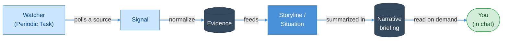
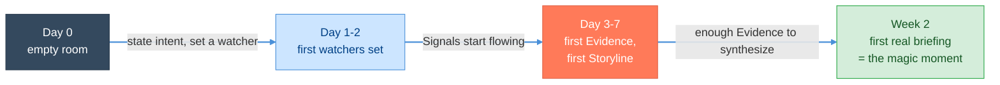

# Roadmap

> **Status:** In Review
>
> **Version:** 0.1   ·   **Last updated:** 2026-06-10
>
> **Purpose:** The phasing and sequencing of the spec suite into shippable releases — the "smallest magical loop" that is v1, what each major feature area is cut to per phase (v1 / v2 / later), and the cold-start / first-two-weeks experience arc that gets a brand-new install from an empty room to value.
>
> **Depends on:** [constitution](constitution.md), [overview](overview.md), [how-it-works](how-it-works.md)   ·   **Related:** [signals](signals.md), [periodic-tasks](periodic-tasks.md), [evidence](evidence.md), [storylines](storylines.md), [situations](situations.md), [narrative](narrative.md), [proactivity](proactivity.md), [integrations](integrations.md), [agents](agents.md), [agent-orchestration](agent-orchestration.md), [tasks](tasks.md), [memory](memory.md), [entities](entities.md), [calendar](calendar.md), [conversation](conversation.md)

> Requirement tag: **ROAD**

---

## 1. Purpose & Scope

This spec answers a question the rest of the suite deliberately avoids: **what do we build first, and what do we leave for later?** The suite specifies ~16 feature areas at depth, but it carries **no MVP cut and no phasing** — and the codebase is an early scaffold (an HTTP server, curator/LLM-provider scaffolding). The competitive doc warns this is exactly where the product dies: "the moat is *the combination*, which is also the execution trap … products routinely die on exactly these" ([comparison](comparison.md) §6).

This spec exists to **defeat that failure mode** by sequencing the build. It defines:

- **The "smallest magical loop"** — the minimum machinery that delivers the core *narrative-not-feeds* value (§5.1), the v1 target.
- **Phase tags** (v1 / v2 / later) for every major feature area, with an honest cut line (§5.2–§5.3).
- **The cold-start / first-two-weeks arc** (§5.4) — why a day-1 empty install retains the user when its value depends on *accumulated* Evidence.

Requirement IDs use the tag **`ROAD`** (`REQ-ROAD-NN`).

## 2. Non-Goals / Out of Scope

- **Not a product redefinition.** The vision is [overview](overview.md); the feature mechanics are each feature's own spec. This spec only *sequences* what those define; where it cuts a feature for v1, the feature spec still owns the full design.
- **Not a schedule.** No dates, headcount, or estimates — phases are **ordered, not calendared**. "v1" means "the first learnable release," not a quarter.
- **Not UI/client rendering.** The first-run *experience arc* (§5.4) belongs here because it is a product-level retention question, but how any screen is drawn is **client / out of scope** ([index](index.md) "Out of scope (not planned)").
- **Not architecture.** Build order of subsystems at the code level is [app-architecture](app-architecture.md); this is feature-altitude phasing.
- **Sharing, browser automation, and local filesystem** are already deferred by the suite ([overview](overview.md) REQ-OVR-02, [how-it-works](how-it-works.md) §5.4); this spec records *which phase* they re-enter, not whether.

## 3. Background & Rationale

Two facts force a roadmap:

1. **Scope vastly exceeds a first release.** The approved suite is multiple team-years: an ingestion pipeline ([signals](signals.md)/[inbox](inbox.md)/[evidence](evidence.md)), the narrative layer ([storylines](storylines.md)/[situations](situations.md)/[insights](insights.md)/[narrative](narrative.md)), agents + orchestration ([agents](agents.md)/[agent-orchestration](agent-orchestration.md)), tasks ([tasks](tasks.md)), memory + entities ([memory](memory.md)/[entities](entities.md)), proactivity ([proactivity](proactivity.md)), integrations ([integrations](integrations.md)), calendar ([calendar](calendar.md)), conversation ([conversation](conversation.md)), plus the capability/security substrate ([tools](tools.md)/[permissions](permissions.md)/[mcp](mcp.md)/[skills](skills.md)/[secrets](secrets.md)/[sandboxing](sandboxing.md)/[prompt-injection](prompt-injection.md)). Shipping all of it before anyone uses it is the trap.

2. **The value is *emergent and accumulated*, not feature-count.** The magic is "open a client and in three sentences know where everything stands" ([overview](overview.md) §5.8) — which only exists once enough Evidence has flowed through the pipeline. So the roadmap must privilege the **one end-to-end loop that produces that feeling**, even thinly, over breadth.

> **REQ-ROAD-01.** The product MUST be sequenced so the **core value loop runs end-to-end in v1** ([overview](overview.md) §5.1 P2 *narrative, not event-driven*). Breadth of sources, agents, and surfaces is added in later phases; the loop is not. A release that ships more feature *areas* but no working loop is not a valid v1.

## 4. Concepts & Definitions

This spec introduces no domain terms; it uses the canonical vocabulary ([glossary](glossary.md)) and the example cast ([constitution](constitution.md) §7). Three roadmap-local labels:

- **Smallest magical loop** — the minimum Observe → Understand → Surface round-trip ([how-it-works](how-it-works.md) §5.1) that delivers the *narrative-not-feeds* value with the least machinery (§5.1).
- **Phase tag** — `v1` (the first learnable release), `v2` (the next coherent increment), `later` (deferred until the loop is proven). Ordered, not dated (§2).
- **Cold start** — the state of a fresh install with no accumulated Evidence: the "empty room" problem (§5.4).

## 5. Detailed Specification

### 5.1 The smallest magical loop (the v1 target)

> **REQ-ROAD-02.** v1 is the **smallest magical loop**: a **watcher** ([periodic-tasks](periodic-tasks.md) — a Periodic Task that polls a source) → **Signal** → **Evidence** ([evidence](evidence.md)) → **Situation/Storyline** ([situations](situations.md)/[storylines](storylines.md)) → **briefing** ([narrative](narrative.md)), read in a **Conversation** ([conversation](conversation.md)). This single round-trip — and nothing more — is what v1 must make work end-to-end.

This is the thinnest path that still produces the headline experience: *"the System kept thinking while you were away, and tells you only the part worth knowing."* It exercises every principle that differentiates the product — P2 (narrative), P3 (Evidence-first), P4 (proactive-but-quiet) — without requiring agents, multi-source ingestion, or autonomy beyond reading.

> **REQ-ROAD-03 — what is explicitly IN v1.** The loop's spine and the minimum to run it:
> - **Spaces** ([spaces](spaces.md)) — the hierarchy + per-Space isolation; sharing stays out.
> - **Periodic Tasks / watchers** ([periodic-tasks](periodic-tasks.md)) — the only Signal *source* needed to make the loop run (a watcher polling a public page/feed).
> - **Signal → Evidence ingestion** ([signals](signals.md), [evidence](evidence.md), [inbox](inbox.md)) — including the **ingestion API** ([how-it-works](how-it-works.md) §5.3) so external tools can POST Signals without a connector.
> - **Storylines + Situations** ([storylines](storylines.md), [situations](situations.md)) and the **Curator** ([curator](curator.md)) maintaining them.
> - **Narrative / briefing** ([narrative](narrative.md)) — the read-out that delivers the value.
> - **Conversation** ([conversation](conversation.md)) — the primary surface; chat over what the System knows.
> - **Proactivity, minimal** ([proactivity](proactivity.md)) — enough relevance/urgency bar + a daily Digest to be *quiet by default*; full multi-channel/quiet-hours/anti-spam tuning is v2.
> - **Tasks, read-only tier** ([tasks](tasks.md)) — the loop only needs *Always* actions (observe, summarize, create internal objects). The Always/Ask-first/Never gate exists, but v1 ships almost no Ask-first surface area.
> - The capability/security substrate that the loop unavoidably touches: [permissions](permissions.md), [ai-models](ai-models.md), [context-management](context-management.md), [prompt-injection](prompt-injection.md) (the envelope), [secrets](secrets.md) (for the model key). These ship as *thin as the loop demands*, not in full.

> **REQ-ROAD-04 — what is explicitly DEFERRED out of v1** (so the loop stays small):
> - **Multi-source inbound integrations** ([integrations](integrations.md)) beyond watchers + the ingestion API — email/calendar/chat/code-host connectors are **v2**.
> - **Agents & multi-agent orchestration** ([agents](agents.md), [agent-orchestration](agent-orchestration.md)) — v1 has no Research/Ops/Reviewer roster; the Curator + a single execution path suffice. **v2**.
> - **Outbound action** ([tools](tools.md), [mcp](mcp.md), [skills](skills.md)) — sending mail, browser state-changes, purchases. The Ask-first machinery is specced but v1 ships effectively read-only. **v2**.
> - **Entities knowledge graph** ([entities](entities.md)) — v1 may reference people/repos as plain strings; the graph is **v2**.
> - **Calendar** ([calendar](calendar.md)) — **v2**.
> - **User Workflows** ([user-workflows](user_workflows.md)) — event-triggered WHEN/THEN rules: **v2**.
> - **Deep Memory** ([memory](memory.md)) — v1 needs only the Narrative-as-compression and basic recall; decay/reflection/distillation tuning is **v2**.
> - **Sharing, browser automation, local filesystem** — **later** (already suite-deferred).
> - **Token/cost governance** ([token-cost-management](token-cost-management.md)) beyond a hard cap — full budgets/showback are **v2**.

### 5.2 Phase tags by feature area

> **REQ-ROAD-05.** Every major feature area carries a phase tag. The cut is honest: a feature is **v1 only if the smallest magical loop cannot deliver value without it.**

| Feature area | Phase | v1 scope (if any) | Deferred to |
|---|---|---|---|
| Spaces & isolation ([spaces](spaces.md)) | **v1** | Hierarchy, downstream inheritance, per-Space isolation | sharing → **later** |
| Ingestion: watchers ([periodic-tasks](periodic-tasks.md)) | **v1** | A scheduled watcher polling a public source | — |
| Ingestion: Signal→Evidence ([signals](signals.md)/[inbox](inbox.md)/[evidence](evidence.md)) | **v1** | Normalize, dedup, distill to Evidence; ingestion API | richer source catalog → v2 |
| Inbound integrations ([integrations](integrations.md)) | **v2** | — | email/calendar/chat/code-host connectors |
| Storylines & Situations ([storylines](storylines.md)/[situations](situations.md)) | **v1** | Creation, Momentum, Attention score, Curator upkeep | — |
| Narrative / briefing ([narrative](narrative.md)) | **v1** | Space-scope briefing as the read-out | per-Storyline polish → v2 |
| Conversation ([conversation](conversation.md)) | **v1** | Chat over the System; the primary surface | living-channel agent threads → v2 |
| Proactivity ([proactivity](proactivity.md)) | **v1 (minimal)** | Relevance bar + daily Digest, quiet-by-default | quiet hours, anti-spam budget, push → v2 |
| Tasks ([tasks](tasks.md)) | **v1 (read tier)** | Always-tier observe/summarize/create-internal | recursive decomposition, Ask-first flows → v2 |
| Agents & orchestration ([agents](agents.md)/[agent-orchestration](agent-orchestration.md)) | **v2** | — | role roster, delegation, replanning |
| Outbound Tools / MCP / Skills ([tools](tools.md)/[mcp](mcp.md)/[skills](skills.md)) | **v2** | — | send/act/automate under Ask-first |
| Entities graph ([entities](entities.md)) | **v2** | — | typed entity/relationship CRM |
| Memory ([memory](memory.md)) | **v1 (thin)** | Narrative-as-compression + basic recall | decay, reflection, distillation tuning → v2 |
| Calendar ([calendar](calendar.md)) | **v2** | — | time-based view of tasks/runs/deadlines |
| User Workflows ([user-workflows](user_workflows.md)) | **v2** | — | WHEN/THEN user automations |
| AI models ([ai-models](ai-models.md)) | **v1 (thin)** | One Strong-tier remote + one local path; routing minimal | full card/tier registry, evals → v2 |
| Cost/budget ([token-cost-management](token-cost-management.md)) | **v1 (cap only)** | A hard spend/token cap, fail-closed | budgets, showback, burn-rate → v2 |
| Sandboxing ([sandboxing](sandboxing.md)) | **v1 (as needed)** | Confinement for any subprocess the loop runs | full backend matrix → v2 |
| Prompt-injection ([prompt-injection](prompt-injection.md)) | **v1** | The untrusted-content envelope (loop ingests external text) | reader-agent/quarantine depth → v2 |
| Permissions ([permissions](permissions.md)) | **v1 (thin)** | The two-gate model; almost no Ask-first surface yet | standing-grant UX depth → v2 |
| Activity log ([activity-log](activity-log.md)) | **v2** | — | full auditable trail (v1 logs minimally) |
| Sharing, browser automation, filesystem | **later** | — | (already suite-deferred) |

> **REQ-ROAD-06.** **v2 is the "act and connect" phase**: it adds the things v1 deliberately omits to keep the loop small — multi-source integrations, agents + orchestration, outbound action under Ask-first (which makes the §5 background-approval model finally load-bearing), entities, calendar, user-workflows, and full proactivity/cost governance. **later** is the suite-deferred set (sharing, browser automation, local filesystem) plus parity/scale work.

### 5.3 Honest cut rationale

The temptation is to ship agents and integrations early because they *demo* well. The roadmap resists this:

- **Agents without a working pipeline are a chatbot.** The differentiator ([comparison](comparison.md) §3) is Situations/Storylines + cited Evidence — which is the *pipeline*, not the agent layer. v1 proves the pipeline; v2 makes it act.
- **Integrations are the competitor moat we cannot win on count.** n8n has 400+, Lindy 4,000+ ([comparison](comparison.md) §4). Racing them on connector breadth in v1 is a losing game; v1 instead proves the *synthesis* a connector would feed, using the cheapest possible source (a watcher + the ingestion API).
- **Outbound autonomy is the highest-risk surface.** Deferring it to v2 means v1 can ship with a tiny Ask-first surface area, lowering the trust bar a brand-new product must clear.

### 5.4 Cold start — the first-two-weeks arc

> **REQ-ROAD-07.** The product's value depends on **accumulated Evidence** ([overview](overview.md) §5.8), so a fresh install is an **empty room**: day 1 it knows nothing and has nothing to surface. The roadmap MUST treat this cold-start arc as a first-class product concern, because the moment of highest churn risk is precisely when the System is least able to demonstrate value. *(The UI that renders any of this is client / out of scope — this spec owns the **experience arc and what creates retention**, not the screens.)*

The honest tension: every shipping competitor ([comparison](comparison.md)) is useful in minute one; a self-hosted accumulation engine is useful in *week two*. The arc must make the gap survivable.

> **REQ-ROAD-08 — the cold-start retention contract.** Across the empty-room period the System MUST:
> - **Be honest, not fake activity.** An empty briefing says "I'm not watching anything worth reporting yet" — never manufactures Insights (P4; [overview](overview.md) §9 "Nothing to say"). Padding the empty room to look busy destroys the trust the whole product rests on.
> - **Make the *first watcher* the onboarding act.** First-run is "establish scope, not configure" ([overview](overview.md) §5.9): the user states a few things they care about and points at least one watcher at a source (e.g. a competitor's release notes). This is the single action that starts the accumulation flywheel.
> - **Show the loop turning before it has a verdict.** Within days the user should *see* Signals arriving and Evidence accruing ("3 changes captured on the Northwind pricing page") even before there's enough to form a Storyline — so the empty room visibly fills, proving the machine works.
> - **Deliver the first real briefing as the explicit "magic moment."** The arc's goal is week-2 payoff: the first briefing that connects accumulated Evidence into a narrative the user couldn't have assembled by hand ("the *Framework UI direction* has looped — you've revisited it without an RFC"). v1 success is measured against *time-to-this-moment* ([overview](overview.md) §5.8 measurable proxies).

> **REQ-ROAD-09.** Because the payoff is delayed, v1 SHOULD lower the activation cost of the first watcher as far as possible (suggested starter watchers, the ingestion API so a user's existing tooling can seed Evidence on day 1) — turning "week two" into "as soon as your own data starts flowing." How this is surfaced is a client concern; that it is a roadmap priority is fixed here.

## 6. Visualizations

The two diagrams above are the core set: the **smallest magical loop** (§5.1) and the **cold-start arc** (§5.4). The phase cut is the table in §5.2.

## 7. Data Shapes

*(Not applicable — this spec defines no data; it sequences features defined elsewhere.)*

## 8. Examples & Use Cases

### Example A — "v1 delivers value with one watcher" (Given/When/Then)
- **Given** a fresh v1 install, the `Business/Framework` Space, and **no** agents, integrations, or outbound tools enabled (all v2+).
- **When** you point a watcher ([periodic-tasks](periodic-tasks.md)) at a competitor's release-notes page and leave for the week.
- **Then** each meaningful change becomes a Signal → Evidence; the Curator forms a *competitor releases* Storyline; and your week-2 briefing reads *"Two release changes touch your roadmap — one may be a breaking upgrade,"* each claim citing its Evidence. The full magical loop ran with **only the v1 set** (§5.1, REQ-ROAD-02/03).

### Example B — "The empty room, honestly" (Given/When/Then)
- **Given** day 1 of a fresh install with one watcher just set and no Evidence yet.
- **When** you open a client expecting a briefing.
- **Then** the System says plainly *"I'm watching the Northwind pricing page; nothing to report yet — I'll surface changes as they happen"* rather than fabricating activity (REQ-ROAD-08, P4). The room is empty **and the System admits it**, which is what earns the trust to keep it running to week two.

### Example C — "Why this is deferred, not forgotten" (narrative)
A reviewer asks why v1 can't email Devin when the Northwind bill spikes. Answer: outbound communication is Ask-first ([constitution](constitution.md) §5), and the whole background-approval model ([constitution](constitution.md) §5.2) only earns its keep once there *are* Ask-first actions to park. v1 detects and surfaces the spike (Always-tier); **v2** adds the email-Devin action and the approval round-trip ([overview](overview.md) Example B describes the v2 behavior). The capability is **deferred, with a named home**, not dropped (REQ-ROAD-06).

## 9. Edge Cases & Failure Modes

- **"v1 feels empty" churn.** The dominant risk: a user uninstalls before week-2 payoff. Mitigation is REQ-ROAD-08/09 (honest empty state + lowest-cost first watcher + visible accumulation), not feature breadth.
- **Scope creep back into v1.** Each "small" addition (one connector, one agent) erodes the loop's smallness. The §5.2 cut is the backstop: a feature re-enters v1 only by amending this spec, with rationale.
- **Pipeline thin but loud.** A v1 with weak relevance tuning could over-surface. v1 ships *quiet-by-default* proactivity (REQ-ROAD-03) precisely so an immature pipeline errs toward silence (P4).

## 10. Open Questions & Decisions

- **OQ-ROAD-1 — v1 source minimum.** Is a single watcher + ingestion API enough to demonstrate value, or does v1 need *one* real inbound integration (e.g. email) to feel useful day-1? Current leaning: watcher + API only, to hold the line on smallness; revisit if cold-start testing shows the empty room is fatal. (Touches [integrations](integrations.md).)
- **OQ-ROAD-2 — minimal proactivity boundary.** Exactly which [proactivity](proactivity.md) levers are v1 (bar + daily Digest) vs v2 (quiet hours, anti-spam budget, push)? Leaning as in §5.2; confirm against [proactivity](proactivity.md).
- **OQ-ROAD-3 — first-watcher friction.** How aggressively should v1 suggest starter watchers without violating "establish scope, not configure"? (Touches onboarding, a client surface.)
- **OQ-ROAD-4 — v2 entry trigger.** What signal (user count, retention, loop reliability) gates starting v2's outbound/agents work? Deferred until v1 ships.

## 11. Review & Acceptance Checklist

- [ ] The smallest magical loop is defined as the v1 target and drawn (§5.1).
- [ ] v1 IN / DEFERRED sets are explicit and consistent with the §5.2 table (REQ-ROAD-03/04/05).
- [ ] Every major feature area carries a v1 / v2 / later tag with honest cut rationale (§5.2–§5.3).
- [ ] The cold-start / first-two-weeks arc is specified with a retention contract that forbids faking activity (§5.4, REQ-ROAD-08).
- [ ] Sharing, browser automation, and filesystem are placed in **later**, consistent with the suite's existing deferrals.
- [ ] At least two end-to-end examples use the shared cast.
- [ ] No dates/estimates; phases are ordered, not calendared.
- [ ] Cross-references resolve.

## 12. Cross-References

- [overview](overview.md) — the vision and success criteria this spec sequences; §5.8 measurable proxies anchor v1 success; §5.9 onboarding feeds §5.4.
- [how-it-works](how-it-works.md) — the operating loop (§5.1) the smallest magical loop is a minimal slice of.
- [periodic-tasks](periodic-tasks.md), [signals](signals.md), [evidence](evidence.md), [storylines](storylines.md), [situations](situations.md), [narrative](narrative.md), [conversation](conversation.md) — the v1 loop's components.
- [integrations](integrations.md), [agents](agents.md), [agent-orchestration](agent-orchestration.md), [tools](tools.md), [entities](entities.md), [calendar](calendar.md), [user-workflows](user_workflows.md) — the v2 "act and connect" set.
- [comparison](comparison.md) — the execution-trap warning (§6) and the integration-moat reality this roadmap routes around.
- [constitution](constitution.md) — the Always/Ask-first/Never model (§5/§5.2) that becomes load-bearing in v2.

## 13. Changelog

- **2026-06-10 — v0.1** — Initial draft. Defines the smallest magical loop as the v1 target (watcher → Evidence → Situation/Storyline → briefing) with explicit IN/DEFERRED sets; phase-tags all major feature areas (v1/v2/later) in a cut table with honest rationale; specifies the cold-start / first-two-weeks experience arc and a retention contract that forbids faking activity. Established as the home for the MVP cut, phasing, cold-start, and scope-vs-scaffold concerns. Status Draft.
