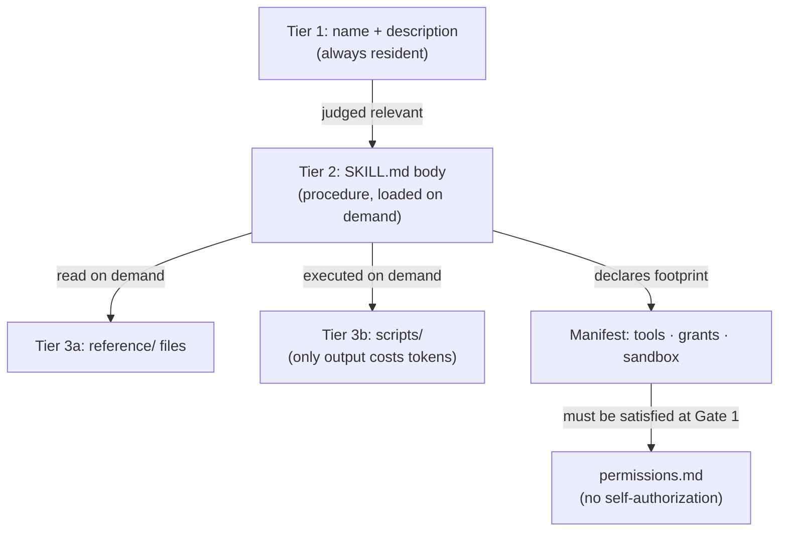

# Skills

> **Status:** Approved
>
> **Version:** 1.0   ·   **Last updated:** 2026-06-08
>
> **Purpose:** The **Skill** (`skill_`) — a packaged capability (a `SKILL.md` procedure + bundled scripts/resources + a least-privilege **manifest** of tools, grants, and sandbox policy) an Agent loads on demand.
>
> **Depends on:** [constitution](constitution.md), [tools](tools.md), [permissions](permissions.md), [agents](agents.md), [sandboxing](sandboxing.md), [prompt-injection](prompt-injection.md)   ·   **Related:** [mcp](mcp.md), [secrets](secrets.md), [agent-orchestration](agent-orchestration.md), [ai-models](ai-models.md)

> Requirement tag: **SKILL**

---

## 1. Purpose & Scope

This spec defines the **Skill** (`skill_`): a **packaged capability** an [Agent](agents.md) loads to do a class of work — a bundle of **procedure** (instructions), optional **scripts/resources**, and a **manifest** declaring the [Tools](tools.md) it uses, the [grants](permissions.md) it requires, and its [sandbox](sandboxing.md) policy ([glossary](glossary.md)). It is the layer **above tools**: a Tool is one callable capability; a Skill is the know-how and assets to wield several toward an outcome.

Skills adopt the cross-vendor **`SKILL.md` open standard** (YAML frontmatter + Markdown body + bundled files) with **progressive disclosure**, extended by a **manifest** that gives the Skill a declared, least-privilege footprint. An Agent references Skills by `skill_set`; they are **loaded into context on demand** ([agents](agents.md) REQ-AGENT-05).

## 2. Non-Goals / Out of Scope

- **The Tool shape and tool-call lifecycle** — owned by [tools](tools.md); a Skill *uses* Tools, it does not redefine them.
- **Gate 1 / grants** — owned by [permissions](permissions.md); a Skill's manifest *declares needs*, it cannot grant authority.
- **MCP servers** — owned by [mcp](mcp.md); a Skill may *use* MCP-backed Tools.
- **The Agent definition and loop** — owned by [agents](agents.md); a Skill is referenced by, not the same as, an Agent.
- **Sandbox enforcement mechanics** — owned by [sandboxing](sandboxing.md); a Skill *declares* a profile that is intersected, never loosened.

## 3. Background & Rationale

The `SKILL.md` format has become an open, cross-vendor standard for packaging procedural capability: a directory with a `SKILL.md` (frontmatter + Markdown) plus optional `scripts/` and `reference/` files. Its key idea is **progressive disclosure** — only a name and description sit in context by default; the body loads when the Skill is judged relevant; bundled files are read, and scripts **executed**, only on demand (so a 500-line script costs nothing until its *output* is used). This keeps many specialized capabilities available without flooding context.

Two product realities extend the vanilla standard. First, the System is **capability-gated**: a Skill must declare the Tools, credentials, and sandbox it needs so least privilege can be enforced — hence the **manifest**. Second, **skills are an untrusted-instruction surface**: every line of a `SKILL.md` is interpreted as instruction, and skills are freely shared, so a malicious or compromised skill is a prompt-injection vector. The design therefore signs/pins skills, gates their install (Ask-first), treats their text with the same suspicion as any instruction source for non-built-ins, and lets a Skill's manifest *request* but never *grant* authority. Research also shows **degrees of freedom** matter: fragile/irreversible steps should run **exact scripts**, open-ended steps **prose heuristics**.

## 4. Concepts & Definitions

- **Skill** (`skill_`) — a packaged capability: a `SKILL.md` + optional bundled files + a manifest. *Example:* a `release-watcher` Skill.
- **`SKILL.md`** — frontmatter (`name`, `description`) + a Markdown **procedure** body.
- **Manifest** — the declared footprint: required `tools` (`tool_` ids), required `grants` (handles, mounts, connectors), and a `sandbox` policy.
- **Progressive disclosure** — three tiers: name+description (always), body (on relevance), bundled files/scripts (on demand).
- **Degrees of freedom** — how prescriptive a step is: **rigid** (exact script) ↔ **flexible** (prose heuristic).
- **Source** — `built_in` (shipped, trusted) or `user`/`third_party` (signed, pinned, reviewed).

## 5. Detailed Specification

### 5.1 A Skill is procedure + assets + manifest

> **REQ-SKILL-01.** A Skill (`skill_`) is a **directory**: a required **`SKILL.md`**, optional **`scripts/`** and **`reference/`** files, and a **manifest** (§5.4). It bundles the **procedure** plus the declared **Tools, grants, and sandbox** it needs. An Agent lists Skills in `skill_set`; they are **loaded on demand** — the agent reads the Skill's instructions before applying it ([agents](agents.md) REQ-AGENT-05). A Skill **references** Tools; it does not define them.

### 5.2 `SKILL.md` format

> **REQ-SKILL-02.** A Skill adopts the **`SKILL.md` standard**: YAML frontmatter with **`name`** (kebab-case, gerund-preferred, no vendor words) and **`description`** (third-person, stating *what it does **and** when to use it* — the model's selection signal), followed by a Markdown **procedure** body. The description is the highest-leverage field for correct selection and MUST include trigger terms and non-uses.

### 5.3 Progressive disclosure

> **REQ-SKILL-03.** Skills load in **tiers**: **(1)** `name` + `description` are always resident; **(2)** the `SKILL.md` body is read into context only when the Skill is judged relevant; **(3)** bundled `reference/` files are read, and `scripts/` **executed**, on demand — only a script's **output** costs tokens, not its source. `SKILL.md` SHOULD stay small (≈ ≤ 500 lines) with references **one level deep**; organize by domain so unrelated context never loads.

### 5.4 The manifest is the least-privilege footprint

> **REQ-SKILL-04.** A Skill's **manifest** declares: the **`tools`** it uses (`tool_` ids, incl. `mcp_*` ones); the **`grants`** it requires (secret handles, file mounts, connectors); and a **`sandbox`** policy (egress/exec/fs/resources). This is the Skill's **declared, least-privilege footprint** — what it may touch, named explicitly, so the System can reason about and gate it before loading.

### 5.5 A Skill requests authority; it never grants it

> **REQ-SKILL-05.** Loading a Skill **never widens authority**. The manifest declares *needs*; each need must be **satisfied by the Agent's grants at Gate 1** ([permissions](permissions.md) REQ-PERM-01/05). A manifested Tool the Agent does not hold, or a grant it lacks, means that step **cannot run** — the Skill **fails closed** or triggers an Ask-first grant request; it cannot self-authorize. A Skill's text cannot escalate privilege, add Tools, or alter an output schema ([prompt-injection](prompt-injection.md) REQ-PINJ-05).

### 5.6 Sandbox policy is intersected, never loosened

> **REQ-SKILL-06.** A Skill's `sandbox` policy is **inherited** by the Agent that loads it and **combined by intersection** with the Agent's and Space's profiles — the **most-restrictive** wins ([sandbox](sandboxing.md) REQ-SBX-03). A Skill can **tighten** confinement (e.g. a `research` Skill sets `exec: false`) but never relax it. Script execution from `scripts/` runs inside this combined sandbox.

### 5.7 Degrees of freedom

> **REQ-SKILL-07.** A Skill matches **prescriptiveness to fragility**: **rigid** steps — fragile, irreversible, or destructive — provide an **exact script** ("run exactly this, do not modify"); **flexible** steps provide **prose heuristics** for open-ended judgment. Destructive or batch operations SHOULD follow **plan → validate → execute** with verifiable intermediate artifacts. Pre-made scripts are preferred over model-generated code for reliability and token cost.

### 5.8 Skills are untrusted instruction surfaces

> **REQ-SKILL-08.** A Skill's `SKILL.md` and bundled text are **instructions**, so a non-built-in Skill is a **prompt-injection surface**. **Built-in** Skills shipped with the System are trusted; **user/third-party** Skills are treated as **untrusted until reviewed**, signed, and pinned. A loaded Skill's instructions never override the System prompt or the §5 gates; an action a Skill describes still passes Gate 1 + Gate 2 ([constitution](constitution.md) §5). Untrusted-content the Skill *reads* remains data (REQ-PINJ-02).

### 5.9 Provenance: signed, pinned, Ask-first to install

> **REQ-SKILL-09.** **Installing or enabling** a non-built-in Skill is an **Ask-first capability install** ([constitution](constitution.md) §5). Skills carry a **version** and are **content-pinned**; an update that changes the procedure or **manifest** is **re-approved before use** (anti rug-pull, mirroring [mcp](mcp.md) REQ-MCP-05). The System ships a **built-in roster** and the user (or the System) may **define new Skills** the same way (§5.14 authoring conventions).

### 5.10 Ownership & non-duplication

> **REQ-SKILL-10.** This spec **owns** the Skill package, the `SKILL.md` + manifest format, progressive disclosure, degrees of freedom, and skill provenance. It **references**: [tools](tools.md) (the Tools it bundles), [permissions](permissions.md) (grants satisfy the manifest), [sandboxing](sandboxing.md) (the inherited profile), [agents](agents.md) (`skill_set` loading), [prompt-injection](prompt-injection.md) (untrusted instructions). It **defers** the `skill_` id format and the on-disk layout/distribution mechanics to [app-architecture](app-architecture.md).

## 6. Visualizations

### 6.1 Skill anatomy & progressive disclosure



### 6.2 A `SKILL.md` (illustrative)

```markdown
---
name: processing-invoices
description: Extract totals from vendor invoice PDFs and record them.
  Use when the user uploads invoices or asks to reconcile vendor bills;
  do NOT use for general PDF reading.
---

## Steps
1. Run `scripts/extract.py <file>` exactly (rigid — deterministic parse).
2. Validate the JSON against `reference/schema.json`.
3. Upsert each line via the `record_upsert` tool (idempotent).

<!-- manifest -->
tools:   [file_read, record_upsert]
grants:  [secret://accounting/api#key]
sandbox: { exec: true, egress: [api.accounting.internal], fs: [./scripts] }
```

## 7. Data Shapes

Conceptual. Non-normative.

```go
type Source string // "built_in" | "user" | "third_party"

type Manifest struct {
    Tools   []string // tool_ ids (incl. mcp_*)
    Grants  []string // secret handles, mounts, connectors required
    Sandbox SandboxProfile // intersected with agent + space (REQ-SKILL-06)
}

type Skill struct {
    ID          string // "skill_processing_invoices"
    Name        string // "processing-invoices"
    Description string // what + when (selection signal)
    Body        string // SKILL.md markdown procedure
    Files       []string // reference/ + scripts/
    Manifest    Manifest
    Source      Source
    Version     string // content-pinned (REQ-SKILL-09)
}
```

## 8. Examples & Use Cases

### Example A — a flexible built-in Skill (Given/When/Then)

- **Given** a `release-watcher` built-in Skill — `description: "summarize what changed in a project's latest release; use when tracking a dependency or competitor."` Manifest: `tools: [web_fetch]`, `sandbox: { exec: false, egress: [github.com, *.npmjs.com] }`.
- **When** an agent tracking the `framework` dependency on npm loads it.
- **Then** only `web_fetch` (read_only, Always) is needed and already granted; the Skill runs **flexibly** (prose heuristics), reads release notes **as untrusted content**, and returns a summary. No exec, no outbound — its tight manifest makes the blast radius obvious.

### Example B — a user Skill that requires grants (narrative)

A user adds a `processing-invoices` Skill (above) to a `Finance` agent. **Installing** it is Ask-first (REQ-SKILL-09); it is pinned. Its manifest requires `secret://accounting/api#key` and `exec: true`. When the agent loads it, Gate 1 checks each need: the secret's **first use** prompts an Ask-first approval → standing grant ([permissions](permissions.md) REQ-PERM-07); the `extract.py` step runs **exactly** (rigid) inside the intersected sandbox. If the agent lacked the exec capability, step 1 would **fail closed** rather than the Skill widening its own reach (REQ-SKILL-05/06).

## 9. Edge Cases & Failure Modes

- **Skill needs a Tool/grant the agent lacks.** Fail closed or request a narrow grant; the Skill never self-authorizes (REQ-SKILL-05).
- **Skill update changes the manifest.** Re-approval required before use (REQ-SKILL-09).
- **Malicious instruction in a shared Skill.** Non-built-in text is untrusted; cannot override the gates or output schema; install was Ask-first and signed/pinned (REQ-SKILL-08).
- **Oversized `SKILL.md`.** Discouraged (≤ ~500 lines); deep nesting causes partial reads — keep references one level deep (REQ-SKILL-03).
- **Skill's sandbox conflicts with the agent's.** Intersection wins (most-restrictive); a Skill cannot loosen (REQ-SKILL-06).

## 10. Open Questions & Decisions

- **OQ-SKILL-1** — **Composition**: may a Skill load another Skill, or is composition only at the Agent level? *Leaning: Agent-level only for v1, to keep the footprint analyzable.*
- **OQ-SKILL-2** — The **signing/pinning mechanism** for third-party Skills (signature format, trust roots) — likely shared with [mcp](mcp.md) supply-chain handling.
- **OQ-SKILL-3** — **Distribution**: a built-in roster only, or a curated/marketplace install path (bundled with MCP servers as "plugins")?

## 11. Review & Acceptance Checklist

- [ ] A Skill is a directory: `SKILL.md` + optional scripts/reference + manifest; referenced via `skill_set`, loaded on demand (REQ-SKILL-01).
- [ ] `SKILL.md` uses the standard frontmatter (`name`, `description`) + Markdown procedure (REQ-SKILL-02).
- [ ] Progressive disclosure across the three tiers; small body, references one level deep (REQ-SKILL-03).
- [ ] The manifest declares tools, grants, and sandbox — the least-privilege footprint (REQ-SKILL-04).
- [ ] A Skill requests but never grants authority; missing capability fails closed (REQ-SKILL-05).
- [ ] Sandbox policy is intersected, never loosened (REQ-SKILL-06).
- [ ] Degrees of freedom match step fragility; rigid scripts for destructive/fragile steps (REQ-SKILL-07).
- [ ] Non-built-in Skill text is untrusted and cannot override the gates (REQ-SKILL-08).
- [ ] Install/enable is Ask-first; Skills are versioned, pinned, and re-approved on change (REQ-SKILL-09).

## 12. Cross-References

- [tools](tools.md) — the Tools a Skill bundles, and their lifecycle/effect class (REQ-TOOL-02/03/06).
- [permissions](permissions.md) — grants that must satisfy the manifest at Gate 1 (REQ-PERM-01/05/07).
- [sandboxing](sandboxing.md) — the profile a Skill inherits and may tighten (REQ-SBX-03).
- [agents](agents.md) — `skill_set` and on-demand loading (REQ-AGENT-05).
- [prompt-injection](prompt-injection.md) — Skill text as an untrusted-instruction surface (REQ-PINJ-02/05).
- [mcp](mcp.md) — MCP-backed Tools a Skill may use; shared pin/re-approval pattern (REQ-MCP-05).
- [glossary](glossary.md) — the canonical **Skill** definition.

## 13. Changelog

- **2026-06-08 — v1.0** — **Approved.** SKILL.md + manifest model confirmed; skill composition, the signing mechanism, and distribution remain open (OQ-SKILL-1/2/3).
- **2026-06-08 — v0.1** — Initial draft. The Skill as a packaged capability (`SKILL.md` + bundled files + manifest), loaded on demand (REQ-SKILL-01/02); progressive disclosure (REQ-SKILL-03); the least-privilege manifest (REQ-SKILL-04); requests-not-grants authority (REQ-SKILL-05); intersected sandbox (REQ-SKILL-06); degrees of freedom (REQ-SKILL-07); untrusted-instruction posture (REQ-SKILL-08); signed/pinned, Ask-first install (REQ-SKILL-09); ownership (REQ-SKILL-10). In Review.
