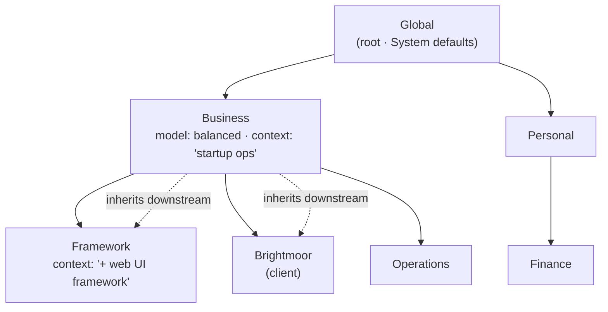
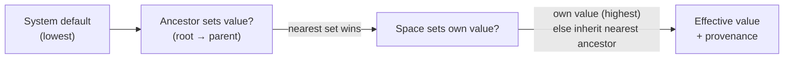
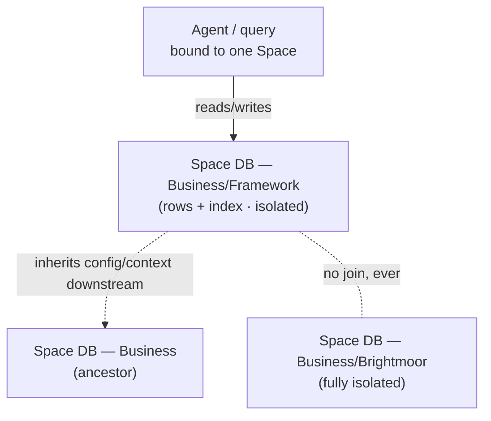

# Spaces

> **Status:** Approved
>
> **Version:** 1.1   ·   **Last updated:** 2026-06-10
>
> **Purpose:** The Space primitive end-to-end — the **only** organizing container in the System: one hierarchy, **downstream inheritance** of configuration and context, **nearest-scope-wins** precedence with explicit overrides, **physical per-Space isolation**, the rule that every item resolves to **exactly one** owning Space, and the create/move/archive lifecycle. The structural backbone every other spec is scoped to.
>
> **Depends on:** [constitution](constitution.md), [glossary](glossary.md), [data-model](data-model.md)   ·   **Related:** [permissions](permissions.md), [entities](entities.md), [narrative](narrative.md), [memory](memory.md), [agents](agents.md), [ai-models](ai-models.md), [secrets](secrets.md), [mcp](mcp.md), [app-architecture](app-architecture.md)

> Requirement tag: **SPACE**

---

## 1. Purpose & Scope

A **Space** is the System's **only primitive** ([constitution](constitution.md) P11): the universal organizing container, and a node in **one hierarchy** with **downstream inheritance**. Everything else — Storylines, Situations, Evidence, Insights, the Narrative, Memory, Entities, Tasks, Agents, secrets, connectors, configuration — lives *inside* exactly one Space ([data-model](data-model.md) REQ-DM-02). There are **no roles, orgs, or teams**; structure is expressed entirely as where a Space sits in the tree.

This spec owns the **mechanics of the container itself**: the **primitive and the hierarchy** (§5.1–5.2), **downstream inheritance** of the dimensions a child draws from its ancestors (§5.3–5.4), the **precedence/override resolution** that decides which value wins (§5.5–5.6), the **isolation boundary** as a security property (§5.7), the rule that every item **resolves to exactly one owning Space** (§5.8), and the **lifecycle** — create, move, archive (§5.9). It is deliberately the *plumbing* layer: the per-Space *data* (the CRM, the Narrative, the grants, the index) is owned by the dimension specs; this spec owns **how the tree, inheritance, override, and isolation work** so they can reuse it consistently.

## 2. Non-Goals / Out of Scope

- **Not sharing.** Sharing a Space with another person is **explicitly deferred** and out of scope for this suite ([index](index.md) changelog, 2026-05-29). This spec is *designed so sharing can layer on later* (§5.7, OQ-SPACE-3) — downstream-only per P10 — but specs **no** sharing mechanism, person model, or access-by-identity now. Where "isolation" appears it means the **structural boundary**, not an ACL.
- **Not the per-Space data.** *What* lives in a Space and how it behaves is owned by the dimension specs: Entities ([entities](entities.md)), Narrative ([narrative](narrative.md)), Memory ([memory](memory.md)), grants ([permissions](permissions.md)), secrets ([secrets](secrets.md)), connectors ([mcp](mcp.md)), model selection ([ai-models](ai-models.md)). This spec owns only the **hierarchy, inheritance, precedence, and isolation** those specs reuse.
- **Not persistence.** The one-SQLite-file-per-Space realization, the System DB boundary, and `space_<ULID>` identity are owned by [app-architecture](app-architecture.md) (REQ-ARCH-03) and [data-model](data-model.md); this spec states the *logical* isolation guarantee they make physical.
- **Not settings UI / catalog.** The concrete set of configurable keys and their defaults is owned inline by each feature spec (the client config surface is out of scope here); this spec owns *how* a key inherits and overrides, not the key list.
- **Not item mechanics.** How a Signal resolves, a Storyline merges, or a Situation is detected is owned by those specs; this spec owns only the invariant that the result lands in **one** Space (§5.8).

## 3. Background & Rationale

Most products grow a tangle of containers — orgs, teams, workspaces, projects, folders, roles, groups — each with its own sharing and permission rules. The System rejects that: **one primitive, one hierarchy** (P11). A "company," a personal life area, and a research topic are all just Spaces at different places in the tree. Collapsing every container into one removes a whole class of "which abstraction owns this?" questions and gives the System a single, uniform place to scope context, memory, credentials, and action.

The hierarchy is not decoration — it is the **inheritance and isolation mechanism**. This mirrors the dominant industry patterns for hierarchical scope:

- ◆ **Source pattern (inheritance/cascade):** Google Cloud's resource hierarchy — *organization → folder → project* — where "the effective policy for a resource is the **union** of the policy set at that resource and the policy **inherited from its parent**," set once high and cascading down. The System's downstream inheritance is the same shape: configure at an ancestor, every descendant inherits.
- ◆ **Source pattern (delegated hierarchical scope):** Kubernetes **Hierarchical Namespaces (HNC)** — child namespaces inherit ancestor policy by **propagation**, each propagated object tagged with `inherited-from` so its origin is visible. The System tracks inheritance provenance the same way (§5.6, the `inherited_from` of a resolved value).
- ◆ **Source pattern (nearest-scope-wins config cascade):** **git config** (`system → global → local`, local wins) and **VS Code settings** (`user → workspace → folder`, the narrower scope overrides) — the **nearest scope wins**, and a child overrides an ancestor by *restating* the key. The System uses exactly this for configuration (§5.5).

The hard constraint that keeps this safe is **P10: isolation by Space**. Context, Memory, credentials, and actions **never** leak across Spaces except via explicit downstream inheritance; cross-Space leakage is a *hard failure*, not a tolerated bug. The System makes that boundary **physical** — one database file per Space, queries never joining across them ([app-architecture](app-architecture.md) REQ-ARCH-03) — which is the strongest, "siloed" tier of multi-tenant isolation. ◆ **Source pattern (isolation):** the database-per-tenant ("silo") model, the strongest isolation tier, where data is segregated at the storage boundary so accidental cross-tenant access is "virtually impossible" — versus a shared-schema `tenant_id` filter, whose soft isolation a single bug can defeat.

## 4. Concepts & Definitions

Canonical definition of **Space** is in [glossary](glossary.md). Terms this spec introduces or fixes:

- **Hierarchy** — the single rooted tree of Spaces; every Space except the root has exactly one **parent** (§5.2).
- **Ancestor / descendant** — a Space's chain *up to the root* / everything *below* it. Inheritance flows **down** the ancestor chain only.
- **Dimension** — one inheritable aspect of a Space: configuration, context/personality, model, permissions, secrets/connectors, Memory/recall scope (§5.4). Each dimension has an owning spec.
- **Inheritance** — a descendant drawing a dimension's value from the **nearest ancestor that sets it** when it does not set its own (§5.3).
- **Resolution** — computing a dimension's **effective value** for a Space by walking root→self and applying precedence (§5.5).
- **Override** — a Space **restating** a dimension to replace (or, where the dimension allows, **merge with**) the inherited value (§5.5–5.6).
- **Isolation boundary** — the Space edge across which nothing flows except by explicit downstream inheritance; physical, not advisory (§5.7).
- **Owning Space** — the single Space an item belongs to (`space_id`); every item has exactly one (§5.8).

## 5. Detailed Specification

### 5.1 The Space is the only primitive

> **REQ-SPACE-01.** A **Space** (`space_`) is the System's **only** organizing container ([constitution](constitution.md) P11). Personal areas, a "business," a client, a research topic — **all** are Spaces; there are **no** roles, orgs, teams, or any second container abstraction. Every other entity (Storyline, Situation, Evidence, Insight, Narrative, Memory, Entity, Task, secret, connector, grant) belongs to a Space and **never** exists outside one ([data-model](data-model.md) REQ-DM-02). Structure and scope are expressed **only** by where a Space sits in the hierarchy (§5.2) — not by a role attached to a person.

### 5.2 One hierarchy, single-parent tree

> **REQ-SPACE-02.** Spaces form **one rooted tree**. There is a single **root** Space (conceptually `Global`); every other Space has **exactly one parent**, and a Space's **ancestor chain** is the unique path from it to the root. The tree is **strictly hierarchical**: no Space has two parents, and a Space may **never** be its own ancestor (cycles are rejected at create/move — §5.9). A Space MAY have any number of children, nested to any depth. *Example:* `Business/Framework` has ancestor chain `Framework → Business → Global`; its siblings `Brightmoor` and `Operations` are **not** on that chain.

### 5.3 Downstream inheritance — the core rule

> **REQ-SPACE-03.** Inheritance flows **downstream only**: a descendant inherits a dimension's value from the **nearest ancestor that sets it**, and **no value ever flows upward or sideways**. An ancestor never sees or draws from a descendant; a sibling never sees a sibling (P10). A Space that sets none of its own values is a fully-inherited view of its parent. This is the *only* channel by which anything crosses a Space boundary (§5.7). ◆ Source pattern: GCP resource-hierarchy inheritance (effective = own ∪ inherited-from-parent) and Kubernetes HNC ancestor→descendant propagation.

### 5.4 The inherited dimensions

> **REQ-SPACE-04.** The dimensions that inherit downstream, and their merge-vs-replace default (§5.6), are:
>
> | Dimension | What inherits | Default on override | Owned by |
> |-----------|---------------|---------------------|----------|
> | **Configuration / settings** | preferences, cadences, budgets, toggles | **replace** (nearest key wins) | client (out of scope) |
> | **Context / prompt / personality** | the standing instructions, tone, and Narrative context an Agent runs with | **merge** (ancestor context + child context, child last) | [agents](agents.md), [narrative](narrative.md) |
> | **Model selection** | the default AI model / tier for work in the Space | **replace** | [ai-models](ai-models.md) |
> | **Permissions / grants** | standing `grant_` capabilities scoped to a Space | **merge, attenuate-only** (a child may narrow, never widen; deny-wins) | [permissions](permissions.md) |
> | **Secrets / connectors** | secret handles and MCP/connector availability | **merge, attenuate-only** | [secrets](secrets.md), [mcp](mcp.md) |
> | **Memory / recall scope** | which Memory/Evidence an Agent in the Space may recall | **own + ancestors, downstream-only** | [memory](memory.md) |
>
> Each dimension's *content and behavior* is owned by its spec; this spec owns only that it **inherits downstream** and **resolves by §5.5**. The two security-sensitive dimensions (permissions, secrets) are **attenuate-only** — a descendant may **narrow** but **never broaden** what it inherited ([permissions](permissions.md) REQ-PERM-05).

### 5.5 Precedence & resolution — nearest scope wins

> **REQ-SPACE-05.** A dimension's **effective value** for a Space is resolved by walking the ancestor chain **root → self** and applying, in order of increasing precedence:
> 1. the **System default** (lowest),
> 2. each **ancestor's** setting, root-first,
> 3. the **Space's own** setting (highest).
>
> The **nearest scope wins**: a Space's own value overrides its parent's, which overrides its grandparent's, down to the System default. An **explicit** value always beats an **inherited** one. A Space that does **not** set a dimension is **not** an override — it transparently inherits the nearest ancestor's value (distinct from setting it to empty, which *is* an override). ◆ Source pattern: git config (`local > global > system`) and VS Code settings (folder > workspace > user) — nearest-scope-wins, override-by-restating.

### 5.6 Merge vs replace, and inheritance provenance

> **REQ-SPACE-06.** Whether an override **replaces** the inherited value or **merges** with it is a **per-dimension** property (§5.4 column 3), not a global rule:
> - **Replace** (config, model): the nearest set value wins wholesale; ancestor values are shadowed.
> - **Merge** (context, permissions, secrets): the effective value is the **composition** of ancestor and descendant contributions, with the descendant applied **last** and, for the security dimensions, **only able to attenuate** — **deny-wins at every level**, so a descendant (or any) `deny` is final and a more-specific `allow` can never override it ([permissions](permissions.md) REQ-PERM-02, REQ-PERM-11, now reconciled to this composition).
>
> Every resolved value carries its **provenance** — *which Space in the chain supplied it* (`inherited_from`, or `self`). Provenance is **inspectable**: the user can always see, for any effective value, whether it is set here or inherited and from where. ◆ Source pattern: GCP "effective policy = union"; AWS Organizations SCP, where an **Allow must be restated at every level** to pass but a **Deny is inherited and evaluated at every level** (the deny-wins composition the security dimensions use); HNC's `inherited-from` provenance label.

### 5.7 The isolation boundary

> **REQ-SPACE-07.** The Space boundary is a **hard isolation boundary**, and the only permitted crossing is **downstream inheritance** (§5.3). Concretely:
> - **No sibling or upward flow.** Context, Memory, Evidence, Entities, credentials, Narrative, and actions in `Business/Framework` are **invisible** to `Business/Brightmoor` (sibling) and to `Business` (ancestor). Inheritance is descendant-draws-from-ancestor, never the reverse (P10).
> - **Isolation is physical, not advisory.** The boundary is realized as **one database file per Space** with **no cross-Space joins** ([app-architecture](app-architecture.md) REQ-ARCH-03, [entities](entities.md) REQ-ENT-08) and **one semantic-index collection per Space** ([app-architecture](app-architecture.md) REQ-ARCH-05). An Agent or query bound to a Space cannot reach another Space's store. ◆ Source pattern: the database-per-tenant "silo" model — the strongest isolation tier.
> - **Crossing the boundary is a `Never`.** "Act outside the active Space's granted scope" is a baseline **Never** ([constitution](constitution.md) §5); cross-Space context/memory bleed is a **hard failure**, not a tolerated bug (P10). A capability granted in one Space inherits **downstream** but is a hard failure from a sibling or ancestor ([permissions](permissions.md) REQ-PERM-06).
> - **Sharing-ready, but no sharing now.** This downstream-only shape is *exactly* what sharing will reuse (a shared person sees a Space and its descendants, never its private ancestors — P10), but **no** sharing/identity mechanism is specified here (§2, OQ-SPACE-3).

### 5.8 Item → Space resolution — exactly one owner

> **REQ-SPACE-08.** Every item in the System resolves to **exactly one owning Space** (`space_id`) — never zero, never two ([data-model](data-model.md) REQ-DM-02). The owning Space is the item's **home in the isolation boundary** (§5.7), determining which DB it lives in, which context/model/permissions apply, and what it may recall.
> - **Resolution is to a single node, not a subtree.** Inheritance lets a *descendant* Agent draw on an ancestor's context, but the item itself is **owned by one Space**. An item under `Business/Framework` is owned by `Framework`, not by `Business`.
> - **Ambiguity resolves to the nearest enclosing Space, never split.** When ingestion cannot confidently place an item deeper, it attaches to the **nearest enclosing Space** it *is* sure of rather than guessing a child or duplicating across two ([signals](signals.md) REQ-SIG-09). Re-homing is a **move** of the item, recorded — never a copy.
> - **The owning Space is authoritative and correctable.** Resolution hints (folder mount, browser profile, entity match — [signals](signals.md) REQ-SIG-13) are advisory; the binding `space_id` is written on the durable item ([Evidence](evidence.md)) where it can be corrected, and correction re-homes the item, it does not clone it.

### 5.9 Lifecycle — create, move, archive

> **REQ-SPACE-09.** A Space has a **create → (move) → archive** lifecycle; the tree invariants (§5.2) hold at every step.
> - **Create.** A Space is created **under a parent** (the root if unspecified), starting as a fully-inherited view until it overrides dimensions. Creating a Space is an **Always** action (internal structure); provisioning its store is part of create ([app-architecture](app-architecture.md)).
> - **Move (re-parent).** A Space may be moved to a new parent; its **ancestor chain changes**, so its **inherited** values re-resolve under the new parent — *own* (overridden) values are unaffected. A move that would create a **cycle** (moving a Space under its own descendant) is **rejected**. Because moving re-scopes inherited permissions and secrets, a move is **Ask-first** (it changes reach — [constitution](constitution.md) §5; cf. "grant a new mount/domain"). Moving carries the **whole subtree** with it.
> - **Archive.** A Space is **archived**, not hard-deleted by default: its data is retained and isolated but the Space goes dormant (no new ingestion/work). Archiving a Space with **children** archives the subtree. **Irreversible deletion** of a Space's data is a high-friction **Ask-first** action requiring explicit typed confirmation ([constitution](constitution.md) §5); knowledge is preferably archived, never silently destroyed.
> - **No merge/split of Spaces in v0.1.** Combining or dividing Spaces is out of scope (OQ-SPACE-2); restructuring is done by **move**.

### 5.10 What this spec does *not* decide

> **REQ-SPACE-10.** This spec owns the **tree, inheritance, precedence, and isolation**; it does **not** own the *content* of any dimension. The configurable key set (owned inline by each feature spec; client config surface out of scope), the grant model ([permissions](permissions.md)), the secret/connector catalog ([secrets](secrets.md), [mcp](mcp.md)), the model roster ([ai-models](ai-models.md)), the Narrative structure ([narrative](narrative.md)), and the Entity schema ([entities](entities.md)) are each owned by their spec, which **reuses** the resolution rules here (§5.5–5.6). When a dimension spec and this spec disagree on *how inheritance resolves*, **this spec wins**; on *what* a dimension contains, the dimension spec wins.

## 6. Visualizations

### 6.1 The hierarchy and downstream inheritance



*`Framework` inherits `Business`'s model + context (and `Global`'s defaults), then adds its own. `Brightmoor` **cannot** see `Framework`, and `Business` **cannot** see either child (P10).*

### 6.2 Resolving an effective value (nearest scope wins)



### 6.3 Isolation — physical per-Space stores



*Cross-Space isolation is physical: one SQLite file per Space, no cross-Space joins ([app-architecture](app-architecture.md) REQ-ARCH-03). Inheritance carries **config/context** downstream; it does **not** merge data stores.*

## 7. Data Shapes

Conceptual — **not** a storage schema (persistence + `space_<ULID>` identity are owned by [app-architecture](app-architecture.md) REQ-ARCH-02/03; per-dimension shapes by their specs).

```ts
interface Space {
  id: string;                 // space_<ULID>
  parent_id: string | null;   // null only for the root (Global)
  name: string;               // e.g. "Framework"
  status: "active" | "archived";
  // Per-dimension overrides set ON THIS Space. Absent key = inherit (NOT empty).
  config?: Record<string, unknown>;       // replace-on-override
  context?: string;                       // merge-on-override (agents.md / narrative.md)
  model?: string;                         // replace-on-override (ai-models.md)
  // permissions, secrets, connectors live in their own per-Space stores,
  // resolved downstream + attenuate-only (permissions.md / secrets.md / mcp.md).
  created_at: Date;
}

// The result of resolving one dimension for a Space (§5.5–5.6):
interface ResolvedValue<T> {
  value: T;
  inherited_from: string | "self";  // which Space supplied it (provenance, §5.6)
  mode: "replace" | "merge";        // how it composed with ancestors (§5.4)
}
```

## 8. Examples & Use Cases

### Example A — context & model inherit, then a child overrides (Given/When/Then)
- **Given** `Business` sets `model = balanced` and `context = "solo-founder startup ops"`, and `Business/Framework` sets only `context = "+ you build a web UI framework"`,
- **When** an Agent runs a Task owned by `Framework`,
- **Then** its **model** resolves to `balanced` (inherited from `Business`, provenance `inherited_from: Business`), and its **context** resolves to the **merge** `"solo-founder startup ops" + "you build a web UI framework"` (child last) — nearest-scope-wins for the replace dimension, compose for the merge dimension (REQ-SPACE-04, -05, -06).

### Example B — a capability inherits downstream but not sideways (narrative)
A `grant_` allowing the Stripe secret is created scoped to `Business`. A Task in `Business/Operations` (a descendant) **inherits** it and proceeds without re-prompting. The **same** action attempted in `Personal/Finance` — not under `Business` — finds **no inherited grant**, and reaching into `Business`'s store is a **Never** (cross-Space). `Business/Brightmoor` (a sibling of `Operations`) likewise does **not** inherit it. Inheritance is strictly downstream (REQ-SPACE-03, -07; [permissions](permissions.md) REQ-PERM-06).

### Example C — an item resolves to exactly one Space (narrative)
A file change under `~/Projects/framework` produces a Signal. Resolution hints point at `Business/Framework`, so the distilled Evidence is **owned by `Framework`** — one `space_id`, written on the durable Evidence ([signals](signals.md) REQ-SIG-09). It is **not** also filed under `Business`; an Agent in `Framework` may *recall* `Business`'s context by inheritance, but the item lives in one Space. If the user later re-homes it to `Business/Operations`, that is a **move** (recorded), not a copy (REQ-SPACE-08).

### Example D — re-parenting re-resolves inheritance (narrative)
The user moves `Research/LLM Agents` to become `Business/LLM Agents` (it has become product work). Its **own** overrides are untouched, but its **inherited** model and context now re-resolve under `Business` instead of `Research`. The move carries no cycle (Business is not a descendant of the moved Space) so it is accepted, and because it re-scopes inherited reach it is **Ask-first** (REQ-SPACE-09).

## 9. Edge Cases & Failure Modes

- **Cycle on move.** Moving a Space under its own descendant would break the single-parent tree; rejected at move time (REQ-SPACE-02, -09).
- **Deep chains.** Resolution walks root→self; a pathologically deep tree only lengthens the walk — values still resolve deterministically by nearest-scope-wins, and provenance shows the supplying Space (REQ-SPACE-05, -06).
- **"Set to empty" vs "unset."** Explicitly setting a dimension to empty **is** an override (shadows the ancestor); *not setting* it inherits. The two are distinct and must not be conflated (REQ-SPACE-05).
- **Attenuation violation.** A descendant that tries to **broaden** an inherited permission/secret is rejected — security dimensions are attenuate-only, deny-wins (REQ-SPACE-04, -06; [permissions](permissions.md) REQ-PERM-05).
- **Unresolvable item.** An item that cannot be confidently placed attaches to the **nearest enclosing Space**, never split across two and never left ownerless (REQ-SPACE-08).
- **Cross-Space leak.** Any path that would let one Space read another's store (a stray join, a mis-scoped recall) is a **hard failure**, caught structurally by per-Space DBs/indexes — not a value to tolerate (REQ-SPACE-07; P10).
- **Archived ancestor.** Archiving a Space archives its **subtree**; a descendant cannot stay active under a dormant ancestor without first being moved (REQ-SPACE-09).

## 10. Open Questions & Decisions

- **OQ-SPACE-1** — **Sub-Space Narratives.** Whether very large Spaces need a Narrative **below** the Space level (the remainder of [glossary](glossary.md) OQ-CON-1 / [narrative](narrative.md) OQ-NAR-3). Current leaning: **no** new scope — Storyline-scope Narratives already subdivide, and a "global" view is just the root Space's Narrative ([narrative](narrative.md) REQ-NAR-02). Revisit if real Spaces grow past readable Narratives.
- **OQ-SPACE-2** — **Merge/split of Spaces.** Restructuring is done by **move** in v0.1; whether Spaces ever need a first-class merge/split (folding two Spaces, or dividing one) — and how owned items re-home — is deferred (cf. Storyline merge/split, [curator](curator.md) REQ-CUR-05).
- **OQ-SPACE-3** — **Sharing layering.** When sharing is un-deferred, it must layer onto §5.7's downstream-only shape: a shared person sees a Space + descendants, never private ancestors (P10). Open: the person/identity model, the cross-server view, and whether shared-in context counts as untrusted ingested data (P12). Out of scope now; this spec is built to accept it without changing the inheritance/isolation core.
- **OQ-SPACE-4** — **Per-dimension merge semantics.** The exact composition for *context* merge (concatenate vs structured layering) remains open — coordinate with [agents](agents.md) and [narrative](narrative.md). The deny-wins evaluation order for inherited grants is now **fixed** by [permissions](permissions.md) REQ-PERM-11 (deny-wins-everywhere + the total ordering), consistent with REQ-SPACE-06.

## 11. Review & Acceptance Checklist

- [ ] The Space is the **only** primitive; no roles/orgs/teams; everything is Space-scoped (REQ-SPACE-01; P11).
- [ ] One rooted, single-parent tree; ancestor chain unique; cycles rejected (REQ-SPACE-02).
- [ ] Inheritance is **downstream-only** — never up, never sideways (REQ-SPACE-03; P10).
- [ ] The inherited dimensions and their merge-vs-replace defaults are enumerated; security dimensions are attenuate-only (REQ-SPACE-04).
- [ ] Resolution is **nearest-scope-wins**, explicit-over-inherited, root→self, with System default lowest (REQ-SPACE-05).
- [ ] Merge-vs-replace is per-dimension; every resolved value carries inspectable provenance (REQ-SPACE-06).
- [ ] The isolation boundary is hard, physical (per-Space DB/index, no cross-Space join), and crossing it is a Never (REQ-SPACE-07).
- [ ] Every item resolves to **exactly one** owning Space; ambiguity → nearest enclosing, never split (REQ-SPACE-08).
- [ ] Create/move/archive lifecycle holds tree invariants; move re-resolves inheritance and is Ask-first; cycles rejected; deletion high-friction (REQ-SPACE-09).
- [ ] Sharing is **out of scope** but the design is sharing-ready (downstream-only) (§2, REQ-SPACE-07, OQ-SPACE-3).
- [ ] Examples use the [constitution](constitution.md) §7 cast (`Business/Framework`, `Brightmoor`, …); diagrams Zed-safe (no `%%{init}%%`, `<br/>`); no placeholders.

## 12. Cross-References

- [constitution](constitution.md) — **P10** (isolation by Space, downstream-only), **P11** (the Space is the only primitive — no roles), §5 (cross-Space act = Never), §7 (the cast).
- [glossary](glossary.md) — the canonical **Space** definition this spec realizes.
- [data-model](data-model.md) — every entity belongs to exactly one Space (REQ-DM-02); containment hierarchy (REQ-DM-03).
- [permissions](permissions.md) — cross-Space isolation of capabilities (REQ-PERM-06), attenuate-only (REQ-PERM-05), **deny-wins-everywhere + deterministic total ordering** (REQ-PERM-02, REQ-PERM-11, reconciled to this spec's REQ-SPACE-06 composition) — the security dimensions resolved here.
- [secrets](secrets.md) / [mcp](mcp.md) — per-Space secret handles and connectors that inherit downstream.
- [narrative](narrative.md) — Space-scope Narrative; the sub-Space question (OQ-NAR-3 ↔ OQ-SPACE-1). [memory](memory.md) — per-Space recall scope. [entities](entities.md) — per-Space CRM and physical isolation (REQ-ENT-08).
- [agents](agents.md) / [ai-models](ai-models.md) — context/personality and model selection that inherit downstream. The configurable key set is owned inline by each feature spec (client config surface out of scope).
- [app-architecture](app-architecture.md) — `space_<ULID>` identity (REQ-ARCH-02) and the physical realization: one SQLite file + one index collection per Space, no cross-Space joins (REQ-ARCH-03/05).

> **Sources.** Inheritance/cascade and precedence mechanics are grounded in primary docs: **GCP resource hierarchy** (effective policy = own ∪ inherited-from-parent; set-high-cascade-down); **Kubernetes Hierarchical Namespaces (HNC)** (ancestor→descendant propagation, `inherited-from` provenance); **AWS Organizations SCPs** (Allow restated at every level, Deny inherited & evaluated at every level — the deny-wins composition); **git config** (`local > global > system`) and **VS Code settings** (folder > workspace > user) for nearest-scope-wins / override-by-restating; and the **database-per-tenant "silo"** multi-tenant model for the physical isolation boundary.

## 13. Changelog

- **2026-06-10 — v1.1** — **Deny-semantics reconciled with [permissions](permissions.md).** [permissions](permissions.md) previously implied a more-specific `allow` could beat a broader `deny` ("deny-wins on ties"), contradicting this spec's REQ-SPACE-06 AWS-SCP-style **deny-wins at every level**. The conflict is resolved in permissions' favor of *this* spec — [permissions](permissions.md) REQ-PERM-02 is now **deny-wins-everywhere** and REQ-PERM-11 adds a **deterministic total ordering** over the security dimensions. Clarified the §5.6 merge row to state deny-wins-at-every-level explicitly, updated the §12 cross-reference and OQ-SPACE-4 to point at the now-fixed REQ-PERM-11 evaluation order. No REQ IDs renumbered; no change to the inheritance/isolation core.
- **2026-06-09 — v1.0** — **Approved.** Moved from the untiered backlog into **Tier 3: Features** (§6.3); no requirement changes from v0.1.
- **2026-06-08 — v0.1** — Initial draft. The Space as the only primitive in one single-parent hierarchy (REQ-SPACE-01/02); downstream-only inheritance (REQ-SPACE-03); the inherited dimensions with per-dimension merge/replace and attenuate-only security dimensions (REQ-SPACE-04); nearest-scope-wins resolution root→self (REQ-SPACE-05) with inspectable provenance (REQ-SPACE-06); the hard, physical isolation boundary realized as per-Space DB/index with cross-Space = Never (REQ-SPACE-07); item→exactly-one-owning-Space resolution (REQ-SPACE-08); create/move/archive lifecycle with cycle rejection and Ask-first re-parent (REQ-SPACE-09); the inheritance-not-content ownership split (REQ-SPACE-10). Sharing explicitly deferred but the downstream-only design is sharing-ready (OQ-SPACE-3). Grounded in GCP resource hierarchy, Kubernetes HNC, AWS Organizations SCP, git/VS Code config cascades, and the database-per-tenant silo model. In Review.
