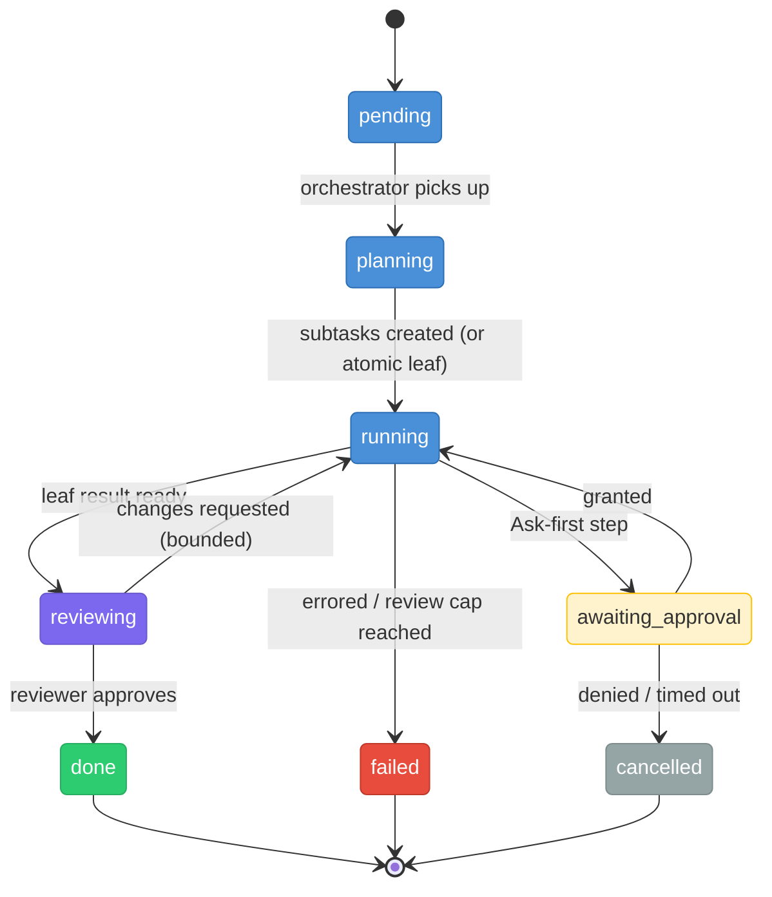
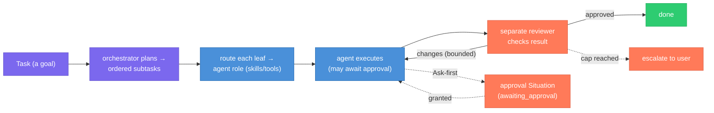

# Tasks

> **Status:** Approved
>
> **Version:** 1.2   ·   **Last updated:** 2026-06-10
>
> **Purpose:** The Task feature — an **agentic** unit of work: a *goal* given to an agent. A Task is **planned into subtasks**, each **routed** to the right agent and **executed**, then **reviewed** (review is **risk-based**, not blanket per-leaf). Owns the (recursive) Task entity, its status, the plan→execute→review journey, the mid-task **approval** pause (with **plan-level pre-approval / batching**), **plan-surfacing & live progress**, a **per-Task cost budget**, and **cancellation**.
>
> **Depends on:** [constitution](constitution.md), [data-model](data-model.md), [glossary](glossary.md)   ·   **Related:** [agents](agents.md), [agent-orchestration](agent-orchestration.md), [situations](situations.md), [curator](curator.md), [permissions](permissions.md), [proactivity](proactivity.md), [skills](skills.md), [tools](tools.md), [periodic-tasks](periodic-tasks.md), [app-architecture](app-architecture.md), [activity-log](activity-log.md)

> Requirement tag: **TASK**

---

## 1. Purpose & Scope

A **Task** is the System's unit of *doing*, and it is **agentic**: not a function to run, but a **goal handed to an agent** that reasons, uses tools, and may split the work. A Task is **planned first** into ordered **subtasks**; each subtask is **routed** to the agent role whose skills/tools fit, **executed** by that agent, and **reviewed** by a separate reviewer agent before it counts as done.

This spec owns the **Task entity** (which is **recursive** — a subtask *is* a Task), its **status**, the **plan → execute → review** journey, the **mid-task approval** pause (`awaiting_approval`), and **cancellation**. The *orchestrator's* internals and agent hand-offs are [agent-orchestration](agent-orchestration.md); the agent roles/skills are [agents](agents.md) / [skills](skills.md); the queue runtime is [app-architecture](app-architecture.md).

## 2. Non-Goals / Out of Scope

- **Not the orchestrator internals.** *How* the orchestrator/planner/reviewer agents coordinate and hand off is [agent-orchestration](agent-orchestration.md); this spec owns the Task's journey through them.
- **Not the agent roles.** Roles, skills, tools, sandboxes are [agents](agents.md) / [skills](skills.md) / [tools](tools.md).
- **Not the queue runtime.** Workers, polling, persistence are [app-architecture](app-architecture.md).
- **Not recurring work** ([periodic-tasks](periodic-tasks.md)), **not the autonomy tiers** ([constitution](constitution.md) §5 / [permissions](permissions.md)), **not approval surfacing** (the `approval` [Situation](situations.md) + [proactivity](proactivity.md)).
- **Explicitly NOT (kept simple):** retries, idempotency keys, dead-letter queues, backoff, leases/visibility-timeouts, saga/compensation, priority queues, exactly-once, workflow/durable-execution engines.

## 3. Background & Rationale

This is an **agentic** task queue, not a Celery-style one. A Celery task is a function plus arguments that a worker runs and returns. An agentic Task is a **goal** that an agent pursues — which means three things shape the model:

- **Plan-and-execute.** A non-trivial goal is **decomposed first** into a small plan of subtasks, then each subtask is run. This mirrors the orchestrator-workers pattern: break down, dispatch, synthesize.
- **Recursive.** A subtask is just a Task with a parent, so planning is "a Task creates child Tasks," and the same status machine, execution, approval, and cancellation apply at every level. A **leaf** (a Task the planner did not split) is the thing an agent actually executes; a **parent** is `done` when its children are.
- **Reviewed.** A leaf's result is checked by a **separate reviewer agent** (fresh context — a worker grading itself repeats its own blind spots). The reviewer either approves or sends actionable feedback for a bounded redo.

A Task is also the **attempt to change a [Situation](situations.md)** (REQ-SIT-11): the Situation is the condition; the Task is the action against it.

## 4. Concepts & Definitions

- **Task** — an agentic unit of work (`task_`): a goal pursued by an agent. Recursive.
- **Plan / decompose** — turning a goal into ordered child subtasks (§5.4).
- **Subtask** — a child Task (`parent_task_id` set).
- **Leaf / parent** — a Task with no children is executed; a parent aggregates its children.
- **Assigned role** — the agent role routed to execute a leaf (§5.5).
- **Orchestrator** — the agent that plans, routes, and spawns the reviewer ([agent-orchestration](agent-orchestration.md)).
- **Reviewer** — a *separate* agent that checks a leaf's result (§5.8) — a **quality** gate, distinct from the user's **permission** gate (§5.7).

## 5. Detailed Specification

### 5.1 What a Task is

> **REQ-TASK-01.** A Task (`task_`) is a **goal** to be achieved by an agent, in one Space ([data-model](data-model.md) REQ-DM-02). It is **recursive**: a subtask is itself a Task linked by `parent_task_id`. A Task is usually an **attempt to change a [Situation](situations.md)** (REQ-SIT-11) and may carry the Evidence that motivates it.

### 5.2 Status

> **REQ-TASK-02.** A Task's status is one of:
>
> | Status | Meaning |
> |--------|---------|
> | `pending` | enqueued, not yet started |
> | `planning` | the orchestrator is decomposing the goal into subtasks |
> | `running` | a leaf is being executed by its assigned agent (or a parent's subtasks are running) |
> | `awaiting_approval` | a leaf paused at an Ask-first step; the wait is the linked `approval` [Situation](situations.md) (§5.7) |
> | `reviewing` | a leaf's result is under review by a separate reviewer agent (§5.8) |
> | `done` | completed — a parent is `done` when all its subtasks are `done`. **Terminal.** |
> | `failed` | the work errored, or review exhausted its bounded iterations. **Terminal.** |
> | `cancelled` | stopped deliberately (see `cancel_reason`, §5.9). **Terminal.** |
>
> There is **no automatic retry** — the only "redo" is the bounded review loop (§5.8). A `failed` Task is re-enqueued by hand if wanted.

### 5.3 Enqueue

> **REQ-TASK-03.** A Task is enqueued by the **user**, an **[agent](agents.md)**, or the **[Curator](curator.md)** (and may originate from a Signal, an Insight, or chat). Each Task records its **creator**; its **assigned role** is set by routing (§5.5), not at creation.

### 5.4 Plan & decompose

> **REQ-TASK-04.** A Task is **planned before it is executed**. The orchestrator ([agent-orchestration](agent-orchestration.md)) reads the goal and decomposes it into a small, **ordered** set of child subtasks (each a Task with `parent_task_id` and `plan_order`). A goal the planner judges **atomic** gets **no children** and is executed directly as a leaf. A subtask may itself be planned (recursive), but decomposition stays **shallow** by default (a depth guard prevents runaway planning — OQ-TASK-1).

### 5.5 Routing & assignment

> **REQ-TASK-05.** Each **leaf** subtask is **routed** to the one [agent](agents.md) role whose **`description`/when-to-use + skills/tools** ([agents](agents.md) REQ-AGENT-03 / [skills](skills.md) / [tools](tools.md)) fit the subtask — deterministically when the required capability is obvious, by an LLM router (on the `description`) when it is ambiguous. The routing mechanism is owned by [agent-orchestration](agent-orchestration.md) REQ-AORCH-03; the chosen role is recorded as `assigned_role`.

### 5.6 Execution

> **REQ-TASK-06.** The assigned agent executes a **leaf** via its own agent loop (its role, skills, tools, sandbox — [agents](agents.md)). A **parent** does not execute directly; it is `done` when its subtasks complete (and `failed`/surfaced if a required subtask fails — OQ-TASK-4). Subtasks run respecting **`depends_on`** — independent subtasks run **in parallel** (up to a concurrency cap), dependent ones in order; the scheduling is owned by [agent-orchestration](agent-orchestration.md).

### 5.7 Mid-task approval

> **REQ-TASK-07.** When the executing agent reaches an **Ask-first** step ([constitution](constitution.md) §5, [permissions](permissions.md)):
> 1. it asks **before** doing the side effect — so a denial is a clean **no-op** (safety from ordering, not rollback);
> 2. **the blocked leaf** moves to **`awaiting_approval`** and raises an **`approval` [Situation](situations.md)** (REQ-SIT-04, §5.2) + a [proactivity](proactivity.md) push. Only the blocked leaf and the subtasks that `depends_on` it park; **independent parallel sibling leaves keep running** and the **parent stays `running`** ([agent-orchestration](agent-orchestration.md) REQ-AORCH-05). The parent reconciles when the parked leaf resolves;
> 3. **the `approval` Situation is the single source of truth for the decision** (it carries the suggested action and the deadline); the `awaiting_approval` **status mirrors it** and the two stay in lockstep. The **previewed action — the exact tool-call arguments — is frozen and persisted at park time** (REQ-TASK-13), so the granted action is what executes;
> 4. on **grant** → the leaf returns to `running`, the agent performs **the frozen action verbatim**, and continues; on **deny** → `cancelled` (`permission_denied`); on **no answer by the deadline** → the default is **park-and-hold** (stay `awaiting_approval`, the `approval` Situation keeps it visible) **rather than auto-cancel**, *except* where holding is itself unsafe (a time-sensitive action whose value expires, per [permissions](permissions.md)), where it `cancelled`s (`permission_timeout`). A denied/expired leaf cascades to its dependents (§5.9). Every decision is logged ([activity-log](activity-log.md)).

### 5.7a Plan-level pre-approval & batching

> **REQ-TASK-14.** To avoid **approval fatigue** ([constitution](constitution.md) §5.2 *anticipate-don't-nag*), a multi-step or file-heavy plan must not generate N serial one-by-one interrupts when the Ask-first steps are foreseeable. When planning (§5.4) surfaces the Ask-first steps a plan will reach, the System **pre-computes them and asks once**: a single **batched `approval` Situation** that lists the **N planned actions** (each with its frozen previewed action, REQ-TASK-13) for the user to **approve as a set** (or approve a subset / deny individually). A **batch grant pre-approves** those exact frozen actions, so the corresponding leaves **proceed without re-parking** when reached. Only steps that were **not foreseeable at plan time** (an action discovered mid-execution) fall back to the per-leaf pause (§5.7). Pre-approval still binds the **frozen** action (REQ-TASK-13) — a pre-approved action that drifts from what was approved re-parks. Every batch decision is logged ([activity-log](activity-log.md)).

### 5.8 Review

> **REQ-TASK-08.** Review is **risk-based, not blanket per-leaf** (resolves OQ-TASK-5). A leaf is reviewed when it is **risk-bearing** — it **acted** on the world (any Ask-first/Always side effect: outbound, destructive, or otherwise mutating per [permissions](permissions.md)) **or** the worker returned **low confidence** (self-reported uncertainty / explicit signal that the result may be wrong). A **pure read-only / internal** leaf (no external side effect, no mutation — e.g. a summary or an internal lookup) **skips review** and goes straight to `done`, saving the reviewer LLM call where it buys nothing. The risk classification is recorded on the leaf (`review_required`) and logged (REQ-TASK-11); when in doubt, **review** (fail safe toward review).
>
> When a leaf **is** reviewed, it is checked by a **separate reviewer agent** (fresh context — not the worker grading itself), status `reviewing`. The reviewer returns one of:
> - **`approved`** → the Task is `done`;
> - **`changes_requested`** (with **actionable feedback**) → the Task returns to `running` and the worker redoes it with the feedback. This loop is **bounded** (a small iteration cap); past the cap the Task **escalates to the user** (raised as a Situation) or ends `failed` (OQ-TASK-3).
>
> The reviewer's **approval is a *quality* gate** and is **distinct from the user's *permission* gate** (§5.7): one judges "is the result good?", the other "may I take this action?".

### 5.9 Cancellation

> **REQ-TASK-09.** A Task can be **cancelled** from any non-terminal state (`pending/planning/running/awaiting_approval/reviewing`), ending `cancelled` with a `cancel_reason`:
> - **`user`** — the user cancels it manually, anytime;
> - **`permission_denied` / `permission_timeout`** — the approval was denied or expired (§5.7);
> - **`parent_cancelled`** — a cancelled parent **cascades** to its unfinished subtasks (a subtask already `done` stays `done` — its work happened).
>
> Cancellation is **cooperative**: a running agent stops at its next step boundary. Because every Ask-first side effect is gated *before* it happens (§5.7), a cancel cannot leave a half-done irreversible action — so **no compensation/rollback is needed**.

### 5.10 Relationship to Situations

> **REQ-TASK-10.** A Task is an attempt to change a [Situation](situations.md) (REQ-SIT-11); a Task in `awaiting_approval` is what raises an `approval` Situation ([constitution](constitution.md) §5.2). Resolving the underlying condition resolves the Situation — closing a Task is not the same as resolving its Situation.

### 5.11 Observability

> **REQ-TASK-11.** A Task's **status**, its **review** outcomes, and every **approval decision** are observable and logged ([activity-log](activity-log.md)) with actor and time. A parent's subtasks are inspectable as its plan.

> **REQ-TASK-15.** Running work is **visible and observable**, not opaque (supports P9 transparency). Two contracts:
> 1. **Plan-surfacing on enqueue.** When planning (§5.4) produces a plan, that plan — the **ordered subtasks, their `assigned_role`, `depends_on`, and any foreseeable Ask-first steps** (REQ-TASK-14) — is **surfaced before execution begins**, so the work is inspectable up front (not only after the fact).
> 2. **Live task-progress observation.** While a Task runs, its **live progress is observable** — current per-leaf status transitions (§5.2), which leaves are running/parked/reviewing/done, and review iterations — emitted as they happen, not only on completion.
>
> This spec owns the **behavior/contract** (what is surfaced and when); how a client renders it is out of scope (§2). Control beyond cancel — **pause/edit of a running plan** — is an OQ (OQ-TASK-6); today the guaranteed control is **cancel** (§5.9).

### 5.12 Emitting a Signal

> **REQ-TASK-12.** A Task **may emit a [Signal](signals.md)** into the [Inbox](inbox.md). This is the capability that **replaces the watcher primitive**: a Task scheduled by a [Periodic Task](periodic-tasks.md) (REQ-PTASK-04) that polls a source and detects a meaningful change simply **emits a Signal**, which then flows through ingestion ([signals](signals.md) / [inbox](inbox.md)) like any other. Emitting is internal; the Signal is **untrusted data** thereafter (P12), handled by the normal pipeline.

### 5.13 Durable park & resume

> **REQ-TASK-13.** A park must survive a process restart across a multi-day approval wait. The orchestrator's working state lives **in memory** during a run, so a parked leaf persists only as a Task row is **not enough** to resume correctly. At park time the System **freezes and persists, alongside the parked Task**: (a) the **previewed tool-call arguments** — the exact action awaiting approval — so on **grant** the *approved* action executes **verbatim** (never a re-derived call); (b) the **parked-worker context** needed to resume that leaf; (c) the **done-set** (which sibling subtasks completed and their results); and (d) the **replan and review counters**. On grant the orchestrator rehydrates this state and resumes from the park point ([agent-orchestration](agent-orchestration.md) REQ-AORCH-14). This is **minimal durable state, not a workflow/durable-execution engine** — only what a correct resume requires (the explicit non-goal of §2 still holds: no saga/durable-execution machinery).

### 5.14 Per-Task cost budget

> **REQ-TASK-16.** A Task carries a **budget** — a cap on **tokens, monetary cost, and wallclock** — covering the *whole* recursive run (planning, routing, every leaf's execution, and reviews), not just an iteration count. The existing orchestration caps (decomposition depth OQ-TASK-1, review iterations OQ-TASK-3) bound *structure*; this bounds *spend*. Consumption accrues across the subtree against the **top-level Task's** budget (a parent's budget is the ceiling for its children). When the budget is **exhausted**, the orchestrator **stops spawning new work** and the Task **escalates to the user** (raised as a Situation) or ends `failed` — it does **not** silently keep spending. A budget is set at enqueue (with a Space/System default) and is observable (REQ-TASK-11). Token/cost accounting and rate/spend policy are owned by [token-cost-management](token-cost-management.md); this REQ owns only that **a Task is bounded by a budget and what happens at exhaustion**.

## 6. Visualizations

### 6.1 Task status



*Blue = active (`pending`/`planning`/`running`), amber = `awaiting_approval` (the wait = the `approval` Situation), violet = `reviewing`, green/red = succeeded/errored, grey = `cancelled`. **Any non-terminal state can go to `cancelled`** (user / denied / timeout / parent cascade — §5.9); the cancel edges are omitted from the diagram for readability.*

### 6.2 Plan → execute → review



## 7. Data Shapes

Conceptual — not a storage schema ([app-architecture](app-architecture.md)). IDs per [data-model](data-model.md) §5.1.

```ts
interface Task {              // agentic, recursive — a subtask is a Task
  id: string;                 // task_
  space_id: string;
  goal: string;               // the objective to achieve (not a function to call)
  status:
    | "pending" | "planning" | "running" | "awaiting_approval"
    | "reviewing" | "done" | "failed" | "cancelled";
  parent_task_id?: string;    // null = top-level; set = a subtask
  plan_order?: number;        // this subtask's place in the parent's plan
  depends_on: string[];       // sibling subtask ids this one waits for (independent ones run in parallel)
  assigned_role?: string;     // the agent role routed to run a leaf (set by routing, §5.5)
  created_by: "user" | "agent" | "curator";
  situation_id?: string;      // the Situation it acts on; or the open `approval` Situation while awaiting permission
  frozen_action?: {           // set while awaiting_approval — the previewed tool-call FROZEN at park time (REQ-TASK-13)
    tool: string;             // the action awaiting approval; on grant it executes verbatim
    args: Record<string, unknown>;
  };
  resume_state?: {            // minimal durable orchestration state for a correct restart (REQ-TASK-13)
    worker_context: string;   // the parked worker's context needed to resume this leaf
    done: string[];           // completed sibling subtask ids (the done-set)
    replan_count: number;
    review_iteration: number;
  };
  context_evidence_ids: string[];
  result?: string;            // the leaf's output, which the reviewer checks
  review_required?: boolean;  // risk-based (REQ-TASK-08): acting/destructive or low-confidence ⇒ true; pure read-only/internal ⇒ skip review
  review?: {                  // the reviewer's verdict — a quality gate, NOT user permission. Absent when review_required is false
    outcome: "approved" | "changes_requested";
    feedback?: string;
    iteration: number;        // bounded; escalates to the user past the cap
  };
  pre_approved?: boolean;     // set by a plan-level batch grant (REQ-TASK-14) — frozen action proceeds without re-parking
  budget?: {                  // per-Task cap over the whole recursive run (REQ-TASK-16); accrues to the top-level Task
    max_tokens?: number;
    max_cost?: number;        // monetary
    max_wallclock_ms?: number;
  };
  cancel_reason?: "user" | "permission_denied" | "permission_timeout" | "parent_cancelled";
  error?: string;
  created_at: Date;
  updated_at: Date;
}
```

## 8. Examples & Use Cases

### Example A — a goal is planned, executed, and reviewed (Given/When/Then)
- **Given** a Task *"prepare the Brightmoor portal handoff,"* status `pending`,
- **When** the orchestrator plans it (`planning`) into ordered subtasks — *(1) summarize open items → Research; (2) draft the handoff note → Research; (3) email it to Devin → Ops* —
- **Then** each leaf runs in order. Subtasks 1–2 are reviewed and `done`. Subtask 3 reaches the outbound-email step → `awaiting_approval` with an `approval` Situation; on **grant** it sends and is reviewed `approved` → `done`. The parent goes `done` when all three are (REQ-TASK-04…-08).

### Example B — a reviewer sends it back (narrative)
A *"draft the Framework RFC skeleton"* leaf finishes; the reviewer flags a missing alternatives section (`changes_requested`, feedback attached). The Task returns to `running`, the agent revises, the reviewer `approved`s it. Two iterations, within the cap (REQ-TASK-08).

### Example C — cancellation cascades (narrative)
The user cancels the parent *"prepare the handoff."* Subtask 3 (still `running`) goes `cancelled` (`parent_cancelled`); the already-`done` subtasks 1–2 stay `done`. No email was sent — the Ask-first step was gated before the side effect (REQ-TASK-09).

## 9. Edge Cases & Failure Modes

- **Runaway decomposition.** A planner that keeps splitting is bounded by a depth guard (OQ-TASK-1); a leaf is simply a Task the planner didn't split (REQ-TASK-04).
- **Review never satisfied.** The bounded loop caps iterations, then escalates to the user / fails — it does not loop forever (REQ-TASK-08).
- **Approval never answered.** The Task sits in `awaiting_approval`; the `approval` Situation keeps it visible; on the deadline it `cancelled`s (`permission_timeout`), or the user cancels first (REQ-TASK-07/09).
- **Subtask fails.** The orchestrator **replans** the remaining work; only if unrecoverable does the parent fail/surface ([agent-orchestration](agent-orchestration.md) REQ-AORCH-08).
- **Restart mid-flight.** Every Task is a persisted row; status, plan, and the `approval` Situation all survive. A *parked* leaf also persists its **frozen previewed action, parked-worker context, done-set, and replan/review counters** (REQ-TASK-13), so a resume after a multi-day wait + restart executes the *approved* action verbatim — **minimal durable state, no workflow engine** ([agent-orchestration](agent-orchestration.md) REQ-AORCH-14).
- **Self-review bias avoided.** Review is always a **separate** agent, never the worker grading itself (REQ-TASK-08).

## 10. Open Questions & Decisions

- **OQ-TASK-1** — The **decomposition depth guard** (how deep recursive planning may go) and what makes a goal "atomic."
- **OQ-TASK-2 (resolved)** — Subtasks use a **`depends_on` dependency graph**; independent ones run in **parallel** (scheduling owned by [agent-orchestration](agent-orchestration.md)).
- **OQ-TASK-3** — The **review iteration cap** and the **escalation** mechanism past it (a Situation vs `failed`).
- **OQ-TASK-4 (resolved)** — On a subtask failure the orchestrator **dynamically replans** the remaining work, escalating only when unrecoverable ([agent-orchestration](agent-orchestration.md) REQ-AORCH-08).
- **OQ-TASK-5 (resolved)** — Review is **risk-based**, not blanket per-leaf: review acting/destructive or low-confidence leaves, **skip** pure read-only/internal ones (REQ-TASK-08). The queue **runtime** is [app-architecture](app-architecture.md); the approval **deadline** default lives on the `approval` Situation.
- **OQ-TASK-6** — Control of a **running** plan **beyond cancel** — **pause** and **edit** (re-order/drop/amend subtasks mid-flight). Today the guaranteed control is cancel (§5.9); plan-surfacing + live progress (REQ-TASK-15) are the prerequisite visibility.

## 11. Review & Acceptance Checklist

- [ ] A Task is an agentic **goal**, recursive (subtask = Task), usually an attempt to change a Situation (REQ-TASK-01).
- [ ] The 8-state status set is specified, with `awaiting_approval` dedicated and no auto-retry (REQ-TASK-02).
- [ ] Enqueue (user/agent/Curator) and **plan-first decomposition** into ordered subtasks are specified (REQ-TASK-03/04).
- [ ] Leaves are **routed** by skills/tools and executed by the assigned agent; a parent is done when its children are (REQ-TASK-05/06).
- [ ] Mid-task approval uses the dedicated `awaiting_approval` status **mirroring** the `approval` Situation (single source of truth), gated before the side effect, with grant/deny/timeout outcomes; only the **blocked leaf + dependents** park while independent siblings keep running and the parent stays `running` (REQ-TASK-07).
- [ ] A park **freezes & persists** the previewed action, parked-worker context, done-set, and replan/review counters; resume after restart executes the *approved* action verbatim — minimal durable state, no workflow engine (REQ-TASK-13).
- [ ] Review is **risk-based** (acting/destructive or low-confidence reviewed; pure read-only/internal skipped), by a **separate** reviewer agent, bounded, with reviewer-*quality* distinct from user-*permission* (REQ-TASK-08).
- [ ] **Plan-level pre-approval / batching** asks once for foreseeable Ask-first steps (a batched `approval` Situation over N frozen actions), with timeout defaulting to **park-and-hold** where safe (REQ-TASK-14/07).
- [ ] The **plan is surfaced on enqueue** and **live progress is observable** during a run; behavior/contract only, client rendering out of scope (REQ-TASK-15).
- [ ] A Task is bounded by a **per-Task budget** (tokens/cost/wallclock) over the whole recursive run; exhaustion escalates/fails, never silent spend (REQ-TASK-16, → [token-cost-management](token-cost-management.md)).
- [ ] Cancellation is a terminal state from any non-terminal one, with `cancel_reason`, cascade to subtasks, cooperative, no compensation (REQ-TASK-09).
- [ ] Situation relationship and observability/audit are specified (REQ-TASK-10/11). Examples use the [constitution](constitution.md) §7 cast; no enterprise machinery.
- [ ] Subtasks carry `depends_on` (parallel where independent); a Task may **emit a Signal** (replaces the watcher) (REQ-TASK-06/12).

## 12. Cross-References

- [agent-orchestration](agent-orchestration.md) — the orchestrator/planner/reviewer agents and their hand-offs that drive a Task's journey.
- [agents](agents.md) / [skills](skills.md) / [tools](tools.md) — the roles and capabilities routing assigns and execution uses.
- [situations](situations.md) — a Task is an attempt to change a Situation (REQ-SIT-11); the `approval` Situation that represents a permission wait (REQ-SIT-04).
- [constitution](constitution.md) §5 / [permissions](permissions.md) — the Always/Ask-first/Never gate this spec invokes. [proactivity](proactivity.md) — surfaces approvals/escalations.
- [curator](curator.md) — an enqueuer. [periodic-tasks](periodic-tasks.md) — recurring Tasks. [app-architecture](app-architecture.md) — the queue runtime. [activity-log](activity-log.md) — the audit.
- [token-cost-management](token-cost-management.md) — token/cost accounting and spend policy behind the per-Task budget (REQ-TASK-16).

**Design lineage.** The model follows **orchestrator-workers** + **plan-and-execute** (decompose → dispatch → synthesize) and **evaluator-optimizer** (generate → review → refine, bounded) from the documented agent-pattern literature (e.g. Anthropic, "Building Effective Agents"), with a **separate reviewer** (not self-critique) to avoid self-grading bias, and the **approve-before-act** gate so the approval pause needs only **minimal durable state** (the frozen action + resume state, REQ-TASK-13) rather than a full durable-execution engine.

## 13. Changelog

- **2026-06-04 — v0.1** — Initial draft. A deliberately simple, Celery-style Task (status/assignment/queue) with mid-task approval via the `approval` Situation and no waiting status.
- **2026-06-04 — v0.2** — **Reframed as agentic.** A Task is now a **goal**, **recursive** (subtask = Task, `parent_task_id`), **planned-first** into ordered subtasks (REQ-TASK-04), **routed** to an agent role by skills/tools (REQ-TASK-05), executed (REQ-TASK-06), and **reviewed by a separate reviewer agent** in a bounded loop (REQ-TASK-08, reviewer-quality distinct from user-permission). Added the **dedicated `awaiting_approval` status** mirroring the `approval` Situation (REQ-TASK-07) and full **cancellation** with `cancel_reason` + cascade (REQ-TASK-09). Status set is now `pending/planning/running/awaiting_approval/reviewing/done/failed/cancelled`. Still no enterprise queue machinery.
- **2026-06-04 — v0.3** — Added **`depends_on`** to subtasks (parallel where independent — resolves OQ-TASK-2) and noted **dynamic replanning** (resolves OQ-TASK-4, → [agent-orchestration](agent-orchestration.md)); added **REQ-TASK-12: a Task may emit a [Signal](signals.md)** (replaces the watcher primitive, [periodic-tasks](periodic-tasks.md) REQ-PTASK-04); **improved the §6.1 status diagram** (color-coded by state class).
- **2026-06-04 — v0.4** — Aligned **REQ-TASK-05 routing** with [agent-orchestration](agent-orchestration.md) REQ-AORCH-03: routing is on an agent's **`description`/when-to-use + skills/tools** (deterministic-then-semantic), not skills/tools alone; the routing mechanism is owned by agent-orchestration.
- **2026-06-04 — v1.0** — Approved.
- **2026-06-10 — v1.1** — **(stays Approved.)** Resolved an `awaiting_approval` contradiction and added durable-resume guarantees, kept consistent with [agent-orchestration](agent-orchestration.md): **REQ-TASK-07** now states the pause parks **only the blocked leaf + its dependents** while independent sibling leaves keep running and the **parent stays `running`** (matching the leaf-level definition in REQ-TASK-02), and that the previewed action is **frozen** so grant executes it verbatim. **New REQ-TASK-13** requires freezing & persisting the previewed tool-call args, parked-worker context, done-set, and replan/review counters at park time for a correct restart, and softens the "no engine needed" overclaim to **"minimal durable state, no workflow engine"** (§9 edge case and §12 lineage updated to match). Added `frozen_action` and `resume_state` to the §7 Task shape; updated the §11 checklist.
- **2026-06-10 — v1.2** — **(stays Approved.)** Four material changes. **REQ-TASK-08** is now **risk-based review** (resolves OQ-TASK-5): only acting/destructive or low-confidence leaves are reviewed, pure read-only/internal leaves **skip review** (with `review_required` recorded), cutting the per-leaf reviewer LLM call where it buys nothing. **New REQ-TASK-14 (§5.7a) plan-level pre-approval / batching**: foreseeable Ask-first steps are pre-computed and asked **once** as a batched `approval` Situation over N frozen actions (P5.2 anticipate-don't-nag), and **REQ-TASK-07** timeout default softens from auto-cancel to **park-and-hold** where safe (still `permission_timeout`-cancel for value-expiring actions). **New REQ-TASK-15** adds **plan-surfacing on enqueue** and **live task-progress observation** contracts (P9 transparency; client rendering out of scope), and opens **OQ-TASK-6** (pause/edit of a running plan). **New REQ-TASK-16 (§5.14) per-Task budget** (tokens/cost/wallclock over the whole recursive run; exhaustion escalates/fails, never silent spend), cross-referencing [token-cost-management](token-cost-management.md). Added `review_required`, `pre_approved`, and `budget` to the §7 Task shape; updated the §11 checklist and §12 cross-refs.
