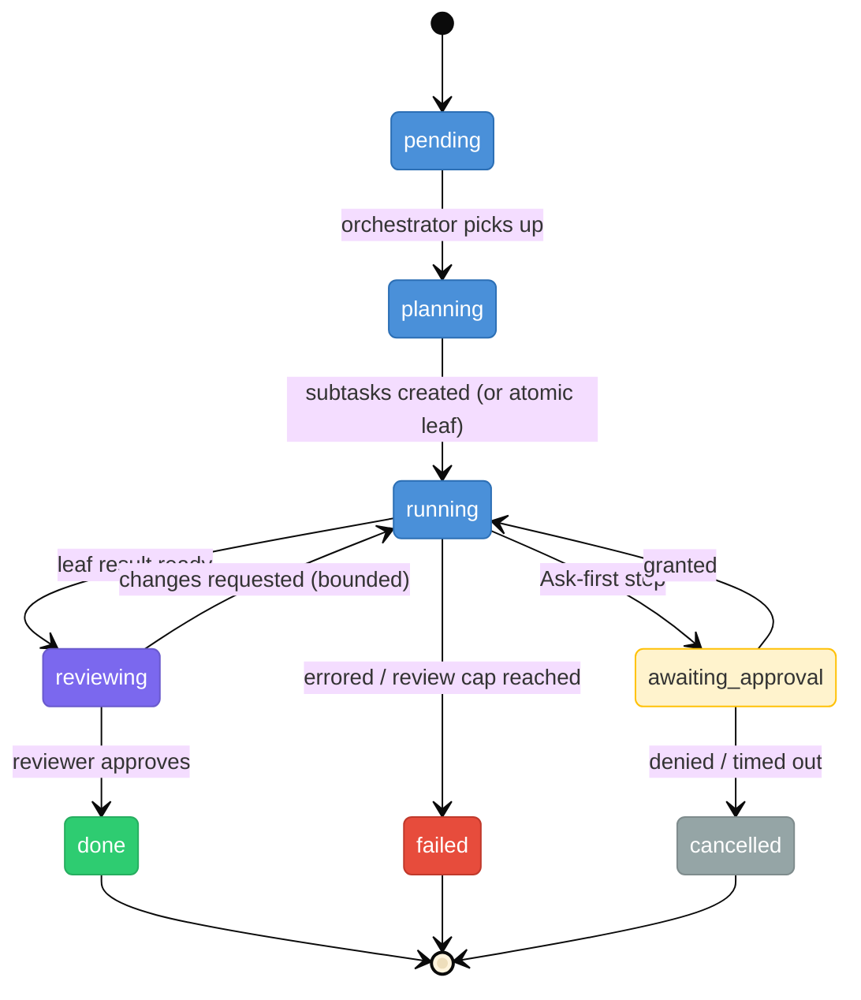

# Tasks

> **Status:** Approved
>
> **Version:** 1.0   ·   **Last updated:** 2026-06-04
>
> **Purpose:** The Task feature — an **agentic** unit of work: a *goal* given to an agent. A Task is **planned into subtasks**, each **routed** to the right agent and **executed**, then **reviewed**. Owns the (recursive) Task entity, its status, the plan→execute→review journey, the mid-task **approval** pause, and **cancellation**.
>
> **Load this when:** Building or changing how work is enqueued, planned/decomposed, assigned, executed, reviewed, paused for the user's permission, or cancelled.
>
> **Depends on:** [constitution](constitution.md), [data-model](data-model.md), [glossary](glossary.md)   ·   **Related:** [agents](agents.md), [agent-orchestration](agent-orchestration.md), [situations](situations.md), [curator](curator.md), [permissions](permissions.md), [proactivity](proactivity.md), [skills](skills.md), [tools](tools.md), [periodic-tasks](periodic-tasks.md), [app-architecture](app-architecture.md), [activity-log](activity-log.md)

> Requirement tag: **TASK**

---

## 1. Purpose & Scope

A **Task** is the System's unit of *doing*, and it is **agentic**: not a function to run, but a **goal handed to an agent** that reasons, uses tools, and may split the work. A Task is **planned first** into ordered **subtasks**; each subtask is **routed** to the agent role whose skills/tools fit, **executed** by that agent, and **reviewed** by a separate reviewer agent before it counts as done.

This spec owns the **Task entity** (which is **recursive** — a subtask *is* a Task), its **status**, the **plan → execute → review** journey, the **mid-task approval** pause (`awaiting_approval`), and **cancellation**. The *orchestrator's* internals and agent hand-offs are [agent-orchestration](agent-orchestration.md); the agent roles/skills are [agents](agents.md) / [skills](skills.md); the queue runtime is [app-architecture](app-architecture.md).

## 2. Non-Goals / Out of Scope

- **Not the orchestrator internals.** *How* the orchestrator/planner/reviewer agents coordinate and hand off is [agent-orchestration](agent-orchestration.md); this spec owns the Task's journey through them.
- **Not the agent roles.** Roles, skills, tools, sandboxes are [agents](agents.md) / [skills](skills.md) / [tools](tools.md).
- **Not the queue runtime.** Workers, polling, persistence are [app-architecture](app-architecture.md).
- **Not recurring work** ([periodic-tasks](periodic-tasks.md)), **not the autonomy tiers** ([constitution](constitution.md) §5 / [permissions](permissions.md)), **not approval surfacing** (the `approval` [Situation](situations.md) + [proactivity](proactivity.md)).
- **Explicitly NOT (kept simple):** retries, idempotency keys, dead-letter queues, backoff, leases/visibility-timeouts, saga/compensation, priority queues, exactly-once, workflow/durable-execution engines.

## 3. Background & Rationale

This is an **agentic** task queue, not a Celery-style one. A Celery task is a function plus arguments that a worker runs and returns. An agentic Task is a **goal** that an agent pursues — which means three things shape the model:

- **Plan-and-execute.** A non-trivial goal is **decomposed first** into a small plan of subtasks, then each subtask is run. This mirrors the orchestrator-workers pattern: break down, dispatch, synthesize.
- **Recursive.** A subtask is just a Task with a parent, so planning is "a Task creates child Tasks," and the same status machine, execution, approval, and cancellation apply at every level. A **leaf** (a Task the planner did not split) is the thing an agent actually executes; a **parent** is `done` when its children are.
- **Reviewed.** A leaf's result is checked by a **separate reviewer agent** (fresh context — a worker grading itself repeats its own blind spots). The reviewer either approves or sends actionable feedback for a bounded redo.

A Task is also the **attempt to change a [Situation](situations.md)** (REQ-SIT-11): the Situation is the condition; the Task is the action against it.

## 4. Concepts & Definitions

- **Task** — an agentic unit of work (`task_`): a goal pursued by an agent. Recursive.
- **Plan / decompose** — turning a goal into ordered child subtasks (§5.4).
- **Subtask** — a child Task (`parent_task_id` set).
- **Leaf / parent** — a Task with no children is executed; a parent aggregates its children.
- **Assigned role** — the agent role routed to execute a leaf (§5.5).
- **Orchestrator** — the agent that plans, routes, and spawns the reviewer ([agent-orchestration](agent-orchestration.md)).
- **Reviewer** — a *separate* agent that checks a leaf's result (§5.8) — a **quality** gate, distinct from the user's **permission** gate (§5.7).

## 5. Detailed Specification

### 5.1 What a Task is

> **REQ-TASK-01.** A Task (`task_`) is a **goal** to be achieved by an agent, in one Space ([data-model](data-model.md) REQ-DM-02). It is **recursive**: a subtask is itself a Task linked by `parent_task_id`. A Task is usually an **attempt to change a [Situation](situations.md)** (REQ-SIT-11) and may carry the Evidence that motivates it.

### 5.2 Status

> **REQ-TASK-02.** A Task's status is one of:
>
> | Status | Meaning |
> |--------|---------|
> | `pending` | enqueued, not yet started |
> | `planning` | the orchestrator is decomposing the goal into subtasks |
> | `running` | a leaf is being executed by its assigned agent (or a parent's subtasks are running) |
> | `awaiting_approval` | a leaf paused at an Ask-first step; the wait is the linked `approval` [Situation](situations.md) (§5.7) |
> | `reviewing` | a leaf's result is under review by a separate reviewer agent (§5.8) |
> | `done` | completed — a parent is `done` when all its subtasks are `done`. **Terminal.** |
> | `failed` | the work errored, or review exhausted its bounded iterations. **Terminal.** |
> | `cancelled` | stopped deliberately (see `cancel_reason`, §5.9). **Terminal.** |
>
> There is **no automatic retry** — the only "redo" is the bounded review loop (§5.8). A `failed` Task is re-enqueued by hand if wanted.

### 5.3 Enqueue

> **REQ-TASK-03.** A Task is enqueued by the **user**, an **[agent](agents.md)**, or the **[Curator](curator.md)** (and may originate from a Signal, an Insight, or chat). Each Task records its **creator**; its **assigned role** is set by routing (§5.5), not at creation.

### 5.4 Plan & decompose

> **REQ-TASK-04.** A Task is **planned before it is executed**. The orchestrator ([agent-orchestration](agent-orchestration.md)) reads the goal and decomposes it into a small, **ordered** set of child subtasks (each a Task with `parent_task_id` and `plan_order`). A goal the planner judges **atomic** gets **no children** and is executed directly as a leaf. A subtask may itself be planned (recursive), but decomposition stays **shallow** by default (a depth guard prevents runaway planning — OQ-TASK-1).

### 5.5 Routing & assignment

> **REQ-TASK-05.** Each **leaf** subtask is **routed** to the one [agent](agents.md) role whose **`description`/when-to-use + skills/tools** ([agents](agents.md) REQ-AGENT-03 / [skills](skills.md) / [tools](tools.md)) fit the subtask — deterministically when the required capability is obvious, by an LLM router (on the `description`) when it is ambiguous. The routing mechanism is owned by [agent-orchestration](agent-orchestration.md) REQ-AORCH-03; the chosen role is recorded as `assigned_role`.

### 5.6 Execution

> **REQ-TASK-06.** The assigned agent executes a **leaf** via its own agent loop (its role, skills, tools, sandbox — [agents](agents.md)). A **parent** does not execute directly; it is `done` when its subtasks complete (and `failed`/surfaced if a required subtask fails — OQ-TASK-4). Subtasks run respecting **`depends_on`** — independent subtasks run **in parallel** (up to a concurrency cap), dependent ones in order; the scheduling is owned by [agent-orchestration](agent-orchestration.md).

### 5.7 Mid-task approval

> **REQ-TASK-07.** When the executing agent reaches an **Ask-first** step ([constitution](constitution.md) §5, [permissions](permissions.md)):
> 1. it asks **before** doing the side effect — so a denial is a clean **no-op** (safety from ordering, not rollback);
> 2. the Task moves to **`awaiting_approval`** and raises an **`approval` [Situation](situations.md)** (REQ-SIT-04, §5.2) + a [proactivity](proactivity.md) push;
> 3. **the `approval` Situation is the single source of truth for the decision** (it carries the suggested action and the deadline); the `awaiting_approval` **status mirrors it** and the two stay in lockstep;
> 4. on **grant** → the Task returns to `running`, the agent performs the action, and continues; on **deny** → `cancelled` (`permission_denied`); on **no answer by the deadline** → `cancelled` (`permission_timeout`). Every decision is logged ([activity-log](activity-log.md)).

### 5.8 Review

> **REQ-TASK-08.** When a leaf finishes, its result is checked by a **separate reviewer agent** (fresh context — not the worker grading itself), status `reviewing`. The reviewer returns one of:
> - **`approved`** → the Task is `done`;
> - **`changes_requested`** (with **actionable feedback**) → the Task returns to `running` and the worker redoes it with the feedback. This loop is **bounded** (a small iteration cap); past the cap the Task **escalates to the user** (raised as a Situation) or ends `failed` (OQ-TASK-3).
>
> The reviewer's **approval is a *quality* gate** and is **distinct from the user's *permission* gate** (§5.7): one judges "is the result good?", the other "may I take this action?".

### 5.9 Cancellation

> **REQ-TASK-09.** A Task can be **cancelled** from any non-terminal state (`pending/planning/running/awaiting_approval/reviewing`), ending `cancelled` with a `cancel_reason`:
> - **`user`** — the user cancels it manually, anytime;
> - **`permission_denied` / `permission_timeout`** — the approval was denied or expired (§5.7);
> - **`parent_cancelled`** — a cancelled parent **cascades** to its unfinished subtasks (a subtask already `done` stays `done` — its work happened).
>
> Cancellation is **cooperative**: a running agent stops at its next step boundary. Because every Ask-first side effect is gated *before* it happens (§5.7), a cancel cannot leave a half-done irreversible action — so **no compensation/rollback is needed**.

### 5.10 Relationship to Situations

> **REQ-TASK-10.** A Task is an attempt to change a [Situation](situations.md) (REQ-SIT-11); a Task in `awaiting_approval` is what raises an `approval` Situation ([constitution](constitution.md) §5.2). Resolving the underlying condition resolves the Situation — closing a Task is not the same as resolving its Situation.

### 5.11 Observability

> **REQ-TASK-11.** A Task's **status**, its **review** outcomes, and every **approval decision** are observable and logged ([activity-log](activity-log.md)) with actor and time. A parent's subtasks are inspectable as its plan.

### 5.12 Emitting a Signal

> **REQ-TASK-12.** A Task **may emit a [Signal](signals.md)** into the [Inbox](inbox.md). This is the capability that **replaces the watcher primitive**: a Task scheduled by a [Periodic Task](periodic-tasks.md) (REQ-PTASK-04) that polls a source and detects a meaningful change simply **emits a Signal**, which then flows through ingestion ([signals](signals.md) / [inbox](inbox.md)) like any other. Emitting is internal; the Signal is **untrusted data** thereafter (P12), handled by the normal pipeline.

## 6. Visualizations

### 6.1 Task status



*Blue = active (`pending`/`planning`/`running`), amber = `awaiting_approval` (the wait = the `approval` Situation), violet = `reviewing`, green/red = succeeded/errored, grey = `cancelled`. **Any non-terminal state can go to `cancelled`** (user / denied / timeout / parent cascade — §5.9); the cancel edges are omitted from the diagram for readability.*

### 6.2 Plan → execute → review


## 7. Data Shapes

Conceptual — not a storage schema ([app-architecture](app-architecture.md)). IDs per [data-model](data-model.md) §5.1.

```ts
interface Task {              // agentic, recursive — a subtask is a Task
  id: string;                 // task_
  space_id: string;
  goal: string;               // the objective to achieve (not a function to call)
  status:
    | "pending" | "planning" | "running" | "awaiting_approval"
    | "reviewing" | "done" | "failed" | "cancelled";
  parent_task_id?: string;    // null = top-level; set = a subtask
  plan_order?: number;        // this subtask's place in the parent's plan
  depends_on: string[];       // sibling subtask ids this one waits for (independent ones run in parallel)
  assigned_role?: string;     // the agent role routed to run a leaf (set by routing, §5.5)
  created_by: "user" | "agent" | "curator";
  situation_id?: string;      // the Situation it acts on; or the open `approval` Situation while awaiting permission
  context_evidence_ids: string[];
  result?: string;            // the leaf's output, which the reviewer checks
  review?: {                  // the reviewer's verdict — a quality gate, NOT user permission
    outcome: "approved" | "changes_requested";
    feedback?: string;
    iteration: number;        // bounded; escalates to the user past the cap
  };
  cancel_reason?: "user" | "permission_denied" | "permission_timeout" | "parent_cancelled";
  error?: string;
  created_at: Date;
  updated_at: Date;
}
```

## 8. Examples & Use Cases

### Example A — a goal is planned, executed, and reviewed (Given/When/Then)
- **Given** a Task *"prepare the Brightmoor portal handoff,"* status `pending`,
- **When** the orchestrator plans it (`planning`) into ordered subtasks — *(1) summarize open items → Research; (2) draft the handoff note → Research; (3) email it to Devin → Ops* —
- **Then** each leaf runs in order. Subtasks 1–2 are reviewed and `done`. Subtask 3 reaches the outbound-email step → `awaiting_approval` with an `approval` Situation; on **grant** it sends and is reviewed `approved` → `done`. The parent goes `done` when all three are (REQ-TASK-04…-08).

### Example B — a reviewer sends it back (narrative)
A *"draft the Framework RFC skeleton"* leaf finishes; the reviewer flags a missing alternatives section (`changes_requested`, feedback attached). The Task returns to `running`, the agent revises, the reviewer `approved`s it. Two iterations, within the cap (REQ-TASK-08).

### Example C — cancellation cascades (narrative)
The user cancels the parent *"prepare the handoff."* Subtask 3 (still `running`) goes `cancelled` (`parent_cancelled`); the already-`done` subtasks 1–2 stay `done`. No email was sent — the Ask-first step was gated before the side effect (REQ-TASK-09).

## 9. Edge Cases & Failure Modes

- **Runaway decomposition.** A planner that keeps splitting is bounded by a depth guard (OQ-TASK-1); a leaf is simply a Task the planner didn't split (REQ-TASK-04).
- **Review never satisfied.** The bounded loop caps iterations, then escalates to the user / fails — it does not loop forever (REQ-TASK-08).
- **Approval never answered.** The Task sits in `awaiting_approval`; the `approval` Situation keeps it visible; on the deadline it `cancelled`s (`permission_timeout`), or the user cancels first (REQ-TASK-07/09).
- **Subtask fails.** The orchestrator **replans** the remaining work; only if unrecoverable does the parent fail/surface ([agent-orchestration](agent-orchestration.md) REQ-AORCH-08).
- **Restart mid-flight.** Every Task is a persisted row; status, plan, and the `approval` Situation all survive — no engine needed.
- **Self-review bias avoided.** Review is always a **separate** agent, never the worker grading itself (REQ-TASK-08).

## 10. Open Questions & Decisions

- **OQ-TASK-1** — The **decomposition depth guard** (how deep recursive planning may go) and what makes a goal "atomic."
- **OQ-TASK-2 (resolved)** — Subtasks use a **`depends_on` dependency graph**; independent ones run in **parallel** (scheduling owned by [agent-orchestration](agent-orchestration.md)).
- **OQ-TASK-3** — The **review iteration cap** and the **escalation** mechanism past it (a Situation vs `failed`).
- **OQ-TASK-4 (resolved)** — On a subtask failure the orchestrator **dynamically replans** the remaining work, escalating only when unrecoverable ([agent-orchestration](agent-orchestration.md) REQ-AORCH-08).
- **OQ-TASK-5** — Whether review is **per-leaf always**, or risk-based (skip pure-internal leaves). The queue **runtime** is [app-architecture](app-architecture.md); the approval **deadline** default lives on the `approval` Situation.

## 11. Review & Acceptance Checklist

- [ ] A Task is an agentic **goal**, recursive (subtask = Task), usually an attempt to change a Situation (REQ-TASK-01).
- [ ] The 8-state status set is specified, with `awaiting_approval` dedicated and no auto-retry (REQ-TASK-02).
- [ ] Enqueue (user/agent/Curator) and **plan-first decomposition** into ordered subtasks are specified (REQ-TASK-03/04).
- [ ] Leaves are **routed** by skills/tools and executed by the assigned agent; a parent is done when its children are (REQ-TASK-05/06).
- [ ] Mid-task approval uses the dedicated `awaiting_approval` status **mirroring** the `approval` Situation (single source of truth), gated before the side effect, with grant/deny/timeout outcomes (REQ-TASK-07).
- [ ] Review is a **separate** reviewer agent, bounded, with reviewer-*quality* distinct from user-*permission* (REQ-TASK-08).
- [ ] Cancellation is a terminal state from any non-terminal one, with `cancel_reason`, cascade to subtasks, cooperative, no compensation (REQ-TASK-09).
- [ ] Situation relationship and observability/audit are specified (REQ-TASK-10/11). Examples use the [constitution](constitution.md) §7 cast; no enterprise machinery.
- [ ] Subtasks carry `depends_on` (parallel where independent); a Task may **emit a Signal** (replaces the watcher) (REQ-TASK-06/12).

## 12. Cross-References

- [agent-orchestration](agent-orchestration.md) — the orchestrator/planner/reviewer agents and their hand-offs that drive a Task's journey.
- [agents](agents.md) / [skills](skills.md) / [tools](tools.md) — the roles and capabilities routing assigns and execution uses.
- [situations](situations.md) — a Task is an attempt to change a Situation (REQ-SIT-11); the `approval` Situation that represents a permission wait (REQ-SIT-04).
- [constitution](constitution.md) §5 / [permissions](permissions.md) — the Always/Ask-first/Never gate this spec invokes. [proactivity](proactivity.md) — surfaces approvals/escalations.
- [curator](curator.md) — an enqueuer. [periodic-tasks](periodic-tasks.md) — recurring Tasks. [app-architecture](app-architecture.md) — the queue runtime. [activity-log](activity-log.md) — the audit.

**Design lineage.** The model follows **orchestrator-workers** + **plan-and-execute** (decompose → dispatch → synthesize) and **evaluator-optimizer** (generate → review → refine, bounded) from the documented agent-pattern literature (e.g. Anthropic, "Building Effective Agents"), with a **separate reviewer** (not self-critique) to avoid self-grading bias, and the **approve-before-act** gate so the approval pause needs no durable-execution engine.

## 13. Changelog

- **2026-06-04 — v0.1** — Initial draft. A deliberately simple, Celery-style Task (status/assignment/queue) with mid-task approval via the `approval` Situation and no waiting status.
- **2026-06-04 — v0.2** — **Reframed as agentic.** A Task is now a **goal**, **recursive** (subtask = Task, `parent_task_id`), **planned-first** into ordered subtasks (REQ-TASK-04), **routed** to an agent role by skills/tools (REQ-TASK-05), executed (REQ-TASK-06), and **reviewed by a separate reviewer agent** in a bounded loop (REQ-TASK-08, reviewer-quality distinct from user-permission). Added the **dedicated `awaiting_approval` status** mirroring the `approval` Situation (REQ-TASK-07) and full **cancellation** with `cancel_reason` + cascade (REQ-TASK-09). Status set is now `pending/planning/running/awaiting_approval/reviewing/done/failed/cancelled`. Still no enterprise queue machinery.
- **2026-06-04 — v0.3** — Added **`depends_on`** to subtasks (parallel where independent — resolves OQ-TASK-2) and noted **dynamic replanning** (resolves OQ-TASK-4, → [agent-orchestration](agent-orchestration.md)); added **REQ-TASK-12: a Task may emit a [Signal](signals.md)** (replaces the watcher primitive, [periodic-tasks](periodic-tasks.md) REQ-PTASK-04); **improved the §6.1 status diagram** (color-coded by state class).
- **2026-06-04 — v0.4** — Aligned **REQ-TASK-05 routing** with [agent-orchestration](agent-orchestration.md) REQ-AORCH-03: routing is on an agent's **`description`/when-to-use + skills/tools** (deterministic-then-semantic), not skills/tools alone; the routing mechanism is owned by agent-orchestration.
- **2026-06-04 — v1.0** — Approved.
