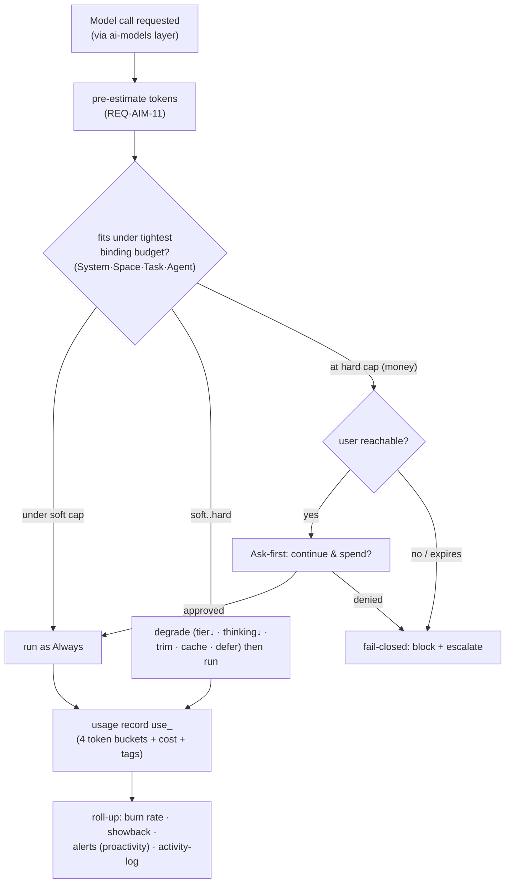

# Token & Cost Management

> **Status:** Approved
>
> **Version:** 1.0   ·   **Last updated:** 2026-06-09
>
> **Purpose:** The **accounting and governance layer** over every model call — metering token usage, attributing spend to a Space / Task / Agent / model, enforcing **hierarchical budgets and caps**, and **degrading rather than failing** at the limit. It answers *"how much did that cost, who spent it, and what happens when the budget runs out?"* — the money/compute analogue of [proactivity](proactivity.md)'s attention budget.
>
> **Depends on:** [constitution](constitution.md), [ai-models](ai-models.md), [app-architecture](app-architecture.md)   ·   **Related:** [proactivity](proactivity.md), [tasks](tasks.md), [agents](agents.md), [agent-orchestration](agent-orchestration.md), [periodic-tasks](periodic-tasks.md), [spaces](spaces.md), [settings](settings.md), [activity-log](activity-log.md), [glossary](glossary.md)

> Requirement tag: **TOK**

---

## 1. Purpose & Scope

A self-hosted assistant runs **continuous** model work — high-volume extraction on every Signal, nightly reflection, agentic Tasks that fan out into many calls. Left ungoverned, a single recursive Task or a flapping watcher can burn an unbounded amount of remote-API money or saturate local hardware. This spec is the **budget-keeper for compute and spend**, sitting *after* [ai-models](ai-models.md) picks and runs a model.

This spec owns:

- **Metering** — a per-call **usage record** capturing input / output / cache-read / cache-write tokens and the derived cost (§5.1–5.2).
- **Attribution** — every record tagged to the **Space · Task · Agent · model · purpose** that spent it (§5.3).
- **Budgets & caps** — a **hierarchy** of budgets (System → Space → Task → Agent) over a rolling window, with **hard** and **soft** limits and a token-bucket rate ceiling (§5.4–5.6).
- **Enforcement & degradation** — what happens at the cap: **degrade** (cheaper tier / less context / drop a feature), **Ask-first** to continue, or **block** (fail-closed) — wired to the [constitution](constitution.md) autonomy model (§5.7–5.8).
- **Observability** — spend dashboards, **burn-rate** alerts, and the attribution feed into the [activity-log](activity-log.md) (§5.9).

## 2. Non-Goals / Out of Scope

- **Not model selection or the call itself.** *Which* model runs, the fallback chain, prompt-caching mechanics, context-window fitting, and the `usage` object that a call returns are owned by [ai-models](ai-models.md) (REQ-AIM-05/06/10/11/12). This spec **consumes** that `usage` object — it does not produce it. The cost-reduction *levers* (caching, tier downshift, context trimming, dedup, batching) live in their owning specs; here they are only the **menu of degradations** (§5.8).
- **Not the attention budget.** [proactivity](proactivity.md)'s notification budget (REQ-PROACT-06) rations **user interruption**; this spec rations **compute/money**. Same token-bucket shape, different scarce resource — they do not share a counter (§3).
- **Not persistence or the event bus.** The meter table, budget rows, the rolling-window store, and the audit append are realized in the System DB / outbox by [app-architecture](app-architecture.md) (REQ-ARCH-03/12/19); this spec defines their **conceptual shape and semantics**, not their storage.
- **Not the concurrency cap.** Parallel-worker throttling is [app-architecture](app-architecture.md) REQ-ARCH-08; a token budget is orthogonal (a single serial Task can blow a budget without ever hitting the concurrency cap).
- **Not provider pricing truth.** Per-model prices are a **dated card field** ([ai-models](ai-models.md) REQ-AIM-02 `Cost`); this spec reads them, it does not maintain them.
- **Not billing/invoicing.** There is no external billing integration; spend is **showback to the user**, who owns the deployment (P1) — not chargeback to a vendor.

## 3. Background & Rationale

Production LLM-agent platforms converge on the same control plane: **meter every call, attribute it, cap it hierarchically, and enforce before the next call — not after an alert.** LiteLLM's proxy sets `max_budget` + `budget_duration` and `tpm_limit`/`rpm_limit` at **Key / User / Team / Org** levels; Langfuse and Helicone record per-call `input / output / cache_read` tokens and compute cost from a model price table; FinOps practice tags each transaction and runs **burn-rate** projections. The hard lesson across all of them: an **LLM API call is a transaction, not a taggable resource**, so attribution metadata must be captured **at the application layer** and carried through — there is nothing to tag after the fact.

◆ **Source pattern — LiteLLM hierarchical budgets.** Spend limits set at **Key · User · Team · Org**, with `max_budget` over a `budget_duration` window plus `tpm`/`rpm` rate limits; enforced **before** the call. Our hierarchy (§5.4) is the same shape mapped onto the System's primitives: **System → Space → Task → Agent**.

◆ **Source pattern — Anthropic `usage` object.** A response reports `input_tokens`, `output_tokens`, `cache_creation_input_tokens`, `cache_read_input_tokens`, where `total_input = input + cache_creation + cache_read`; cached reads bill at **~10%** of base input and (on most models) **do not** count toward the rate limit. Our meter (§5.1) records all four buckets so cost and cache-savings are exact, never estimated from a single total.

Two design commitments make this fit the constitution. First, **degrade before you block** ([constitution](constitution.md) P-resilience, fail-safe): hitting a budget should drop to a cheaper tier or trim context and **keep working**, not hard-stop — a hard block is the last resort, and "spend more money" is itself an **Ask-first** action (incurring a cost, [constitution](constitution.md) §5). Second, **the deterministic cap is the backstop**: like [proactivity](proactivity.md)'s relevance judge, any smart routing can *reduce* spend but can never *raise* a hard cap. And because the System is **self-hosted (P1)**, **local** model calls (`hosting: local`, [ai-models](ai-models.md) REQ-AIM-07) carry **no per-token money cost** — they are metered for **throughput/observability** and bounded by hardware, while **remote** calls carry real money and are the primary subject of money budgets (§5.2).

## 4. Concepts & Definitions

Canonical terms in [glossary](glossary.md). Terms this spec uses:

- **Usage record** (`use_`) — one immutable row per model call: the four token buckets, model, cost, attribution tags, timestamp (§5.1).
- **Attribution tags** — the `{space, task, agent, model, purpose}` that a usage record is charged to (§5.3).
- **Cost** — for a **remote** call, `Σ (bucket_tokens × bucket_price)` from the model card; for a **local** call, **money = 0**, with a tracked **compute estimate** (§5.2).
- **Budget** — a cap on cost (or tokens) for a **scope** over a rolling **window** (§5.4).
- **Scope** — the level a budget binds to: **System · Space · Task · Agent** (§5.4).
- **Hard cap / soft cap** — soft = warn + degrade; hard = the line the System will not autonomously cross (§5.5).
- **Rate ceiling** — a **token-bucket** limit on tokens-per-window, smoothing bursts (§5.6).
- **Burn rate** — spend per unit time; projected forward to forecast window exhaustion (§5.9).
- **Degradation** — the ordered menu of cheaper behaviors applied as a budget tightens (§5.8).

## 5. Detailed Specification

### 5.1 The usage record — meter every call

> **REQ-TOK-01.** Every model call routed through the [ai-models](ai-models.md) inference layer (REQ-AIM-01) emits **exactly one immutable usage record** (`use_`) on completion, capturing the provider's `usage` object verbatim — **`input_tokens`, `output_tokens`, `cache_creation_input_tokens`, `cache_read_input_tokens`** — plus the resolved **model id**, the **attribution tags** (§5.3), the derived **cost** (§5.2), and a timestamp. The four token buckets are recorded **separately** (never collapsed to one total) so cost and cache-savings are exact. A failed/partial call still emits a record for whatever tokens were consumed. Embedding calls record `input_tokens` only. *(Producing the `usage` object is [ai-models](ai-models.md)'s `LLMClient.Complete`; recording it is this spec.)*

### 5.2 Cost computation — remote money vs local compute

> **REQ-TOK-02.** Cost is derived from the **model card's `Cost`** ([ai-models](ai-models.md) REQ-AIM-02), per bucket:
> `cost = input·InputPerM + cache_creation·CacheWritePerM + cache_read·CacheReadPerM + output·OutputPerM` (per Mtok).
> - **Remote** (`hosting: remote`) → real **money**; this is what money budgets ration.
> - **Local** (`hosting: local`, [ai-models](ai-models.md) REQ-AIM-07) → **money cost = 0**. Local calls carry no per-token charge; they are still **metered** (tokens, latency) and may carry a non-binding **compute estimate** for observability, bounded in practice by hardware throughput, not by money. A budget MAY be expressed in **tokens** rather than money precisely so it governs local work too (§5.4).
>
> Prices are a **dated snapshot** (the card is non-normative, [ai-models](ai-models.md) REQ-AIM-14); a price gap degrades to a token-only budget for that model, never to a silent $0.

### 5.3 Attribution — who spent it

> **REQ-TOK-03.** Every usage record is tagged with its **attribution chain** at the point of call — metadata captured at the application layer, since an LLM call is a transaction with nothing to tag afterward (◆ FinOps). The tags are: **`space_id`** (always — cost never crosses a Space boundary, P10), **`task_id`** (the [Task](tasks.md) in flight, if any), **`agent_id`** (the [Agent](agents.md) that made the call, including the orchestrator/reviewer roles), **`model_id`**, and **`purpose`** (the task-kind from [ai-models](ai-models.md) REQ-AIM-04 — `extract`/`reflect`/`synthesize`/…). Background work attributes to its driver: a [Curator](curator.md) job to its Space + `cjob`, a [Periodic Task](periodic-tasks.md) run to the [Task](tasks.md) it enqueued. Spend with no resolvable Space is **System-scoped**. Attribution makes every aggregate roll-up (§5.9) a `GROUP BY` over these tags.

### 5.4 The budget hierarchy

> **REQ-TOK-04.** Budgets are **hierarchical and nested** (◆ LiteLLM Key/User/Team/Org), mapped onto the System's primitives — a call must satisfy **every** budget on its attribution chain:
>
> | Scope | Binds | Typical use | Owner of the limit |
> |-------|-------|-------------|--------------------|
> | **System** | the whole deployment | "≤ $X/month of remote spend total" | [settings](settings.md) |
> | **Space** | one [Space](spaces.md) (+ downstream) | per-project/per-client cap; a **local-only** Space implies token-only | [settings](settings.md) / [spaces](spaces.md) |
> | **Task** | one [Task](tasks.md) tree | bound a recursive/agentic goal so it can't run away | [tasks](tasks.md) / planner |
> | **Agent** | one [Agent](agents.md) role | cap a high-frequency or untrusted agent | [agents](agents.md) |
>
> Each budget has a **limit** (money or tokens), a rolling **window** (§5.6), and a **hard/soft** flag (§5.5). A call is admitted only if it fits under the **tightest binding** budget; the Task and Agent budgets are the runaway guard for autonomous work (§5.7). Defaults and per-scope overrides live in [settings](settings.md) (OQ-TOK-1).

### 5.5 Hard vs soft caps

> **REQ-TOK-05.** Each budget carries two thresholds (◆ FinOps guardrails; LLM-budget "alert-then-enforce"):
> - **Soft cap** — a fraction of the limit (e.g. 80%). Crossing it **warns** (burn-rate alert, §5.9) and **engages degradation** (§5.8) — cheaper tiers, trimmed context — but **work continues**.
> - **Hard cap** — the limit the System **will not autonomously cross**. At the hard cap, an outbound (money-incurring) call is **not Always**: it converts to **Ask-first "continue and spend?"** ([constitution](constitution.md) §5 — *incur a cost*) or, where no user is reachable, **fail-closed** (§5.7).
>
> **Pre-flight, not post-hoc:** budgets are checked **before** dispatching the next call, using a token **pre-estimate** ([ai-models](ai-models.md) REQ-AIM-11 token counting) so the cap refuses *before* the spend, not after (◆ LiteLLM/llm-budget — enforce before the call). The smart routing of [ai-models](ai-models.md) may *lower* a call's tier to fit, but can **never raise a hard cap** (the deterministic-backstop rule, mirroring [proactivity](proactivity.md) REQ-PROACT-11).

### 5.6 Rate ceiling — the token bucket

> **REQ-TOK-06.** Independent of the cumulative budget, each scope MAY carry a **rate ceiling** — a **token-bucket** limit on tokens (or cost) per short window (◆ LiteLLM `tpm`/token-bucket): a bucket of fixed capacity refills at a constant rate; a call drawing more tokens than remain **waits in the queue** (backpressure, composing with [app-architecture](app-architecture.md) REQ-ARCH-08) rather than failing. This **smooths bursts** — a fan-out Task or a Signal storm spreads its spend over time instead of spiking — and keeps the System under the **provider's own** ITPM/RPM tier ([ai-models](ai-models.md) REQ-AIM-06 rate-limit fallback is the *reactive* backstop; the bucket is the *proactive* smoother). Cached-read tokens, which don't count against the provider's rate limit (◆ Anthropic), are weighted accordingly.

### 5.7 Enforcement & the autonomy model

> **REQ-TOK-07.** Enforcement is **fail-safe and tier-aware** ([constitution](constitution.md) §4 resilience, §5.2 background autonomy):
> - **Under soft cap** → calls run as **Always** (model use over existing evidence is Always, [constitution](constitution.md) §5).
> - **Between soft and hard cap** → run, but **degraded** (§5.8); emit a burn-rate warning.
> - **At hard cap** → the next **remote (money)** call becomes **Ask-first "continue and spend?"**. In a **foreground** chat the user is prompted inline; in **background/autonomous** work the Task **parks the request and enters `awaiting_approval`** ([constitution](constitution.md) §5.2, [tasks](tasks.md) REQ-TASK-07) — surfaced via [proactivity](proactivity.md) as a `blocker` Situation. **No autonomous step ever silently exceeds a hard money cap.**
> - **No user reachable / approval expires** → **fail-closed**: the step is blocked and recorded (the Task escalates per [agent-orchestration](agent-orchestration.md) REQ-AORCH-11). Fail-closed is correct here: an unbounded bill is worse than a stalled Task.
> - **Local-only / token budgets** never become money prompts; they **degrade or queue**, since there is no money to ask about.
>
> A hard cap can be **raised only by the user** (a [settings](settings.md) change), never by an agent or the router — and never below a [constitution](constitution.md) **Never** (e.g. a budget can't authorize exfiltrating secrets to "save tokens").

### 5.8 Degradation — the cost-reduction menu

> **REQ-TOK-08.** When a budget tightens (soft cap, or a per-Task ceiling nearing), the System applies an **ordered, reversible degradation menu** — each rung is owned elsewhere; this spec only sequences *when* to pull them:
>
> | Rung | Lever | Owned by |
> |------|-------|----------|
> | 1 | **Tier downshift** — drop Strong→Standard→Fast where the task tolerates it | [ai-models](ai-models.md) REQ-AIM-05 |
> | 2 | **Lower thinking budget** — `high → low → off` | [ai-models](ai-models.md) REQ-AIM-12 |
> | 3 | **Trim/compact context** — smaller retrieval, harder summarization | [context-management](context-management.md) |
> | 4 | **Lean harder on cache** — prefer cache-warm paths; widen batching/debounce | [ai-models](ai-models.md) REQ-AIM-10, [inbox](inbox.md), [signals](signals.md) |
> | 5 | **Defer non-urgent work** — push low-importance Signals/Curator jobs to off-peak | [signals](signals.md), [curator](curator.md) |
> | 6 | **Disable an optional feature** — pause a watcher, skip a nightly reflection | [periodic-tasks](periodic-tasks.md), [memory](memory.md) |
>
> Degradation is **best-effort and surfaced**: the user is told *"running cheaper to stay in budget"* (P3), and full capability resumes when the window rolls over. Degradation **must not silently change a result's correctness contract** — e.g. a JSON-contract task still gets a JSON-capable model ([ai-models](ai-models.md) REQ-AIM-09); the System degrades *cost*, not *validity*.

### 5.9 Observability — spend, burn rate, alerts

> **REQ-TOK-09.** The usage records (§5.1) are the substrate for **showback** (P1 — the user owns the deployment, so spend is shown to them, not charged to a vendor): aggregates **by Space / Task / Agent / model / purpose / day** (a `GROUP BY` over §5.3 tags), surfaced in [settings](settings.md)/dashboards. The System computes a **burn rate** (spend per unit time) and **projects window exhaustion** (◆ FinOps burn-rate projection); crossing a soft cap or an anomalous burn spike raises an alert through [proactivity](proactivity.md) (a `watch`-category Situation — e.g. *"Brightmoor Space at 85% of its monthly model budget; projected to exhaust in 3 days"*), batched unless urgent. Every budget event (soft-cap crossed, hard-cap block, degradation engaged, limit raised) is appended to the [activity-log](activity-log.md) (P9). Cache-read savings are reported explicitly so the value of caching is visible.

### 5.10 Ownership & non-duplication

> **REQ-TOK-10.** This spec **owns** the usage record, cost computation, attribution, the budget hierarchy, hard/soft caps, the rate ceiling, the enforcement decision, the degradation sequencing, and spend observability. It **references**: [ai-models](ai-models.md) (the `usage` object, model-card prices, token counting, caching, thinking, tiers, local-vs-remote — REQ-AIM-01/02/05/07/10/11/12), [constitution](constitution.md) §5/§5.2 (the Ask-first/Never gate and background parking), [proactivity](proactivity.md) (the surfacing of alerts and the parked-approval push), [tasks](tasks.md) REQ-TASK-07 (`awaiting_approval`), [agent-orchestration](agent-orchestration.md) REQ-AORCH-11 (escalation on a blocked step). It **defers**: the meter/budget persistence, the rolling-window store, the event bus and the audit append to [app-architecture](app-architecture.md); budget defaults and the dashboard UI to [settings](settings.md); the actual cost-reduction implementations to the specs in §5.8.

## 6. Visualizations

### 6.1 Meter → attribute → enforce → degrade



### 6.2 Budget hierarchy (every call satisfies all four)

| Scope | Limit example | Window | On hard cap |
|-------|---------------|--------|-------------|
| **System** | $200 / month remote | rolling 30d | Ask-first, then fail-closed |
| **Space** (`Business/Brightmoor`) | $40 / month | rolling 30d | Ask-first; degrade first |
| **Task** (`prepare Brightmoor brief`) | 800k tokens | per-run | block the run; escalate |
| **Agent** (`Research`) | 200k tokens / hour | rolling 1h (token bucket) | queue (backpressure) |

## 7. Data Shapes

Conceptual ([app-architecture](app-architecture.md) owns persistence). Non-normative. IDs per [data-model](data-model.md) §5.1.

```ts
type Hosting = "local" | "remote";
type Scope = "system" | "space" | "task" | "agent";
type CapKind = "hard" | "soft";
type BudgetUnit = "money" | "tokens"; // local work uses tokens; remote can use either

interface Usage {                 // use_ — one immutable row per model call (REQ-TOK-01)
  id: string;                     // use_
  model_id: string;               // resolved card id (ai-models REQ-AIM-02)
  hosting: Hosting;
  input_tokens: number;           // post-cache-breakpoint input
  output_tokens: number;
  cache_creation_input_tokens: number;
  cache_read_input_tokens: number; // billed ~10%, off the rate limit (Anthropic)
  cost_usd: number;               // 0 for local; Σ bucket·price for remote (REQ-TOK-02)
  // attribution chain (REQ-TOK-03):
  space_id: string;               // always present (P10)
  task_id?: string;
  agent_id?: string;
  purpose: string;                // task-kind (ai-models REQ-AIM-04)
  at: Date;
}

interface Budget {                // a cap on a scope over a window (REQ-TOK-04/05/06)
  id: string;                     // bdg_
  scope: Scope;
  scope_id?: string;              // space_/task_/agent_; null for system
  unit: BudgetUnit;
  limit: number;                  // money (USD) or tokens
  window: string;                 // "30d" | "1h" | "per-run"
  soft_fraction: number;          // e.g. 0.8 — engages degradation (REQ-TOK-08)
  cap: CapKind;                   // hard = won't autonomously cross (REQ-TOK-07)
  rate?: { capacity: number; refill_per_sec: number }; // token bucket (REQ-TOK-06)
}

// Pre-flight decision before each call (REQ-TOK-05/07):
type Verdict =
  | { allow: true; degrade?: string[] }            // rungs applied (REQ-TOK-08)
  | { allow: false; reason: "ask_first"; estimate_usd: number }
  | { allow: false; reason: "blocked"; scope: Scope }; // fail-closed

interface Meter {
  charge(u: Usage): void;                                  // record + decrement buckets
  preflight(tags: Partial<Usage>, estTokens: number): Verdict;
  burnRate(scope: Scope, scope_id?: string): { perHour: number; exhaustsAt?: Date };
}
```

## 8. Examples & Use Cases

Cast per [constitution](constitution.md) §7.

### Example A — a runaway Task is bounded, then asks (Given/When/Then)

- **Given** the Task *"prepare the Brightmoor portal delivery brief"* in `Business/Brightmoor` has a **per-run Task budget** of 800k tokens, and the orchestrator fans it into many leaves ([agent-orchestration](agent-orchestration.md)),
- **When** the running total nears the soft cap (640k), the meter **degrades** the remaining leaves — Strong→Standard where tolerable, thinking `high→low` (REQ-TOK-08) — and continues; at 800k the next remote call's pre-estimate would exceed the hard cap,
- **Then** that step does **not** run silently: the Task **parks an Ask-first "continue and spend?"** request, enters `awaiting_approval` ([tasks](tasks.md) REQ-TASK-07), and surfaces as a `blocker` Situation. On **deny/expire** it fails closed and escalates (REQ-TOK-07); no unbounded bill (REQ-TOK-04/05).

### Example B — local-only Space, token budget (narrative)

The `Research/LLM Agents` Space is **local-only** ([ai-models](ai-models.md) REQ-AIM-07), so all its model calls cost **$0 money** (REQ-TOK-02). Its budget is therefore expressed in **tokens/hour** with a **token-bucket rate ceiling** (REQ-TOK-06): a burst of nightly reflection over a large Evidence cluster doesn't fail or prompt for money — it **queues** and spreads over the window (backpressure), bounded by the local GPU's throughput, never by a dollar figure.

### Example C — burn-rate alert as a quiet Situation (narrative)

Mid-month, a chatty new watcher pushes `Business/Brightmoor`'s remote spend to **85%** of its $40 monthly Space budget. The meter's burn-rate projection (REQ-TOK-09) says *"exhausts in ~3 days at this rate."* It crosses the soft cap, so [proactivity](proactivity.md) raises a **`watch`-category** Situation — *"Brightmoor model budget 85% used; projected to exhaust before month-end"* — batched into the morning Digest (not an interruption, REQ-PROACT-07). The activity-log records the crossing. The user can widen the budget in [settings](settings.md) or let degradation hold the line.

### Example D — cache savings made visible (narrative)

The [Inbox](inbox.md) extractor runs thousands of times a day against a large cached rule block ([ai-models](ai-models.md) REQ-AIM-10). Each usage record splits `cache_read_input_tokens` from fresh `input_tokens` (REQ-TOK-01), billed at ~10% (◆ Anthropic). The showback view (REQ-TOK-09) reports that caching cut the extractor's spend by an order of magnitude — making the value of the cache an **observable number**, not a guess.

## 9. Edge Cases & Failure Modes

- **Pre-estimate too low.** A call's actual output overshoots the estimate and tips a hard cap mid-window; the **next** call is refused (the overshoot is recorded, never silently allowed to recur). Estimates are conservative on output (reserve headroom, [ai-models](ai-models.md) REQ-AIM-11).
- **Missing price card.** A model with no price snapshot ([ai-models](ai-models.md) REQ-AIM-14) degrades to a **token-only** budget for that model — never billed at silent $0 (REQ-TOK-02).
- **Spend with no Space.** A System-level call (e.g. routing/classification not yet bound to a Space) charges the **System** scope, not an arbitrary Space (REQ-TOK-03; P10 — never mis-attribute across Spaces).
- **Hard cap during foreground chat.** The user is prompted inline (Ask-first) rather than the background-parking path — same gate, louder channel (REQ-TOK-07).
- **Budget vs concurrency.** A single serial Task can exhaust a budget without hitting the concurrency cap; the two limits are independent and both apply ([app-architecture](app-architecture.md) REQ-ARCH-08).
- **Window rollover mid-run.** A long Task that straddles a window boundary re-checks against the **fresh** window; degradation lifts when the soft cap clears.
- **Clock skew / restart.** Usage records are append-only and timestamped; the rolling-window total is recomputed from records on restart (it is never a single mutable counter that can drift, [app-architecture](app-architecture.md) REQ-ARCH-12).
- **A budget can't authorize a Never.** No budget setting can unlock a [constitution](constitution.md) Never (e.g. sending secrets to a cheaper provider to save tokens) (REQ-TOK-07).

## 10. Open Questions & Decisions

- **OQ-TOK-1** — Default **budget values** per scope (System monthly, per-Space, per-Task, per-Agent) and soft-cap fractions — coordinate with [settings](settings.md). *Leaning:* ship conservative defaults (a System soft cap + a per-Task token ceiling) on by default, the rest opt-in.
- **OQ-TOK-2** — Whether **local compute** gets a real cost estimate (electricity/GPU-hour amortization) or stays **money-free + token-metered**. *Leaning:* token-metered only in v1; a compute estimate is observability-grade at best (break-even economics are deployment-specific).
- **OQ-TOK-3** — Where the **rate ceiling** sits relative to [app-architecture](app-architecture.md)'s concurrency cap and the provider's own rate-limit fallback ([ai-models](ai-models.md) REQ-AIM-06) — one queue or two.
- **OQ-TOK-4** — The exact **degradation order** (§5.8) and whether it is per-Space configurable or a fixed policy.
- **OQ-TOK-5** — **Budget inheritance** down the Space hierarchy ([spaces](spaces.md)): does a child Space draw from its parent's budget, or carry its own? Coordinate with [spaces](spaces.md) downstream-inheritance semantics.

## 11. Review & Acceptance Checklist

- [ ] Every model call emits one immutable `use_` record with the four token buckets recorded separately (REQ-TOK-01).
- [ ] Cost is per-bucket from the model card; remote = money, local = $0 + token-metered (REQ-TOK-02).
- [ ] Every record carries the Space/Task/Agent/model/purpose attribution chain; never mis-attributed across Spaces (REQ-TOK-03; P10).
- [ ] Budgets are hierarchical (System·Space·Task·Agent); a call satisfies every binding budget (REQ-TOK-04).
- [ ] Soft cap warns + degrades; hard cap is the autonomous ceiling; enforcement is **pre-flight**, not post-hoc (REQ-TOK-05).
- [ ] A token-bucket rate ceiling smooths bursts via backpressure, proactive to the provider's reactive fallback (REQ-TOK-06).
- [ ] Enforcement is tier-aware: Always under soft, degraded between, Ask-first at hard, fail-closed when unreachable; never crosses a Never (REQ-TOK-07).
- [ ] The degradation menu sequences cost levers owned elsewhere, reversible and surfaced, never trading away result validity (REQ-TOK-08).
- [ ] Showback aggregates by tag, burn-rate projects exhaustion, alerts surface via proactivity, events hit the activity-log (REQ-TOK-09).
- [ ] Ownership vs ai-models / app-architecture / proactivity is explicit; no duplication of selection/caching/persistence (REQ-TOK-10). Examples use the [constitution](constitution.md) §7 cast; no placeholders.

## 12. Cross-References

- [ai-models](ai-models.md) — the seam: it owns the `usage` object (REQ-AIM-01), model-card prices (REQ-AIM-02), token counting / context fitting (REQ-AIM-11), prompt caching (REQ-AIM-10), thinking level (REQ-AIM-12), tiers/selection (REQ-AIM-05), and local-vs-remote (REQ-AIM-07). This spec **accounts for and governs** what that layer runs.
- [constitution](constitution.md) — §5 (incur-a-cost is Ask-first), §5.2 (background parking / `awaiting_approval`), the Never floor a budget can't lift, and the fail-safe engineering principle.
- [proactivity](proactivity.md) — the **attention** budget (distinct resource, same shape); also the channel that surfaces burn-rate alerts and parked spend approvals.
- [tasks](tasks.md) REQ-TASK-07 (parking on Ask-first) · [agent-orchestration](agent-orchestration.md) REQ-AORCH-11 (escalation on a blocked step) · [agents](agents.md) (per-Agent budgets).
- [app-architecture](app-architecture.md) — persistence of meter/budget rows, the event bus/outbox, the activity-log append, and the concurrency cap (orthogonal). [settings](settings.md) — budget defaults + dashboards. [spaces](spaces.md) — budget inheritance (OQ-TOK-5). [periodic-tasks](periodic-tasks.md)/[curator](curator.md)/[context-management](context-management.md) — degradation levers.

**Sources (research-grounded, read this session — figures are dated snapshots, June 2026):**

- ◆ **LiteLLM** — hierarchical budgets (Key/User/Team/Org), `max_budget` + `budget_duration`, `tpm`/`rpm` limits, spend tracking, enforce-before-call (`docs.litellm.ai/docs/proxy/users`, `/cost_tracking`, `/rate_limit_tiers`).
- ◆ **Anthropic Claude API** — the `usage` object (`input_tokens`/`output_tokens`/`cache_creation_input_tokens`/`cache_read_input_tokens`), `total_input = input + cache_creation + cache_read`, cached reads ~10% of base and off the rate limit; the `/v1/messages/count_tokens` pre-flight endpoint; the Usage & Cost API (`platform.claude.com/docs` — token-counting, prompt-caching, usage-cost-api).
- ◆ **Langfuse / Helicone** — per-call token & cost tracking, cached-token usage types, cost from a model price table, hierarchical spans with per-step cost (`langfuse.com/docs/.../token-and-cost-tracking`; `docs.helicone.ai/guides/cookbooks/cost-tracking`).
- ◆ **FinOps for AI** — showback vs chargeback, tag-at-the-application-layer (an LLM call is a transaction, not a taggable resource), budget guardrails, burn-rate projection (`finops.org/framework/.../invoicing-chargeback`, `cloudzero.com/blog/chargeback-vs-showback`).
- ◆ **Token-bucket / fail-closed** — token-bucket rate limiting, hard-vs-soft enforcement, fail-closed for cost-critical paths, enforce-before-the-call agent budgets (`llm-budget` (Mattbusel/GitHub), TrueFoundry 3-layer gateway, Portkey budget-limits-and-alerts).
- ◆ **Local vs API economics** — local inference has no per-token charge; bounded by hardware throughput; break-even is volume-dependent (AgentCalc local-vs-API calculator; Featherless inference-cost guide).

## 13. Changelog

- **2026-06-09 — v1.0** — **Approved.** Moved from the untiered backlog into **Tier 3: Features** (§6.3); no requirement changes from v0.1.
- **2026-06-08 — v0.1** — Initial draft. The accounting-and-governance layer over [ai-models](ai-models.md): the immutable per-call **usage record** with the four token buckets (REQ-TOK-01); per-bucket **cost** (remote money / local $0 + token-metered) from the model card (REQ-TOK-02); the **attribution chain** Space/Task/Agent/model/purpose (REQ-TOK-03); the **hierarchical budget** System→Space→Task→Agent (REQ-TOK-04); **hard/soft caps** enforced **pre-flight** (REQ-TOK-05); the **token-bucket rate ceiling** with backpressure (REQ-TOK-06); **tier-aware enforcement** — Always/degrade/Ask-first/fail-closed, never crossing a Never (REQ-TOK-07); the **reversible degradation menu** sequencing levers owned elsewhere (REQ-TOK-08); **showback + burn-rate** observability surfaced via proactivity and the activity-log (REQ-TOK-09); ownership/non-duplication vs ai-models/app-architecture/proactivity (REQ-TOK-10). §7 gives TS shapes. Research-grounded with inline ◆ Source patterns (LiteLLM budgets, Anthropic `usage` object, Langfuse/Helicone cost tracking, FinOps showback + burn-rate, token-bucket/fail-closed, local-vs-API economics). Diagrams Zed-safe (no `%%{init}%%`, `<br/>` breaks). In Review.
