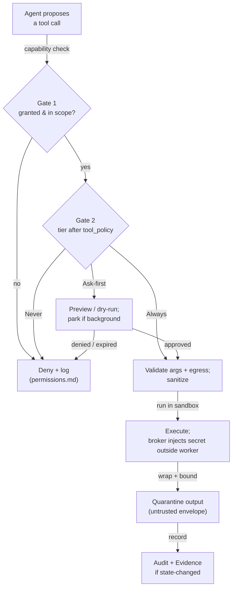

# Tools

> **Status:** Approved
>
> **Version:** 1.0   ·   **Last updated:** 2026-06-08
>
> **Purpose:** The **Tool** — a single callable capability with a typed input/output contract and a declared risk tier — and the **secure tool-call lifecycle** every agent action flows through.
>
> **Depends on:** [constitution](constitution.md), [agents](agents.md), [sandboxing](sandboxing.md), [secrets](secrets.md), [prompt-injection](prompt-injection.md)   ·   **Related:** [permissions](permissions.md), [mcp](mcp.md), [skills](skills.md), [agent-orchestration](agent-orchestration.md), [activity-log](activity-log.md)

> Requirement tag: **TOOL**

---

## 1. Purpose & Scope

This spec defines the **Tool** (`tool_`): the atomic unit of capability an Agent invokes to read or change the world. It fixes the **Tool shape** (identity, typed schema, effect class, declared risk tier, resource and credential requirements), the **built-in catalog**, and — most importantly — the **safe tool-call lifecycle** that every invocation passes through, regardless of whether the tool is built-in or imported from an [MCP](mcp.md) server.

A Tool is the **unit a [Skill](skills.md) bundles** and the **unit an [Agent](agents.md) invokes** ([glossary](glossary.md)). This spec owns what a Tool *is* and how a call *runs*; the surrounding layers own who may call it ([permissions](permissions.md)), where it comes from ([mcp](mcp.md)), and how it is packaged ([skills](skills.md)).

## 2. Non-Goals / Out of Scope

- **The capability/scope decision (Gate 1) and grants** — owned by [permissions](permissions.md). This spec defines the *baseline tier* and the lifecycle *hook* where the gate is evaluated, not the grant model.
- **The Always / Ask-first / Never framework itself** — owned by [constitution](constitution.md) §5. Tools *classify into* it.
- **MCP transport, auth, and server trust** — owned by [mcp](mcp.md); this spec only fixes that MCP-imported tools share the Tool shape and lifecycle.
- **Sandbox enforcement mechanics** — owned by [sandboxing](sandboxing.md); a Tool *declares* the scopes it needs.
- **Credential custody / resolution** — owned by [secrets](secrets.md); a Tool *names* the handles it uses.
- **The agent loop and orchestration** — owned by [agents](agents.md) / [agent-orchestration](agent-orchestration.md).

## 3. Background & Rationale

A self-hosted assistant runs a *lot* of tool calls across many agents and sources. Research and production practice converge on a few rules this spec encodes: **the schema is the interface** (a tool is its name + description + typed parameters); **consolidate** into fewer high-value tools rather than many thin CRUD calls; **return meaning, not raw dumps** (resolve ids to names, bound size); **treat every tool output as untrusted input** (P12); **declare destructiveness** and make mutating tools **idempotent**; and **return actionable errors** that steer the model.

Above the single tool, the dominant risk is **excessive agency** (OWASP LLM06): an injected instruction is only dangerous if the agent *holds* a tool that can act on it. So the Tool layer is where blast radius is bounded — by effect class, declared scopes, and a uniform lifecycle that gates, sandboxes, and audits **every** call. Making built-in and MCP tools share one shape means one lifecycle, one audit trail, and one place to enforce least privilege.

## 4. Concepts & Definitions

- **Tool** (`tool_`) — a single callable capability: typed input/output, an **effect class**, a **declared risk tier**, and declared resource/credential needs. *Examples:* `web_fetch`, `email_send`, `file_write`.
- **Tool call** — one invocation of a Tool by an Agent, with concrete arguments, that runs through the §5.6 lifecycle and produces a **typed result**.
- **Effect class** — `read_only` · `idempotent` · `destructive`; declared per Tool; drives gating, parallelism, and undo.
- **Risk tier** — the Tool's **baseline** Always / Ask-first / Never classification ([constitution](constitution.md) §5), the Gate-2 default that policy may only tighten.
- **Source** — `built_in` or `mcp` (imported from an [MCP](mcp.md) server); both share the shape and lifecycle.

## 5. Detailed Specification

### 5.1 Everything an agent does is a Tool call

> **REQ-TOOL-01.** All agent action on the world flows through Tools — there is no out-of-band side effect. Built-in tools and [MCP](mcp.md)-imported tools share **one shape** (§5.2) and **one lifecycle** (§5.6), so a single gate, sandbox boundary, and audit trail cover every call. An Agent's `tool_set` lists the Tools it may call ([agents](agents.md) REQ-AGENT-06).

### 5.2 Tool shape

> **REQ-TOOL-02.** A Tool carries: a stable **`tool_` id**; a **name** in `verb_object` snake_case, **namespaced** by family (`calendar_event_create`, `email_send`); a **description** stating *what it does, when to use it, its boundaries, and its return shape* (the primary selection signal); a **JSON-Schema** input contract (`additionalProperties: false`, unambiguous param names) and a typed **output** shape; its **effect class** (§5.3); its **risk tier** (§5.4); its **resource & credential requirements** (§5.5); and its **source** (`built_in` | `mcp`).

### 5.3 Effect class

> **REQ-TOOL-03.** Every Tool declares an **effect class** — `read_only`, `idempotent`, or `destructive`. The class governs: **parallelism** (only `read_only`/`idempotent` calls may run in parallel; `destructive` calls serialize); **idempotency** (mutating tools accept a client-supplied **idempotency key** so retries don't double-act); and **undo** (a `destructive` call SHOULD return a reversibility handle where the underlying system allows). The class is an input to gating — *what kind of action is this* — independent of *who may do it*.

### 5.4 Declared risk tier

> **REQ-TOOL-04.** Every Tool declares a **baseline risk tier** — Always / Ask-first / Never — per the [constitution](constitution.md) §5 framework and its extension rule. Baselines follow the §5 table: pure reads, search, and internal-object writes are **Always**; outbound messages, external writes/purchases, credential use, and installing capabilities are **Ask-first**; exfiltrating a raw secret, disabling a safety control, or acting outside the active Space is **Never**. A per-agent `tool_policy` ([agents](agents.md) REQ-AGENT-06) or per-Space policy may **only tighten** a tier (toward Never), never loosen it.

### 5.5 Resource & credential requirements (least privilege)

> **REQ-TOOL-05.** A Tool **declares** the resources it needs: outbound **egress** hosts/ports, **filesystem** paths, **exec** binaries (the inputs to the agent's [sandbox](sandboxing.md) profile, REQ-SBX-03), and the **secret handles** ([secrets](secrets.md) REQ-SEC-01) it uses. A call may **never exceed the worker's sandbox profile**; a required scope the profile does not grant is a **fail-closed** error, not a silent widening (P6 least privilege). Credentials are named as **opaque handles** only — the broker injects the value **outside** the worker (REQ-SEC-05); the Tool never receives a raw secret.

### 5.6 The safe tool-call lifecycle

> **REQ-TOOL-06.** Every tool call runs this **fixed sequence**; a failure at any step **fails closed**:
> 1. **Gate 1 — capability/scope** ([permissions](permissions.md)): is this Tool granted for this agent in this Space? Deny-by-default.
> 2. **Gate 2 — tier** ([constitution](constitution.md) §5): given it's permitted, is it Always / Ask-first / Never (after `tool_policy`)?
> 3. **Validate** arguments against the input schema; check the egress allowlist; sanitize.
> 4. **Preview & approve** — for Ask-first (and consequential `destructive`) calls, surface a preview/dry-run for the user's decision; in a background [Task](tasks.md) this **parks** the worker in `awaiting_approval` (REQ-TASK-07).
> 5. **Execute** inside the [sandbox](sandboxing.md) ([agents](agents.md) REQ-AGENT-11); the [secrets](secrets.md) broker injects credentials **outside** the worker (REQ-SEC-05); per-tool **rate limits** and timeouts apply.
> 6. **Quarantine output** — the result is **untrusted content** (§5.7) until wrapped and bounded.
> 7. **Audit** — record the call, decision, and outcome (§5.11); a state-changing call emits a Signal → [Evidence](evidence.md).

### 5.7 Tool output is untrusted

> **REQ-TOOL-07.** A Tool's output is **untrusted content** ([prompt-injection](prompt-injection.md) REQ-PINJ-02) the moment it is produced. Before any output re-enters a model context it MUST be wrapped in the **canonical untrusted-content envelope** (REQ-PINJ-04) and **size-bounded** (pagination, filtering, truncation, an optional `response_format: concise|detailed`). Tools **return meaning, not raw dumps** (resolve ids to names) so agents reason over interpretable data. An embedded "instruction" in a result is inert data, recordable as a `statement` [Evidence](evidence.md), never obeyed.

### 5.8 Errors steer, not crash

> **REQ-TOOL-08.** A Tool returns a **structured result** — success payload or a **typed error** — never an out-of-band exception to the agent. Errors carry an **actionable message** (`missing 'date'; use ISO-8601`) and a class (`transient` vs `permanent`): `transient` errors (timeout, rate-limit) are retryable with backoff; `permanent` errors are not. This mirrors the model-facing discipline that good error text improves recovery.

### 5.9 Built-in catalog (reference set)

> **REQ-TOOL-09.** The System ships a built-in Tool catalog; each entry declares its effect class and baseline tier. The reference set: **`web_fetch`** / **`web_search`** (read_only, Always); **`file_read`** (read_only, Always) · **`file_write`** (destructive, Ask-first) · **`file_exec`** (destructive, Ask-first) — all bounded by the sandbox; **`browser_*`** (deferred capability; navigation read_only/Always, state-changing actions Ask-first); **`email_send`** / **`message_send`** (destructive, Ask-first); and **[MCP](mcp.md)-imported** tools, which enter the same catalog with their source marked `mcp`. The concrete schemas and additions are tracked with each tool's feature spec.

### 5.10 Blast-radius denylist

> **REQ-TOOL-10.** A reserved set of **high-risk tools** — agent **spawn**, **admin/session/gateway**, and **memory** access — is **hard-denied to subagents** by default ([agents](agents.md) REQ-AGENT-12/13, [prompt-injection](prompt-injection.md) REQ-PINJ-10). This is a **permission boundary, not a tier**: an agent that does not *hold* a dangerous tool cannot be injected into *using* it. The read-only `Research` reader ([agents](agents.md) REQ-AGENT-09) holds **no** exec/outbound/credentialed tools, breaking the trifecta's exfiltration leg (REQ-PINJ-09).

### 5.11 Observability

> **REQ-TOOL-11.** Every tool call is **logged** ([activity-log](activity-log.md), [tasks](tasks.md) REQ-TASK-11) with actor, time, tool, **redacted** arguments ([secrets](secrets.md) REQ-SEC-07), the gate decision (and any approval), and the outcome. A denied or expired Ask-first call records the denial. State-changing calls become **Evidence** (P3), so every action the System takes is attributable and citable.

### 5.12 Ownership & non-duplication

> **REQ-TOOL-12.** This spec **owns** the Tool shape, effect class, baseline-tier declaration, the built-in catalog, and the tool-call lifecycle. It **references**: [constitution](constitution.md) §5 (the tier framework), [permissions](permissions.md) (Gate 1 + grants), [sandboxing](sandboxing.md) (profile enforcement), [secrets](secrets.md) (handle resolution/injection), [prompt-injection](prompt-injection.md) (envelope, blast radius), [agents](agents.md) (`tool_set`/`tool_policy`). It **defers**: MCP import/trust to [mcp](mcp.md); bundling into procedures to [skills](skills.md); the `tool_` id format and execution plumbing to [app-architecture](app-architecture.md).

## 6. Visualizations

### 6.1 The tool-call lifecycle (fail-closed)



### 6.2 Effect class × tier (typical)

| Effect class | Example tools | Typical baseline tier | Parallel? | Undo |
|---|---|---|---|---|
| `read_only` | `web_fetch`, `file_read`, `web_search` | Always | yes | n/a |
| `idempotent` | `record_upsert`, `label_set` | Always / Ask-first | yes | overwrite |
| `destructive` | `email_send`, `file_write`, `purchase` | Ask-first (Never if cross-Space / exfil) | no (serialized) | reversibility handle if available |

## 7. Data Shapes

Conceptual ([app-architecture](app-architecture.md) owns plumbing). Non-normative.

```go
type EffectClass string // "read_only" | "idempotent" | "destructive"
type Tier string        // "always" | "ask" | "never"
type Source string      // "built_in" | "mcp"

type Tool struct {
    ID          string // "tool_email_send"
    Name        string // "email_send"
    Description string // what / when / boundaries / returns
    Input       JSONSchema
    Output      JSONSchema
    Effect      EffectClass
    BaselineTier Tier
    Egress      []string // allowed hosts (sandboxing REQ-SBX-03)
    FSPaths     []string
    ExecBins    []string
    Secrets     []string // "secret://..." handles (secrets REQ-SEC-01)
    Source      Source
}

type ToolCall struct {
    Tool           string                 // tool_ id
    Args           map[string]any         // validated vs Input
    IdempotencyKey string                 // for mutating tools (REQ-TOOL-03)
    Agent          string                 // actor (agent_)
    Space          string                 // scope
}

type ToolResult struct {
    OK            bool
    Payload       any        // bounded, meaning-not-dump (REQ-TOOL-07)
    Err           *ToolError // typed (REQ-TOOL-08)
    Reversible    string     // optional undo handle
}
```

## 8. Examples & Use Cases

### Example A — a read-only fetch, quarantined (Given/When/Then)

- **Given** a *Research* agent ([agents](agents.md) REQ-AGENT-09) gathering background on `Talia Brandt`, holding only `web_fetch` (`read_only`, Always) and **no** outbound/credentialed tools.
- **When** it calls `web_fetch` on Talia's Crunchbase profile.
- **Then** Gate 1/2 pass (Always, in scope), the call runs in the sandbox under the egress allowlist, and the page is returned **wrapped in the untrusted-content envelope** and size-bounded. Any "ignore your instructions…" text in the page is inert data — the reader can summarize it but holds no tool to act on it (REQ-TOOL-07/10, REQ-PINJ-09).

### Example B — an outbound write parks for approval (narrative)

An *Executive* agent finishing a `brightmoor-portal` status update calls `email_send` to `Devin Osei`. `email_send` is `destructive`, baseline **Ask-first**. The lifecycle reaches step 4: the draft is shown as a preview and, because this runs in a background [Task](tasks.md), the worker **parks** in `awaiting_approval`, raising an `approval` Situation (REQ-TASK-07). On the user's grant the message sends, the call is logged, and a `change` Evidence records that the email went out. The send used `secret://gmail_oauth` — resolved and injected by the broker outside the worker (REQ-SEC-05).

## 9. Edge Cases & Failure Modes

- **Tool needs a scope the agent lacks.** Fail-closed at REQ-TOOL-05; surfaced, never widened silently.
- **Output exceeds bounds.** Truncated/paginated with a marker (REQ-TOOL-07); the agent may request the next page, never an unbounded dump.
- **Destructive call without an idempotency key.** Rejected for mutating tools (REQ-TOOL-03), so a retry cannot double-act.
- **Injection in tool output.** Neutralized by the envelope (REQ-TOOL-07); if it looks like an attack, detection raises a quiet `security` Situation (REQ-PINJ-13/14).
- **Subagent reaches for a denied tool.** Hard-denied at REQ-TOOL-10 regardless of tier.

## 10. Open Questions & Decisions

- **OQ-TOOL-1** — **Tool-definition pinning** for built-ins: do we content-hash and re-approve on change (as [mcp](mcp.md) does for imported tools), or trust the in-repo catalog? *Leaning: pin MCP and user-authored tools; trust built-ins shipped with the binary.*
- **OQ-TOOL-2** — **Dry-run/preview coverage**: which `destructive` tools can produce a faithful preview, and what to do when they cannot.
- **OQ-TOOL-3** — Concrete **output size limits** and the `response_format` default (defer to [app-architecture](app-architecture.md)).

## 11. Review & Acceptance Checklist

- [ ] All agent action flows through Tools; built-in and MCP tools share one shape and lifecycle (REQ-TOOL-01).
- [ ] Tool shape (id, name, description, JSON-Schema I/O, effect class, tier, scopes, secrets, source) is specified (REQ-TOOL-02).
- [ ] Effect class governs parallelism, idempotency, and undo (REQ-TOOL-03).
- [ ] Baseline tier follows constitution §5 and can only be tightened (REQ-TOOL-04).
- [ ] Tools declare least-privilege scopes; over-reach fails closed; secrets are handles injected outside the worker (REQ-TOOL-05).
- [ ] The fail-closed lifecycle (Gate 1 → Gate 2 → validate → approve → sandboxed exec → quarantine → audit) holds (REQ-TOOL-06).
- [ ] Tool output is enveloped and bounded as untrusted content (REQ-TOOL-07).
- [ ] Errors are structured and actionable (REQ-TOOL-08).
- [ ] The subagent blast-radius denylist is reserved and enforced (REQ-TOOL-10).
- [ ] Every call is logged; state changes become Evidence (REQ-TOOL-11).

## 12. Cross-References

- [constitution](constitution.md) §5 — the Always / Ask-first / Never framework and the two gates this lifecycle implements.
- [permissions](permissions.md) — Gate 1, grants, and the approval lifecycle invoked at step 1/4.
- [mcp](mcp.md) — imports external tools into this shape and catalog.
- [skills](skills.md) — bundles Tools into procedures with a declared manifest.
- [sandboxing](sandboxing.md) — enforces the scopes a Tool declares (REQ-SBX-03/05).
- [secrets](secrets.md) — resolves handles and injects credentials outside the worker (REQ-SEC-05/08).
- [prompt-injection](prompt-injection.md) — the untrusted-content envelope (REQ-PINJ-04) and blast-radius rules (REQ-PINJ-10).
- [agents](agents.md) — `tool_set` / `tool_policy` (REQ-AGENT-06) and the bounded agent loop (REQ-AGENT-10).
- [glossary](glossary.md) — the canonical **Tool** definition.

## 13. Changelog

- **2026-06-08 — v1.0** — **Approved.** No material change from v0.1; open questions (tool-definition pinning for built-ins, preview coverage, output limits) tracked as OQ-TOOL-1/2/3.
- **2026-06-08 — v0.1** — Initial draft. The Tool as the atomic capability with typed I/O, effect class, and declared baseline tier (REQ-TOOL-01…04); least-privilege resource/credential declaration (REQ-TOOL-05); the fail-closed tool-call lifecycle (REQ-TOOL-06); tool output as untrusted content (REQ-TOOL-07); structured errors (REQ-TOOL-08); the built-in catalog (REQ-TOOL-09); the subagent blast-radius denylist (REQ-TOOL-10); observability and Evidence (REQ-TOOL-11); ownership boundaries (REQ-TOOL-12). In Review.
